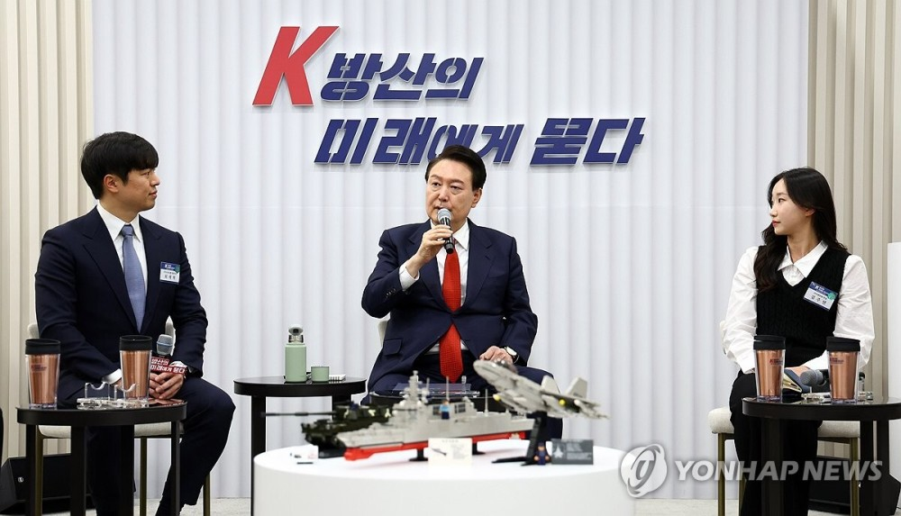
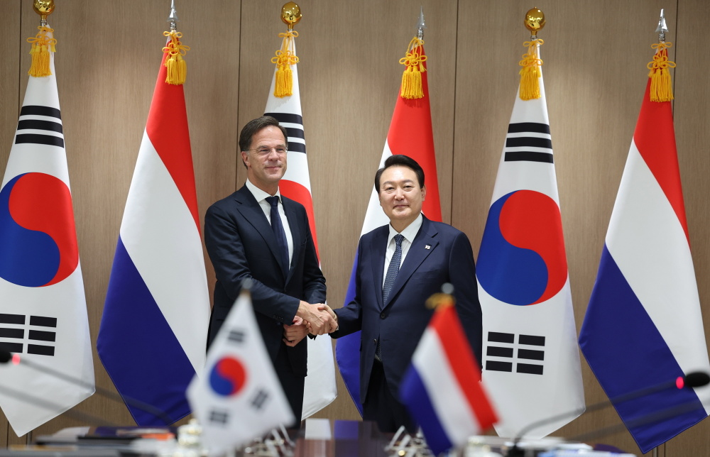

# 尹锡悦称韩国与荷兰将强化半导体同盟，韩媒：与美收紧对华限制有关

（观察者网讯）据韩联社报道，韩国总统尹锡悦7日表示，他将以下周的荷兰之行为契机，重点讨论加强韩国与荷兰之间半导体同盟的事宜。韩媒称，随着美国收紧半导体相关对华出口限制，韩国与荷兰的合作关系变得非常重要。

报道称，尹锡悦将自下周一（11日）起对荷兰进行为期4天的国事访问，这也是自两国1961年建交以来首次有韩国领导人对荷兰进行国事访问。尹锡悦7日在京畿道城南市的韩华航空航天公司主持召开第二次军工出口战略会议，谈及此次访问。

“我将以此次出访为契机，同荷方重点就强化两国半导体同盟的事宜进行讨论。”尹锡悦称，稳控原材料、零部件和设备供应链对于进一步实现军工产业飞跃至关重要，而荷兰具有全球顶级的极紫外光刻（EUV）等曝光技术，韩荷两国合作将为韩国提升军工力量作出贡献。

_12月7日，在位于京畿道城南市的军工企业LIG Nex1，尹锡悦（中）与军工行业青年人才座谈。图片来源：韩联社_

据韩联社，尹锡悦强调，军工产业是支撑韩国国安和经济的国家战略性产业，因此应尽快研发人工智能（AI）、航天、有人/无人协同体系、机器人等尖端技术，并将其用于军工产业，抢占全球军工市场先机，为尖端军工技术的发展做好准备。

尹锡悦政府7日还在会上发布了“可持续军工出口战略”，重点培育五大尖端战略产业，争取到2027年跻身全球四大军工强国之列。尹锡悦要求：“我们各方要共同努力，使军工产业成为大韩民国未来新增长的动力，特别是政府要带头。”

据韩总统府方面介绍，韩荷双方将集中探讨构建包括政府、企业、高校在内的半导体同盟方案。为此，两国将推进新设半导体对话机制，签署谅解备忘录（MOU），协商发掘共同项目等。

韩国国家安保室第一次长金泰孝7日在记者会上说，韩方希望通过此访将荷兰尖端装备与韩国尖端制造力量相结合，最大优化半导体价值链的互补性，并给韩国正在建设的华城半导体集群提供启示。

去年11月，尹锡悦与荷兰首相吕特会面签署协议，同意将两国的双边关系提升为战略伙伴关系，这是韩国与荷兰自2016年以来的首次外交关系升级。两国承诺扩大先进技术的合作，包括芯片、核电站和可再生能源。

据悉，荷兰光刻机巨头阿斯麦（ASML）计划到2025年投资2400亿韩元（约合人民币13.4亿元），在京畿道华城市打造半导体集群。就在尹锡悦与吕特会面的前一天，阿斯麦总裁兼首席执行官彼得·温宁克出席了华城半导体集群的奠基仪式。

 _当地时间2022年11月17日，韩国总统尹锡悦在龙山总统府与荷兰首相吕特会谈。图片来源：澎湃影像_

在下周的荷兰之行期间，尹锡悦也将同三星电子会长李在镕、SK集团会长崔泰源一道造访阿斯麦总部，进入无尘车间，并参观明年上市的最新光刻设备生产现场。尹锡悦与吕特另外进行的会谈和工作午餐中也将重点讨论半导体合作。

韩国纽西斯通讯社4日指出，半导体合作是尹锡悦此访中最受关注的主题。报道称，随着美国进一步收紧对AI相关芯片、半导体制造设备的对华出口限制，韩国与荷兰的合作关系变得非常重要，后者坐拥全球唯一掌握EUV制造技术的厂商阿斯麦。

纽西斯通讯社说，与韩国一样，每当美国升级半导体相关对华限制时，荷兰都会受到影响，其国内也会就此展开激烈争论，荷兰外贸与发展合作大臣施赖纳马赫尔就表达过强烈不满。多名荷兰议员也曾[公开质疑](https://news.qq.com/rain/a/20231025A0BABU00)，美国单方面收紧规则、迫使盟友服从，损害了荷兰的经济利益，剥夺了荷兰的战略自主权。

报道提到，中国和韩国都是阿斯麦的重要客户。荷兰外交大臣斯洛特日前接受韩媒采访时表示，荷兰经常与韩国就半导体产业事宜进行对话，围绕半导体产业链问题，荷方今后也将继续与包括韩国在内的多种利害关系人进行协商。此外，荷兰政府也将与本国半导体企业继续进行讨论，以掌握其期望。

针对美方对华限制性措施，中国外交部发言人毛宁此前表示，美方出于维护科技霸权需要，滥用出口管制措施，对中国企业进行恶意封锁和打压，这种做法背离公平竞争原则，违反国际经贸规则，不仅损害中国企业的正当权益，也将影响美国企业的利益。这种做法阻碍国际科技交流和经贸合作，对全球产业链供应链稳定和世界经济恢复都将造成冲击。美方将科技和经贸问题政治化、工具化、武器化，阻挡不了中国发展，只会封锁自己、反噬自身。

**本文系观察者网独家稿件，未经授权，不得转载。**

