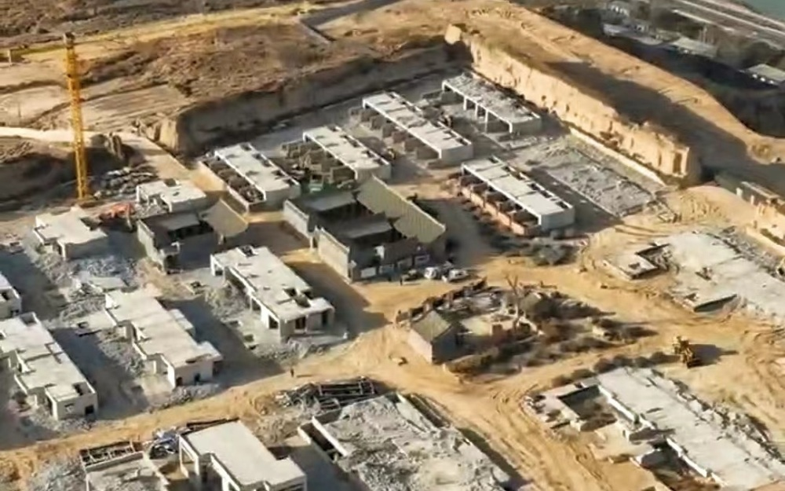

# 山西忻州明代古堡内民居被拆后建新房，省文物局：正调查处理

新京报讯（记者 吴采倩
张建斌）近日，山西省忻州市居民反映称，位于河曲县的省级保护文物单位罗圈堡疑似被破坏，明代古堡内的民居被拆除后盖了新房，新房近期也被拆除。12月7日，新京报记者从山西省文物局获悉，罗圈堡包括被拆民居在内均在省级文物保护范围内，有关工作人员正在调查处理此事。

_大型机械设备在拆除罗圈堡内房屋。受访者供图_

网传视频显示，罗圈堡四周由土墙围住，大型机械设备在拆除堡内房屋，不远处是明长城遗址和烽火台。

“去年把老百姓的旧房子拆了，后半年建了一些二层的楼房，新建的房子主要是搞旅游的，现在不合格又拆了。”罗圈堡文物管理人员鲁先生介绍，罗圈堡是省级文物保护单位，堡内有一座戏台和两座古庙，是重点管理的文物。堡内民居在保护范围内，但居住其中的居民几乎都已迁走。

新京报记者从知情人士处了解到，罗圈堡此前修建的新建筑属于乡村振兴项目。据河曲县人民政府官网，罗圈堡村乡村振兴项目由华鹿阳坡泉煤业有限公司进行投资开发，立足“继承保护与合理开发利用”，依托长城、古堡、民居，田园风光，特色农业等资源，打造边塞军事文化感受地。该项目于2022年8月份正式开工建设，计划于2023年年底正式竣工验收并投入使用。

据当地的长城保护志愿者介绍，罗圈堡是黄河畔上最重要的古堡之一，罗圈堡的关堡、古民居、古庙是一个整体，都需要进行保护。而当地因开发旅游把堡里面的古民居、古巷等基本拆除，新建了现代化的楼房。

12月6日，河曲县文旅局局长乔先生告诉新京报记者，罗圈堡内之前拆除的主要是老旧的危房，后来新建的民宿密度过大，今年又拆除了一部分建筑。他表示，“倒塌的、没顶的（房屋）拆了，原来是文物的、保存好的（房屋），还没动。”

_罗圈堡航拍图。受访者供图_

有网友质疑在罗圈堡内拆建房屋，是否会破坏文物并违反相关保护法规？

据山西省文物局官网显示，罗圈堡是省级文物保护单位，建于明代，构成为“堡一座”，类型为“古遗址”。其保护范围为：以墙体的马面、关堡和相关遗存的墙基外缘为基线向四周各扩50米作为边界；建设控制地带：自保护范围边界外扩200米作为边界。

_罗圈堡文物范围。图源：山西省文物局_

“以墙体的马面、关堡和相关遗存的墙基外缘为基线向四周各扩50米作为边界”，山西省长城保护研究会理事吴永春介绍，这是罗圈堡外部的范围界定，在这个范围内不允许大搞拆建，而在“建设控制地带”也不能随便动土。

至于堡内的民居是否属于文物保护单位，吴永春认为要根据这些民居的年代和价值来判断，需要专业人员进行界定。但在堡内新建建筑，建筑的高度应该受到文物保护法的限制。“如果这些民居不属于公布的文物保护单位，就不受文物保护法律的约束。”

吴永春指出，目前地方文物保护法规存在不健全之处，有些具备文物价值的民居也可能被居民自行拆除，未能得到及时保护。他表示，在山西有许多像罗圈堡这样的古堡，以前人们还会在古堡城墙取土，给古堡的保护造成隐患，相关保护意识需要提高。

“罗圈堡属于明长城配套的军事设施，也受到相关的长城保护条例保护。”吴永春介绍，山西省、市均出台了相关的长城保护条例，可以据此落实保护措施。

新京报记者注意到，忻州市出台的《忻州市长城保护条例》有相关的条例：第三条，本条例所称长城，是指本市行政区域内由国务院文物主管部门认定并公布的长城墙体、壕堑、单体建筑、关堡、相关设施等文物本体和相关遗存，长城文化景观构成要素，其他与长城直接关联的景观风貌和生态环境。第二十四条，在长城保护范围内，禁止从事下列活动：（一）随意倾倒垃圾、排放污水、丢弃危害长城安全的废弃物；（二）擅自进行取土、开沟、挖渠以及修建房址、坟墓等活动；（三）从事开山、采石、采砂、采矿、擅伐林木等破坏长城地形地貌和生态环境的活动；（四）法律、法规禁止的其他活动。

编辑 杨海 校对 吴兴发

