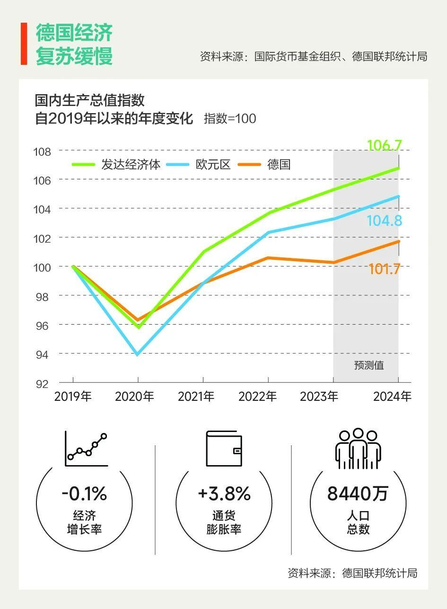
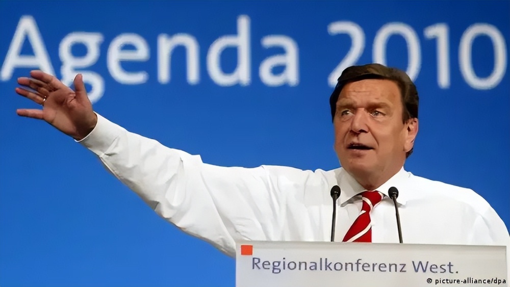
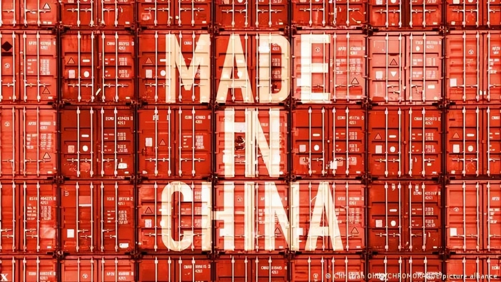
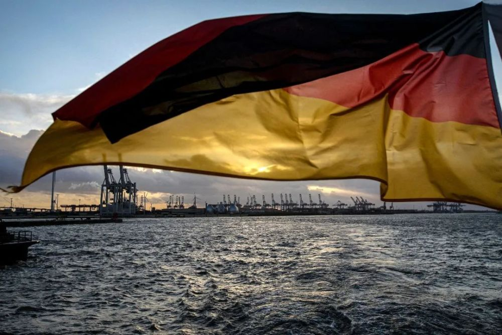

# 德国的经济密码还灵吗？名义GDP超越日本，却再度被称作“欧洲病夫”

**文 / 周睿睿**

**编辑 / 漆菲**

国际货币基金组织（IMF）的最新预测显示，2023年德国将在名义GDP上成为全球第三大经济体。不过，同一份预测亦称：德国将成为全球主要经济体中唯一出现负增长的国家，经济增速甚至在未来几年也很难超过其他西方发达国家。反映在经济生活中，德国新增就业人数自今年年初开始放缓，破产企业数增加，市场信心不足，就连工业也出现了下滑迹象。

在评价德国经济时，英国《经济学人》再度用上了“欧洲病夫”这个词。不过，德国总理朔尔茨接受采访时承认国家经济正在走弱，但强调德国还不至于像“盎格鲁-
撒克逊媒体”（即《经济学人》）说的那样。德国央行行长则称：“德国不是‘欧洲病夫’，我认为这是一个容易被很多人误解的说法。我们应更加自信。”

1999年首次被冠名“欧洲病夫”后，德国只花了几年工夫就在经济上重整旗鼓，成为欧洲第一大经济体。2011年欧债危机期间，欧洲经济百花杀尽，德国成为一片萧瑟中的一枝独秀。这样的表现令很多人记忆犹新。

这一次，德国能够再度从谷底腾飞吗？以及，当我们谈论德国经济时，我们究竟在谈论什么？

社会市场经济促成巨大繁荣

一直以来，德国都被外界视为制度稳定的典范。所谓制度稳定，主要体现在其较为成功地兼顾了不同的社会利益，以经济、社会、政治三个维度而论，均未出现明显的“木桶短板”。

这就要提到第二次世界大战之后，德意志联邦共和国（西德）所采取的主要经济制度——社会市场经济。这一概念最早由德国经济学家、社会学家阿尔弗雷德·缪勒-
阿马克在1947年提出，为战后德国首任经济部长路德维希·埃哈德采纳，其中心思想是“保障所有供需双方均有参与市场的自由，同时确保社会平衡”以及“开放市场准入和竞争共存，防止支配性的市场权力产生”。对市场的运行不能放任自流，而需要国家构建框架，既要确保有效竞争得以进行，又要促成市场参与者均有机会和意愿发挥自己所长。

缪勒-
阿马克用“国家收入转移过程”来形容社会市场经济对收入分配的纠正。他指出，“只有在市场经济体系中，在市场地位中受保护较少的消费者才能根据自己的需要引导经济，这些消费者可能涵盖所有阶层。”

在他看来，“国家收入转移过程”表现在社会政策上，就是各种福利金、养老金和均等负担支付、住房建设津贴和形形色色的补贴，其目的是为那些无法或暂时无法通过出卖劳动力赚取市场收入的老、病、孕或失业人员提供社会保障，从而让他们也能参与到消费中来。

得益于社会市场经济，德国在20世纪50年代实现了巨大的经济繁荣，史称“经济奇迹”。当时的经济政策与社会政策相搭配，产生了良好的效果。经济的繁荣和社会的稳定带来了政治上对于内政的高度认同，经验的总结进而演变成对于制度的路径依赖。就德国自战后所面临的特殊国际局势以及其战后外交的先天性不利开端而言，能产生如斯向心力不可谓不难得。

_◆大众甲壳虫被外界描述为德国战后复苏的标志。这张照片是1954年在联邦德国一家工厂拍摄的。_

“经济奇迹”的出现当然少不了外部条件。德国能如此迅速从战争的后果中恢复过来，离不开西方盟国的支持——冷战时期，西方盟国需要在阵营的交界处有一个强大的盟友。这让德国得以不被进一步解体，并受益于美国的“马歇尔计划”，该计划对饱受战争蹂躏的欧洲国家进行了重建援助。之后的朝鲜战争则间接促成了这一经济繁荣。

由于盟军禁令而无法生产军备的德国企业，可以集中精力满足外国对资本和消费品的需求。得益于适合全球市场需求的产业结构、大量的产能储备和合格的劳动力，军事方面的大幅缩减反而造就了有利的环境。

例如有“世界钢铁大王”之称的行业巨头提森克虏伯（ThyssenKrupp），它在第二次世界大战期间因军火生产而声名狼藉，被盟军的炸弹几近损毁，并在战争结束后被解散，也在20世纪50年代恢复了生产。

此外，德国还通过税收减免和低税率创造出巨大的投资激励。这些条件带来“自给自足”式增长，在1952年就实现了突破。1953年，伦敦债务协定又免除了德国近一半的外债。

经济复苏初期困难重重，但社会市场经济很快显示出其顶层设计的成功，并塑造了比货币改革影响更长远的政治经济制度。尽管社会市场经济本身未被写入德意志联邦共和国宪法，但德国法律体系的诸多核心要素（例如财产保障、合同和结社自由、职业和工作场所的自由选择）都为社会市场经济奠定了重要基础。

“经济奇迹”背后的“人人富足”

从1950年开始，德国12%以上的高失业率有所下降，7年后便实现了充分就业。国内生产总值（GDP）则从1949年的790亿德国马克上升到1960年的近3000亿德国马克。对外贸易蓬勃发展，住房短缺问题明显缓解，弱势群体得到越来越多的支持。

对很多德国人来说，这样的经济增长是几年前在废墟里始料未及的，更不要提曾亲眼目睹德国众多工业重镇在二战中被夷为平地的西方诸国，于是便有了“经济奇迹”一说。

不少人只知经济奇迹，而不知当时德国社会发展的座右铭是“人人富足”(Wohlstand für
alle)。这一方针是由路德维希·埃哈德提出的。他于1949-1963年任经济部长、1963-1966年任联邦总理。他在执政期间推出货币和经济改革，并让社会市场经济成为德国的经济秩序。“人人富足”也成为1957年大选前基民盟的主打口号，即让每个努力做贡献的人能够买得起一些东西。

“富足”这个词常常被外界译成“繁荣”（对应英语的prosperity）。因此，人们很容易认为，其指向为个人、私人家庭或整个社会提供商品和服务的程度，也就是使用GDP或人均收入来衡量经济体的物质繁荣或生活水平。

但其实，德语中Wohlstand这个词的字面意思是“舒适的状态”。即使在上世纪50年代，德国语境里关于“富足”的涵义至少包含两个维度：物质维度和社会维度，即物质繁荣和社会的团结或参与度，而后者是通过生活质量意义上的个人福祉来体现的。

至今，德国已经发展出包括环境指标、个人能耗、健康状况、医疗资源的供应与覆盖、工作环境、教育均等在内的一整套用于衡量“社会的团结与参与度”的社会指数。当然，在可持续发展观念被广泛接受的今天，“富足”又被加上了包括生态参与度和环境经济核算等指标在内的环境维度。

用大白话来说，“人人富足”追求的就是每个人——而不是宏观的国家——都应该从“经济奇迹”中受益，其益处不应仅限于物质生活领域。和西德经济腾飞相辅相成的是社会许多领域都发生了变化，包括工作条件、婚姻家庭、消费者行为和生活方式等。

实现经济增长的正向循环

实现经济增长的过程中必然会产生冲突，如何解决冲突便成了一个问题。

1948年，作为美英法三占区“经济行政主管”的埃哈德重新引入德国马克进行货币改革，工资最初处于“冻结”状态，物价和失业率急剧上升。

当时，钢铁工业和采矿被确立为经济发展的基础和能源来源，机械工程、化学和电气工业也在随后的经济规划中占有重要席位。然而，私人消费品的生产在20世纪50年代上半叶并没有发挥重要作用。工资一开始增长缓慢，公司利润则被用于进一步扩张。

德国工会联合会（DGB）成立于1949年。早在“经济奇迹”到来前，它就开始呼吁关键产业社会化、中央经济控制和经济民主化。随着国家经济腾飞，企业利润的增速明显高于工资的增速，激烈的劳资纠纷随之产生。工会联合会提出一系列要求改善工作条件的诉求，包括男女同工同酬、缩短工作时长以及为员工提供更多社会保障。

这样的诉求起初不被联邦政府采纳。之后为了获得工会联合会对德国加入欧洲煤钢共同体的支持，时任德国总理阿登纳不得不与工会联合会主席伯克勒协商并达成妥协：以法律形式赋予采矿业雇员平等共同决策权，但雇主联合会和联邦政府拒绝将该权利扩展到其他行业。工会联合会随即以罢工表达抗议。

_◆1949年9月15日，阿登纳宣誓就任首任联邦德国总理。_

最终，德国联邦议院于1952年7月通过《工厂基本法案》，雇员在股份公司的监事会中拥有三分之一的席位，但在经济事务中，劳资委员会仅享有信息权。到了1976年，借着社会民主化的东风，又通过了《共同决策法》，总算在法律和制度方面取得了标志性进展。

这让雇员们从经济发展中获得更大收益。如今，前身是专业领域工会的金属工业工会IG-
Metall是德国最大的工会，也是世界最大的有组织雇员代表机构。早在1958年，IG-
Metall就为雇员增加了6%的工资。与此同时，雇员每周的工作时长从1955年的49.8小时减少到1961年的46.2小时，休假时间则延长到每年平均15个工作日。1957年，通过为期16周的罢工，雇员在获得带薪病假方面取得重大进展。

除了雇员，以往被忽略的其他人群也被纳入经济增长正向循环的顺风里。以养老金改革为例，德国经济学家施赖伯在一份报告中将养老保险称作“两代人之间的团结契约”，并提出构想：劳动者为退休人员支付养老金，养老金与工资总额挂钩，雇员和雇主各缴纳一半养老金，国家补贴补充国库。这一构想于1957年2月在联邦议院获得通过。此次改革使养老金领取者的收入平均增加了60%。由此，退休人员也成为经济增长的一部分。

德国人获得新的民族认同感

1950年至1963年间，德国实际工业生产增长了185%。机车、工业设备、机器和发动机销往世界各地。作为生产力飞速飙升的工业大国，德国吸引了许多国外投资者，对外贸易随之蓬勃发展。“德国制造”开始成为出口商品的品质标签。

从20世纪50年代中期开始，私人购买力有所增加，德国人陷入“买买买”的狂潮。消费品的大规模生产降低了商品价格，继而促进了电气行业的蓬勃发展：洗衣机、冰箱、电视和收音机成为畅销品。联邦政府通过低息建筑贷款，支持人们拥有“乡村小屋”的梦想。人们休假时喜欢去露营或者自驾，买房时喜欢自建大平层小别墅，这些消费追求又反哺了德国工业。

私人消费领域的增长同样体现在食品和旅游方面。战后废墟中的德国姑娘曾经轻易地被一块美国巧克力收买芳心，而50年代中期的德国人已经开始对黄油和咖啡豆挑挑拣拣了。另据1965年的电视报道，当时涌现出一批旅游公司，定期组团飞往西班牙的马略卡岛，以至于该岛被称为“地中海上的日耳曼烧烤店”。

_◆1973年，西班牙马略卡岛上的德语啤酒广告牌，马略卡是当时最受德国人欢迎的旅行目的地之一。_

就连时任总理埃哈德，也在莱茵河游船上，伴着《罗蕾莱》的歌声，喝着雷司令葡萄酒，向到访的外国首脑展示与二战时期截然不同的、富裕讲究的德国形象。

这样的狂潮里，大量的工人、因为战争流离失所的人乃至难民也被加以利用。

20世纪50年代中后期，德国出现了工人短缺的情况，企业家开始雇用外国工人。1955年，德国与意大利签署了第一份“客工”招募协议，葡萄牙、西班牙、希腊和土耳其等地中海国家也紧随其后。1964年，科隆中央火车站迎来第100万名外来务工者。

已婚妇女也加入到经济建设中来。虽然在联邦德国首任总理阿登纳的眼中，女人一旦结婚就不该工作，当时的社会舆论里也有很多关于女性工作对于家庭生活负面影响的警告，可已婚妇女的就业率依然不断增加。不过她们的工资通常较低，且必须承担家庭和工作的双重负担。

无论如何，通过发展经济，德国再次赢得尊重。经济日益繁荣的成果不是飘在空中的，而是实实在在和社会生活与日常消费紧密挂钩。社会保障、充分就业——一切在今日德国被视为理所当然的标准，都是在20世纪50年代形成的。

实际上，德国社会对于纳粹和战争的大规模追溯、辩论及反思连同外交上具有里程碑象征意义的勃兰特华沙一跪，要到上世纪60年代末70年代初才得以实现。但这一切并没有妨碍德国人在五六十年代——远在外交和国际政治领域获得国际承认前——就获得了新的民族认同感。

埃哈德并不喜欢使用“经济奇迹”这个词，与之相比，他更愿用“经济崛起”来形容这一过程。在他看来，这一切是通过国民新教徒式的辛勤工作、国家对于重建的努力以及社会重视满足个人需求、“不使一人掉队”的团结协作带来的结果，并非天上掉馅饼式的奇迹。

再度被贴上“欧洲病夫”标签

1999年，德国有过一个季度的经济增长处于停滞状态，从而被《经济学人》贴上“欧洲病夫”的标签。当年的文章描述了经济增长乏力、制造业萎缩和失业率高企的社会现实。经过了短暂的面壁思过期，德国迎来超过15年的稳健经济增长，这被一些国际媒体形容为“经济奇迹2.0”。

二十多年过去，梦魇重来。“德国再次成为‘欧洲病夫’？”《经济学人》在今年8月的一期封面中以此为题，并配有一张图，图中是一个正在输液的小绿人——暗指德国执政的“红绿灯联盟”（由社民党、自民党和绿党组成）。

_英国《经济学人》杂志今年8月的封面，标题是“德国再次成为欧洲病夫？”_

截至2023年秋天，德国经济增长连续三个季度出现停滞。而由于欧盟需求低迷不振，出口也遭遇意外下滑。据德国联邦统计局12月4日公布的数据，10月德国出口额1264亿欧元，环比下降0.2%，同比下降8.1%；进口额1086亿欧元，环比下降1.2%，同比下降16.3%。

包括国际货币基金组织和基尔世界经济研究所在内的一些业内机构认为，2023年，德国将是所有工业国家中唯一经济不增反降的。德国《南德意志报》评论说，“红绿灯联盟”执政已两年，但德国依旧面临技术工人短缺、能源价格上涨创纪录、数字化落后等困境，因此才被人贴了标签。

这种情况下，对于德国名义GDP超过日本一事，德国媒体表现得格外冷静。德国《世界报》指出，在本世纪的前二十年，德国从全球化和俄罗斯廉价能源中受益匪浅，但现在一切都结束了，未来可能会更困难。该报引述专家的话说：“未来德国大约每三年就会出现一次衰退年，甚至可能每两年经历一次经济衰退。如果通胀随后下降，欧元对美元汇率下跌，第三的位置很快会旁落。”

面对种种非议，德国政府多次强调，困难是暂时的，转型成功后将迎来更大机遇，比如全球对清洁技术日益增长的兴趣，将有利于德国。总理朔尔茨就称，由于脱碳投资，德国正面临高速增长时期，类似于“经济奇迹”时期。

首个将德国称作“欧洲病夫”的经济学家霍尔格·施密丁也觉得，外界对德国经济的预期有些过于悲观了。他在一份研究报告中写道，德国现在的经济地位比1998年要强大得多，如今德国拥有创纪录的就业水平和强劲的公共财政，使其“更容易适应经济冲击”。

但根据德国联邦统计局的数据，尽管新冠疫情对德国经济造成的损害没有人们担心的那么大，德国恢复的速度仍比其他地区慢多了——和欧盟区平均值相比也少了三个点位。民意研究机构Forsa今年10月公布的一项调查显示，71%的受访者预计德国的生活水平将持续恶化，62%的人选择“最主要的原因是德国面临经济危机”。

原本的优势如今成为阻碍？

通过梳理德国的经济增长模式会发现，那些原本给德国带来稳定的特点，却让其在目前的危机中进退两难。

在德国的经济组成中，外贸和工业一直发挥着不可取代的作用。目前，德国工业领域创造的价值份额达到18.3%，明显高于意大利（15.2%）、法国（9.2%）等欧洲国家。

在比较政治经济学研究中，德国一直被视为（有别于英美）依靠生产和出口质量优良的产品而繁荣发展的协作式资本主义模范：德国工业成功的金融基础带来稳定充足的资本供应，它主要源于三支柱银行体系（商业银行、储蓄银行部门和信用社）和国内股票持有者。

德国银行在大量放贷的同时，还持有大型企业的股份并控制着大量投票权，从而鼓励企业对劳动力技能和渐进式产品创新进行长期投资，企业对于市场的敏锐又会反映到与之合作的科研单位的技术研发上，而后者正是“德国制造”出口成功的保障。

2003年，时任总理施罗德提出“2010议程”，决心进行全面改革，以应对人口老龄化的挑战，增强德企的国际竞争力，促进经济复苏和就业增长。为了加强德国出口导向型增长模式，政府加大了工资限制以提高出口企业的竞争力，并通过降低社会工资来改革社会保险制度。

_◆2003年，时任德国总理施罗德提出“2010议程”，决心进行全面改革。_

这是德国首次直面大规模发展不平衡所带来的一系列“失灵”。彼时，距离两德统一（1990年10月）没过太久，距离第一次被称作“欧洲病夫”也不太久。

“2010议程”被认为是德国二战后实施的最艰难的社会改革，它让兼职工作变得普遍，并扩容了低薪但不稳定的二级劳动力市场。其效果可谓立竿见影：工资不平等和劳动力灵活性同时增加，让德国出口导向型产业受益匪浅。

_◆2003年5月17日，德国柏林，德国社会民主党（SPD）正在召开有关“2010议程”的党级会议。_

1996年至2008年，德国的出口增速为欧元区其他成员国的两倍，劳动力成本与生产率增速几乎相同，而其他欧元区成员国的劳动力成本增速快于生产率增长，这使它们面对德国时毫无优势。资本市场的自由化、将股东价值引入公司治理等举措提高了德国的竞争力，反过来也强化了德国的出口主导型增长战略。

近20年来，德国出口的商品远多于进口，一直保持贸易顺差，就连盟友美国也对此多有微词。与此同时，以出口为导向的增长模式也导致需要通过控制工资来维持出口商的竞争力。

眼下，德国的人口结构发生了变化，财富分配却停留在过去，这彻底改变了“经济奇迹”时期“人人受惠于增长、人人在增长中消费”的状态，反而让国内消费受到抑制。

与1996-2008年间德国出口量增长相对应的是，德国家庭的国内需求相对于其他欧元区成员国每年下降1.5%。2003年至2016年，德国最终消费占GDP的比重从76.6%下降到73.3%，私人消费从57.7%下降到53.6%，家庭消费从56.1%下降到51.8%。同期，国内总需求占GDP的比重从96.3%下降至92.5%。个人消费占比从69.3%下降至66.4%。

与此同时，一些非金融企业获得了更多利润，不再依赖银行提供资金，反而越来越多地利用留存利润来投资融资，并积累了大量储蓄。

财政盈余不少，这也符合德国“量入为出”的传统财政观念。但增加的一部分并没有被用在国内投资，公共投资和私人投资均有所滞后。银行所能发挥的宏观调控作用也被削弱，从而也削弱了昔日支撑传统德国模式的资本体系中的关键一环。

这样的增长模式使得德国经济容易受到外部环境的影响。消费和投资份额的持续走低又会使得德国经济过度依赖于国外需求，从而进一步扩大贸易顺差。毕竟，任何国家的经济增长只有三个来源：国内消费、国内投资和净贸易。

疫情期间，供应链受不可控力产生的延迟乃至一度断流，一度引发德国企业的大规模恐慌。过度的路径依赖也易使德国在经济全新升级的当口出现动能不足，无论是电动汽车还是数字化的布局莫不如此。

这一框架同样有助于加深对中德经济关系的理解。德国出口型导向的经济增长模式使其和中国的深化改革开放同频共进，可谓互相成就。德国经济从中国市场获益良多，反之亦然。但近年来，中国经济增长呈现出明显放缓趋势。

尽管一些德国企业依然视中国为投资热土，但它们在中国所获收益的增长幅度短期内不可能回到从前。而在德国经济面临转型的当下，德国对华的经济依赖关系也被一些人拿来作为反思材料。

_◆中国已连续第七年成为德国最重要的贸易伙伴。_

出口市场对于某些行业来说确实重要。比如，德国汽车企业在中国的销售量大约占其总量的三分之一。但实际上，德国的对外贸易比其表现出来的数字更为多元化。

不少德国政治家，包括专业评论人员，津津乐道于德国产品的比较优势以及家庭主妇也能听懂的账面财政经济学，却很少讨论环境与制度的互补关系。事实上，德国经济远比坊间讨论的更深地卷入到全球化的进程中。

受到全球格局变动的冲击

在这个当口，全球政治格局的变动起到了火上浇油的作用。

这里必须谈到俄乌战事带来的冲击。德国的工业严重依赖于化石燃料，而长久以来，这些燃料主要从俄罗斯进口。与俄罗斯切断能源来往一定程度上拖累了德国经济。而在2011年立法禁止核电后，德国目前的发展程度也远远无法满足其能源需求。截至2021年，气候中性能源（即核能和可再生能源）仅占德国一次能源消费的22%。今年关闭核电站后，这一比例会进一步下降。其余的能源来自石油、煤炭和天然气。燃煤发电计划于2030年结束，但由于电力需求不断增长，剩余产能必须在七年内增加一倍。

_◆德国此前55%的天然气供应依赖俄罗斯输送，但自从俄乌战事爆发后，德国开始投资建设自己的液化天然气接收站。_

_◆2022年12月17日，位于北海港口威廉港的德国首个液化天然气接收站启用，德国经济和气候保护部长哈贝克（左）、总理朔尔茨（中）和财政部长林德纳出席启用仪式。_

在碳中和目标和实际工业生产之间有一个巨大缺口，俄乌战事激化了本就没准备充分的转型过程中的矛盾。

而随着与冲突有关的贸易中断的风险增加，许多德国公司将被迫开拓其他市场，使供应来源多样化并适应新环境，这将导致成本上升。德国本土能源价格的上涨也使得能源密集型企业更多将投资转向美国和中国。

另外不要忘记的是，德国不可能像“经济奇迹”时期那样全情投入到经济建设中去。自冷战结束以来，德国原本减少了国防开支在预算中的比例，并将资金转向更有利的用途。由于二战的“历史遗留问题”，如果发生战争，德国人将依靠北约尤其美国来保卫其国土。

然而，时也势也，俄乌战事的爆发促使总理朔尔茨喊出了“时代转折”的宣言，他不仅宣布2022年拨款1000亿欧元用于建设联邦国防军特殊基金，还承诺将在2024年前实现让军备预算占国内生产总值2%的目标，这意味着每年需要筹集约250亿欧元。

_◆2022年8月，德国总理朔尔茨参观用以训练乌克兰士兵的联邦国防军训练设施。_

新的地缘政治形势要求德国增加军备开支，加上气候保护方面公共支出的增加，以及应对人口变化和数字化等方面的影响，政府面临巨大的财政负担。就在11月20日，德国财政部冻结了未来几乎全部财政支出计划，一些德媒形容，这是“一个真正的国家危机”。

如今，伴随着不平等加剧，离心力席卷了西方民主国家的政党政治。在德国，主流执政党被批评变成了“没有范式的政党”，能代表大范围选民利益的社民党的基本盘正在不断缩小。

对德国来说，面对重塑中的国际秩序，获得更多的政治话语权是否能意味着在经济上实现某种破局呢？这可不是小修小补，而是结构性的调整。

 _◆2022年11月4日，德国总理朔尔茨抵达北京，开启就任总理后的首次访华。_

如果说，经济、社会和政治的同步发展带来了“经济奇迹”，那么，随着全球化的深入，德国经济发展和环境所带来的新的不平衡逐渐反映到了国内。能否实现“再平衡”，决定着德国能否迎来下一个“经济奇迹”。

（作者系德国汉堡大学社会与经济学院讲师、时政评论员）

