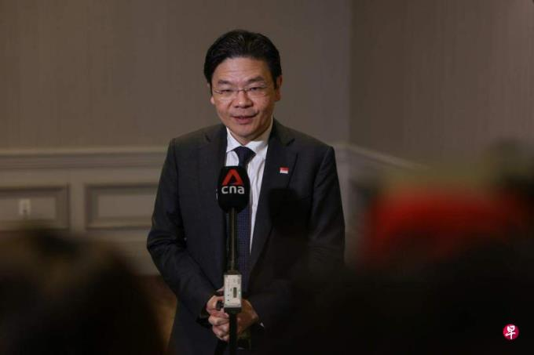

# 新媒：新加坡副总理称，新中将通过30天互免签证安排加强两国人员往来

【环球网报道】据新加坡《联合早报》7日消息，新加坡和中国12月7日在天津召开新中双边合作联合委员会（JCBC）会议，进一步推进两国合作。新加坡副总理兼财政部长黄循财在会上透露，在新中航班不断增加的基础上，双方将通过30天互免签证安排，加强两国人员往来。

_新加坡副总理兼财政部长黄循财 资料图 图自《联合早报》_

报道称，黄循财还表示，今年的JCBC会议，在全球经济面对逆风、地缘政治不确定性上升、全球气候变暖的背景下召开，两国在动荡下携手并加强合作，变得更加重要。

黄循财表示，新中在贸易投资等传统领域巩固合作的同时，也在新的领域拓展和深化合作，包括数字和绿色经济，在发展中融入可持续的解决方案等。此外，两国也在金融互联互通、粮食安全、智慧城市等领域合作。他还说，支撑这些合作项目的基础是人员往来，双方的人员往来正在增加，两地航班已增加到接近疫情前水平。

“我们希望能达到疫情前水平，甚至在直航航班上超过疫情前水平。我们两国的30天互免签证安排，也将支持这一进展，这能够推动更多人员交流，从而强化双边关系的基石。”报道援引黄循财的话称。

