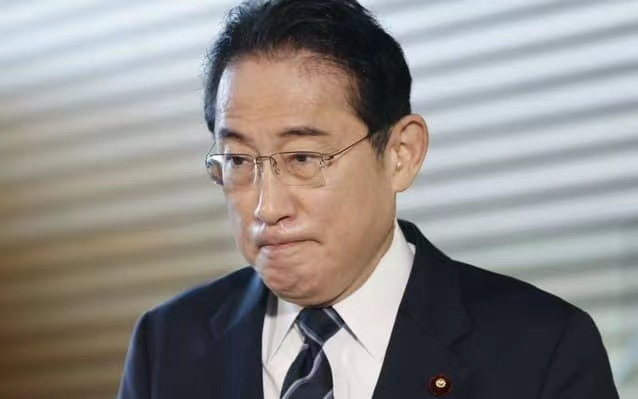

# 日媒：自民党丑闻缠身，岸田文雄决定辞任“岸田派”会长以保持距离

【环球网报道】据日本广播协会（NHK）7日报道，消息人士透露，日本首相岸田文雄决定在其担任首相期间退出自民党派系“岸田派”（宏池会）并辞任派系会长。

综合NHK等日媒报道，岸田辞任是因为近期自民党“安倍派”（清和政策研究会）等被曝出关于政治资金集会的丑闻。

 _日本首相岸田文雄 资料图片_

据报道，所谓政治资金集会，是指日本法律所认可的筹资手段。想要参加的个人或企业需要购买一单2万日元左右的“集会券”，参加者基本上购买多单。多的时候，政治资金集会可筹得数亿日元。不过，为了防止腐败，法律规定，如果一次政治资金集会从同一个人或团体获得超过20万日元，则需要在收支报告书上明确填写其名字和金额。

然而，“安倍派”等自民党政治派系被接连曝光没有明确记载政治资金集会的收支。富士新闻网（FNN）称，“安倍派”被曝光对所属议员提出“集会券”贩卖的“绩效要求”，超过“绩效要求”的收益却没有被记载到收支报告书上，而是直接回馈给了涉事议员。在5年时间里，“安倍派”这种被不正当处理的资金数额超过一亿日元，而“岸田派”等其他派系也被曝光存在这种情况。在野党指责称，这是一种贿赂。

在这种背景下，据FNN报道，日本首相岸田文雄6日呼吁自民党各政治派系暂停召开政治集会，但这对日本社会的批评声来说只是杯水车薪。在这种背景下，岸田放弃了其坚守的派系会长一职，与该问题拉开距离。时事通讯社称，按照惯例，自民党政客在就任日本首相后都会离开派系，岸田没有这么做，因此曾受到前首相菅义伟等人的批评。

