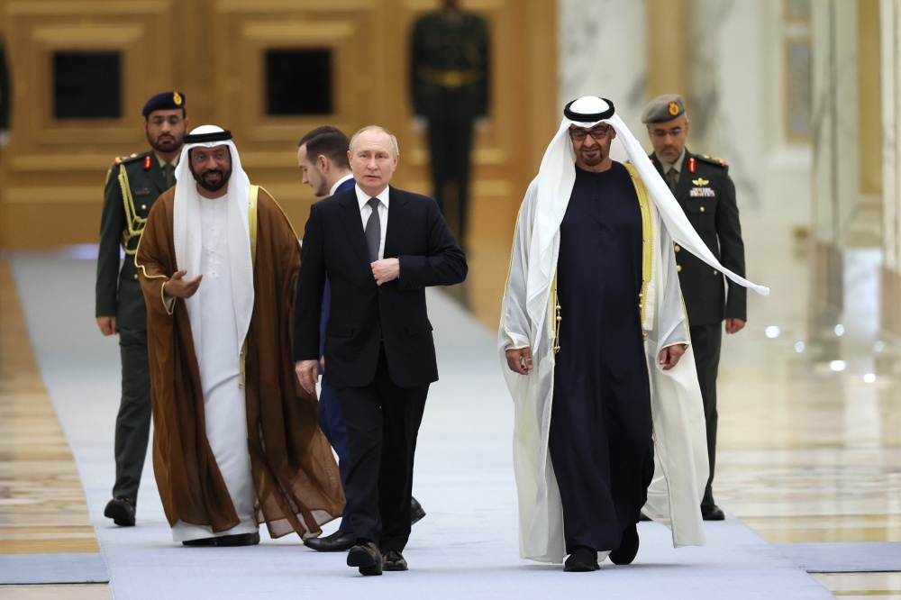

# 普京“闪电式”访问阿联酋与沙特后又会见伊朗总统，释放何种信号？

根据参考消息援引俄新社报道，当地时间12月6日，俄罗斯总统普京搭乘专机，在4架装载有空空导弹的苏-35S战机的护送下抵达阿联酋首都阿布扎比，开启了自俄乌冲突以来的首次中东之行。

 _当地时间2023年12月6日，阿联酋阿布扎比，阿联酋总统穆罕默德会见到访的俄罗斯总统普京。IC
photo 图_

6日当天，普京在与阿联酋总统穆罕默德·本·扎耶德·阿勒纳哈扬会晤后前往沙特，与沙特王储兼首相穆罕默德·本·萨勒曼会面。会晤期间，普京与两国领导人探讨石油市场问题，包括在“欧佩克+”框架内的协作，并就巴以冲突等国际和地区问题交换意见。而在为期一天的“闪电式”出访结束后，普京随即返回莫斯科，并在7日与到访的伊朗总统莱希举行会谈。

报道称，因乌克兰冲突而被西方孤立的普京正在中东寻求盟友，他将在这里商讨石油、贸易和巴以冲突等问题。参考消息援引法新社分析，普京此次“罕见的”访问表明莫斯科正寻求在国际舞台上重新主张自己的地位。

普京此访为俄乌冲突爆发以来为数不多的海外出访行程之一。尤其是在今年3月国际刑事法院对普京发出“逮捕令”以来，其出访海外变得更为复杂。不过，阿联酋与沙特均未签署国际刑事法院的创始条约，因此不受“逮捕令”约束。

此外，普京此次访问中东恰逢阿联酋在迪拜主办《联合国气候变化框架公约》第二十八次缔约方大会（COP28），但俄方没有公布普京参会的任何计划。

在巴以冲突及俄乌冲突持续、俄罗斯即将于2024年迎来大选年的背景下，普京与中东国家领导人会面被认为是俄罗斯寻求进一步突破西方对俄孤立政策、加强在中东地区影响力的明确信号。卡内基俄罗斯欧亚中心高级研究员安德烈·科列斯尼科夫分析称，普京日前的一系列行程不仅能帮助俄罗斯获取实际利益，也将向俄罗斯精英及民众表明俄罗斯并未与国际社会隔绝、陷入孤立。

**油价疲软、冲突持续，普京出访正值关键时刻**

在普京出访前夕，由石油输出国组织（OPEC）及以俄罗斯为首的非欧佩克产油国所组成的“欧佩克+”（OPEC+）刚刚于11月30日召开第36次部长级会议。在国际油价持续疲软的背景下，继今年6月宣布将石油减产延长至2024年后，欧佩克+成员在11月底的会议上确认将按自愿原则在2024年第一季度继续削减石油产量。

其中，沙特宣布将自7月开始的100万桶/日自愿减产措施延长至2024年3月底，俄罗斯将每日自愿减供石油的数量自30万桶提高至日均50万桶，而6月获得小幅增产权利的阿联酋也宣布在2024年第一季度实施16.3万桶/日的自愿减产措施。不过，由于市场对欧佩克+自愿减产措施的执行力存在怀疑情绪，此次减产决定未能显著提振国际油价。

今年2月，由欧盟、七国集团和澳大利亚组成的“限价政策联盟”（Price Cap
Coalition）对俄汽油、煤油、柴油等原油衍生产品以及燃料油、石脑油等低质量原油产品的限价措施正式生效，与之同步生效的还有欧盟对俄罗斯石油产品的海运禁令。

对于高度依赖能源收入的俄罗斯而言，在俄乌冲突爆发、西方对俄石油实行“禁运”及“限价”制裁后，国际油价的上涨在一定程度上对冲了俄石油出口量下降所带来的经济损失。

据俄总统助理乌沙科夫介绍，陪同普京进行“中东一日行”的俄方代表团成员包括负责协调与“欧佩克+”成员国关系的俄副总理诺瓦克、俄外长拉夫罗夫、俄央行行长纳比乌琳娜等高级官员以及俄国家航天集团总裁鲍里索夫、俄国家原子能集团总裁利哈乔夫等商界代表。有消息称，在当前提振油价措施效果不佳的情况下，俄方或借此次中东之行在能源领域进一步加强与相关国家的协调与合作。

除能源问题外，俄乌冲突也是普京与沙特、阿联酋领导人以及伊朗总统莱西会晤时探讨的议题之一。

自2022年2月俄乌冲突爆发后，阿拉伯国家对冲突保持较为谨慎的中立态度，同时频繁扮演“调解人”的角色，阿联酋、沙特均曾斡旋俄乌达成换囚协议，沙特还于今年8月在该国吉达举办了一场没有俄罗斯参与的乌克兰问题国际会议。

伊朗在俄乌冲突后与俄罗斯关系愈发密切。乌克兰方面多次表示，俄罗斯在对乌克兰进行空袭时使用了由伊朗制造的无人机，俄防长绍伊古今年9月还曾访问伊朗，参观了伊朗伊斯兰革命卫队航空航天部队的军事装备展。伊朗也于11月底正式证实将从俄罗斯获得苏-35战斗机、米-28攻击直升机等先进战机。就在普京出访中东之前，12月5日，俄伊两国外长在莫斯科举行会晤，并签署了一份反对西方单边制裁的文件。

与此同时，巴以冲突也被提上普京此行的议程。在普京出访前不久，以色列与哈马斯自11月24日生效的临时停火协议刚刚于12月1日到期，冲突双方目前已恢复交火。

10月新一轮巴以冲突爆发后，普京曾表示，巴以冲突的急剧升级是美国中东政策失败的清晰例证，美方不断推行自身主张，却从未考虑过巴勒斯坦人民的根本利益。与此同时，美方力挺以色列的做法也点燃了阿拉伯国家的愤怒情绪，由其斡旋的沙以关系正常化进程也暂时搁置。

在此背景下，普京此次与沙特、阿联酋、伊朗这三个中东地区重要国家领导人的会面，也被视为俄方展现并提升其在中东地区影响力、与美国博弈的最新尝试。

**巴以冲突下俄罗斯在中东面临复杂局面**

巴以冲突后，世界开始将目光由俄乌战场移向中东。乌克兰总统泽连斯基11月接受采访时曾表示，由于西方援助力度不足，乌克兰夏季反攻未能取得预期结果。而在巴以局势升级的情况下，俄乌冲突不再是国际社会的焦点，目前出现了对俄方有利的局面。

泽连斯基的担忧不无道理。美国总统拜登10月提出了近1060亿美元的拨款申请，其中有614亿美元用于向乌克兰提供军事、安全和经济援助，另有143亿美元用于军事援助以色列。然而，这项申请在美国国会屡屡碰壁。

共和党籍众议院议长约翰逊及一部分共和党议员认为拜登政府在乌克兰问题上缺乏明确的战略，应优先处理对以色列援助。而其他一些共和党议员尽管支持继续对乌提供援助，但要求拜登政府采取更严厉的边境政策，以此换取对拨款申请的批准。

据《环球时报》报道，当地时间12月4日，美国白宫在致国会众议院和参议院领导人的一封信中警告，对乌克兰的援助资金将在今年年底前耗尽。如果美国国会在年底前不批准追加资金，美国将无法继续向乌提供武器装备，并将给乌克兰在战场上带来“毁灭性后果”。

巴以冲突为俄罗斯在俄乌战场上提供了喘息的机会，同时也令俄罗斯在中东地区面临愈发复杂的局面。

12月7日，伊朗总统莱希到访莫斯科，与普京会晤。据伊朗媒体报道，莱希访俄为期一天，其间双方将主要讨论伊俄关系和加沙局势。

国际在线援引专家分析报道称，在巴以问题上，俄罗斯和伊朗加强协调、形成共同立场，一方面可以给美国、以色列造成压力；另外通过跟伊朗的合作，对俄罗斯改善处境也是有好处的。双方可以更好地维护利益，争取战略上的主动地位。

10月，俄罗斯不仅在联合国安理会就巴以局势提出立即实现人道主义停火的草案，还在莫斯科接待了哈马斯代表团，就释放人质等问题进行讨论。值得注意的是，伊朗外交部副部长阿里·巴盖里·卡尼也在哈马斯代表团访问莫斯科期间与哈马斯政治局成员穆萨·阿布·马尔祖克见面，讨论了加沙地带局势以及停火相关问题。

在加沙地带人道主义危机愈发严峻的情况下，西方对巴以冲突的立场日益分裂，力挺以色列、拒绝加沙全面停火的美国开始遭到越来越多的指责。而俄罗斯此时发挥自身优势，在相关各方之间积极斡旋，呼吁立刻实现人道主义停火，并借此向中东各国乃至全球南方发出信号：美国的中东政策已经产生了灾难性的结果，而俄罗斯将是更好的调解人。

俄罗斯的努力得到了中东多数国家的肯定，但却引发了以色列方面的不满。有分析认为，俄罗斯一方面将有机会在美国对以色列的支持引发阿拉伯国家愤怒时，进一步加强俄在中东影响力，同时也可能无法像过去一样与中东地区各方保持相对平衡的关系。

自沙俄时期起，俄在中东地区就曾频繁活动，试图进一步扩张领土。进入20世纪后，苏联曾在阿以冲突中支持阿拉伯国家与美国抗衡，但埃及“弃苏投美”、苏联自身的一系列政策失误使得美国在中东地区影响力日益上升。苏联解体后，俄罗斯在中东影响力一度继续萎缩，但随着2011年中东变局、2018年特朗普宣布美军撤出叙利亚等事件的发生，俄罗斯开始“重返中东”，成为少有的能够与该地区各方进行联系与合作的国家。

值得注意的是，尽管以色列向来以美国在中东地区最亲密盟友自居，但俄以两国之间近年来也保持着密切且特殊的联系。2019年以色列举行选举期间，以色列总理内塔尼亚胡曾在利库德集团总部大楼外悬挂与普京握手的巨幅海报，为选举造势。俄乌冲突后，以色列也并未跟随西方国家脚步对俄实施制裁。

不过，由于俄乌冲突之下俄与西方关系紧张、与伊朗关系日益密切，加之俄以两国在叙利亚存在利益分歧，俄以关系一直较为微妙。巴以冲突爆发后，俄罗斯对冲突的立场以及10月与哈马斯代表团的会晤让俄以关系进一步出现裂痕。11月，有消息称以色列部分银行已开始跟进欧盟对俄制裁，对俄公民账户予以限制。

