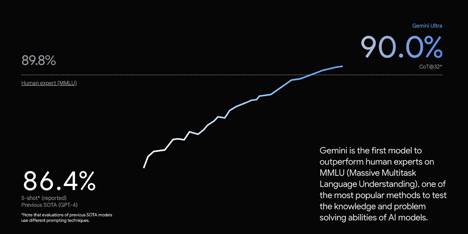
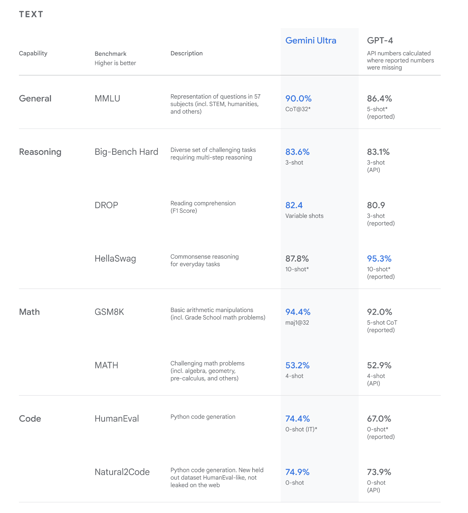
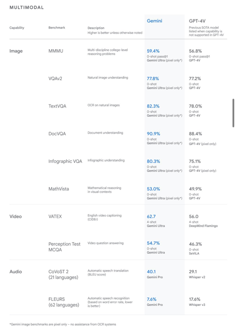
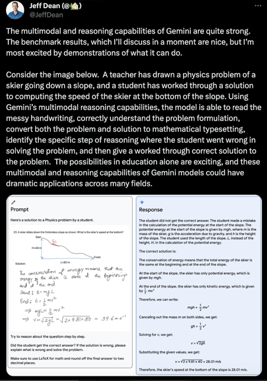
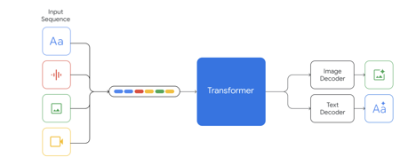
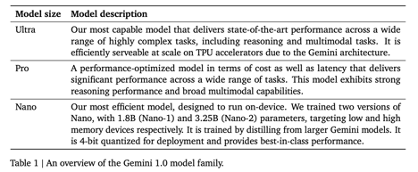
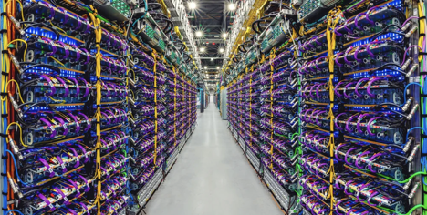
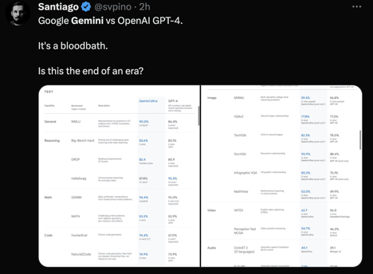

# 赶超GPT-4！谷歌发布最新大模型Gemini，主打三大“杀手锏”

腾讯新闻《潜望》 纪振宇 12月6日发自硅谷

外界期待已久的谷歌大语言模型Gemini在美国时间12月6日早间正式对外发布，谷歌首席执行官皮查伊表示，Gemini
1.0是目前为止谷歌能力最强的通用人工智能模型。

“Gemini是原生多模态打造，是（谷歌）通往Gmeini模型时代的第一步。”皮查伊在当天的声明中说。

谷歌当天发布的Gemini 1.0共分为Ultra,
Pro和Nano三个版本，其中Ultra的能力最强，复杂度最高，能够处理最为困难的任务，Pro能力稍弱，可以用来处理多任务，Nano则更注重于端侧的处理能力。

目前谷歌旗下的基于大语言模型的对标ChatGPT的人工智能语言对话机器人Bard已经启用Gemini
Pro作为底层大模型驱动，能够实现比过去由Palm大模型驱动的更为高级的推理、规划、理解等能力，同时继续保持免费。谷歌预计在明年初将推出“Bard
Advanced” ，计划使用 Gemini 最强版本 Ultra。

**主打三大“杀手锏” 能力超越GPT-4**

在当天的发布博客文章中，谷歌表示，对Gemini 模型进行了严格的测试，并评估了它们在各种任务中的表现。

从自然图像、音频和视频理解，到数学推理等任务，Gemini Ultra 在大型语言模型研发被广泛使用的 32 个学术基准测试集中，在其中 30
个测试集的性能超过当前 SOTA 结果。

另外，Gemini Ultra 在 MMLU（大规模多任务语言理解数据集）中的得分率高达 90.0%，首次超越了人类专家。MMLU
数据集包含数学、物理、历史、法律、医学和伦理等 57 个科目，用于测试大模型的知识储备和解决问题能力。

针对 MMLU 测试集的新方法使得 Gemini 能够在回答难题之前利用其推理能力进行更仔细的思考，相比仅仅根据问题的第一印象作答，Gemini
的表现有显著改进。

谷歌还专门公布了在各方面能力上与OnpeAI目前最强的大语言模型GPT-4进行的对比，结果显示，在文本处理方面，除了在MMLU
得分90%超过GPT-4的86.4%以外，Gemini Ultra在推理、数学、代码等方面能力的得分均高过GPT-4。

在多模态方面，Gemini也在包括图像、视频、音频等各个方面全面超越了GPT-4的能力。

根据谷歌首席科学家、人工智能负责人Jeff Dean的描述，Gemini模型在多模态模型推理能力方面已经达到惊人的程度。

在上述例子中，当用户给一份有学生手写的计算滑雪者滑到山下速度的解题内容提示后，Gemini能够在读懂题目的同时，指出正确的解答方法应该是怎样。Dean表示，多模态模型能力仅仅在教育方面体现出的各种可能性就让人非常兴奋，而这样的多模态能力能够在许多不同的领域发挥巨大作用。

在模型架构方面，Gemini依然采用Transformer架构，采用了高效的Attention机制，支持32k的上下文长度。

在当天的发布中，谷歌方面并没有透露Gemini Ultra和Gemini Pro的具体参数大小，只是明确称规模最小的Gemini
Nano的参数分别为18亿（Nano-1) 和32.5亿 (Nano-2) 。

目前外界有传言称，Gemini Ultra的参数规模达到万亿级别，训练动用的算力是 GPT-4 的5倍以上。

在当天同时发布的Gemini技术报告中，谷歌称，Gemini的训练动用了大规模的TPU资源，使用TPU-v5e和TPU
v4进行训练，训练使用了跨多个数据中心的大量TPU
v4，这也在某种程度上印证了Gemini的训练参数规模十分庞大，此前谷歌的PaLM的训练参数规模为3400亿。

谷歌Gemini的首个“杀手锏”，在于其打造时是“原生的多模态”，这区别于目前主流的其他多模态模型，大多数是通过训练不同的组件，最终将这些组件拼接在一起实现所谓的“多模态”。

因此通过“拼接”的多模态模型虽然能够完成一些特定任务，例如图像识别，但在更为复杂的多模态任务方面可能就有些力不从心。

但谷歌原生多模态的Gemini，是从预训练就用不同的模态进行，并不断进行微调，谷歌方面表示，这样的训练方法，有助于让Gemini从头开始无缝理解和推理各种输入，远远优于现有的多模态模型，而且它的功能在几乎每个领域都是最先进的。

Gemini的第二大“杀手锏”，在于其使用自家的设计的、针对人工智能训练进行优化的Tensor Processing
Units(TPUs)的v4和v5e，谷歌称，将其TPU设计为自己最稳定、可扩展以及最有效率的服务。

谷歌表示，目前Gemini在TPU上运行，比过去规模更小、能力更小的模型的运行速度更快，这些定制的AI
加速器是谷歌AI产品驱动面向数十亿用户的搜索、Youtube、Gmail、谷歌地图等服务的核心。TPU也让企业能够以更优的成本效率方式训练大规模AI模型。

当天，谷歌还宣布了目前为止最强大、最高效、可扩展的 TPU 系统 —Cloud TPU v5p，专为训练尖端的人工智能模型而设计。新一代 TPU 将加速
Gemini 的发展，帮助开发人员和企业客户更快地训练大规模生成式 AI 模型，让新产品和新功能更快地与客户见面。

谷歌Gemini的第三大“杀手锏”，在于与谷歌旗下生态的融合，除了发布Gemini以外，谷歌在当天也强调，Gemini将通过谷歌产品推向数十亿用户。

最早上线的便是与ChatGPT直接对标的谷歌人工智能语言助手Bard，谷歌宣布，目前Bard将由Gemini
Pro微调版本驱动，谷歌表示，这是Bard推出以来最大的升级。

谷歌还考虑到了端上直接运行大模型，当天同步推出的Gemini Nano版本就是针对此推出的适用于移动端的大语言模型版本，谷歌旗下的Pixel
8将是第一款直接在端上运行Gemini 的智能手机。

除此以外，谷歌还计划在未来逐步将Gemini的底层人工智能能力推向旗下全线产品，包括核心业务广告、搜索、Chrome浏览器等。

谷歌称，目前已经在试验用Gemini驱动的搜索，已经让Serach Generative Experience
(SGE)在美国英语搜索的延迟降低了40%，并提高搜索质量。

**业界反应热烈 与OpenAI竞争进入白热化**

谷歌当天发布Gemini多少让外界有些意外，在今年5月份谷歌的开发者大会上，谷歌便高调对外宣布了下一代大语言模型Gemini，引发外界的巨大期待。按照原计划，谷歌将在12月份对外正式发布Gemini，但上周有消息称，谷歌将推迟发布Gemini至明年1月，谷歌方面给出的理由是“在某些非英语任务方面的表现不佳”，这在一定程度上引发外界对于谷歌在Gemini研发方面遇到困难和阻力的猜想。

或许是迫于外界的压力和期待，谷歌最终还是在12月6日按照原计划对外发布了Gemini。Gemini一经推出，便引发了业内外广泛关注和讨论，关注最为集中的是Gemini所公布的模型能力对GPT-4的全面超越。

有人在社交媒体上评论称，谷歌的Gemini和OpenAI的GPT-4正拼的头破血流。

毫无疑问，自从ChatGPT在去年底诞生以来1年多的时间，行业内又掀起了一轮以生成式人工智能为核心的热潮。ChatGPT背后公司OpenAI成为这一轮人工智能热潮中的领军公司，其与微软的深度合作，也让原先在人工智能领域处于领先地位的谷歌危机感十足。

为了对抗OpenAI和微软这一强大联盟，谷歌在内部迅速进行了调整，包括将旗下人工智能部门与谷歌大脑部门进行合并，集中优势资源进行大模型领域的研发以及旗下产品应用的全面升级。

值得一提的是，当天Gemini的发布，博客文章的署名人是谷歌首席执行官皮柴和Deep Mind创始人兼首席执行官Demis
Hassabis，并且在Gemini的详细介绍说明部分，则是Hassabis单独署名，可见Gemini的研发工作主要由Deep
Mind主导，而谷歌旗下的Deep Mind，正是当年推出震惊世界、在围棋界击败人类顶尖选手的Alpha Go的背后公司。

前不久，OpenAI刚刚经历了非常戏剧性的“董事会内乱”，首席执行官Sam
Altman突遭董事会罢免，但最终迅速回归，经此意外后，OpenAI的未来发展也萌生了许多新的不确定性，这也意外给了包括谷歌在内其他行业内竞争者更多追赶的时间和机会。

当天谷歌发布的Gemini，特意将很多项能力直接与OpenAI的GPT-4进行逐一对比，也彰显了谷歌与OpenAI之间在大语言模型领域的竞争已经进入到白热化的程度。

毫无疑问，OpenAI方面也在密切关注谷歌方面的动作并做出相应的应对，在上个月进行的OpenAI历史上首个开发者大会上，OpenAI已经公布了一系列更新，包括GPT-4模型的升级版、以及将打造专属GPT的能力赋予每个用户的功能、未来开放GPT应用商店等，OpenAI目前的开放重点在于下一代GPT-5上，由于谷歌的Gemini已经在很多能力上显示出对GPT-4的全面超越，外界对GPT-5也增加了更多的期待。

