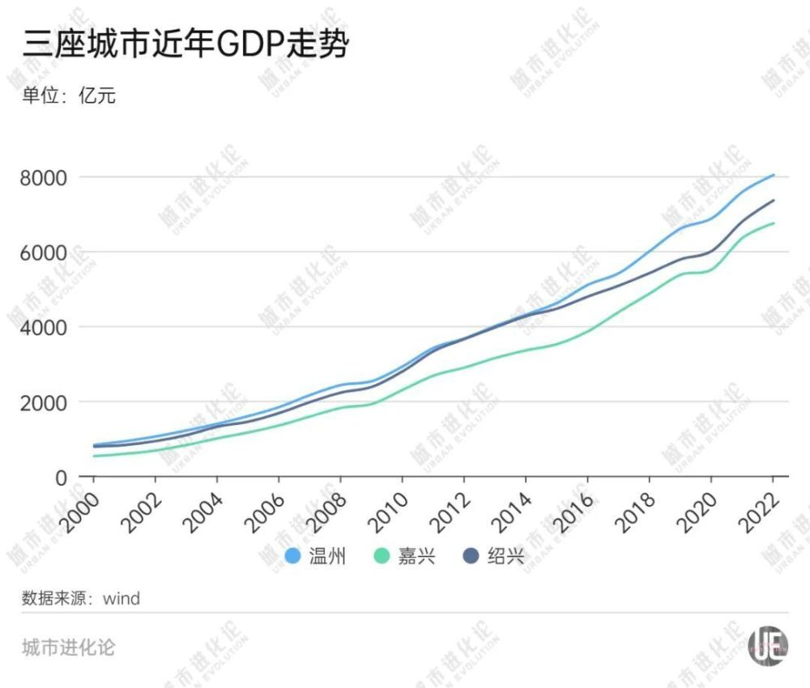

# “杭绍甬”联手，能否成为下一个“苏锡常”

每经记者：刘旭强 每经编辑：刘艳美

 _图片来源：摄图网_501712281_

跨市轨道交通接踵而至，让长三角城市之间越来越近，也是各大都市圈间竞速新的关键手。

日前，《宁波市轨道交通线网规划（2021-2035年）》（以下简称《规划》）公布。其中一大亮点是，全市远期规划的16条轨道交通路线中，有4条都涉及绍兴。

而在此之前，绍兴人早就可以坐着地铁去逛杭州西湖了。前有杭州、后有宁波，浙江两大万亿之城，为何都将地铁修往绍兴？

按照当地媒体的解释，此举是浙江省地“缝”起杭甬产业辐射半径的共识。

杭甬“双城记”带动下，绍兴近年来经济增速在省内脱颖而出，不断甩开嘉兴、逼近温州。杭州、宁波之后，浙江“第三极”悬念再起。

放眼长三角，同为跨市轨交“C位”的常州，有望在今年迈入“GDP万亿俱乐部”，推动苏锡常都市圈能级攀升。未来，在长三角一体化的大舞台上，“杭绍甬”联手，能否成为下一个“苏锡常”?

01

今年是长三角一体化发展上升为国家战略五周年。作为浙江乃至长三角举足轻重的两个经济大市，杭州和宁波如何唱好“双城记”备受关注。

亚运为推进“双城记”带来新契机。看着杭州借赛营城，宁波紧迫感更甚。11月27日，宁波市党政代表团来到杭州，学习杭州改革发展的理念、经验，也与当地党政领导班子探讨杭甬“同城化”的新思路。

强强联手，塑产业高地，是杭甬“双城记”的重要主题。不过，浙江当地媒体指出，杭州的辐射半径基本处于绍兴诸暨一带，而宁波的辐射半径是绍兴上虞、新昌、嵊州一带，将两座万亿之城的辐射半径“缝”起来，亟待解决。

_图片来源：新京报_

关键枢纽，正是绍兴。

“擦亮长三角‘金南翼’，重点支持杭州、绍兴、宁波到舟山的杭州湾南岸一带，是浙江近年来的策略。”华东师范大学城市发展研究院院长曾刚向城叔分析表示，包括杭绍甬在内的杭州湾南岸，被浙江视为未来在全国进一步强势崛起的核心支撑。

顶层设计层面，浙江开始不断推动杭绍甬靠拢。2018年，浙江省政府工作报告首次提出“推动杭州宁波一体化发展”的想法；此后连续四年，又不间断提及“杭绍甬”这一关键词。

2020年，浙江专门出台《杭绍甬一体化发展实施方案》，全力推动三市形成基础设施互联互通、创新要素顺畅流动、公共服务品质共享的一体化发展格局。去年6月，浙江省党代会报告进一步提到：唱好杭甬“双城记”，培育国家中心城市，推动宁波舟山共建海洋中心城市，支持绍兴融杭联甬打造网络大城市。

按照绍兴的设想，要建设网络大城市，有两张网很关键：一是交通网，二是产业网。杭州是浙江的航空中心，宁波则是全省的海运枢纽。近年，绍兴一边跟杭州合力发展临空经济，一边携手宁波沿港出海。

同时，杭绍甬间的城际轨道交通正加速迈向贯通。《规划》内容显示，宁波全市远期规划的轨道交通路线中，涉及绍兴方向的包括：9号线甬江科创支线、溪口支线；N3余姚泗门-
慈溪逍林线；N4 余姚马渚-慈溪阳明线等。

_图片来源：《宁波市轨道交通线网规划（2021-2035年）》_

比宁波更快，杭州先行一步把地铁修到了绍兴。2021年6月28日，杭绍城际铁路（即绍兴市轨道交通1号线柯桥段）通车。去年绍兴地铁一号线主线开通与1号线柯桥段贯通运营后，杭州、绍兴实现了市中心地铁互通。

根据《绍兴市综合交通运输发展“十四五”规划》，绍兴还将积极推动杭绍间轨道交通新线的建设。料想未来，杭绍甬一体化轨道交通网有望落成，并不断织密。

02

随着杭绍甬一体化推进，浙江省内的经济格局或将改变。

_图片来源：绍兴发布（蔡海江 摄）_

夹在杭甬之间，绍兴曾是浙江最尴尬的城市，GDP增速在2016年一度排名浙江各地市末位。不过，过去几年间，绍兴经济增速明显提升。2021年、2022年、2023年前三季度，绍兴经济增速分别为8.7%、4.4%、7.8%，分别高于全省0.2、1.3、1.5个百分点。

一个重要变化在于绍兴似乎正在走出被“虹吸”的阶段。绍兴市委党校杨宏翔等人研究发现，从企业跨市投资数据信息来看，2018年以后，杭州、宁波对绍兴的新增投资超过绍兴对杭州、宁波的投资。绍兴已度过被杭州和宁波“虹吸”资源的阶段，与杭州产业关联度较高并且提升速度较快，与宁波产业关联度较低，但也在缓慢提升。同时，杭州生产性服务业已经形成对绍兴在内等浙江省制造业第一梯队城市的匹配与支持。

更关键的是，2021年、2022年、2023年前三季度，绍兴经济增速也超过了省内经济位次相近的温州和嘉兴。绍兴今年的经济数据更为亮眼，在GDP、规上工业增加值、社消零总额、进出口总额四项数据的增速上，均超过温州、嘉兴两市。

温州身后，绍兴正在努力追赶。Wind数据显示，2020年，绍兴与温州之间的GDP差距一度拉大到869.9亿元，到2022年已缩小至678.8亿元；而绍兴对嘉兴的领先优势，也在多年逐步走低之后，去年画风“突变”，拉大到超600亿元。

从趋势上看，温州、绍兴及嘉兴的相互竞逐，让浙江“第三城”又增加了变数。在曾刚看来，嘉兴有临近上海的区位优势，但不在浙江重点发展的杭州-
宁波发展轴上，经济规模也还较小，尚不足以冲击浙江“第三城”。

温州，一方面受限于在长三角一体化发展中逐渐边缘化的区位条件，过去靠低成本把产品卖向全球的粗放式发展路子，在当下技术驱动的市场中也显得难以为继。而绍兴，当杭州经济发展重心东移，从“西湖时代”转向“杭州湾时代”，杭州对绍兴的连通性和辐射性都会提高。

曾刚认为，随着杭州湾发展的推进，未来绍兴超过温州是大概率事件。他建议，温州想要扭转这一局面，既要发挥前期的财富积累优势和遍布在外的广大温商群体，与杭州、上海甚至北京打造飞地经济，升级产品和商业模式。同时，也要引进更多科研机构，补足科创能力不足的短板。

03

于绍兴而言，身处杭甬之间，面对两大城市的虹吸，一直试图把“东拉西扯”变成“左右逢源”。

而在长三角竞逐中，前有上海大都市圈虹吸之势，后有苏锡常都市圈的“夹攻”之忧，杭甬何尝不想提升要素配置能级，保持区域竞争的优势地位。曾刚认为，浙江对杭州湾南岸的扶持，正是出于这种发展需要。

_图片来源：摄图网_501309731_

借助绍兴这根“金扁担”，杭州、宁波才能联系得更紧密，“金扁担”的作用也才能更加凸显。有媒体评价，未来，随着交通基础设施加速建设，产业协同联动不断强化，浙江的“杭绍甬”，也可能像江苏的“苏锡常”那样，成为一个惯用的固定词组。

“杭绍甬”，能否成为下一个“苏锡常”？在曾刚看来，当前促进民营经济发展壮大的政策密集出台，杭绍甬地区凭借民营经济发展水平和活跃程度的优势，爆发力不容小觑。

2023 年浙江民企百强榜单显示，浙江百强民企主要聚集在杭绍甬地区，其中杭州38席，宁波16席，绍兴11席，位居全省前三，合计占全省65%。

曾刚举例说，杭绍甬一批民营企业，靠着自身灵活的技术转化应用和经营管理机制，从加工环节切入当地不占资源优势的稀土、石墨等新材料产业，成长为国家级专精特新“小巨人”企业。

而放眼杭绍甬地区，以杭州数字经济优势，赋能宁波、绍兴制造业转型升级的例子，比比皆是。比如，以杭州企业提供技术支撑的“化工产业大脑”，已覆盖浙江省九成化工园区。

“杭州湾南岸，在未来五到十年一定是发展非常快的地方。从这个意义上来讲，杭绍甬近期的发展速度，应该比苏南快一些。”曾刚认为，杭绍甬的经济体量和影响力，将向苏锡常不断靠近。

_图片来源：摄图网_501742015_

但杭绍甬的短板也同样明显。曾刚提醒，在与上海合作方面，苏锡常比杭绍甬更紧密。在修建地铁上，苏州第一条市域轨道交通线路，就选择连向上海而不是省内其他毗邻城市。加上近日苏锡常都市圈轨道交通融合发展规划发布，苏锡常轨交加速融合，将进一步与上海实现贯通。

曾刚认为，从长远来看，浙江除了加强内部同城化的“小圈子”，也要向外开拓“大圈子”，进一步加强和长三角中心城市上海的互动力度。城市之间的竞逐本就是你追我赶，但格局打开，才能取长补短，在更大的舞台上共同施展拳脚。

