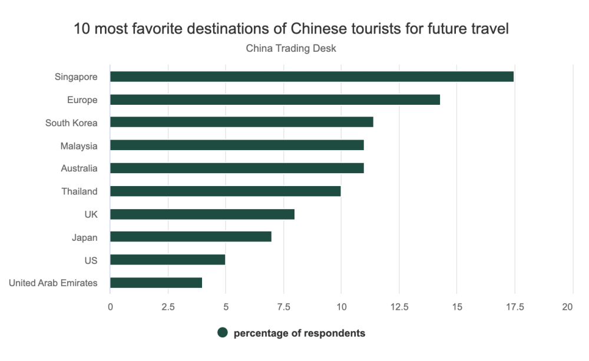
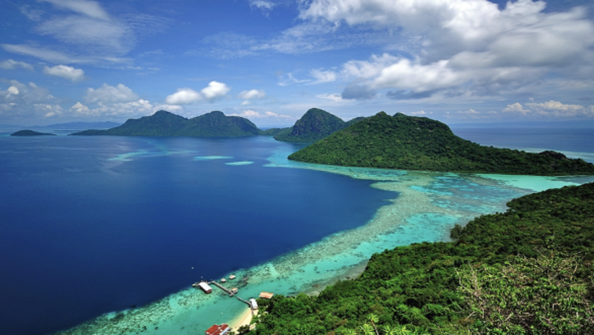

# 中国游客缺席，东南亚“急了”：新泰马陆续免签，争抢出境游首选地

本文来源：时代周报 作者：刘沐轩

东南亚经典路线“新马泰”，马上又可以说走就走了。

继泰国和马来西亚对中国游客开放限时免签后，新加坡也即将开放与中国30天互免签证。

12月7日，在中国新加坡双边合作联合委员会会议上，新加坡副总理兼财政部长黄循财透露，中新双方将通过30天互免签证安排。

 _新加坡著名雕像鱼尾狮（图源：社交媒体）_

相较于此前的签证安排，这一消息意味着两国交流便利性的大升级。

此前，自今年7月23日起，中国政府对持普通护照的新加坡公民恢复15天免签政策。

不仅是新加坡，近期还有多个东南亚国家押注中国游客的春节和寒假出游高峰。随着国际航班的恢复和签证手续的简化，国内的出境游需求也有望出现爆发。

根据携程发布的最新数据，截至12月5日，春节出境游订单整体同比增长近20倍，热门出境游热门目的地包括：东京、新加坡、曼谷、普吉岛、大坂、吉隆坡、悉尼、首尔等。

另据Airbnb爱彼迎发布的2023年冬季中国出境游趋势，中国用户的出境游需求将在“十一”黄金周同比增加8倍的基础上进一步提速。计划在春节长假进行出境游的中国用户，相关搜索热度已飙升至同比14倍以上。

**新加坡成为中国游客出境游首选**

最受中国游客青睐的旅游目的地是哪？

新加坡数字营销公司China Trading Desk在11月发布的季度旅游情绪调查显示，新加坡目前已超越泰国，成为中国游客最喜爱的出境目的地。

该机构针对超过1万名中国游客即将进行的出境游计划进行了调查，发现17.5%的中国受访者计划前往新加坡旅行，其次是欧洲（14.3%）和韩国（11.4%）。

_新加坡成为最受中国游客欢迎的旅游目的地。（图源：China Trading Desk）_

这对新加坡而言可能是意外之喜。

值得注意的是，在该机构上一轮的调查中，位居中国游客出境游欢迎度第一名和第二名的，分别是泰国和日本，选择新加坡的人并不多。

2019年，中国曾是新加坡最大的游客来源地，一年有362万人次前往新加坡。但2023年上半年，前往新加坡的中国游客人数仅有2019年同期的23%。

同时，今年以来截至6月中旬，中国和新加坡之间的航班数刚刚超过2019年同期的一半。

由于国际航班仍然稀少，但需求已然复苏，导致出境游机票、酒店价格暴涨，前往新加坡旅游一度被普遍认为是过于奢侈的旅游目的地。相比于环球影城一日通票至少为60美元（约合429元人民币）的新加坡，消费较低的泰国显然更具性价比。

_相比于其他东南亚国家，新加坡的消费水平很高。（图源：社交媒体）_

然而，随着多起安全事件导致的舆论影响，许多中国游客开始担忧泰国的安全问题，福岛核污水排海又让许多中国游客对日本旅游望而却步。

到了11月China Trading Desk的季度旅游情绪调查中，泰国已经从第一名下滑至第六名，日本也从第二名下滑至第八名。

较为稳定的社会环境和风评良好的治安环境，最终让新加坡脱颖而出。

新加坡此次将开放免签30天的消息公布后，网友们都沸腾了，#新加坡和中国即将免签#
话题一度冲上了热搜第一。携程数据显示，截至12月7日13时，新加坡搜索量环比公布前一小时增长8成，机票搜索量增长9成，酒店搜索量增长5成。

**中国游客缺席，东南亚旅游业“急了”**

2023年的中秋节和国庆节假期，国内旅游出游人数达到8.26亿人次，按可比口径较2019年增长4.1%，国内旅游收入达到7534.3亿元，按可比口径较2019年增长1.5%。

但出境游的复苏仍略显缓慢。据国家移民管理局通报，今年中秋、国庆假期全国边检机关共查验出入境人员1181.8万人次，是2019年同期的85.1%。

这对东南亚部分国家的影响不小，如泰国、马来西亚等国都将旅游业视为支柱产业，而此前占比最高的中国游客，在今年却缺席了他们计划中的复苏。

受打击最大的就是泰国。

2019年，曾有1100万人次的中国游客到访泰国，超过当年赴泰外国游客总数的四分之一。

泰国政府在2023年初预期今年有700万人次的中国游客来到泰国，但经过几次预期下调后，泰国旅游局在11月24日表示，尽管推出了免签政策，但预计今年赴泰的中国游客数量为340人次-350万人次，低于目标。

此前，泰国在9月13日决定对中国游客实施为期5个月的免签政策。

消息公布后，该信息迅速登上热搜，携程上有关泰国旅游的搜索热度一度环比飙升800%。当天15点，携程平台上曼谷、清迈、普吉岛等泰国热门目的地搜索热度环比上周同期均增长超过120%，泰国机票搜索量环比增长155%。

_泰国曼谷的郑王庙（图源：社交媒体）_

好景不长，今年中国恢复出境游后，从泰国景点物价飞涨的消息传出、3月份网上疯传的“男模餐厅嘎腰子”传闻，到8月份反诈电影《孤注一掷》上映、10月份曼谷市中心枪击事件导致中国游客死亡，再到11月曼谷街头发现中国籍乞丐。

有关泰国的负面新闻在今年不断地刺激着中国游客的神经，虽然泰国方面也有针对性地作出过不少澄清，但信任的重建仍然需要时间。

相比之下，马来西亚的没有受到过多负面舆论的影响。

旅游业是马来西亚第三大经济支柱，仅次于电子制造业和石油天然气产业。受益于旅游业的强势复苏，马来西亚今年的GDP增速有望超过4%。

马来西亚旅游、艺术和文化部长张庆信表示，中国今年仍然是马来西亚最大的游客来源国。今年1-9月，马来西亚接待中国游客102万人次，较2019年同期增长42.2%。

_马来西亚仙本那是著名的潜水胜地。（图源：社交媒体）_

他还希望在未来，每年能有500万中国游客来旅游，而开放免签只是其中一项促进措施。

为了吸引更多中国游客，马来西亚正在不停布局。

马来西亚总理安瓦在11月26日表示，该国将从12月1日开始，对来自中国的游客实施30天免签证入境措施。

但在该措施实施之前，从今年3月起，马来西亚旅游局就已经多次来到中国宣传，相继在广州、北京、上海、厦门、长沙、成都、兰州和西安等城市开展路演活动。

根据马来西亚计划中的“2025马来西亚旅游年”，该国希望在2025年实现接待2350万国际游客的目标。但在今年6月，张庆信承认这一雄心勃勃的计划可能得延期到2026年，“以便有更充足的准备”。

