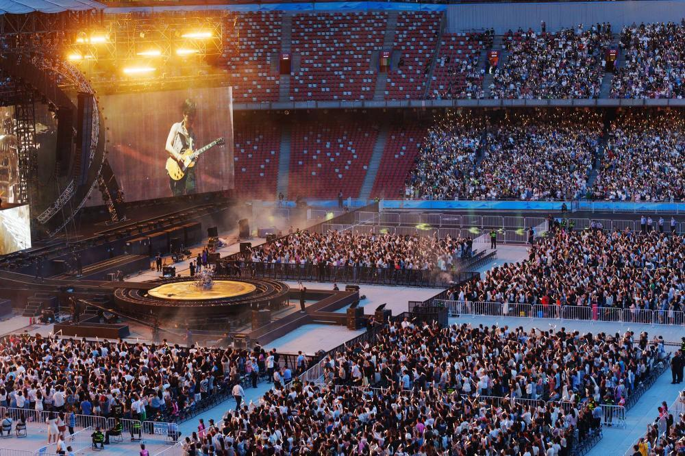
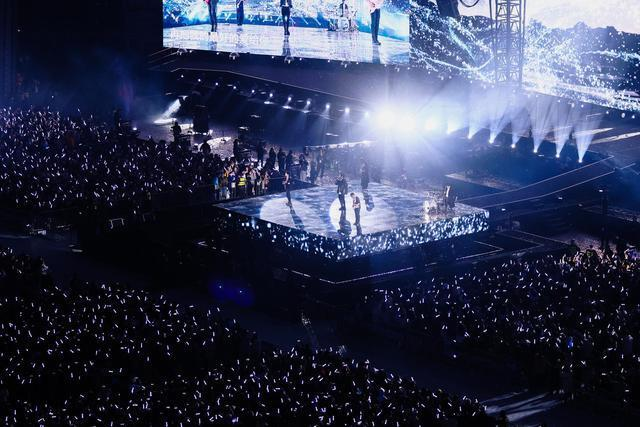
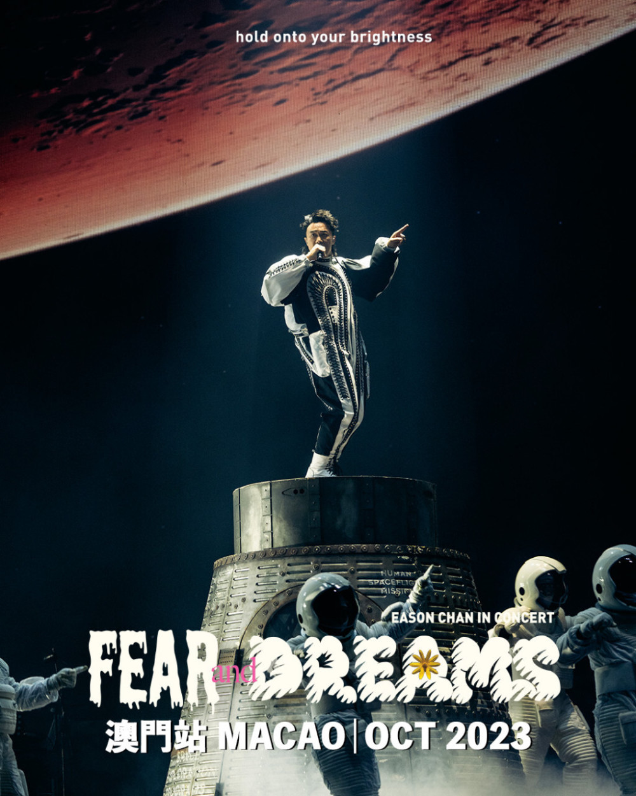

# 五月天“假唱”风波：你等的那个判断，可能最终也不会有

关于判断假唱的标准，业内人士认为此次的五月天事件存在一个模糊地带：“他应该是半开麦，不是完全假唱，所以才死不承认。”他谈到，不仅是五月天这种量级的明星，包括独立歌手在内的音乐人也会这样操作，而“国内的演唱者估计只有10%完全没有问题”。

界面新闻记者 | 尹清露

界面新闻编辑 | 黄月

五月天演唱会的“假唱风波”还在继续发酵。B站up主@麦田农夫
日前发布视频，对五月天上海演唱会的12首歌进行了鉴定，发现其中几乎一半的曲目涉及假唱。此后，相关话题几次冲上微博热搜第一，引发了网友的多轮讨论。

目前看来，这一事件仍难有定论。不仅有音乐博主提出反对意见，质疑麦田农夫的音源对人声提取有限、鉴定不准，有关部门与官方对此事的回应也语焉不详：12月3日北京市文化市场综合执法总队回应称，会将情况记录下来，根据情况进行判定；五月天经纪公司随后回应“没有假唱”；12月6日晚，五月天主唱阿信发布长微博，有人提出质疑——为何说了半天却不直接说自己没有假唱？阿信文中提到的“10拍E6”也引发了新一轮嘲讽，多位乐评人指出，“E6”是极高的高音，阿信不太可能唱得上去。

根据一位不愿透露姓名的专业人士的看法，假唱是国内外乐坛一直存在的问题，然而，“重要的是，观众的耳朵是不是容易被骗，为什么几万名观众里只有几个人会发现，也许大部分的歌迷根本也不在乎偶像是不是假唱，这对他们不重要。”

_五月天演唱会现场（图片来源：视觉中国）_

“是否假唱”似乎已经变成不可解的罗生门，而在事件之外，我们也不由产生疑惑：为什么看似简单的判定却如此复杂？更重要的是，在五月天假唱风波背后，又有哪些问题被忽视了？

界面文化（ID：booksandfun）专访了两位业内人士，讨论了一系列技术层面的细节与国内演出现场现状。他们分别是：音乐人、声学空间设计师李星宇，常年以“鲸鱼马戏团”的名义独立发行音乐专辑；乐评人、音乐厂牌主理人与音乐企划三石一声。

假唱判定为何困难？技术不只有垫音

关于判断假唱的标准，李星宇认为此次的五月天事件存在一个模糊地带：“他应该是半开麦，不是完全假唱，所以才死不承认。”李星宇谈到，不仅是五月天这种量级的明星，包括独立歌手在内的音乐人也会这样操作，而“国内的演唱者估计只有10%完全没有问题”。由于经常遇到类似情况，这在业界不算严格意义上的假唱，帮歌手制作或演奏时，从业者有时会私下吐槽某歌手基本功不扎实，但不会上升到道德层面进行批评。

“尤其是在器乐丰满的演唱会上，如果歌手嗓门本身不大，人声就很难出来，所以会在现场演唱之外叠加一个音轨，类似于一个大的和声。演奏trap（编者按：一种嘻哈音乐风格）这类有一定冲击力的音乐时，也会加入伴唱或使用autotune（编者按：一种音高修正软件）做音效，不然人声听上去很干，这都是可以接受的正常操作。”李星宇还谈到了另一点客观原因，亚洲人的嗓音条件跟某些音乐类型并不匹配，但观众又需要明星驾驭各种曲风，所以在遇到快歌或者需要嗓音洪亮的歌曲时，音色需要叠加才能出效果。

五月天假唱风波也牵扯出了“垫音”这一专业术语。三石一声指出，垫音也就是“原声伴奏音轨之上再加入一部分纯主人声，非和声”。他最早是从海外了解到这个概念的，除了我们平时听的唱片，韩国还有一种其他形态的音乐载体，“它有一个芯片，把芯片贴到手机上，你就可以自行调节伴奏中原唱人声的比例，录制卡拉OK。”

 _图片来源：视觉中国_

三石一声认为，纯靠伴奏、不开麦肯定是假唱，但是许多演出会在原版伴奏中把原声主人vocal音轨中取一个20%-60%不等的区间，而这是演出中很正常的做法。并且，开50%垫音也不代表歌手只出50%的力，而是一样要尽全力，甚至还要花心思琢磨如何与垫音不冲突。他也进一步强调，这种方法大多用在快歌里，慢歌很少这样做。“快歌的很多音色来自于虚拟合成器，不是由真实乐器产生的，所以它在好听的同时也会和人声打架。只依靠人声的话，哪怕唱功再好也会显得单薄。我们在录音室做歌时会加很重的混响，使听感能够相互融合，不然表演效果会打折扣。”

他个人不能接受慢歌还要开垫音的行为：“大家都做了这么多年音乐了，已经很清楚该用怎样的乐器把人的声线凸显出来。”他在今年观看演唱会时发现，仍有一些歌手唱跳快歌时会偶尔开垫音。

李星宇认为，判断真唱的标准不仅在于技术，关键在于出发点是提高歌曲表现力还是单纯偷懒。回到五月天事件，“我们需要把每一首歌的细节全部列出来，再去看垫音的部分是出于怎样的心态。当然，五月天的歌曲还不至于这么复杂，所以偷懒的成分肯定是存在的。”

不仅如此，技术的迭代也让假唱的判定变得更加困难。李星宇谈到，行业内还有一种做法，是把第一场演唱会的录音放到下一场，这样歌手就不用卖力演唱，听上去也有强烈的现场感而不像录音版那样生硬。甚至，我们即将迎来这种技术：所有的音准都已提前规划好，修音软件实时调整歌手的演唱过程，根本不会出错。其结果也是双刃剑，现场的效果更好了，但也降低了对演唱者的要求。

_五月天演唱会现场（图片来源：视觉中国）_

李星宇提醒我们，有正因为技术在不断发展迭代，才会出现越来越多“判定假唱”的新闻。以往，单独提取音频中的人声有一定技术壁垒，但现在大家可以很轻松地买到相关软件进行研究。科技媒体《剁椒Spicy》观察到，如今兴起了一类“技术流乐评人”，虽然假唱判定一直是B站音乐区的热门主题，但是直到今年1月，有了专业设备辅助的up主才开始凭借可视化图谱“打假”，此次认定五月天假唱的麦田农夫就是这类乐评人中的一位。但这类乐评也有局限，内容往往集中在谁假唱了、谁家粉丝又破防了，重复性很强，内容深度不足。

三石一声也在采访中指出，过度关注技术是很可怕的，“音乐是一个整体审美的事，并不是说唱到E6高音就是最厉害的。”李星宇则认为五月天毕竟是乐队，不是严格意义上的歌手，拿流行歌手的评判标准也有点苛刻，“很多歌迷注重的是演出氛围，也有人是去看石头的吉他solo或者玛莎的贝斯表演的，但观众的普遍思维是乐队一定要有主唱，不然就不知道乐队在干嘛。他们肯定有错，但不至于到如此严重的地步。”

总而言之，对于大众来说，更多人想听到的是一个确切的答案，然而按照两位业内人士的观点，这样的答案事实上并不存在。三石一声最后提到，“如果你说半开垫音的做法很正常、不算假唱，大家就觉得你是在帮行业说话了。”

假唱背后市场如何？高票价，少新作，版权规范不足

虽然垫音属于正常操作，但是“五月天假唱”引发如此程度的关注，其原因仍然值得玩味。在三石一声看来，此次事件相当于一次对“极端”粉丝行为的集体反攻，“五月天有一小部分粉丝容不得你提一点善意的建议”，由于部分舆论早就心生不满，才会一次性爆发出来并嫁接到了艺人身上。

李星宇则认为，这次事件与五月天的大牌效应有关，再加上“最近演唱会又多，很多观众又买不到票”，这才激起了民愤。据公开消息，截至12月3日，五月天2023年已举办了59场演唱会，内地的巡回演唱会也十分密集。那么接下来的问题便是，如今国内的演出市场处于怎样的状态？它是健康且良性的吗？

谈到今年的爆发式演出市场，三石一声的态度比较乐观：“大家憋了三年了，很有热情去到现场。”他观察到，今年的演出现场社交属性变得比以往更强，许多人会提前组群去看演唱会，“你我喜欢同样的歌手，就留下联系方式做朋友。”另一方面，今年人们对音乐综艺的讨论变少了，以往周末看节目的时间现在都用来外出了，节目中就没有受关注的作品出现，这也导致许多人前往的是已经成名的头部艺人演唱会。

_图片来源：视觉中国_

假唱风波牵扯出的另一个问题是演唱会的高票价。观察社交媒体上的发言不难发现，许多网友的不满在于“花了钱却被诈骗”。三石一声指出，今年的国内演唱会普遍存在不合理的涨价现象，在中国内地和中国港台地区、日韩、欧美举办同一场演唱会，中国内地的票价一定是最高的。“今年最贵的应该是陈奕迅和张学友，最高价2580元，但是陈奕迅在澳门的演唱会票价最高只有1700澳门币（折合人民币1500元左右），并且比在内地看得更清楚。”他还提到，今年李宗盛在北京和上海的演唱会票价也高达2500元，他在日本的演唱会折合人民币只要1000多元，这已经是同等场地级别的日本歌手不会开出的高价位。

之所以会出现这样的现象，主要原因是为补前几年的亏空。疫情三年，演出主办方和经纪公司没有演出却仍要照常运转，导致今年各个环节都在层层加价，“舞台搭建、舞台灯光这些技术部门也会涨价，最终就由观众买单了。”

_陈奕迅2023年澳门演唱会海报_

当观众集体涌去头部艺人的演唱会，还有多少空间留给独立音乐人呢？三石一声认为这是一个话语权流变的问题，以前的主流媒体更多鄙视先锋型如周杰伦这样的歌手，认为周杰伦比张学友或邓丽君差得远，但当前者的受众成长起来并拥有了话语权，媒体报道也就变多了。“市场还是很大的，非头部也有流量，媒体讨论度不高，但年轻的小朋友很喜欢，也会花钱去看演出，艺人也能把钱赚明白。”

相对而言，李星宇的看法更为悲观，他在采访中指出，“演出看起来很多，但整个市场一直在走低，能赚钱就那么几个。”问题的关键在于，创作者处于一个不被鼓励的环境中，艺人都在演唱老歌，没有新鲜内容输送。首先，由于音乐产业体量太小，国家不会花力气扶持；其次，国内音乐行业的知识产权也不到位，“在版权规范比较强的国家，制作的幕后人员也是有版税分成的，但国内基本上是歌手和唱片公司拿钱，幕后人员的报酬很低，即使歌曲在后期火了，我们也不会分到版税。”

李星宇还提到，这一点也难以怪到音乐平台头上。网易云音乐几年前还能够扶持出好的音乐人，这两年“突然就消停了”，QQ音乐也越来越难推出新作品，无论推多少资源都无人问津。背后的原因在于，听众发现新歌的入口不再是平台，而是小红书等社交平台，听众看到不错的内容才会转战音乐平台。结果就是，许多公司会花费十几万元创作针对抖音受众的歌曲，以此赚钱；还有一些人选择转行搞教学，成为音乐知识科普博主，寻求网红变现的途径。

我们耳畔的音乐正在和这个世界一起发生巨大的改变。无论是假唱乱象与超高票价，还是新作乏力和网红经济，音乐既是深嵌于社会之中的一块小小拼图，同时也成为了反映时代变迁的一面镜子。

