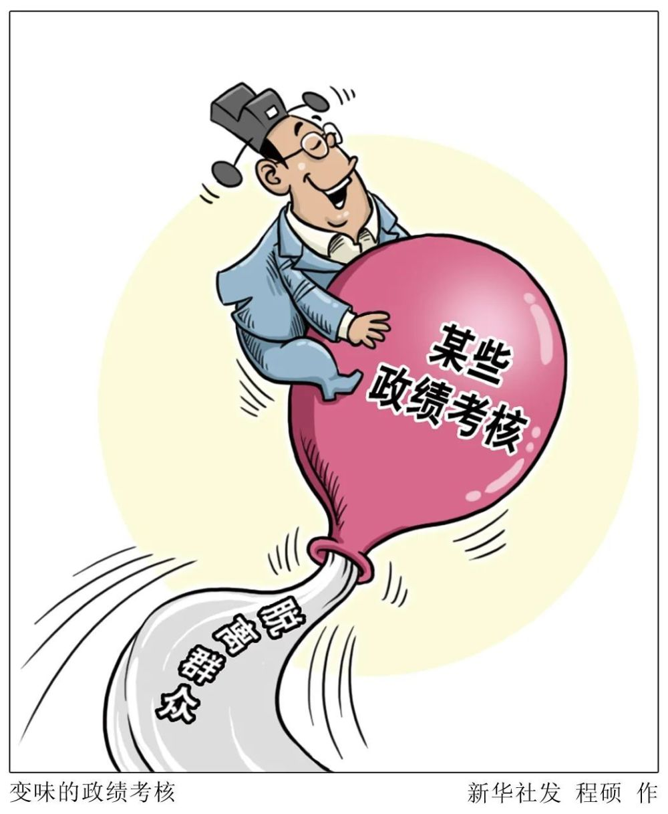
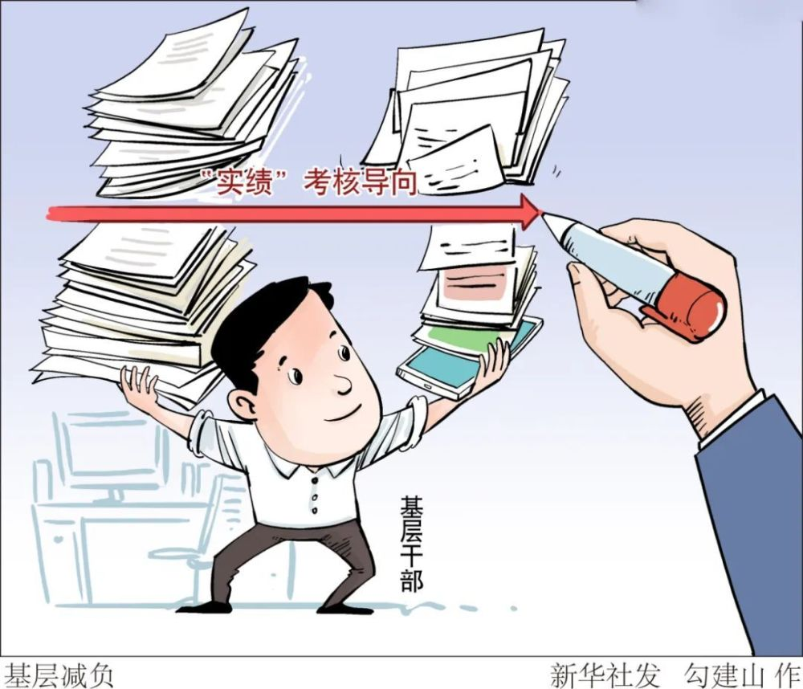

# 半月谈：千分制都不够用，甚至搞出双千分制，勿让基层困在指标体系里

*本文为《半月谈》2023年第22期内容

对基层工作的各种考核指标加以量化，是各地推动工作的一种重要手段。近期，半月谈记者采访了解到，一些地方检验各项工作的考核指标出现过细过多的倾向，让基层干部啧有烦言。

**一个乡镇一月“宣讲”几十场**

摆好桌椅、人员就坐、拍照上传，在东部的某乡镇，一场针对“群众”的理论宣讲就算完成。

党的理论、国家政策、群众身边好人好事等都是宣讲内容。乡镇工作人员介绍，这是必须完成的规定动作，而且有场次要求，还要上传系统才算完成任务。初衷是好的，但是为了完成任务、追求考核，有的乡镇一月就有好几十场。“怎么可能有这么多？大家都知道怎么回事，不说破而已。”一名乡镇干部说。

受访基层干部说，现在各级各部门的考核指标很多，有时候填表、做资料都需要有专门的人去做。“如果说一天10个小时工作，起码有五六个小时在搜集、报送各种资料或者填表。”有受访工作人员说。

考核指标驱动之下，基层出现的专门从事填表报材料的工作人员，被戏称为“表哥”“表妹”。有刚入职的年轻大学生说，如果工作整天都是在与各种材料和表格打交道，那么工作基本上不需要有创新，甚至很多工作不需要动脑筋，只需要把表格填好，资料做好，检查组陪好就行了，这反而在考核中更能够获得好名次。

一位县级领导坦言，考核指标体系能反映真实工作的七八成，但是“打基础利长远”的工作反映不出来，更多的是考核眼下。

有受访干部表示，不少时候基层的工作都是在指标考核体系中“打转”。“只要注意对照指标要求做好相关资料和数据，应付考核就基本没啥太大问题。但是长年累月如此，也使一些基层工作人员缺乏干事创业的主动性和积极性。”

**过于追求考核指标，容易脱离实际**

基层反映，目前上级指标体系存在两种倾向：一是考核越来越细，赋分越来越具体，有些地方千分制都不够用了，甚至搞出了双千分制，基层不得不反复研究考核指标体系，采取针对性措施；二是调度越来越密集，年评比、半年总结不够用了，在一些地方、领域甚至出现日调度、周评比，这大大挤占了用于落实的时间。

不同省市县存在考核一般齐的情况，先天比较优势和特点被忽视。一些主城区考核畜牧、种植，明显这个分难以得到。基层干部反映，区里的拆迁、城建多，但拆迁工作不在考核体系里。考核农业为主地区的工业增加值，导致地方决策动作变形，甚至出现基础不好反而沾光的情况。

某市考核地方，采取末位淘汰制度，首次排名靠后进行约谈，连续排名靠后免职处理。这导致基层相关责任人压力山大。一名生态县区相关责任人对此颇有意见，县域内大部分为限制开发区域，且农业企业税收较少。另一名基础较好的工业强县相关负责人对考核指标体系也不满意，隔壁一个“穷县”因为没有工业基础，上马了一家企业，工业增加值飚增10多倍，这一项排名远超工业强县。

过度依赖考核指标体系推动基层工作，也容易导致基层干部一味地“往上看”，久而久之忽略群众和基层最实际的需求。

北方某县工业门类齐全，经济以传统产业为主。当地最近面临一件烦心事：今年8月份接到省里发文，要求某工业产品生产总量不能超过去年。事实上，这项工业产品在上半年就已经完成去年的量，按照文件要求下半年都得停产。

但是相关企业停产的话，很可能带来系列地方稳定风险：企业工人的工作、职工工资收入、企业经营成本等都是问题。当地无奈，只好咬牙要求相关企业减量生产，但不敢停产。当地干部说，上级来督查肯定有问题，只能在尽量向上争取同情和理解的同时，想办法把老百姓的切身利益维护好。

**调整异化考核指标，为基层减负**

“上面简单，下面麻烦。”受访基层干部反映，一些政策落到基层以后，矛盾重重，问题很多，需要地方再去改进落实。甚至有些出自不同部门的政策，本身存在打架的情况，导致基层不断权衡“挨谁的板子”：“各种做法得罪不同的上级或部门，只能比较权衡，选一个得罪得起或者问题相对较小的方案去执行。”

基层干部向半月谈记者坦言，上级有些决策确实不够客观。政策出台前，首先需要深度调研，结合实际。如考虑按照去年的基础衡量是否科学，是否将基层执行落实这个政策引发的新社会矛盾考虑进去。另外，一项政策出台也得给地方留出执行的空间和时间。

指标考核是现代管理行为。贵州大学经济学院副教授程同林说，针对考核指标可能存在的异化，需要不断调整。

受访人员建议，加强对考核指标体系的清理，同时因地制宜、因时制宜，基于对基层工作和人员状况的了解去制定考核指标，避免因为考核体系与工作实际相差甚远而影响基层工作的落实和推进。

科学设置考核指标，检查考核促进基层工作。一名基层干部说：“检查工作的目的是真正发现问题解决问题，而不是只是一味地挑刺，变着法子去拿捏基层干部。”

武汉大学中国乡村治理研究中心研究员吕德文认为，政策执行要有评估反馈机制、上下级沟通交流机制，现在下级不愿意对上级反映。上级对下级的政策要适当减少刚性，留点弹性。

半月谈记者：邵琨 孙亮全 骆飞 / 编辑：原碧霞

责编：褚孝鹏 / 校对：秦黛新

