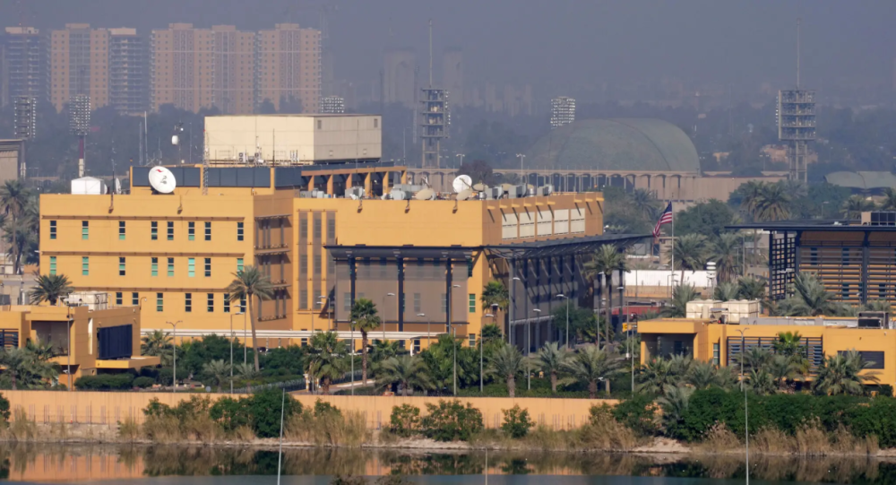

# 外媒：美国驻伊拉克大使馆附近传出爆炸声，警报响起

【环球网报道】据路透社最新消息，经知情人士证实，当地时间8日凌晨4时左右，美国驻伊拉克大使馆附近传出爆炸声，警报响起，呼吁人们“躲避和掩护”。

_美国驻巴格达大使馆 资料图 图自《纽约时报》_

美国驻伊拉克大使馆位于首都巴格达戒备森严的“绿区”内。报道说，美国大使馆发言人没有立即回应置评请求。目前尚不清楚使馆的防空系统是否已启动，或是否受到破坏。目前没有任何组织宣称对此次袭击负责。

路透社提到，自10月中旬以来，驻伊拉克和叙利亚军事基地的美军部队已经遭遇了70多次袭击。

