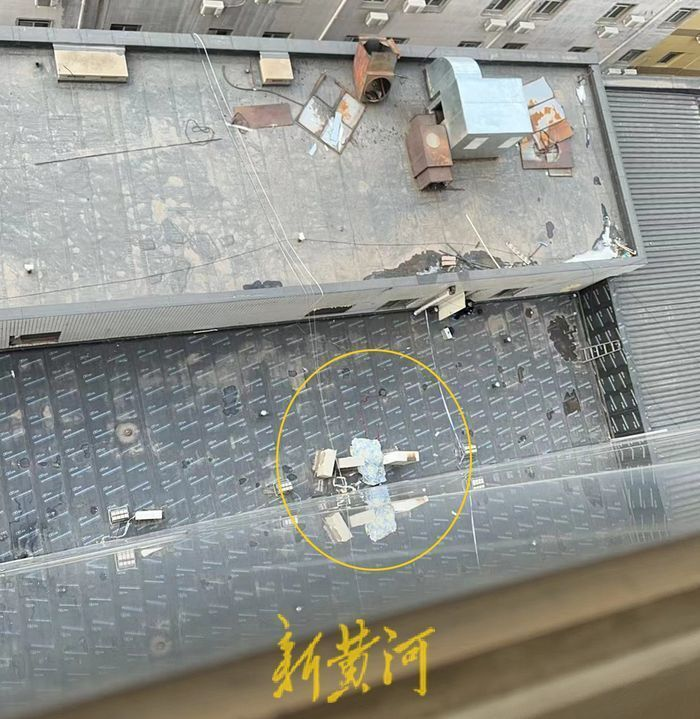
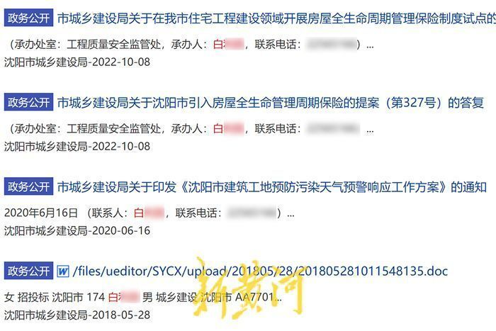

# 沈阳城建局安监处一级调研员在单位坠楼身亡，警方称系自杀非刑事案件

12月7日，有知情人士向新黄河记者爆料，称沈阳市城乡建设局干部白某某在单位坠楼身亡。公开信息显示，白某某生前在该局工程质量安全监管处工作，为一级调研员。8日，记者从当地警方处获悉，白某某坠楼系自杀。此外，据知情人士透露，白某某在坠楼前正接受纪委调查。对于上述情况，沈阳市城乡建设局办公室一工作人员称不清楚，无法给出回应。随后，记者多次拨打该局纪委电话，但始终无人接听。

_知情人提供的现场图片_

前述知情人告诉记者，涉事干部白某某于7日坠楼，根据知情人提供的图片显示，白某某坠楼地点为沈阳市城乡建设局大楼的一处平台上，身体已被覆盖物遮住。8日上午，沈阳市公安局北站分局站前治安派出所一工作人员向记者证实，沈阳市城乡建设局白某某坠楼身亡，“是自杀，不是刑事案件，（自杀）原因我们也不知道。”

_沈阳市城乡建设局官网内容_

据沈阳市城乡建设局官网信息显示，白某某长期在该局工程质量安全监督处任职。2021年，《沈阳市建设工程事故处置应急预案》正式下发，白某某作为该局工程质量安全监督处一级调研员曾代表该局接受媒体采访。另据沈阳市建设工程质量安全协会官网发布文章称，2023年6月，白某某曾参与一起建筑工地深基坑坍塌事故应急救援演练，该文章中也称白某某为沈阳市城乡建设局质量安全处一级调研员。

随即，记者拨打沈阳市城乡建设局电话，该局办公室一工作人员称对白某某的坠亡事件并不清楚。此后，记者多次拨打该局机关纪委电话，但始终无人接听。

新黄河记者：白德彰 编辑：孙菲菲 校对：杨荷放

