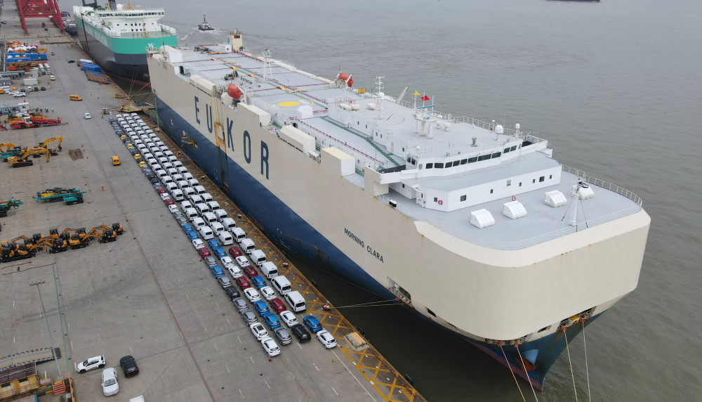

# 美媒：中国电动车进军欧洲意外遭遇运输难题

**参考消息网12月8日报道** 美国《福布斯》双周刊网站12月6日刊登题为《中国电动汽车进军欧洲意外遭遇运输障碍》的报道，报道摘编如下：

过去，预测电动汽车在欧洲的销量并非难事。增长，呈指数级增长，是必由之路，而中国将胜出。

但一个意想不到的复杂因素已经出现，这可能会让中国的计划搁浅，至少在短期内是这样。德国施密特汽车研究所表示，中国缺乏专门的船只将这些新款电动汽车运往欧洲。

这是否会给欧洲电动汽车制造商带来意想不到的救命稻草？目前，欧洲制造商在生产和销售电动汽车方面比中国落后约5年，且中国电动汽车在价格方面要便宜约30%。目前，在售价3万欧元(1欧元约合7.71元人民币——本网注)至5万欧元的电动SUV市场上，中国正大展拳脚。预计明年和2025年电动汽车的大众市场大爆发时，中国将取得更大的成绩。

中国电动汽车的第一批“侦察兵”将于明年亮相，标志着真正的电动汽车革命的开始。这些电动汽车将嘲笑欧洲对经济型电动汽车的错误看法。中国最新推出的电动汽车(可能明年从比亚迪“海鸥”开始)价格将大幅降低。它们是实用的城市通勤车辆，可以满足90%的日常驾驶需求。它们将终结续航里程焦虑，因为没有人会梦想开着它们长途旅行。

英国骏特商务咨询公司全球分析师费利佩·穆尼奥斯说，中国制造商将在这一领域取得成功，因为欧洲人做不到这一点，也赚不到钱。最终，中国人会在欧洲设厂。

但施密特汽车研究所称，中国在欧洲大量销售汽车需要昂贵的运输工具，而目前还没有足够的运输工具。

施密特汽车研究所称：“目前的运力似乎限制了进一步增长，每月从中国运往西欧的汽车数量大约不超过5万辆。我们认为，中国制造商在西欧汽车市场的份额无法超过3%。”

该研究所表示，在新冠疫情和经济放缓期间，许多老旧的远洋汽车运输船被报废，但替代品却迟迟没有出现，大量汽车现在停放在港口等待出口。

施密特汽车研究所的马特·施密特表示：“由于供应不足，租船价格大幅上涨，可能会抵消在中国等成本较低的国家制造汽车所节省的大部分生产成本。”他没有透露何时能解决运输问题。

投资银行瑞银集团认为，无论欧盟作出何种决定，中国的主要汽车制造商都会在欧洲设立工厂。

施密特说：“一旦这些新船在一到两年内投入使用，作为欧盟正在展开的调查的一部分，预计欧盟将对在中国制造的汽车征收更高的进口关税。中国车企进军欧洲市场可能不会像许多评论人士预测的那样一帆风顺。”（编译/邬眉）

_5月25日，空中俯瞰位于上海外高桥的上海海通国际汽车码头，一批上汽集团乘用车停在码头上等待装运（无人机照片）。（新华社）_

