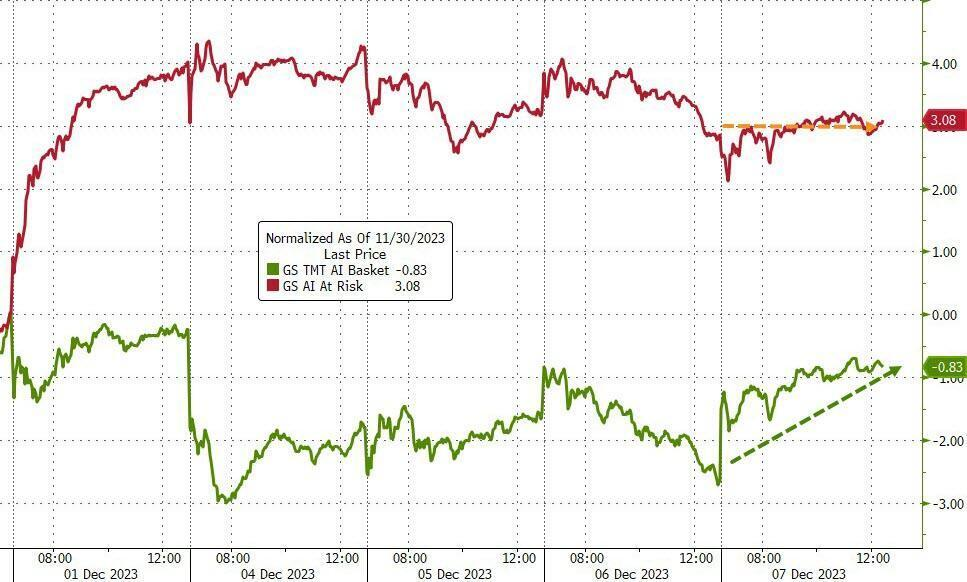
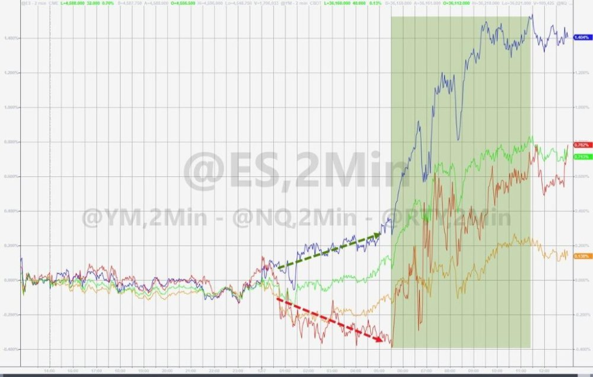
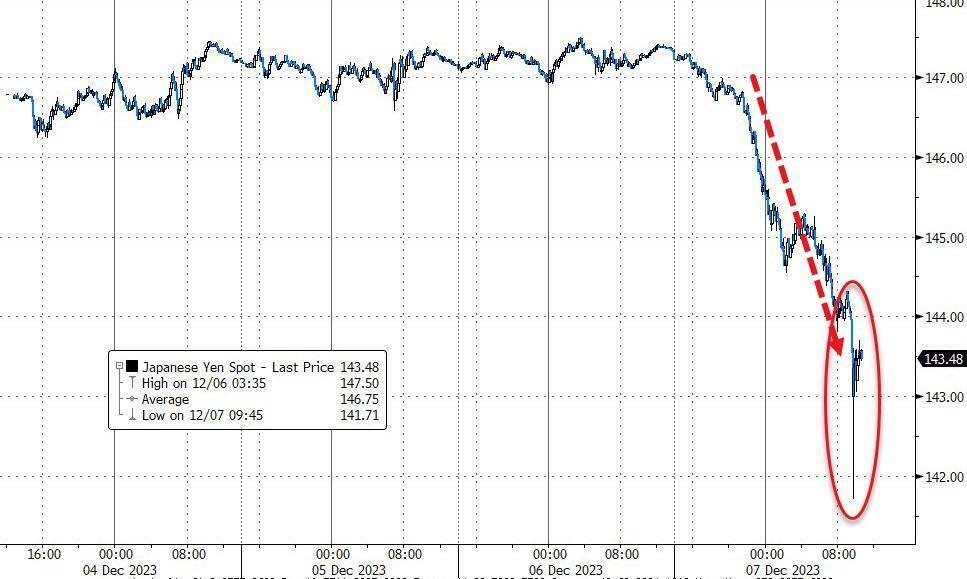
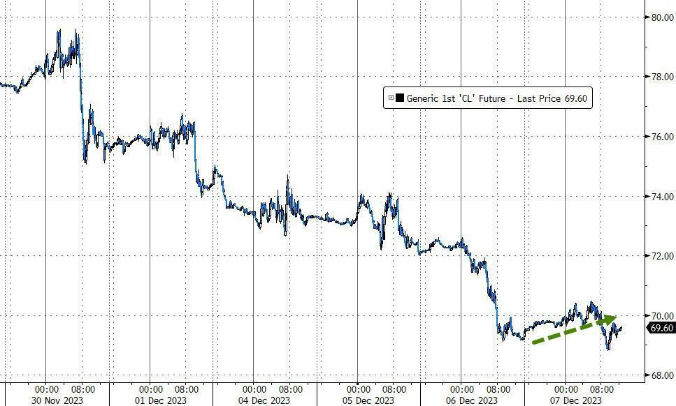

# 美股收盘：重磅就业报告前，美股重拾“AI信仰”反弹，谷歌AMD大涨

本周五公布重磅非农就业报告前，AI热度助美股摆脱跌势，发布最强AI模型Gemini的谷歌领衔，携手推出AI芯片新品的AMD蓝筹科技股力挺大盘反弹，纳指创三周多来最佳单日表现，不但抹平抹平本周内所有跌幅，而且冲上四个月来高位。

 _本月内，AI主题热门股的总体表现首次超过因AI热潮面临风险的个股_

交易员迅速加码押注负利率进入尾声、最快本月结束负利率。互换合约显示，周四盘中，投资者预计日央行本月会议结束负利率的概率一度从2%飙升至接近45%。日本国债价格大跌，十年期日债收益率创一年最大升幅，欧美国债收益率追随攀升、刷新日高；日股加速回落，日经225股指收跌近1.8%；日元高涨。日元兑美元盘中涨近4%，创一年来最强劲涨幅，施压美元指数跌离两周多来高位。

周四美股盘前公布的上上周感恩节期间美国持续申请失业救济人数超预期回落，创四个月最大降幅，总人数仍接近两年高位。数据公布后，美元指数跌幅继续扩大，基准十年期美债收益率保持升势，继续脱离日央行官员放鹰前周四当天所创的三个月新低，而对利率敏感的两年期美债收益率迅速转降，一度靠近上周五所创的五个月低位。

有分析师建议，在周五就业报告公布前，将十年期美债的多仓获利了结。还有分析认为，估值和仓位都将证明最近的美债反弹势头已衰竭，债市的上涨有点过头，因为预计美国将会有温和衰退，高通胀仍有黏性。不过，美国银行最近的报告暗示美债上涨可能才刚开始，其测算，最近五个加息周期中，每个周期的最后一次加息后，美债收益率都猛降，平均降幅107个基点。

大宗商品中，受益于中国11月出口增长及美元回落，铜等部分基本金属期货反弹；黄金期货未能保住反弹势头，盘中转跌，现货黄金继续小幅反弹，还未能接近周一所创的历史高位；国际原油再度反弹失利，自OPEC+会后各协议国宣布自愿加码减产以来，一周内持续下跌，继续下探五个月来低谷，美油未能收复70美元，连续两日收于这一关口下方。评论称，空头发现，投资者无视了OPEC+的削减供应和延长减产威胁，他们对做空更有信心，加码押注做空，同时，经济放缓背景下，对油市需求的担忧持续增加，也影响了油价。

纳指反弹至四个月高位 谷歌所在板块领涨标普 AMD发布AI芯片后大涨

三大美国股指连续两日集体高开。标普500指数和纳斯达克综合指数全天反弹，早盘纳指已涨超1%，道琼斯工业平均指数早盘不止一次转跌，午盘保持涨势。午盘刷新日高时，纳指涨近1.5%，标普涨逾0.9%，道指涨近110点、涨0.3%。最终，三大指数本周首度集体收涨，标普和道指结束三日连跌，本周首日收涨。

最周三连跌三日至11月21日以来低位的标普收涨0.8%，报4585.59点。纳指收涨1.37%，创11月14日以来最大涨幅，报14339.99点，不但脱离周三刷新的11月17日以来收盘低位，而且反弹至7月31日以来高位。道指收涨62.95点，涨幅0.17%，报36117.38点，本周内累计跌势不改。

价值股为主的小盘股指罗素2000收涨0.87%，结束两连跌，未继续跌离周一所创的9月1日以来收盘高位。科技股为重的纳斯达克100指数收涨1.48%，衡量纳斯达克100指数中科技业成份股表现的纳斯达克科技市值加权指数（NDXTMC）收涨2.27%，都摆脱周三回落所创的11月13日以来低位，分别反弹至11月20日和11月29日以来高位。

_主要美股指周四全线反弹，标普和道指本周内首度上涨_

标普500各大板块中，周四只有三个收跌，原油下跌持续影响的能源跌0.6%，连续三日跌幅居首，公用事业跌超0.2%，医疗跌不足0.1%。收涨的八个板块中，谷歌所在的通信服务涨超3%，遥遥领先其他板块，AMD等芯片股所在的IT涨超1%，特斯拉所在的非必需消费品涨0.9%，其他板块涨不到0.7%。

龙头科技股全线上涨，大多至少涨超1%。特斯拉收涨近1.4%，连涨三日至11月29日以来高位。FAANMG六大科技股中，周四发布最强多模态AI模型Gemini正面对决GPT-4的谷歌母公司Alphabet盘初曾涨超6%，收涨5.3%，反弹至11月28日以来高位；连跌六日至11月6日以来低位的Facebook母公司Meta收涨近2.9%，反弹至一周来高位；周三回落至11月21日以来低位的亚马逊收涨1.6%；周三回落至11月14日以来低位的奈飞收涨近1.2%；苹果收涨1%，反弹至8月1日以来高位；涨超1%，曾涨超1%，谷歌的AI领域应用劲敌微软收涨近0.6%，在周三回落至11月13日以来低位后反弹。

芯片股在总体连跌三日后反弹，费城半导体指数和半导体行业ETF
SOXX分别收涨约2.8%和2.7%，刷新11月20日以来高位。个股中，周四推出英伟达AI芯片竞品MI300X的AMD收涨9.9%，收盘时，英伟达、英特尔、高通涨超2%，希捷科技涨超1%。

Alphabet大涨的带动下，包括苹果、微软、Alphabet、Meta、英伟达、特斯拉、亚马逊在内七大美国科技股周四总体大反弹。

 _谷歌大涨的带动下，七大美国科技股周四大反弹_

AI概念股表现各异，未能集体追随大盘反弹。公布第二财季每股亏损低于预期、但营收逊于预期、第三次财季指引令人失望，令市场担心AI投资影响盈利能力后，C3.ai（AI）收跌10.8%，
BigBear.ai（BBAI）跌超2%，而Adobe（ADBE）收涨超2%，SoundHound.ai（SOUN）涨近1%，Palantir（PLTR）涨0.5%。

热门中概股涨跌不一。纳斯达克金龙中国指数（HXC）午盘转跌，收跌0.1%，周三结束三连跌后回落。中概ETF
KWEB和CQQQ分别收涨近0.8%和逾0.6%。个股中，公布三季度净利润、较去年同期大幅扭亏的斗鱼盘初曾涨超15%，收涨超2%，收盘时百度、B站、网易涨超2%，阿里巴巴、京东涨超1%，而拼多多跌超1%，腾讯粉单跌0.3%，三家造车新势力齐跌，收盘时小鹏汽车跌超3%，蔚来汽车也跌超3%，发布财报以来首日下跌，理想汽车跌超1%。

波动较大的个股中，2024财年第三财季业绩优于预期，但管理层预计2025财年销售加速下降、且此后被BTIA将评级从买入降至中性后，客户体验软件公司Sprinklr（CXM）收跌33.5%；三季度营收和四季度净销售指引均低于预期的宠物电商Chewy（CHWY）盘初曾跌近13%，后收窄多数跌幅，收跌0.6%；公布季度业绩逊于预期后被美国银行将评级下调至中性、认为中短期内几乎没有理由看好后，葡萄酒生产商Duckhorn
Portfolio（NAPA）收跌12%；因强劲需求而上调四季度营收指引、且预计四季度亏损低于预期的航空公司JetBlue（JBLU）收涨15.2%；在医药公司艾伯维宣布87亿美元将其收购后，神经科学生物技术公司Cerevel（CERE）收涨11.4%，艾伯维（ABBV）收涨逾1%；尽管第三财季营收低于预期，电动汽车充电网络运营商ChargePoint（CHPT）仍收涨9.8%。

欧股方面，10月德国工业产出超预期下降，欧元区三季度GDP终值同比下修至零增长，不及预期。数据令投资者担心经济下滑，泛欧股指止步两连阳。欧洲斯托克600指数跌离周三连续两日刷新的7月31日以来收盘高位。主要欧洲国家股指周四齐跌，连续两日收创历史新高的德国股指小幅回落，和西班牙股指分别止步七日和四日连涨，两连涨的法股和意股也回落，周三结束两连跌的英股微跌。

斯托克600各板块中，周三涨超2%领涨的旅游板块盘中曾跌超1%，后收窄多数跌幅，收跌0.2%，受累于被摩根大通将航空股评级从超配降至低配后，多家航空公司盘中至少跌超3%，收盘时汉莎航空跌超2%，国际航空IAG跌超2%，而法荷航收涨超5%；防御性的公用事业板块逆市收涨近0.4%。

其他个股中，公布的上半年数据显示二季度业绩增长意外放缓后，微型模型游戏相关公司Games Workshop
Group收跌13.7%，领跌斯托克600成分股。

十年期德债收益率创八个月新低 日央行放鹰后 十年期美债收益率刷新日高 脱离三个月新低

欧洲国债价格涨跌各异，虽然收益率都在日本央行官员讲话后刷新日高，但欧股盘中德债收益率转降，价格继续上涨，英债收益率保住回升势头。到债市尾盘，英国10年期基准国债收益率收报3.96%，日内升2个基点，脱离周三所创的半年来低位；2年期英债收益率收报4.48%，日内升2个基点；基准10年期德国国债收益率收报2.19%，日内降1个基点，连降五日，亚市盘中接近2.24%刷新日高，欧股开盘后持续下行，一度下破2.17%，创4月6日以来新低；2年期德债收益率收报2.58%，日内降1个基点，欧股盘中曾接近2.57%，继续创5月以来新低。

美国10年期基准国债收益率在亚市早盘曾下测4.10%，连续三日刷新的9月初以来低位，后迅速转升，日本央行官员讲话后，亚市盘中曾升破4.18%刷新日高，日内升近8个基点，欧股盘中升幅收窄，曾下破4.14%，美国失业数据公布后曾短线上测4.18%，到债市尾盘时约为4.15%，日内升约5个基点，在连降两日后反弹。

对利率前景更敏感的2年期美债收益率在日本央行官员讲话后持续上行，欧股盘前曾升破4.63%刷新日高，日内升约4个基点，后震荡回落，美股盘前公布失业数据后转降，美股盘中保持降势，美股午盘曾下破4.57%刷新日低，日内降约3个基点，靠近上周五下破4.54%刷新的6月上旬以来盘中低位，尾盘回升，到债市尾盘时约为4.59%，大致持平周三同时段水平，在周三回升后升势暂歇。

_各期限美债表现继续分化，短债收益率下行，长债收益率回升，但全周内中长期美债收益率都下降_

日元盘中涨3.8% 创一年最大涨幅 美元指数止步三连涨 跌落逾两周高位

日元高涨的推动下，追踪美元兑欧元等六种主要货币一篮子汇价的ICE美元指数（DXY）周四亚市盘中转跌后持续下行，转跌前亚市盘中曾涨至104.20刷新日高，日内微涨（周三收104.153），逼近周三涨破104.20刷新的11月17日以来高位，转跌后，美股午盘跌破103.30刷新日低，日内跌超0.8%。

到周四美股收盘时，美元指数处于103.70下方，日内跌近0.5%；追踪美元兑其他十种货币汇率的彭博美元现货指数跌近0.4%，跌落11月17日以来同时段高位，盘中刷新日低时跌近0.7%，和美元指数都在连涨三日后回落，最近七个交易日内第二日下跌，上周五鲍威尔讲话当天止步两连阳。

_彭博美元现货指数创三周来最大盘中跌幅_

非美货币中，日本央行官员暗示将结束负利率后，日元大涨，美元兑日元周四全天基本下行，美股午盘一度逼近141.70，日内跌3.8%，创去年12月20日以来最大跌幅，刷新8月7日以来低位，美股收盘时略低于144.00，日内跌超2%；欧元兑美元在欧股盘前曾跌破1.0760，连续四日刷新11月14日以来低位，后迅速转涨，美股盘前刷新日高时逼近1.0800，日内涨超0.3%；英镑兑美元在欧股盘前曾跌破1.2550，三日刷新11月24日以来低位，美股盘前曾逼近1.2600刷新日高，日内涨近0.3%。

_美元兑日元周四大跌_

离岸人民币（CNH）兑美元在亚市盘初刷新日低至7.1747，后迅速转涨，欧股盘前曾涨至7.1527刷新日高，日内涨215点，告别周三跌至7.1768刷新的11月20日以来低位。北京时间12月8日4点59分，离岸人民币兑美元报7.1632元，较周三纽约尾盘涨110点，在连跌三日后反弹

比特币（BTC）在亚市盘中曾处于4.4万美元上方刷新日高，逼近周三涨破4.44万美元而连续三日所创的去年4月以来高位，欧股开盘后加速回落，欧股盘中一度跌破4.3万美元至4.29万美元下方，较日高跌超1200美元、跌近3%，连续两日盘中回落上千美元，美股收盘时处于4.34万美元下方，最近24小时跌超1%。

OPEC+会后原油六连跌 创九个月最长连跌 连创五个月新低

国际原油期货反弹失利。美国WTI原油在周四欧股盘前和盘中重上70美元，但此后转跌，未能成功收复这一关口。美股盘前刷新日高时，美油接近70.50美元，布伦特原油接近75.50美元，日内均涨近1.6%，后持续回落，美股午盘转跌后，美油一度下测68.80美元，7月4日以来首次盘中跌破69美元，日内跌超0.8%，布油曾跌至73.6美元，日内跌超0.9%。

最终，原油连续六个交易日收跌，创2月22日以来最长连跌日，自上周四OPEC+会议以来持续收跌，但跌幅较周三明显缓和。周三收跌4.07%的WTI
1月原油期货收跌0.06%，报69.34美元/桶，在周三自6月末以来首次收盘跌穿70美元关口后，两日刷新6月27日以来即月合约收盘低位。周三收跌3.75%的布伦特2月原油期货收跌0.33%，报74.05美元/桶，在周三收创6月28日以来新低后，又刷新6月27日以来收盘低位。

_美国WTI原油微幅收跌，在五日连跌后跌势缓和_

美国汽油和天然气期货涨跌互见。NYMEX 1月汽油期货收跌1.43%，报2.0012美元/加仑，连跌三日，连续两日刷新两年来低位；周三大幅回落的 NYMEX
1月天然气期货收涨0.62%，报2.5850美元/百万英热单位，暂别周三跌超5%刷新的将近三个月来低位。周四美国能源部公布的上周美国EIA天然气库存降幅高于预期，助推气价反弹。

伦铜结束三连跌 告别两周低位 黄金期货盘中转跌 未能连日反弹

伦敦基本金属期货周四涨跌各异。领涨的伦镍涨近1.8%，连续两日反弹，继续摆脱跌至上周所创两年多来低位的危险。伦锡也两连涨。伦铜告别两连跌所创的两周多来低位。而伦铅自11月20日以来连跌十多日，连续两日创半年来新低。伦铝连跌四日至五个月来低位，伦锌连跌两日至三个多月来低位。

纽约黄金期货在欧股盘前转涨，美股盘前刷新日高至2057.2美元，日内涨近0.5%，美股早盘转跌后基本保持跌势，未能靠近周一涨破2150美元所创的盘中最高纪录。

最终，周三止住两连跌的COMEX 2月黄金期货收跌0.07%，报2046.4美元/盎司，未能开始接近周一上逼2150美元所创的盘中历史高位。

现货黄金连续两日反弹，美股盘前刷新日高时上测2040美元，日内涨0.7%，后回落，美股盘中曾转跌，美股收盘时略低于2030美元，未能逼近周一上逼2150美元所创的盘中历史高位。

_现货黄金继续窄幅波动，处于2020美元上方_

