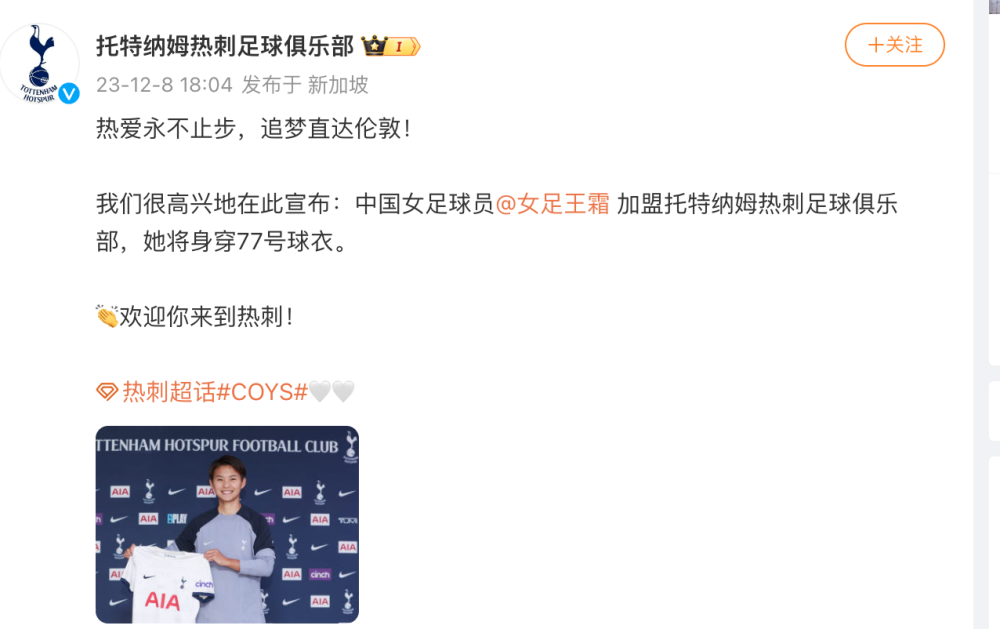

# 英超，王霜来了！热刺官方：中国女足王霜加盟身披77号，合同到2026年

北京时间12月8日消息，今天英格兰女足超级联赛热刺官方宣布，中国球员王霜加盟，合同从2024年1月1日起，到2026年，王霜将身披77号球衣。

其实英超一直都在王霜的考虑范围内，只是缘分一直没到，这次终于水到渠成，一切都是最好的安排，期待王霜与张琳艳的梦幻联动。

今年，王霜随中国女足征战了世界杯，并且有球进账。不过，随后她因为伤病等原因，遗憾错过了奥预赛。

此番加盟热刺，是王霜在29岁的年纪，第一次闯荡英伦，期待她能有更好的表现。

**附热刺官方公告：**

我们很高兴地宣布，我们已经与经验丰富的中国国脚王霜达成了协议，但还需获得工作签证和国际许可。

这位 28 岁的球员与路易斯维尔队的合同到期后，将于2024年1月1日加入我们。

她与我们的合约将持续到2026年，她将身披 77 号球衣为我们的女子一队效力。

