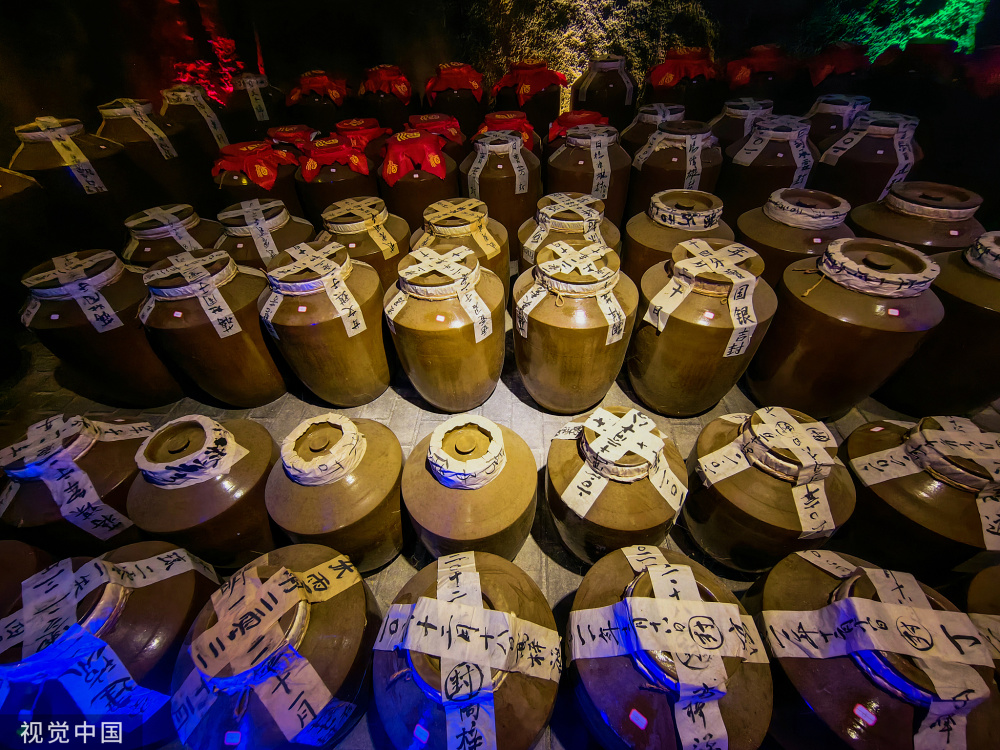

# 茅台镇90%酒厂陷停产？多为半成品酒厂，有老板投资减少了75%

_图片来源：视觉中国_

特约作者|李米

编辑|陈弗也

出品|棱镜·腾讯小满工作室

“在我们仁怀，工资都是用来加油的，要想赚钱还是得靠卖酒。”两三年前，这句话常被挂在仁怀人的嘴边。

尽管仁怀只是一个县级市，但得益于白酒行业的发展，不少家庭非常殷实。在当地，甚至有这样的说法：家庭月度支出5万块钱不算多，打麻将一晚上输几万块不算事儿。而今年，大家凑在一起聊的则是另外一个话题：“钱不好赚了。”

近日，有传言称“茅台镇60%以上的酒厂出现了资金链问题，其中90%选择停产或者减产。社会库存极大，开瓶率极低。”

对于这一消息，多位仁怀酒业从业者表示不清楚具体数据。但他们也表示，今年整个行业相对悲观，虽然有酒厂依然会“投粮下沙”，但也有不少酒厂选择减产、停产。

“很多中小型的酒厂减少了一半产能，几家销售渠道做得好的酒企就还会全部投产。”某酒企员工王洋（化名）观察到。在他看来，关停、减产的酒厂主要业务是销售“基酒”，所谓“基酒”，指的是酿造后未灌装的半成品酒。

“所有以卖基酒为主的酒厂都恼火了。”王洋感叹道。过去很长时间，茅台镇大部分酒企以销售基酒为主，也会承接外地贴牌商的用酒需求。

**大量资金涌入酒厂**

在仁怀，不管是出租车司机，还是在市区、茅台镇街边开店的商家，都声称自家或者亲戚家有酒厂。但实际上，大部分人只是有酒厂资源，或者租用窖池烤酒。

2004年，仁怀市被认定为“中国酒都”，近两年被认定为酱香白酒核心产区，因而仁怀市常住的65.47万人口中，相当一部分人与酒有关。

“市区人口大约在28万，真正在从事酒行业的人可能有15万，除茅台酒厂约5万员工外，剩下的人要么在其他酒厂上班，要么把酒作为副业。”王洋向作者介绍了目前仁怀市酱酒产业链上的三类公司：酒厂、租窖池烤酒的公司、收基酒的基酒公司。

2016年-2021年期间，茅台引领的酱酒热潮席卷仁怀，当地大量闲置资金转向酱香酒。

除供职酒企之外，王洋还对茅台镇酱酒生态研究多年，并建立了大小酒企的联系库。据他了解，此前，有亲戚租用别人的窖池，一年投资2000万元，行情好的时候，营收一半可以作为利润留下来，另一半则拿去继续投产。

但今年，考虑到行情不好，存酒较多，只投资了500万元，直接减少了75%的投资。

2019-2021年，仁怀人李达（化名）曾租用窖池烤酒，酿造完成后就能马上卖出，赚到了数百万元的利润。就在他准备继续投入时，原主人毁约收回窖池。现在回想起，李达感到一阵窃喜：“幸亏当时收回去了，不然今年的酒能不能卖出去都不知道。”

如今，行情下滑，老板们租赁窖池的意愿变小，这直接影响了窖池的租金水平。

王洋观察到，之前茅台镇周边的窖池每口租金5万/年，远点的4万/年，条件差的3万/年，今年基本上都降低了1万/年。

除了当地的投入外，茅台镇也曾吸引了外部资金、上市公司的关注。

在仁怀的中国酱香白酒核心产区，15.03平方公里茅台酒产区、53.03平方公里茅台镇传统优势产区、52.38平方公里仁怀集聚区，加起来120平方公里的地方，曾经容纳了1925家酒企，这让很多上市公司看到了“财富密码”。

在A股，白酒上市公司数量不多，仅有21家，占5000多家上市公司总数的0.4%，总市值超4.2万亿，约占A股的4.8%——每20元的市值，就有近1元属于白酒。

不过，这股资本热潮没持续多久。2023年初，多家媒体报道，证监会在对主板申报企业的行业要求上，将白酒列为“红灯行业”，防止大量热钱进入到白酒赛道。

某酒业研究分析师向作者表示，这主要是由于白酒企业投资周期以及产业链太长，而且资本进来后没有顺畅的退出通道，很多资金就不再关注茅台镇。王洋也发现，现在大多是拉本地人合伙投资，外商基本上很少。

在这样的情况下，2022年，中国酱酒产能达到了一个高峰，约70万千升，同比增长16.7%，其中仁怀酱酒产量达41.1万千升。

**“做包材的也卖酒，资金链直接拖垮了”**

过去两年，“整顿”两个字就像悬在茅台镇酒企老板头上的达摩克里斯之剑。2021年9月，仁怀市政府印发《仁怀市白酒产业综合治理三年行动方案》，提出用3年时间，全面取缔生态环保、食品安全、安全生产等方面不达标的白酒生产企业。

根据仁怀市2022年《政府工作报告》，当地清退白酒生产企业（作坊）622家、窖池7804口。

“24口窖池以下的小作坊，要么以5万元每个窖池的赔偿填坑，要么自己找其他酒企兼并重组从而达到要求。”仁怀市某酒厂老板告诉作者，大部分酒企选择兼并从而继续烤酒，但也有部分停产退出。

不过，相对而言，2023年比较温和，仁怀市政府仅提出新增清理退出白酒企业（作坊）100家以上的计划。

有业内人士称，茅台镇此次酒企减产、停产风波，跟整顿的直接关系不大，主要原因还是市场周期性的波动。

11月中旬，2023杭州国际酒业博览会延期举行，中国酒类流通协会公告载明“经销商及代理商积压库存过多，无法进行正常采购”，将白酒行业的销售困境暴露在市场面前。

深圳某白酒贴牌商杨涛（化名）发现很多有过联系的包材商在过去一年消失了，“做包材的也卖酒，资金链直接拖垮了。”

杨涛最近频繁跟同行交流，往往会以叹气结尾：“你表现最好的一年销售额多少？”“卖了4000-5000万。”“今年呢？”“中秋节前也才卖了几十件。”

互相诉苦后，杨涛发现，虽然贴牌前都有跟酒厂签订保底协议，但目前来看今年都完不成，这必然减少了购买基酒的量。贵州的一家大型包装企业负责人注意到，大酒企自身推出的流通大单品，包材订单相对稳定，但相关贴牌产品的包材订单大幅度减少。

除了销售额下滑以外，回款周期也在影响着酒厂的现金流。

杨涛表示，以往酒企通常会给贴牌商三个月的账期，可以在拿走产品后三个月内给钱。但现在要求现收现付，尽管最新的订单可以及时收回账款，但是更大的订单在这之前已经签订，而那些订单的回款时间并不能确定。

对于囤货风险较大的酒厂来说，现金流更是一件迫切的事情。

仁怀一位专门帮客户找基酒的人士发现，很多中小酒厂的基酒价格一直在下降，“一方面，前两年市场行情使很多酒厂疯狂扩建，现在需要回笼资金；另一方面，粮食成本下来了。”

有茅台镇酒厂老板向作者罗列了当地红缨子高粱的收购单价，近3年分别为5.2元/斤、4.6元/斤、4元/斤。

在茅台镇，过去几年，酒企在快速发展，但没有构建相匹配的销售体系、品牌影响力，在面对今天这个市场周期时，陷入困境就在所难免了

**“染酱暴富”不再，内卷风暴开启**

近两年，“染酱暴富”的神话发生了天翻地覆的变化，上到酒企、贴牌商，下到酒业从业人员，酱酒链条上的每一个人都发现，躺赚的时代过去了，内卷风暴刚刚开始。

为了自救，更多酒厂降低了贴牌门槛。近十几年来，贴牌模式在仁怀逐渐盛行。简单来说，没有酒厂但有资金跟销售渠道的人，拿着商标找到一家酒厂，让酒厂根据自己的需求生产、设计、包装出成品。

在申请条码进行产品备案后，就可以面向市场销售。这个过程中，酒厂只是代加工，销售的主要是基酒和灌装服务，商品的实际运营由贴牌商负责。

某排名靠前的酱酒企业，原本开一个条码的门槛为800万元，今年降为380万元。而规模较小的酒厂，甚至开始接5件、10件的定制。

实际上，这对贴牌商来说造成了另一种压力，杨涛对此表示担忧：“市场行情本来就不好，贴牌门槛降低，竞争压力就大了。”他的一位客户，在大酒厂降低定制门槛后，选择了大酒厂，这在一定程度上也反应了小酒厂的生意难做。

“整体行业估计下滑了30%-40%”，王洋认为高端价位酱香酒的下降最为明显，他所供职的酒企原本主攻500-800元价格带，但现在也已布局200元以下价格带产品，并由此稳住了公司的整体销量，“只要能赚钱，都愿意出。”

看上200元以下酱酒市场的还有茅台集团和习酒。今年3月，茅台集团保健酒业有限公司正式推出新品台源酒，售价156元/瓶；习酒则推出定价为188元的圆习酒。对于一贯打上高品质、高成本标签的酱酒市场来说，百元大众酱香领域将面临激烈厮杀。

不过，对于相对高端的酒体“茅香”来说，由于需要存放几年才能得以灌装销售，价格不降反升。业内知名的某专营基酒销售的茅台镇酒企，今年将“茅香”酒体的单价从380元/斤提至460元/斤。

对于茅台镇的基酒厂来说，他们也意识到终端市场的重要性，此前，他们的客户主要是其他酒厂。

今年10月，“中国酱香白酒核心产区（仁怀）展团”在秋季糖酒会上集体亮相，杨涛意外发现，上述业内知名基酒销售酒企也在其中，这家基酒公司也在争夺终端市场。

与此同时，另一个现象值得关注，新兴的旅行团方式“茅台游”正在仁怀风行。

“茅台游”最初是因茅台机场进港可购买两瓶1499元飞天茅台酒而出现。但近两年，茅台机场买酒政策发生改变，采取抽签方式，且活动并非经常举行，在茅台机场进港，也不一定能买到飞天茅台了。

于是，“茅台游”演变成更新的方式：旅行社在四川等周边省市组织去茅台镇的免费旅行团，酒厂希望能有客户参观，消费者则希望可以免费出游，于是旅行社从中和撮合，并依靠卖酒获取相关提成。

“现在酱香酒有多卷，看这两个例子就知道了。”杨涛感叹道，“原本卖基酒的公司，都要去抢终端市场了。”

曾经坐拥赤水河、只需要等着外界资本介入的茅台镇酒企，如今也不得不走出贵州，等待他们的，则是新的考验。

没有人知道什么时候会好转，有人猜测2025年，还有人认为要到2027年。

