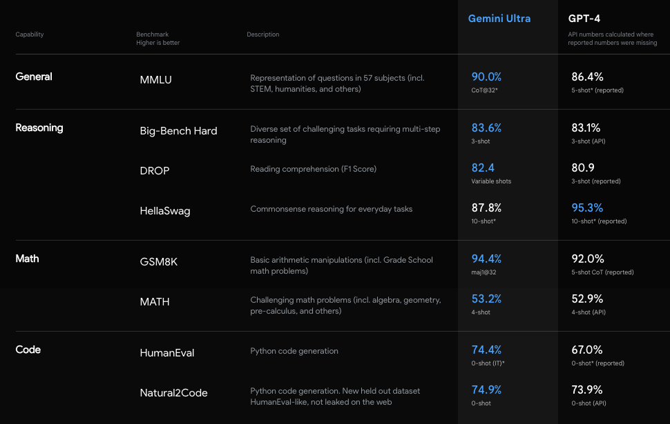
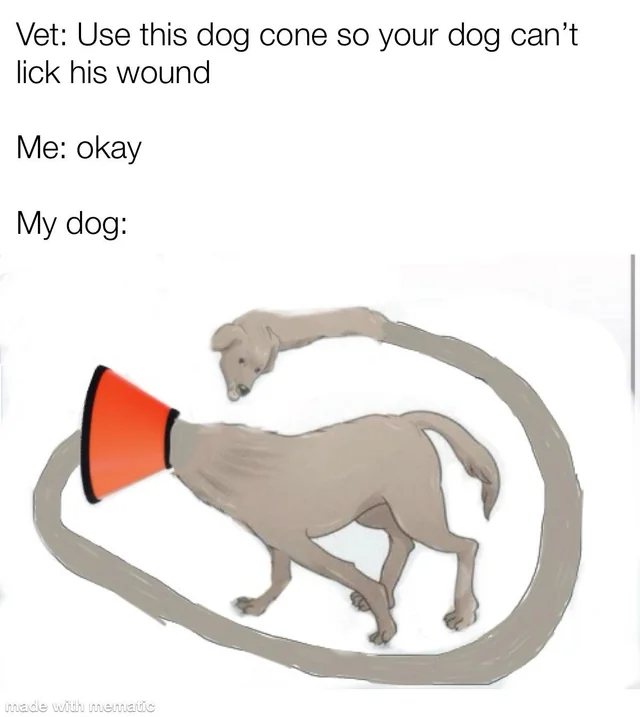

# 试用完谷歌的Gemini，我只想说GPT-4有点菜

告诉 GPT-4 ：安，勿念。我这边和谷歌 Gemini 过得很幸福。

就在今天凌晨，憋了好久的谷歌开大了，直接推出了最新的人工智能模型 **Gemini** （ 双子座 ）。

这个被谷歌称为 **规模最大、能力最强** 的人工智能模型，如果光看官方的演示视频，那真的过于高级了点。

在视频里， Gemini 不仅秒识别演示者画的画、放的视频、做的小把戏、玩的恶作剧，而且整个过程中对答如流，各种语气助词熟练得飞起。

如果没提前说，你甚至都会以为这就是电影里的 **贾维斯** 。

要真这么牛，还要什么 GPT-4 啊？

不过差评君仔细看了下发现，这次发布的 Gemini 其实是一个家族式大模型，分别是 “ **中杯** ”Gemini Nano 、 “ **大杯**
”Gemini Pro 和 “ **超大杯** ”Gemini Ultra 。

目前现在大家能用上的都是 Gemini Pro ，而大部分的测试演示都是基于 “ 超大杯 ”Gemini Ultra 来的。

从官方放出的数据来看，虽然每个版本都有自己合适的环境，但不同版本间，性能还是有着明显差异的。

而 “ 超大杯 ” 的 Gemini Ultra 的能力确实是杠杠的。

不仅在各种常规测试里都 **薄纱** 了 GPT-4 。

甚至在 MMLU （ 大规模多任务语言理解 ）测试里， Gemini Ultra 超过 GPT-4 还不够， **还超越了人类专家**
，成为了第一个在该方面超越人类的模型。

除了在常规能力上的全面超越 GPT-4 ， Gemini 最特殊的一点是，它是谷歌带来的首个多模态大模型，也就是能不光能打字互动，也能进行
**语音、视频、图片** 的互动。

按照谷歌的说法，现有的所谓多模态大模型，都是单独训练了文本、视觉和音频等模型，再把这几个拼接起来。

这样出来的 “ 散装 ” 多模态大模型，在遇到图片、文字、语音或者视频同时出现时，只会分解出不同模块各自回答，然后汇总各个部分的回答最后形成答案。

而 Gemini 从根上就是个多模态模型，然后又通过大量多模态数据训练，它能够一开始就同步理解多模态。

这就好比遇到一个中日韩英混杂的旅游团，以往都是找懂对应语言的导游组成导游团去带队。

而 Gemini 的做法是找了一个通晓中日韩英四门语言的导游，一个人就能无缝安排所有游客。

所以不出意外，在此前 GPT-4V “ 遥遥领先 ” 的多模态测试里， Gemini 也呈现了一种 **全面超越** 的姿态。

但也就是看起来过于牛逼，以至于显得不够真实，所以 Gemini 也在网上招来不少质疑。

比如有人吐槽明明 90.0% 和 89.8% 就差了千分之二，结果图里看起来像是巨大提升。

而且不少人还发现在不少测试里，谷歌用了些 “ **春秋手法** ” 。

因为给 Gemini Ultra 和 GPT-4 使用的测试方法并不一样， Gemini Ultra 用的是自家 **特调** 的全新方法 CoT@32*
。

在这种新方法下， GPT-4 得分提升一般般，而 Gemini 却进步明显。

可如果 Gemini Ultra 和 GPT-4 的同一标准，那它的得分就只有 83.7 ，还不如 GPT-4 。

甚至，还有不少人怀疑那个演示互动视频也是 **剪辑出来的卖家秀** ，实际效果绝对没那么牛。

这些真真假假的戏码咱也不管了，因为谷歌已经在 Bard 上用了微调后的 Gemini Pro ，所以我们也可以直接看看，这波升级后的 Bard
能耐到底涨了多少。

不过，目前调整过的 Bard 只支持英文，所以我们找来了 GPT-4V 版的 ChatGPT ，用英文让他们来一波 **华山论剑** 。

按照谷歌说法，这次 Gemini 在 **多模态** 上的长进最大，所以今天，我们主要就测测这块。

先考考它们的一些 **基础常识** ，丢一张八达岭长城的照片过去，让它们猜猜这是什么地方。

没想到一上来 Bard 就给了 ChatGPT 一个下马威， Bard 这边准确地给出了八达岭长城的答案。

而 ChatGPT 这边却有点 **底气不足** ，只给了个长城的答案，至于是哪段，它就没具体说。

不过马有失蹄，偶尔一次失误也没啥，为了进一步考验它们的图片识别能力，这把我直接让他们识别车的型号。

它们倒是都给出正确答案了： **雪佛兰科尔维特** 。

但细节上还是 Bard 要稍稍细致些，发动机的型号，马力以及加速情况都写出来了，查了下也都对的上，没胡说八道。

ChatGPT 这边，就只简单给出了答案，带了句性价比不错。

能识别出这些正儿八经的图片，也显示不出有多大的能耐，毕竟现在这都是大模型的基本要求了。

于是差评君又上网找来了些 **梗图** ，试试它们理解人类复杂思维的程度。

先是这个狗带保护头套的一个梗图。

Bard 和 ChatGPT 给出的答案都差不多，都点明了带上这个保护套后，狗狗很想舔舐伤口。

接下来我又试了下这个猫猫表情包，各位打工人应该都能 get 到吧。

Bard 不仅读出了大伙们讨厌周一的意思，还认出了这是 2012 年火的一只网红猫。

ChatGPT 这边回答得倒很 **简洁** ，意思也解读出来了，和 Bard **旗鼓相当** 。

毕竟，幽默作为一种对事物的诙谐、滑稽或不合逻辑的理解和共鸣。。。

能读懂梗图、理解幽默，至少需要 AI 有理解人类情感、经验和文化背景的能力。

当然，天天要码字的差评君也得试试它的 **图表分析能力** ，说不定之后咱也能多了个生产力工具。。。

我从美国财政部的官网随便找了张 **柱状图** 丢给它们，看看它们能读出多少信息。

这块儿， Bard 和 ChatGPT 就有点 **难分伯仲** 了，大家给出的信息点都大差不差，都准确读出了美国会加大对低等基础设施州的投资力度。

就只是在表述语序上有一点差别，选哪个就看个人喜好了，不过要我说 **白嫖党还是 Bard 香** 啊。

最后，我们还搬出了 **大模型们的噩梦** ，也就是数学题，测了测它们的数学能力。

第一道是道初中难度的几何题，让它们求一下 ABO 的角度。

Bard 这边小试牛刀，迅速判断出了 ABO 是个等边三角形，得到 ABO 是个 60 °的答案。

但是 ChatGPT 这边的答案却大跌眼镜，直接整出了 45 °。。。

在另一道，判断哪些点连续但不可微的题目上， Bard 这边也 **略胜一筹** 。

有点高数基础的差友，应该都能看出 C ：x=-2 和 x=1 是正确答案。

Bard 这边稳扎稳打，选出了正确答案 C 。

ChatGPT 继续选择 **破罐子破摔** ，支支吾吾选了个它认为最有可能的答案 B 。。。

总得来讲，在几轮的测试对比之后，终于让差评君遇个到能 **和 GPT-4V 打得有来有回** ，甚至有些小优的大模型了。

而在几天之后的 13 号，开发者和企业用户，也直接可以调用 Gemini Pro 的 API 了。

另外，谷歌还准备把 Gemini 引入了 Pixel ， Pixel 8 Pro 将是第一款运行 Gemini Nano 的智能手机。

在接下来的几个月中， Gemini 还会相继和搜索、广告、 Chrome 等服务和产品结合。

至于纸面实力 “ 暴打 ”GPT-4V 的 **Gemini Ultra** ，则还要等到明年的年初，在 Bard Advanced 才能体验到。

最后，差评君想说俗话讲得好， **巨人难转身。。。** 不少人用这样的比喻，来形容今年谷歌在 AI 新时代的困境。

毕竟上半年发布 Bard 的时候，甚至还因为推出得太急，整出了不少笑话。

谷歌的 AI 从遥遥领先，到沦为 OpenAI 追赶者的故事，似乎也成了科技圈的 **“ 伤仲永 ”** ，被大家当成了典型。

但差评君觉得，巨人转身的 “ 难 ” ，最起码有两层逻辑在里面。

第一层是 **愿不愿意** 转身，另一层，才是 **成不成功** 的问题。

无论是雪藏 “ 数码相机 ” 的柯达，还是固守塞班系统到 2013 年的诺基亚，在第一层就出了些问题。

咱们也能看到，至少在转身的态度这块儿，谷歌是没得说。

而目前的 Gemini 给我的感觉，虽说没有当时初识 ChatGPT 时的惊艳，但好歹，是谷歌该有的水平。

毕竟，大伙们可别忘了，当年奥特曼、马斯克等人创办 OpenAI 的目的之一，就是为了打破谷歌在 AI 领域的垄断。

包括 “ GPT ” 中的 “ T ” ，也就是 Transformer ，最早也是谷歌团队提出来的。

而起了个大早，赶了个晚集的谷歌，这次最起码跟上了步伐。

当然在通往 AGI 的道路上，差评君不好说谷歌、 OpenAI 、或是其他谁谁谁会第一个到终点、谁的方向是不是走对了。

但不能否认的是，如果一个内力雄厚的巨人一旦转身成功，方向还碰巧对了，并且还开启氮气加速。。。

那，怕是谁也挡不住。

