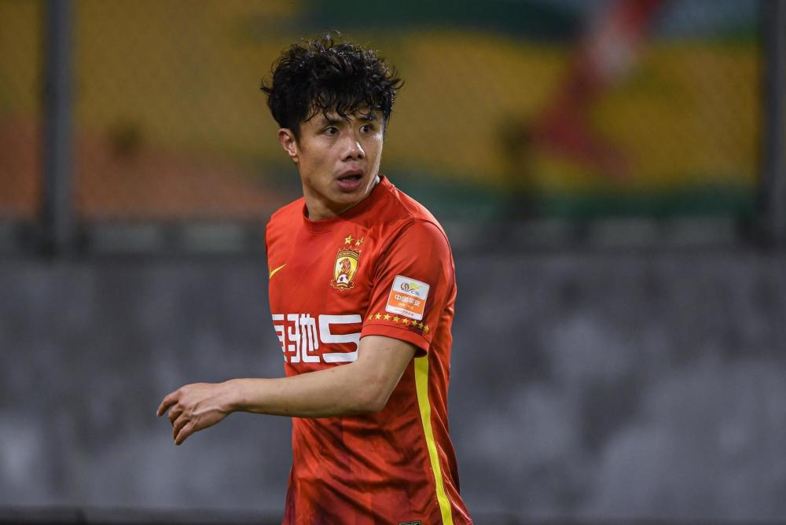
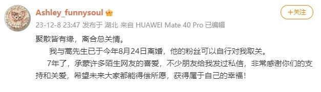
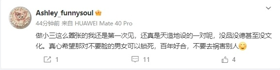
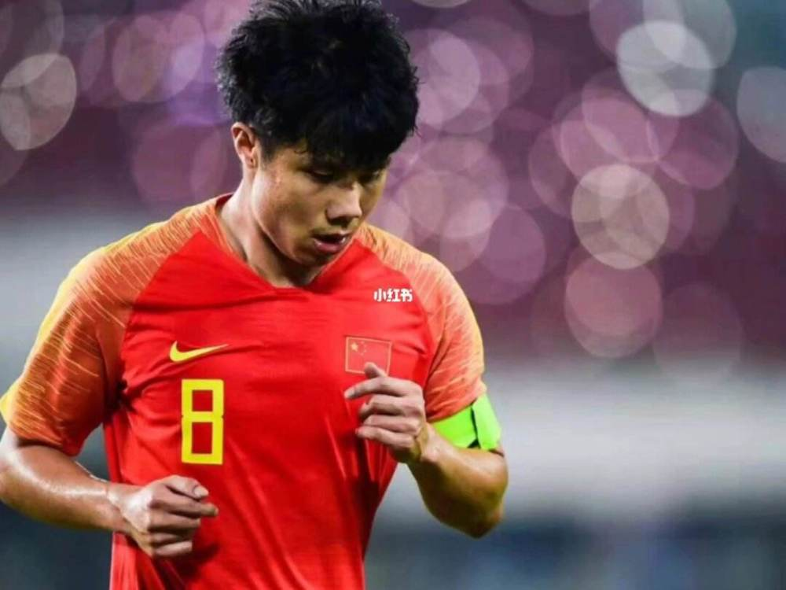

# 36岁国足前队长蒿俊闵离婚，妻子直言遭背叛，怒斥小三嚣张

北京时间12月9日凌晨，36岁的前国足队长蒿俊闵妻子，在个人社交账号上发文宣布，自己已经与蒿俊闵在今年8月24日离婚，结束了7年的婚姻。

蒿俊闵妻子写道：“聚散皆有缘，离合总关情！蒿俊闵的粉丝可以自行对我取关了，7年了，承蒙许多陌生网友的喜爱，不少朋友给我发过私信，非常感谢你们的支持和关爱，希望未来大家都能得偿所愿，获得属于自己的幸福！”

妻子直言自己被蒿俊闵背叛，并且痛斥蒿俊闵和插足者：“做小三这么嚣张的我还是第一次见，还真是天造地设的一对呢，没品没德甚至没文化。真心希望那对不要脸的男女可以锁死，百年好合，不要去祸害别人。”

1987年出生的蒿俊闵司职中场，曾担任中国男足国家队队长。他曾在山东泰山效力了长达10个赛季，是球队的功勋和传奇。离开泰山队后，他辗转效力了武汉队和广州队。上赛季，蒿俊闵代表广州队踢了13场比赛，但本赛季他却没有再加盟任何球队。

今年夏天，蒿俊闵曾经与中甲广西平果哈嘹传出过绯闻。目前，这位36岁的国足前队长正无限接近于退役。至于蒿俊闵的感情生活，此前媒体也鲜有报道。只知道蒿俊闵与妻子结婚多年，二人育有一女。

