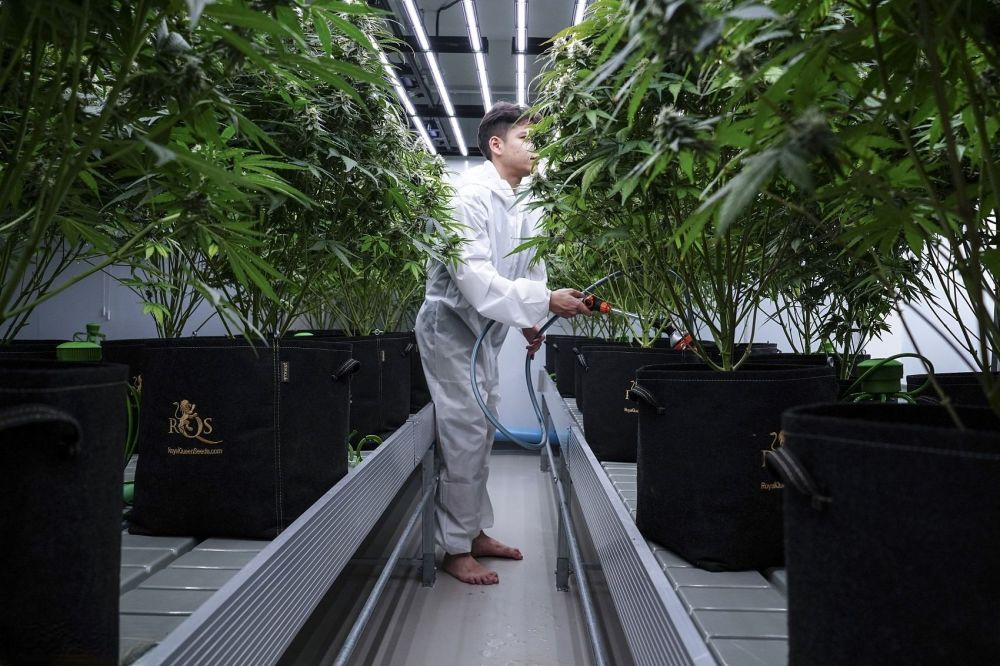

# ​“买大麻比买泰式炒河粉容易多了”，“大麻天堂”泰国18个月里发生了什么？

 _（视觉中国/图）_

经历了推迟、退回和否决，大麻合法化18个月后，泰国终于在《大麻和火麻法》草案上再次迈出一步。

2023年12月3日，媒体报道称，泰国公共卫生部已完成草案初稿，并将于12月在听证会后提交内阁。自豪泰党党魁阿努霆的顾问素帕猜预估，新法案将于2024年通过。

“在经济利益和健康利益之间，我们把健康放在了首位。”11月中旬，泰国公共卫生部长春拉楠曾表示，由于担心滥用大麻可能导致上瘾问题，已对相关法案进行大幅修改。

春拉楠透露，新修订的大麻管制法案不会把大麻重新归类为麻醉品，但将明确在哪些场所禁售大麻。“在过去，我们无法控制大麻的使用，但根据新法律，将禁止大麻用于娱乐目的。”

2022年6月，泰国公共卫生部正式宣布将大麻及其制品从国家第五类毒品清单中剔除。仓促放开的大麻产业在泰国掀起了一股大麻热潮，街头涌现的大麻药店以及“周边产品”，让泰国成为亚洲的“大麻天堂”。

“仅仅在曼谷考山路就有50家大麻店，数量是2022年的五倍。”考山路商业协会主席桑卡向媒体表示。

“大麻合法化给泰国经济注入了活力，但其负面效应也在日渐显现。”云南省社会科学院泰国研究所所长余海秋向南方周末记者分析，“泰国匆匆放开大麻产业，但相关法律制度并不完善，给娱乐用大麻留下了钻空子的机会，导致娱乐大麻泛滥化。”

新法律能否堵住娱乐用大麻监管的漏洞，黎咏诗并不看好。她在国际毒品政策联合会工作了15年，现在常驻曼谷，担任亚洲区域项目主任。

“泰国规定大麻仅限于医疗和研究使用，但问题是真的能明确区分吗？”她向南方周末记者举例说，“半夜睡不着时用一点大麻，这到底算是医疗使用还是娱乐使用？”

大麻热

“整条街到处都是大麻店铺，每家店门口都有很多人拉客，有的甚至直接上手拉胳膊，路两边还有很多摆摊的小商贩，空气中弥漫着吸食大麻和笑气的奇怪味道。”林楠向南方周末记者回忆说。

2023年5月，林楠到泰国旅游，她满怀期待地来到考山路。

曼谷考山路遍布着众多廉价旅馆和夜市酒吧，素来是背包客的天堂，也是赴泰旅游的必去“打卡地”。

然而，街头的大麻乱象让她感到震惊，多家大麻店外鲜绿色的叶子标志，在五颜六色的霓虹灯中格外亮眼。

她第一念头就是快点逃离。

“在这里，买大麻比买泰式炒河粉容易多了。”一位澳大利亚记者在实地考察考山路后感慨。

距离曼谷大约两小时车程的芭提雅，同样掀起了一股绿色热潮。

“现在，在芭堤雅的街道上，每隔两三百米就可以轻松找到一家大麻店，其中90%都不是出于医疗目的。”芭堤雅阳光酒店及度假村集团执行董事赛内特告诉媒体。

而在普吉岛，新的大麻店铺也在不断出现。“街头的大麻店很多，里边摆放得整整齐齐，如果不是店铺外绿色的大麻叶子标志，你可能以为这只是一家普通的香烟店。”在普吉岛经营民宿一年来，海澜发现，街头的大麻店在持续增加。

然而在18个月前，这样的场景在泰国想都不敢想。

位于泰国、缅甸和老挝边境的“金三角”是世界三大毒品产地之一，而饱受毒品困扰的泰国，向来以严格的打击毒品犯罪行动而闻名。根据泰国法律，吸食少量大麻最高可判处一年监禁，如果持有大麻数量超过十公斤，则会被视为意图出售，刑期可能达到15年。

但在2022年6月9日，泰国成为亚洲第一个将大麻合法化的国家。大麻政策放宽之下，不少企业家迫不及待地将大麻视作“摇钱树”，大麻饮料、大麻沙拉以及不同浓度的大麻制品如雨后春笋般在泰国街头涌现。

仅在泰国宣布大麻合法化当天上午，泰国食品和药物管理局推出的大麻注册登记应用程序和网站，就迎来了十万个注册用户。

“泰国大麻”网站数据显示，目前，该国共有六千多家大麻店铺，销售商品从干大麻花到四氢大麻酚（THC）含量不足0.2%的大麻油，应有尽有。

瓦萨娅正是泰国众多大麻经营者中的一员。

泰国大麻新政执行第二天，她就和丈夫申请了许可证，在曼谷开了一家大麻药房。“我们此前并没有计划开设大麻店。多年来，我一直在与抑郁症作斗争，是大麻帮助了我。大麻合法化后，我们决定开一家商店，希望能够帮助更多人从中获益。”瓦萨娅告诉媒体。

据泰国商会大学估计，2023年至2025年，泰国大麻市场将保持每年15%的速度递增，2025年市场价值预计将达到430亿泰铢（约合人民币87亿元）。

但对于大多泰国民众而言，大麻一夜之间合法化的颠覆性改变，来得措手不及。曼谷大麻企业家基蒂·乔帕卡曾是大麻合法化的坚定倡导者，但她感慨：“我的天呀，我这辈子都没有想到这真的会发生。”

“在很多泰国人的认知中，大麻是毒品，现在突然变得合法，政府却并没有解释为什么，也没有告诉民众大麻是什么，究竟怎么样使用才是有益的。”黎咏诗指出。

娱乐使用泛滥

媒体报道称，将大麻和大麻制品从第五类毒品清单中删除，意味着种植、生产、进口、出口、分销、消费和拥有大麻在泰国正式合法化。自此，泰国成为亚洲第一个将大麻合法化的国家。

“事实上，泰国与真正意义上的大麻合法化相距甚远。严格意义上来说，泰国只是成为了东南亚首个合法医疗使用大麻的国家。”中国农业科学院国家麻类种质资源首席科学家、麻类研究所二级研究员粟建光向南方周末记者分析，“而且，泰国对大麻制品中THC含量的要求比国际公认的标准要高。”

1961年，联合国通过《1961年麻醉品单一公约》，将大麻列为受管制的毒品。该公约同时指出，专供工业用途或园艺用途的大麻植物不在管制之列。

“工业大麻主要是指THC含量低于0.3%的大麻品种，而高于0.5%的则是毒品大麻。”粟建光说。

根据泰国政府规定，THC含量超过0.2%的提取物仍被列为麻醉品，将受到毒品政策严格管制。与此同时，大麻合法化后，食客可在泰国餐厅享用含有大麻的菜肴和饮料，但THC含量必须低于0.2%，同时不得使用大麻花作为烹饪原料。

“THC是大麻致幻的元凶，也是大麻被列为毒品的原因。而大麻中的另外一个主要成分大麻二酚（CBD）则具有药用价值，它在治疗小儿癫痫、老年痴呆、睡眠障碍以及癌症止痛等方面功效显著，且具有不可替代性。”粟建光指出，“并不是所有的大麻都是毒品，那些THC含量低于0.3%的，是低毒乃至无毒的。”

按照泰国政府的说法，大麻合法化主要是为了挖掘其医用价值，并不提倡任何形式的娱乐使用。时任泰国公共卫生部长阿努霆——大麻合法化的力推者，曾公开表示,“如果游客认为来到泰国可以自由地吸食大麻，那这个观念是错误的，泰国也不欢迎这样的游客。”

泰国的设想很美好，但毒品的口子一旦打开，大麻究竟用于何处，相关产品是否合规，就很容易超出泰国政府的管控。

大麻合法化后不到一周，曼谷都市管理局医疗服务部门就报告了四例因过度吸食大麻而被送医的案例。其中一名51岁男子因为心脏衰竭死亡，另外还有两名未成年人参与吸毒。

此外，泰国朱拉隆功大学生物化学系副教授库卡隆·克鲁森对曼谷街头的三十多种大麻饮料进行抽查，结果发现约30%饮品中THC含量超标。

大麻滥用以及年轻化趋势引发社会担忧，泰国政府不得不匆匆对大麻使用“约法三章”。

2022年6月17日，泰国《皇家公报》紧急刊登了大麻新规则，包括禁止在公共场合吸食大麻，禁止向20岁以下的人、孕妇和哺乳期母亲出售大麻。

然而，在大麻随处可见的情况下，仅靠口头上的禁令，很难防住大麻娱乐化使用泛滥的趋势。

泰国成瘾研究中心主任拉斯蒙博士指出，2019年至2022年间的调查研究显示，尽管法律禁止娱乐性大麻使用，但泰国青少年吸食大麻的比例增加了十倍 。

“事实上，娱乐用途一直是泰国大麻市场快速增长的主要推动力。”荷兰跨国研究所缅甸项目协调员欧内斯廷· 詹塞姆分析道，她自2002年以来一直致力于毒品政策改革。

泰国的下一步

泰国种植和使用大麻已有三百多年历史，可以追溯到17世纪的大城王国那莱国王时代。

“泰国有些寺庙会用大麻来祭神，东北部地区保留着用大麻叶子做船面汤的习惯。最重要的是，大麻一直作为传统药物出现在许多泰药秘方内。”黎咏诗说。

然而，自1934年通过《大麻法》后，泰国政府长期以来对包括大麻在内的毒品采取严打政策。国际人权联盟2023年发布的泰国监狱数据报告显示，截至2022年12月1日，泰国有207085人因毒品犯罪被监禁，约占泰国监狱总人数的79%。

“泰国对大麻态度大转弯，离不开经济因素的驱动。”余海秋分析，“近些年来，泰国经济发展态势低迷，泰国政府希望通过推动大麻成为经济作物，提高其农业附加值，为民众创造就业机会和收入。与此同时，泰国也试图利用大麻合法化来吸引游客，刺激经济增长。”

其实早在2019年，泰国政府就发布规定，批准在医用和研究领域使用大麻，允许第五类毒品（大麻和卡痛叶植物植株）用于医疗研究和发展医学成果。

“那时候批准医疗使用是非常严格的，只有医生开药方，民众才能使用大麻。但此次发布的规定松弛了很多，人们不仅可以买到大麻油，还可以拿来当烟吸。”黎咏诗说。

在余海秋看来，凭借大麻拉动经济实际上是一把双刃剑。“大麻合法化在一定程度上带动了泰国经济发展，但诸如大麻产品泛滥、游客担忧以及相关犯罪事件频发等诸多潜在风险同样不容忽视。”

泰国政府频频表态，禁止大麻娱乐性使用，但大麻产品的放开速度远远快于立法管制，导致娱乐性大麻处于灰色地带。

“大麻产品已经满天飞了，相关法律还在修订和完善中，法律不健全为大麻种植以及相关产品的生产、销售和使用都埋下了较大隐患。”余海秋指出。

2022年9月，泰国公共卫生部曾把大麻草案送进国会审议，下议院却投票决定推迟二读，将其退回特别委员会审议。为泰党议员苏汀表示：“该法案并未控制大麻，甚至还对其进行了推广，为大麻从医疗用途转向极端娱乐用途留下了空间。”

“大麻管控法律难产的主要原因在于，各党派对大麻合法化的态度未形成统一的意见，很多党派寄希望于新一届政府能重新审视大麻合法化的问题。”余海秋分析。

事实上，大麻合法化问题曾一度成为2023年泰国大选的关键争议。阿努霆曾在电视节目中喊话，“无论谁想与我们一起组建政府，都必须支持大麻政策。”而为泰党总理候选人贝东丹则在武里南府集会时宣誓称，一旦为泰党赢得大选，将根除所有非法毒品。

“作为一名母亲，我不希望我的孩子在一个毒品猖獗、大麻很容易获得的国家长大。”贝东丹说。

伴随着为泰党宣布与自豪泰党联合组建政府，并最终重新执政，大麻管控法案悬而未决的局面或将结束。2023年9月，泰国总理赛塔在接受媒体采访时表示，泰国将寻求在六个月内“纠正”大麻政策。

“尽管目前相关法案依旧处于审读和修订中，但考虑到法律失管失控给泰国带来的负面影响，执政联盟将会尽力助推法案通过。”余海秋认为，这一过程可能比较漫长，泰国很可能会双向并行，一边大力发展医疗大麻产业，一边有序控制娱乐大麻的使用。

（文中林楠和海澜为化名）

​南方周末记者 王航 南方周末实习生 林曦

责编 姚忆江

