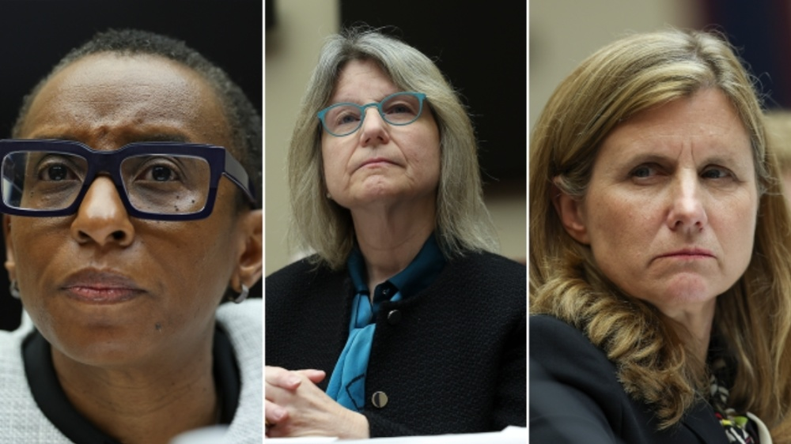
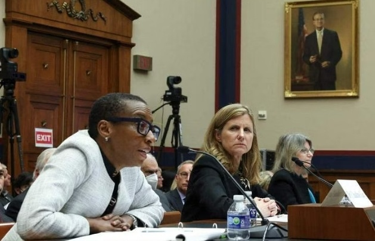
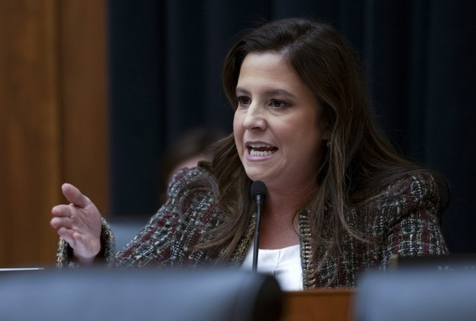

# “高校反犹”听证会后，超70名议员要求哈佛、麻省理工和宾大校长离职

【文/观察者网
刘程辉】因卷入“纵容校内反犹主义”的争议，包括哈佛大学在内的美国三大名校校长本周接受了美政客质询。然而在火药味十足的听证会结束数天后，双方的摩擦仍在继续。

据路透社报道，当地时间12月8日，超过70名美国两党议员发出联名信，要求哈佛大学、宾夕法尼亚大学和麻省理工学院的董事会立即罢免学校校长，理由是他们对校长们早前在校园反犹主义听证会上的证词感到不满。

 _左起：哈佛校长盖伊、麻省理工校长科恩布鲁特、宾夕法尼亚大学校长马吉尔_

在这封联名信中，共和党众议员埃莉斯·斯特凡尼克（Elise Stefanik）和民主党众议员贾里德·莫斯科维茨（Jared
Moskowitz）要求哈佛大学、宾夕法尼亚大学和麻省理工学院的董事会罢黜其校长，否则可能被视为犯下“反犹太主义的共谋行为”。

“你们学校校长提供的证词表明，他们完全缺乏道德清晰度，并表现出有问题的双重标准和对犹太社区的非人化思维。”

“鉴于当前的危机时刻，我们要求你们董事会立即解除这些校长的职务，并提供一个可行的计划，以确保犹太人和以色列学生、教师和教职员工在校园内的安全。”

这份信件由71名共和党人和3名民主党人签署。学校代表没有立即回应媒体置评请求。

_当地时间12月5日，哈佛、宾大和麻省理工三所学校校长在国会接受质询/法新社_

新一轮巴以冲突爆发后，全美各地大学校园紧张局势加剧，相继爆发了数百起抗议活动，其中一些甚至演变为暴力。校长们因在处理亲巴勒斯坦和亲以色列之间的争议方面，受到学校犹太社群的抨击。

在这样的背景下，当地时间12月5日，哈佛大学校长克劳丁·盖伊（Claudine Gay）、宾夕法尼亚大学校长利兹·马吉尔（Liz
Magill）和麻省理工学院校长萨莉·科恩布鲁特（Sally
Kornbluth）出席了众议院教育和劳动力委员会的听证会，就校园“反犹”问题接受质询，听证会持续了约5个小时。

据《纽约时报》报道，三名校长都表示，他们对反犹主义感到震惊，而且正采取行动遏制它。当被问及是否支持以色列的生存权时，他们毫不含糊地给出了肯定的回答。

然而，在谈及“是否包庇参加反犹活动的学生”时，现场火药味十足。

据美国有线电视新闻网（CNN）报道，三位校长辩护时都谴责了哈马斯的袭击，并重申了他们致力于确保犹太学生感到安全的承诺。同时，三人也重申了保护校园言论自由的承诺，表示那些呼吁对犹太人进行种族灭绝的言论只有在导致学生遭到霸凌的情况下，才会违反校规。

听证会上，美国纽约州共和党议员埃利斯·斯蒂芬尼克（Elise
Stefanik）质问哈佛校长盖伊，是否会处分在抗议中发表“仇恨言论”的学生。但盖伊两次以“我校恪守言论自由的承诺”作答，引起质问者不满。

“我们不会因为个人的政治观点或言论而惩罚他们，但当这类言论……变成欺凌、骚扰和恐吓行为时，我们就会采取行动。”盖伊说。

_听证会上，共和党议员斯蒂芬尼克对校长们言辞犀利/美联社_

另两名校长给出了相似的回答，都说这取决于具体情况。宾夕法尼亚大学校长马吉尔回答说：“只有当言论转变成了行为，具有针对性、严重性和普遍性，那就构成了骚扰。”

对于校长们的言论，密歇根州众议员莉萨·麦克莱恩（Lisa
McClain）十分不满：“很明显，你们所有校园的犹太学生都感到害怕，因为你们拒绝采取真正的行动……反对反犹太主义。”

路透社称，听证会的视频片段在社交媒体上传播开来，犹太社区向学校施压要求更换校长的呼声日益高涨。

尽管校长们在听证会上的态度强硬，但在听证会结束后，他们的姿态似乎有所软化。

马吉尔在会后的一份视频声明中说，她不应该总是把事情跟言论自由联系起来，应该更多地关注“邪恶”的事情，比如对犹太人进行“种族灭绝”的言论。

“我想澄清一下，对犹太人进行种族灭绝的呼吁是一种威胁，而且是非常严重的威胁。”马吉尔在视频中说。

紧接着，在12月8日，盖伊在接受哈佛大学学生报纸采访时，为她在听证会上的言论道歉。

“在那一刻，我应该冷静地坚持住我的真理——那些呼吁对犹太社区施加暴力乃至对犹太学生的威胁，在哈佛是没有立足之地的，也永远不会被接受，这是无可辩驳的。”

麻省理工学院执行委员会在8日的一份声明中表示，科恩布鲁特仍然得到他们的全力支持。

“她在领导我们社区方面的工作出色，包括解决反犹主义、伊斯兰恐惧症和其他形式的仇恨——这些都是完全不能被麻省理工学院接受的。”

_今年10月，美国马萨诸塞大学学生举行挺巴抗议/《华尔街日报》_

值得一提的是，针对巴以冲突撕裂美国社会的现象，《华尔街日报》11月28日发文指出，美国年轻一代群体的政治觉醒正加剧着校园动荡，他们倾向于将冲突看作被压迫者对压迫者的反抗，这与美国年长者存在明显不同，席卷全美大学校园的亲巴勒斯坦抗议浪潮令年长者们震惊不已，暴露出美国社会正在形成的代际鸿沟。

皮尤研究中心去年的一项民意调查显示，在18至29岁的美国年轻人中，有近一半的人支持社会主义，多过那些支持市场经济的人，许多人将他们面临的复杂灾难归咎于市场经济。

俄勒冈大学24岁的学生诺亚·汤普森认为，最富裕的群体掌握了国家太多财富，资本主义倾向于帮助富人和剥削穷人。他说，他对向以色列出售武器的战争奸商感到不安，因为以色列随后会用这些武器杀害儿童。汤普森还帮助组织了一场要求以色列停火的抗议活动。

“似乎总是有足够的钱和炸弹用于战争，用于海外干预，但从来没有足够的钱用于教育，用于医疗保健，用于为我们现在创造一个更美好、更安全的社会。”汤普森说。

**本文系观察者网独家稿件，未经授权，不得转载。**

