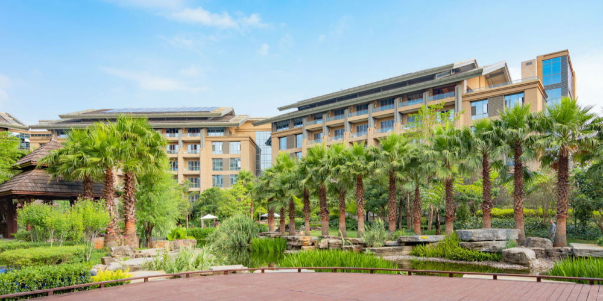

# 内蒙煤老板“围猎”房地产

**经济观察报 记者 田国宝** 最近一段时间，张华多次辗转于北京、上海、海南等地，寻找优质的物业资产，“看了不少项目，有的已经在谈了”。

张华是内蒙古一家民营煤炭企业的驻外负责人，平时的工作是对接各类业务。今年下半年，老板交给他一个新任务，留意一线城市核心物业资产，要求只有一个：稀缺。

刚开始，张华把考察的重心放在了北京和上海，后来又拓展到海南。张华介绍，早在2022年，陕西、内蒙古等地的煤老板已经开始巡猎核心物业资产，金茂北京威斯汀大饭店、雅居乐清水湾的3家度假酒店、上海的中粮海景壹号公寓、富力香水湾万豪酒店等一系列资产已经被煤老板们收入囊中。

煤老板——这是一个标签性很强、却格外低调的群体，经济观察报前后联系了多位煤老板进行采访，对方均婉拒。某种程度而言，他们更愿意“闷声发财”，而不愿“抛头露面”。

一位长期观察煤炭产业资本的业内人士告诉经济观察报，煤老板本来是诸多行业中的一员，但由于历史上煤老板各种行为争议较大，而且煤炭本身又是暴利行业，“很多人都出过事，没出事的一般都不愿被人关注，无论盯上你的人，还是盯上你的钱，基本都没有好事”。

稀缺物业

以41.4亿元成交的上海中粮海景壹号公寓，已经于11月底完成过户，交易对手为上海邕鹏实业有限公司（以下简称“上海邕鹏”）。该项目位于上海陆家嘴，贝壳二手房信息显示，挂牌价高达29.4万元/平方米。

天眼查显示，上海邕鹏的股东为余虹泽和刘彦操，二人均为来自内蒙古鄂尔多斯的煤老板，其中余虹泽名下有内蒙古明满能源等多家企业；刘彦操为鄂尔多斯汇峰煤炭等多家能源企业的法人代表。

今年10月，中国金茂通过北京产权交易所挂牌出售北京金茂威斯汀大饭店，项目最终被北京渤海润泽商业管理有限公司（以下简称“渤海润泽”）以28亿元获取。

渤海润泽的股东为石翠和苏福蛇两名自然人。经济观察报获悉，二人背后是陕西榆林府谷县的中汇集团，这是一家从事煤炭开采、洗煤、煤化工等业务的典型煤炭企业，在府谷等地还开发有房地产项目。

与北京和上海相比，陕西和内蒙古的煤老板在海南的酒店资产交易市场更为活跃。海南地处热带北缘，具备独一无二的旅游度假资源，成为受到煤老板青睐的资产。

海南香水湾富力万豪酒店，今年8月更名为香水湾万豪度假酒店。酒店业主方也从原来的富力地产变更为海南纳旭源实业有限责任公司（以下简称“纳旭源”）。纳旭源与渤海润泽一样，也来自陕西榆林。

同样被出售给陕西煤老板的五星级度假酒店还有清水湾碧桂园希尔顿逸林酒店，接手方为海南蘅远投资有限公司，其背后股东王博、王鹏在陕西榆林地区拥有多家煤矿及煤化工企业，在铜川和西安也有新材料相关企业。交易已经于2022年12月左右完成。

2022年下半年，在巨大的偿债压力下，雅居乐将海南清水湾的3家度假酒店悉数出售。一位接近交易的人士透露，3家酒店的买家均是来自内蒙古的煤老板。

清水湾莱佛士度假酒店是雅居乐在清水湾最高端的酒店项目。工商资料显示，2022年底，该酒店业主方已经变更为锡林郭勒盟蒙东能源发展有限公司，蒙东能源的主要业务有煤炭开采、运输、仓储和销售。

清水湾雅居乐假日度假酒店则被鄂尔多斯市乌兰煤炭集团收入囊中。乌兰煤炭集团是内蒙古30户重点煤炭企业之一，全国民企500强，全国煤炭工业100强，旗下煤矿超过10家，年产值75亿元。

一位熟悉交易的人士透露，海南度假酒店的卖方几乎都是房地产企业，由于房企急需资金，酒店价格相对便宜。以海南某酒店为例，建造成本18亿元，开业不到10年，最终售价13.6亿元，相当于在成本价基础上打了7.5折。

这些度假酒店资产，虽然成交价格相对便宜，但付款条件也高。以上述13.6亿元成交的酒店为例，业主要求一次性付清13亿元，多数买家并不具备如此强大的现金筹集能力。

流动性紧缺的房企与不差钱的煤老板一拍即合，构成大宗资产交易中一道独特的风景线。张华说，只要付款条件好，任何优质稀缺的资产都有可能拿到。

显然，煤老板与开发商的故事才刚刚开始。

筛选标准

所谓稀缺资产，不仅需要具备唯一性，还需要达到收益率指标。在房地产上行年代，稀缺物业资产的交易频次不高，对资本方来说，往往是可遇而不可求的资产。

2022年以来，随着房地产流动性风险影响日渐加深，为避免违约及补充流动性，一些还未爆雷的房企开始将核心资产摆上货架。经济观察报了解到，碧桂园已把全部酒店资产列入出售名单。

对房企来说，酒店属于重资产，虽然每年可以产生一定的利润，但相对于巨大的资金缺口，无疑是杯水车薪，而且遇到市场不好时，酒店还会出现亏损，拖累整体业绩。在这种情况下，将资产变现成为企业的理性选择。

一家商业银行的投行人士介绍，今年以来，由于房价下跌，引发大宗资产价格出现较大幅度震荡，“像上海一些外资持有的商办资产，基本都是以2019年价格的7折出售，依然无人问津”。

这时，手持巨额现金的煤老板出现，为部分房企带来一丝光亮。据悉，目前正在挂牌的上海华侨城宝格丽酒店，也被煤老板盯了很久了。

煤老板的现金实力为何强悍？张华介绍，煤老板的资金主要来自两个方面：第一，日常经营产生的大量现金，煤炭等矿产资源挖出来就可以卖，多是现金交易。尤其是遇到煤炭价格上行期，资金积累速度更快。

第二，最近几年，煤炭行业一直在去产能，部分民营煤矿被国有煤矿或央企能源集团兼并，煤老板可以一次性变现一笔不菲的现金。

数十亿现金趴在账户中，煤老板有把钱尽快投出去的诉求。

从资金回报率来看，煤老板并不追求多高的收益率，但对现金流动性要求比较高，“必须是个现金奶牛，需要钱的时候可以腾挪一笔出来用，收益高点当然更好，但低一点也没关系”，张华说。

按这样的要求，当前市场上，煤老板可以放心将钱投出去的项目并不多，沉淀的大量现金，除了参与当地招商引资，其余主要投向了高新技术产业和稀缺的物业资产。

张华说，高端酒店通常由第三方国际知名酒店集团运营，运营进入稳定期后，只要不出现诸如疫情等极端情况，高端酒店可以产生稳定而持续的现金流，完全符合煤老板“坐享其成”的诉求。

相比较而言，同样是持有性资产，购物中心和写字楼运营过程中的风险更大，而且要考虑出租率和租金收缴率等琐事，所以，即便是一线城市核心区的高端写字楼和商场，也很难获得煤老板的青睐，他们更喜欢稳定和持续。

张华说，虽然整体看上去，煤老板都在收割稀缺物业资产，但具体到每个煤老板身上，其购买大宗资产的预算并不多，“一次只能购买一宗，像北京、上海和海南，最终只能选一个”。

投资路线演变

在北京房地产市场上，至今仍流传着“煤老板用蛇皮袋背着现金，坐公交车到处扫楼”的传说，一次性购买一层、一个单元、一栋楼甚至是几栋楼的豪举，作为坊间谈资长时间地镌刻在房地产史上。

煤老板作为一个群体标签真正诞生始于2002年，当年国家停止发布电煤指导价，实行市场定价，煤炭价格进入一轮鼎盛期。煤炭价格上涨吸引大量资本进入，煤老板开始大量涌现。

2008年前后，因持续不断的煤矿事故，山西掀起一轮煤炭资源整合行动，经过这场整合，山西矿井总数减少6成，煤矿主体从2200多家减少至130家。曾经风光一时的山西煤老板退出历史舞台。

经历整合后的山西煤老板，一部分移民到国外，一部分转型投入到实业中。2008年之后，山西煤老板从养殖业到制造业，从金融到互联网，从影视到文娱，成为资本市场一股不可小觑的力量。

2016年，国内开启新一轮煤炭去产能，在淘汰掉小矿、贫矿、落后产能等煤矿后，整合后的煤矿开始信息化和数字化改造，使得矿难的问题得到一定解决，煤炭行业进入一个全新的发展时代。

内蒙古和陕西煤老板是继山西煤老板之后新崛起的一个群体，不同于山西煤老板，陕西和内蒙古的煤老板很少出圈，他们从事的也多为煤炭相关行业，以及与实体相关的产业。

以内蒙古乌兰煤炭集团为例，其业务除了与煤炭相关的产业外，还包括化工、建材、酒业、房地产、路桥、农牧业、机械制造等多个产业。张华所在的煤炭企业规模不及乌兰煤炭集团，但涉猎的产业也差不多。

收购清水湾碧桂园希尔顿逸林酒店的海南蘅远投资，其实控人在陕西涉足的行业，除了传统的煤炭及相关行业，还有饮品、房地产、新材料等产业，虽然曾短暂涉入影视和文化传媒，但很快就退出了。

张华说，煤老板虽然普遍文化程度较低，但商业敏感性很强，对政策倡导的或风口的产业，他们都愿意尝试，一旦市场有风吹草动，他们很快会撤退得干干净净。

近年，随着煤二代、煤三代的登场，煤老板的投资思维逐渐打开，“很多人都是从国外留学回来的，知道哪些行业是未来的朝阳产业，哪些资产是常青树”，张华表示，充足的现金总是让他们能够获得性价比更高的资产。

张华介绍，因为有些行业目前看不懂，加上大环境不景气，很多煤老板还在观望，比如新能源、集成电路、生物医药等产业，很多煤老板比较看好，但因为缺乏深入了解，又不敢贸然杀入。

作为一个曾经争议较大的群体，经过几十年的洗礼，煤老板的诸多神秘光环也在逐步褪去，随着民营资本陆续从能源行业退出，张华说，“他们很有可能是中国最后一批煤老板了，虽然这两年收了不少资产，但外界关注的并不多。”

（应受访者要求，张华为化名）

