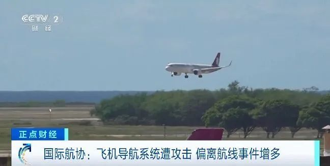
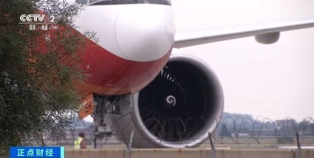

# 多架飞机偏离航线！导航系统被攻击，发生了什么？

国际航空运输协会官员6日表示，鉴于近期网络攻击者误导飞机导航系统，导致飞机偏离航线的事件越来越多，全球航空业巨头计划明年1月开会讨论由此引发的安全问题。

据路透社报道， **一种名为“GPS欺骗”的网络攻击手段近几个月来激增** 。攻击者向飞机飞行管理系统发送虚假“全球定位系统”信号，而飞机无法辨别真伪，
**导致飞机导航系统出现偏差，飞机偏离航线。如果飞机因此未经许可进入他国领空或禁飞空域，将构成较大安全风险。**

国际航协负责运营、安全和安保的主管尼克·卡琳英6日在瑞士日内瓦一场媒体活动上表示，由于这种攻击方式激增，该组织迫切需要找到解决办法，拟定于明年1月召开会议讨论这一问题。卡琳英表示政府、军方和飞机制造商急需就此展开商讨。

值得注意的是，这种攻击手段常见于一些冲突地区和有敏感军事目标的地区周边。国际航空咨询机构飞行运营集团发布的报告显示，截至今年11月上旬，这家机构已收到近50份涉及“GPS欺骗”的报告，其中多数发生在中东地区。

来源：央视财经

