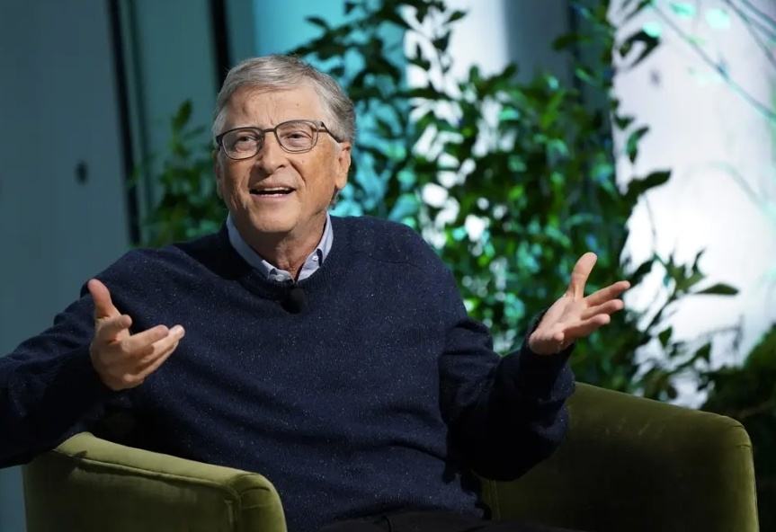
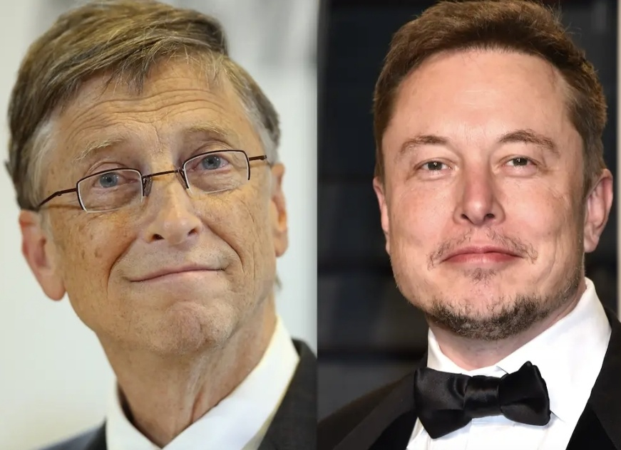
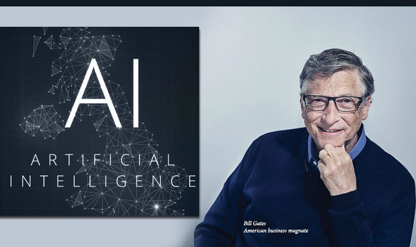

# 盖茨：与马斯克和乔布斯的“硬核”相比 我觉得自己更随和

**划重点**

  * _1_ 盖茨认为，与马斯克和乔布斯的“硬核”相比，他觉得自己是个“好老板”。
  * _2_ 盖茨承认，在领导创新型公司时，老板必须“硬核”，他也有过同样的经历。
  * _3_ 盖茨称对人工智能持积极态度，并支持对该技术进行监管。
  * _4_ 盖茨认为学生们正迎来最幸福时代，可以学习在线课程，师承顶尖教授，并有AI辅助。

腾讯科技讯 据外媒报道，微软联合创始人比尔·盖茨（Bill Gates）最近获得了纽约经济俱乐部颁发的彼得·彼得森卓越领导力奖（Peter G.
Peterson Leadership Excellence
Award）。在颁奖典礼后，盖茨接受了一场短暂的媒体采访，分享了他的企业管理理念、对人工智能技术的看法以及教育领域发生的深刻变革。

**01 “我是个更随和的老板”**

在炉边聊天时，盖茨首先提到了特斯拉首席执行官埃隆·马斯克（Elon Musk）和苹果联合创始人史蒂夫·乔布斯（Steve
Jobs）。与他们相比，他认为自己是个更容易让人感觉放松的“好老板”。

1975年，盖茨与儿时好友保罗·艾伦（Paul
Allen）共同创立了这家软件巨头。当被问及在执掌微软期间，在塑造创新文化方面学到了哪些经验教训时，盖茨回答说，像他这样的领导者在领导创新型公司时，必须考虑自己应该有多“硬核”。

“每个人都有不同的领导风格。马斯克和乔布斯都是非常努力的人，但他们的领导风格过于强硬。相比之下，我可以算是比较随和的老板，”盖茨笑着说。

乔布斯于1976年与史蒂夫·沃兹尼亚克（Steve Wozniak）共同创立了苹果公司，而马斯克是SpaceX和隧道挖掘公司The Boring
Company的创始人，同时还是人工智能创企OpenAI和脑机接口初创公司Neuralink的联合创始人。

盖茨与马斯克和乔布斯的关系都相当微妙。他和乔布斯之间的纠葛持续了数十年，从盟友到对手，又几度和好。他们反复的竞争精神常常被认为是多年来推动微软和苹果进行重大创新的原因。

2011年乔布斯去世后，盖茨表示，他尊重这位苹果创始人，并感谢他们之间的竞争。

近年来，盖茨与马斯克的关系变得更加紧张。从太空旅行到气候变化，两人在公开场合相互指责，并经常在各种问题上产生分歧。

盖茨在2022年告诉马斯克的传记作者沃尔特·艾萨克森（Walter
Isaacson），马斯克对他“超级刻薄”。他解释说：“他一听说我做空了苹果的股票，就对我很刻薄，但他实际上对很多人都很刻薄，所以你不能太往心里去。”

但盖茨在周四的讨论中承认，要成为一名成功的创新领导者，确实需要“某种程度的硬核”。他说：“在我20多岁的时候，我偏执地专注于微软，几乎从来没有周末或假期。”

盖茨还在谈话中证实了这样一则传闻：在微软成立初期，他记住了所有员工的车牌号，这样他就能知道谁在加班。盖茨似是而非地说：“没有那么多车牌，当时我们只有几百名员工！”

他补充说：“除此之外，我还可以告诉你他们什么时候来的，或者什么时候走的。”

盖茨将他的激情与他在微软的“积极经历”联系在一起，他说这些经历至今仍然引导着他的思考，“我从创新的角度看待每一个问题”。

**02 “我本以为互联网会更真实”**

盖茨表示，他原本希望互联网能让世界变得更基于事实、更理性，但现实让他认识到，互联网已经成为虚假信息和“疯狂想法”的聚集地。他说：“我承认，推动数字革命的人，包括我自己，真的认为世界会变得更加理性。”

盖茨谈到了人工智能对世界的影响，并反思了自己在最初的数字革命期间的预测。他说，随着互联网的兴起，他相信互联网会“让世界变得更加真实”。

他认为互联网将推动人们搜索信息，并以负责任的方式赋予自己权力。他还举例说，人们现在更多通过查找原告和被告的主张来了解诉讼，而不是仅仅依赖新闻文章。如果有人对科学领域的某个话题有疑问，他们可以“去阅读相关文章，了解与之相关的所有信息”。

盖茨补充说，像他这样的互联网企业家希望推动“苏格拉底式辩论”。他说：“我们希望人们能够像苏格拉底那样，用事实和逻辑来辩论问题，而不是仅仅凭借情感和偏见。”

然而，盖茨没有预见到的是，世界上那些拥有“疯狂想法”的人会如何使用互联网。他说：“世上有很多这样的人，他们以前很难找到彼此。但如今，有了数字工具，我说：‘哦，你觉得那很疯狂吗？我也是！让我们聚在一起，聚集一群疯狂的人。我们就叫我们QAnon吧！’”

盖茨说，他希望年轻一代能够有足够的创造力来解决当今的虚假信息问题。

**03 “我对人工智能更乐观”**

尽管盖茨承认对互联网现状感到不满，但他称对人工智能持积极态度，认为它可以帮助缓解劳动力短缺，让世界变得更富裕。他说：“我对人工智能更乐观，因为它能带来短期好处。”比如，人工智能可以使医疗保健系统受益，帮助加快药物和疫苗的开发。

此外，盖茨称他对人工智能监管持开放态度，并补充说，任何反对人工智能监管的人听起来都很“愚蠢”。他还强调，在推进人工智能方面，有必要确保“坏人”不会走在“好人”前面。他说：“我们需要领先于那些心怀不轨的人，比如那些试图利用这项技术进行网络犯罪、发动生物恐怖主义袭击的人”。

微软研究人员曾表示，GPT-4已经显示出与人类智能水平相当的“火花”。盖茨对此表示，这是“这个时代最深刻的变化”，人工智能的发展“与微处理器、个人电脑、互联网和手机的发明一样重要”。

但盖茨警告称，生成式人工智能已经走到了死胡同。他认为，从GPT-2到GPT-4的飞跃令人难以置信，但GPT技术现在已经达到了一个平台期，GPT-5不太可能比它的前身GPT-4更好。随后，他承认自己的判断可能出现失误。

**04 “学生迎来最幸福时代”**

在这次访谈中，盖茨也聊到了教育领域翻天覆地的变化。他说，现在的学生可真是有福，有那么多在线课程，还有全球顶尖的教授给他们上课，这机会可真是前所未有的。

盖茨兴奋地说：“现在的学生们可真是幸福啊！有世界上最好的教授给他们上课，这些教授的专业知识特别广泛。”

不过，这位科技大佬也有点担忧，觉得现在数学教育的差距还是蛮大的。虽然比尔和梅琳达·盖茨基金会一直在努力培训老师、引入新的教学方法，但盖茨承认，目前效果还不是特别明显。

他说：“我们的孩子们，即使是在疫情之前，他们的数学能力有没有比20年前或者30年前更好呢？答案是没有。我们仍然非常致力于这一领域，但我们没有像在卫生领域那样取得巨大成功。”

2022年，该基金会提供了超过10亿美元的赠款，作为一项为期四年的改善数学教育的国家计划的一部分。在对数学的关注出现之前，疫情阻碍了学生们的学习，扩大了学生之间的种族差距。

虽然盖茨承认基金会的项目推广起来有点难，但他并没有放弃，还在想办法解决这个问题。他觉得个性化的人工智能辅导或许能帮到学生。

盖茨补充说：“我们非常关注数学，因为初高中数学成绩真的能预测一个学生是否会从高中辍学。”

专家们也指出，美国学生的数学技能相比全球学生来说还是差了点儿，这可能会影响到经济竞争力，甚至引发国家安全问题。而且，要在创新方面保持全球领先地位，也得有一个健全的教育体系才行。（编译/金鹿）

