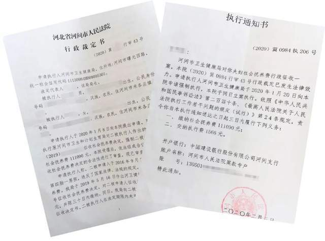
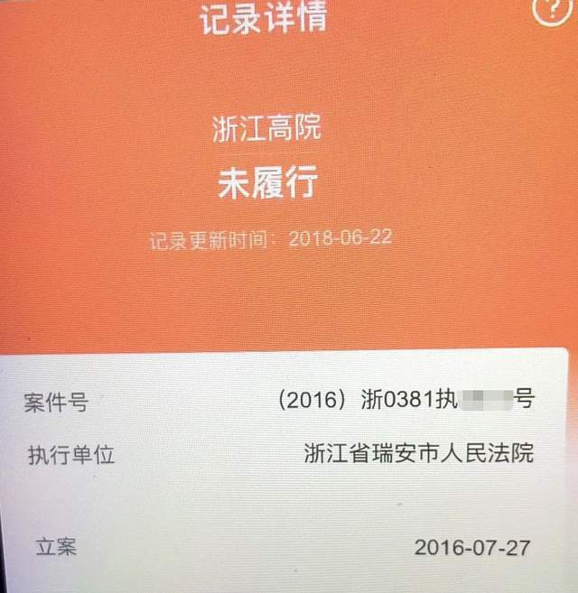

# 社会抚养费取消两年，“老赖”摘帽了吗？

“无论是向银行贷款还是想做生意，一旦查出我是‘老赖’，被拒之门外是家常便饭，‘脱帽’对我和我的家庭来说都至关重要。”天津市某区的林松因超生二胎，且无力在法定期限内履行缴纳社会抚养费的义务，四年前被法院纳入失信被执行人名单。

近日，最高检发布了第五批检察听证典型案例，其中第二例是天津市人民检察院开展“社会抚养费强制执行”专项监督，解决相关执行案件4100余件，共为当事人免除1.1亿余元的行政征收款。林松就是其中一名当事人，他在这次行动中被免征6万余元，四年的“老赖”帽子也终于摘掉了。

社会抚养费制度诞生于上个世纪80年代初，当时，它更为人所知的名字是“超生罚款”。1996年出台的《行政处罚法》明确，对于超计划生育的不得给予罚款，但可以征收“计划外生育费”。

2000年，财政部、原国家计生委联合下发文件，要求各地将“计划外生育费”改为“社会抚养费”。根据后来相关文件的界定，社会抚养费指为调节自然资源的利用和保护环境，适当补偿政府的社会事业公共投入的经费，而对不符合法定条件生育子女的公民征收的费用。

_图/视觉中国_

随着我国生育政策的变化，2021年6月，中共中央、国务院印发的《关于优化生育政策促进人口长期均衡发展的决定》（以下简称《决定》）指出，取消社会抚养费，清理和废止相关处罚规定。之后，《人口与计划生育法》修改，缴纳社会抚养费及相关处分的规定被删去。自此，社会抚养费制度成为历史。

不过，多位专家告诉《中国新闻周刊》，社会抚养费制度被废止后，对费用的征收有统一政策，各地有据可依。但对社会抚养费尚未缴清且进入执行程序而延伸的问题，如有的人因没有缴纳社会抚养费最终上了失信被执行人名单等，他们是否可以下名单，目前并无明确的法律规定或统一程序。

知情人士告诉《中国新闻周刊》，此轮天津市人民检察院解除的不利限制措施，主要涉及失信被执行人名单和限制高消费等。不过，从更大范围来看，社会抚养费制度的遗留问题仍然待解。

**“法不溯及既往”**

林松和妻子已经在失信被执行人名单上待了四年。

在全面二孩政策前一年，也就是2014年，林松夫妻俩生了二胎，被当时天津市某区的人口和计划生育委员会认定为违反计划生育法规规定，以当年该区农村居民年人均纯收入16534元为基数，对林松夫妇二人各按基数的两倍征收社会抚养费，共计66136元。夫妻二人逾期未履行相关法定义务后，区人口和计划生育委员会向法院申请强制执行。

该区法院经调查发现，林松和妻子二人银行账户均无存款，名下也无房产、股权、证券可供执行。2019年，法院把他们纳入失信被执行人名单，并发布了限制消费令，限制其高消费及有关消费。

此后，林松夫妇成为“老赖”，出行购买不了高铁票，向银行贷款做生意也被拒绝，“银行担心我会赖账不愿意放贷”。

王妤一家的经历和林松夫妇类似。2011年，已育有一女的她生育了二胎，是一对双胞胎女儿，此时距离国家实施全面二孩政策还有四年多。2016年，她生育了三胎，是一个男孩，此时距离国家提倡三孩政策还有五年。

2020年，王妤夫妇收到河北河间市人民法院的执行通知书，通知其需缴纳社会抚养费111090元。王妤夫妇说自己是农民家庭，这笔钱是天文数字，无法负担。之后，他们被列入失信被执行人名单，名下的汽车也被查封。

_王妤夫妇收到的行政裁定书和执行通知书。图/受访者提供_

2021年，社会抚养费制度成为历史之后，他们都以为自己身上的强制执行措施可以解除。但几年下来，他们发现，问题没有那么简单。

中国政法大学法治政府研究院教授杨伟东告诉《中国新闻周刊》，《人口与计划生育法》修订、删除社会抚养费及相关处分的规定后，社会抚养费案件遗留问题分为两大类，即社会抚养费的征收及社会抚养费延伸的强制执行措施。

社会抚养费的征收问题，杨伟东解释说，目前的普遍做法是，已经征收的社会抚养费不会再退还，未征收部分不再继续征收。包括林松在内的多位超生户都告诉《中国新闻周刊》，在社会抚养费废止后，没有再被催缴过。一名经手相关案件的检察官也对《中国新闻周刊》证实了该种说法。

北京大学法学院教授湛中乐曾参与《人口与计划生育法》草拟和论证工作，他在接受《中国新闻周刊》采访时表示，随着社会抚养费制度的废止，免除“超生户”再补缴的义务是遵循“法不溯及既往，但是有利于公民权利例外”的法治原则，并符合生育政策及相关法律修改调整的目的和导向。

可以说，社会抚养费的征收问题在法律界已有共识，但社会抚养费延伸的强制执行措施，仍面临较为复杂的现状。

**遗留问题何去何从？**

“去找计生办，这个部门已经不存在了。”浙江瑞安的吴晓莉曾尝试解决自己的信用问题，始终无解。在国家实施三孩政策之前，吴晓莉因意外怀孕生下了三胎，被要求缴纳14万余元的社会抚养费。协商后，这笔费用降低到7万多元。但由于丈夫一人工作，她全职在家带孩子，他们仍然没有缴纳社会抚养费。2016年，他们被列入失信被执行人名单。

直到最近，他们去当地法院执行部门求解，得到的答案仍然是，罚款无须再交，但未履行的记录会在，因为清除这类记录的“政策还没下来”。“社会抚养费都不在了，为什么这些负面记录还在影响我的正常生活？”吴晓莉不解。

_吴晓莉的支付宝“未履行”界面。图/受访者提供_

上述受访检察官向《中国新闻周刊》解释，所谓的“政策还没下来”是指，对“在执行中没有执行完毕的案件”的处理没有法律依据，《决定》和修订的《人口与计划生育法》提出并删除了社会抚养费相关处罚规定，但没有对“已经进入执行程序尚未执行完毕的案件”该如何处理进行规定。

像吴晓莉这样仍有负面记录的人还有不少。河南省某县级法院的一名法官告诉《中国新闻周刊》，据他了解，进入执行程序没有终结的社会抚养费案件不仅在当地，在全国都较为普遍，“没有什么文件或政策要求统一处理”。如果行政机关不主动提出申请，法院一般不会处理，“政策变了，肯定有不少当时没结案至今仍在失信被执行人名单或被限制高消费等情况存在，很正常”。

事实上，有关在执行中的强制措施是否应该维持，数位受访者看法不一。

一名不愿具名的资深律师告诉《中国新闻周刊》，进入执行程序的社会抚养费案件，依据“法不溯及既往”原则，法院是根据当时法律进行的执行决定，并没有错判。如若推翻会有损法律的权威性，对遵守国策和法律的人不公平，也会营造一种失信成本低的社会风气，令社会失序，有碍社会诚信体系建设。

上述法官也赞成应该对此前的“超生户”继续采取惩戒措施，“法不溯及既往，之前判的时候是根据当时的法律，把他们拉出（失信被执行人名单），那是不可能的，要是一点惩罚都没有，岂不乱套了”。

而上述不愿具名的检察官则认为，进入强制执行程序的案子说明，相关人员曾经成为失信被执行人，被限制消费、财产控制甚至拘留，他们已经受到了法律的惩戒。此时终结强制措施，并不是完全的不公平。

北京家理律师事务所合伙人、副主任曹子燕告诉《中国新闻周刊》，既然已经不存在社会抚养费这个大前提，更不应该存在因为没有缴纳而导致的后果，包括失信被执行人名单和限制消费等问题，加上以上强制措施对家庭和个人生活影响很大，如若继续追究，与国家清理社会抚养费遗留问题的规定和近年来鼓励生育的政策导向相悖。

杨伟东也指出，法律或政策的实施会因为客观情形的变化而调整。为保证其连续性，在过渡期应依照从旧从轻原则和对当事人有利的原则，如果纠结于绝对公平，实际上它会带来新的不公平。“无论是审判实践还是国际上总结出来的一条基本经验就是不要‘翻旧账’。”

《决定》和修订的《人口与计划生育法》，提出并删除了社会抚养费相关处罚规定，但目前没有对“已经进入执行程序尚未执行完毕的案件”该如何处理进行规定。图/视觉中国

这些年，有部分省市自行探索了终止强制执行。《中国新闻周刊》梳理了部分法院作出的终结强制征收社会抚养费的裁定，发现无论是申请取消执行程序的主体还是程序本身，各地都不尽相同。

有的地方是由卫健部门向法院提出撤回强制执行的申请。云南省华宁县人民法院的一份执行裁定书显示，该县卫生健康局曾在2021年7月9日向法院申请，要求两位被执行人缴纳社会抚养费142640.00元。该案在执行过程中，华宁县卫生健康局以新的计生政策为由书面向法院提出撤销执行申请。8月2日，该院裁定终结此案件的强制执行程序。

也有地方是法院发布公告，明确将排查相关案件。早在2021年8月，即《人口与计划生育法》修订的同月，厦门市同安区人民法院就发布公告指出，请尚未缴纳社会抚养费的各被执行人即日起停止缴费，已缴纳的社会抚养费将依法上缴国库，法院将会对历年的案件逐年进行排查，解除对被执行人采取的强制措施，请相关执行联动单位解除对征收社会抚养费案件的被执行人采取的限制措施。

还有的地方是检察机关介入。本文开头所说的天津市人民检察院开展“社会抚养费强制执行”专项监督就是其中一个案例。另外，早在《人口与计划生育法》修订的2021年8月，有超生户向福建某县的检察院提出监督申请，要求停止执行并解除强制执行措施。随后，县检察院先向县卫健局发出类案检察建议，县卫健局在采纳检察建议后向县法院申请对该类案件作结案处理。县法院及时将当事人从失信名单中去除，解除限制消费、财产控制等措施并结案。

值得注意的是，河南省某县级执行局工作人员告诉《中国新闻周刊》，过去，社会抚养费类案件一般是由计生部门申请对“超生户”强制执行，“前几年他们催着法院立案”。

数位受访者都认为，最高检发布的天津处理社会抚养费遗留问题的案例有参考价值，但实际情况中，各地案件复杂，难以真正令地方有清晰指引和做法。杨伟东也呼吁，遗留问题的处理需要有统一的标准，无论执行与否、申请的主体是谁，既要有明确的政策导向性，也要有程序指引，否则会使得行政与司法部门疑窦丛生，各行其是，受影响的仍是普通百姓。

（文中林松、王妤、吴晓莉均为化名）

发于2023.12.11总第1120期《中国新闻周刊》杂志

杂志标题：社会抚养费取消之后

记者：解雪薇

编辑：徐天

