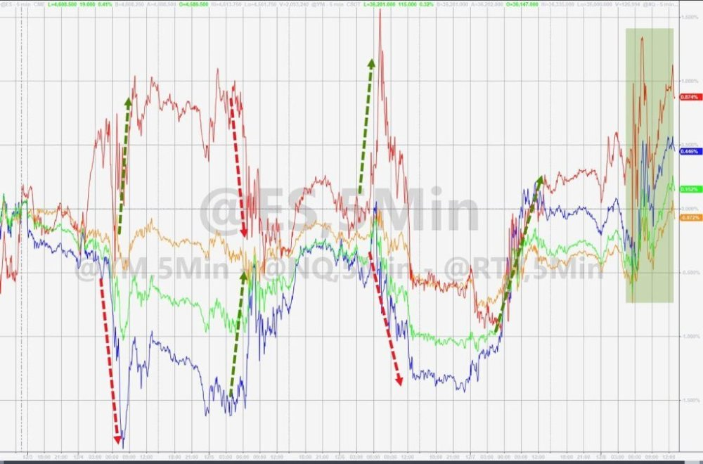
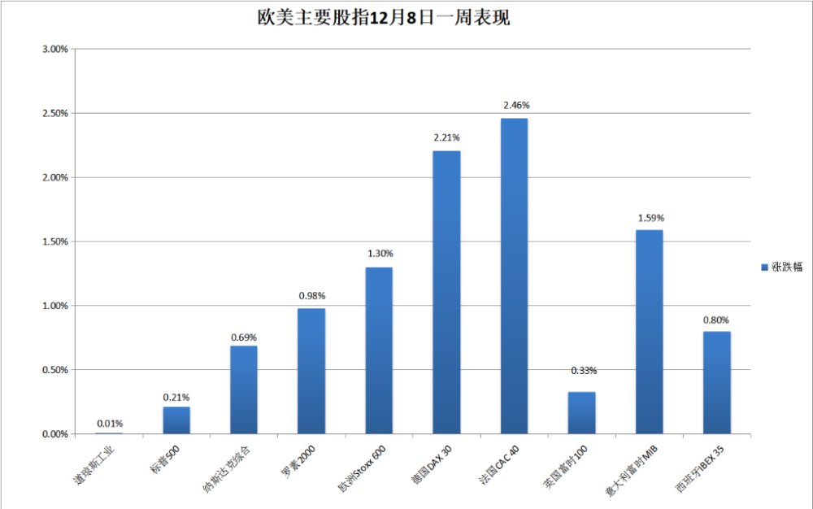
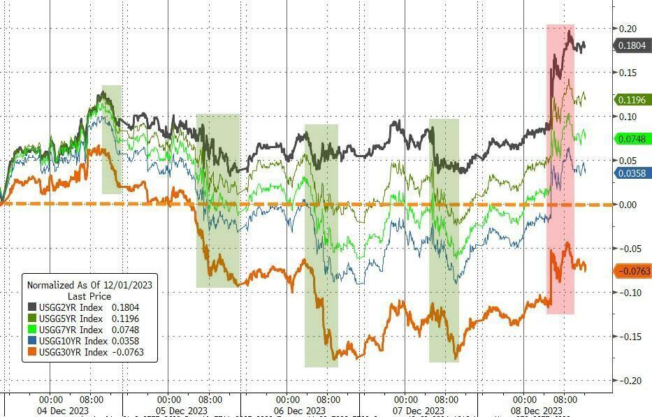
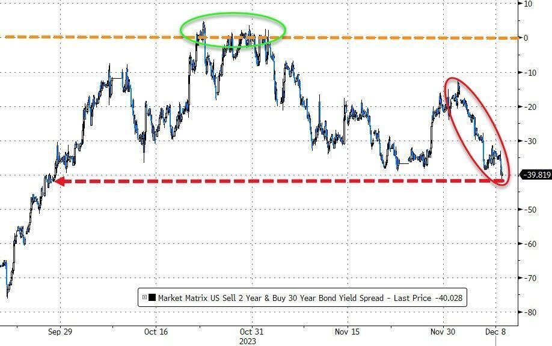
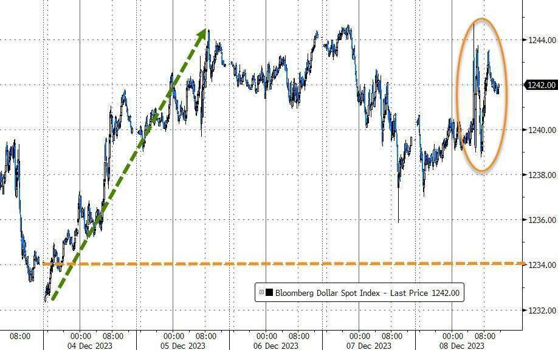
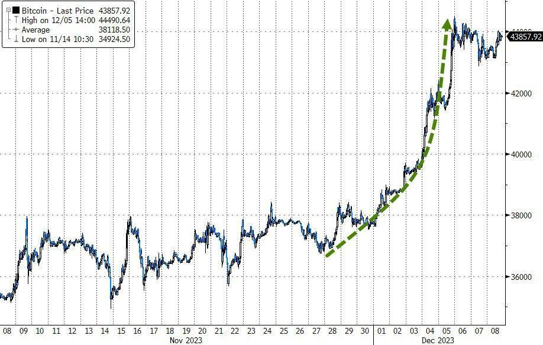
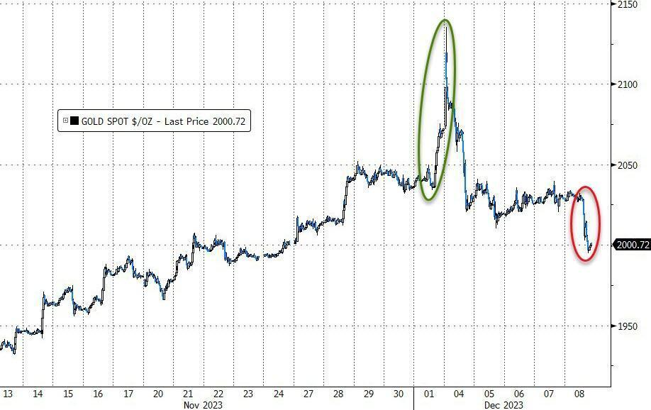

# 美股收盘：就业意外强劲打击降息预期，美股低开高走，六周连涨

评论称，非农就业数据固然暂时降低了美国经济衰退的可能性，却打击了市场对美联储明年降息、最早3月就行动转鸽的预期，令联储将高利率保持更久的预期升温。

就业报告公布后，美国国债价格跳水、收益率盘中拉升，升幅普遍超过10个基点。基准十年期美债收益率迅速重上4.20%，远离一天前所创的三个月低位，对利率敏感的两年期美债收益率一度升破4.70%，冲上本月内高位。美元指数涨幅迅速扩大，刷新三周来高位。美股低开。

此后公布的密歇根大学调查传来好消息。调查显示，12月美国消费者信心指数初值回升幅度大超预期，且消费者对未来一年的通胀预期意外降至2021年3月以来低谷，从11月的4.5%大幅回落至3.1%，预期只放缓至4.3%。

有评论称，就业报告数据一开始增加了经济过热、难以让通胀足够回落到联储目标的担忧，但另一方面，数据也支持联储能实现软着陆的观点。密歇根大学调查结果提振了市场对软着陆的信心。

美股扛住降息预期受创的压力，在原油反弹支持的能源股带领下，早盘主要股指转涨。消费者通胀预期公布后，美股大盘保住涨势，标普和道指凭借周五上涨，惊险锁定全周涨势，携手纳指10月末以来持续周涨；美元指数回吐部分涨幅，全天反弹势头不改，因周五反弹的助推，得以一个月来首次周度累涨；美债收益率短线小幅回落，后很快重回升势，两年期美债收益率创上月末以来新高，全周收益率回升。

美元反弹之际，非美货币齐跌。美国就业报告公布后，欧元延续创11月中以来低位之势，在欧洲央行明年降息预期加剧的本周，创将近七个月来最差单周表现；周四日本央行官员放鹰暗示负利率将结束后大涨的日元盘中转跌，一度较周五稍早所创的四个月来高位回落将近2%。

大宗商品中，国际原油反弹，自OPEC+会议一周来首度收涨，走出连日刷新的五个月低谷。有分析认为，周五反弹部分得益于俄罗斯总统普京和沙特王储萨勒曼会晤后两国联合发布公告，强调了继续合作的重要性，以及需要所有OPEC+协议国遵守协议。但在美国上周汽油库存意外增长、中国11月原油进口下降9%等因素的打击下，原油全周继续累跌，10月下旬以来跌跌不休，创五年最长连跌期。美国就业报告后，在美元和美债收益率齐升的压力下，黄金加速跌离历史高位，现货黄金两周来首次盘中跌穿2000美元关口，黄金期货跌至将近两周来低位，一个月来首次单周累跌。

三大美股指创四年最长周涨 能源板块周五领涨但全周跌超3% 英伟达领涨蓝筹科技股

三大美国股指集体低开，盘初刷新日低，后均转涨。盘初跌近56点的道琼斯工业平均指数，很快转涨，早盘涨超百点。标普500指数盘初曾跌近0.3%，纳斯达克综合指数盘初曾跌超0.5%，开盘约半小时后均转涨。早盘尾声时三大指数均转跌，午盘转涨后持续上行，尾盘刷新日高，最终连续两日集体收涨。

_标普收创去年3月以来新高_

 _纳指收创去年1月以来新高_

价值股为主的小盘股指罗素2000收涨0.67%，连涨两日，逼近周一所创的9月1日以来收盘高位。科技股为重的纳斯达克100指数收涨0.39%，刷新两年来高位；衡量纳斯达克100指数中科技业成份股表现的纳斯达克科技市值加权指数（NDXTMC）收涨0.65%，两连涨至11月20日以来高位，本周累涨1.03%，连涨六周。

本周主要美股指继续集体累涨。纳指累涨0.69%，纳斯达克100累涨0.54%，标普涨0.21%，道指涨0.01%，连涨六周，创2019年来最长单周连涨。罗素2000累涨0.98%，连涨四周。

_主要美股指数全周总体累涨，小盘股指表现最好，道指表现最差_

标普500各大板块中，周四有四个收跌，必需消费品跌近0.7%，公用事业和对利率敏感的房产跌逾0.2%，通信服务跌近0.2%。收涨的七个板块中，原油反弹带动的能源板块领涨，涨超1%，在连续三日跌幅居首后反弹，芯片股所在的IT板块涨0.9%紧随其后，其他板块涨不超0.5%。

本周共六个板块累跌，能源表现最差，跌超3%，板块跌1.7%，必需消费品跌超1%，房产、公用事业、金融跌幅在0.1%到0.4%；五个累涨的板块中，通信服务和非必需消费品涨超1%。

_各板块ETF本周走势_

龙头科技股大多盘中转涨，特斯拉收涨近0.5%，连涨四日，两日刷新11月29日以来高位，本周累涨2.1%。FAANMG六大科技股中，Facebook母公司Meta收涨近1.9%，连涨两日至11月28日以来高位；苹果收涨逾0.7%，连涨两日至7月31日以来高位；微软收涨近0.6%；奈飞收涨近0.4%；亚马逊收涨近0.4%；而周四大涨超5%的谷歌母公司Alphabet盘初跌超2%，收跌1.4%，跌落周四反弹所创的11月28日以来高位。

芯片股总体早盘转涨、连涨两日。费城半导体指数和半导体行业ETF
SOXX均收涨约0.8%，连续两日刷新11月20日以来高位。个股中，到收盘，Arm涨超7%，英伟达涨近2%，在七大科技股中涨幅居首，本周累涨1.6%，英特尔、美光科技涨超1%，公布11月销售额同比下降7.5%的台积电美股也涨超1%，周四发布AI芯片后大涨近10%的AMD涨0.4%，周四盘后公布2024财年营收指引低于预期的博通盘中曾跌超1%，盘中转涨后收涨超2%。

AI概念股多数追随大盘上涨。到收盘，周四财报后跌超10%的C3.ai（AI）涨超8%，BigBear.ai（BBAI）涨超6%，Palantir（PLTR）涨超3%，Adobe（ADBE）涨0.2%，而SoundHound.ai（SOUN）早盘转跌后收跌0.5%。

热门中概股总体下挫。纳斯达克金龙中国指数（HXC）收跌逾0.7%，连跌两日至11月1日以来低位，本周跌近4%。造车新势力继续齐跌，到收盘，小鹏汽车跌超7%，蔚来汽车和跌超1%。其他个股中，收盘时，爱奇艺跌超3%，百度跌2%，京东、腾讯粉单跌超1%，拼多多跌近1%，B站跌近0.6%，阿里巴巴跌近0.3%、网易跌0.2%；而斗鱼涨超7%。

公布财报的个股中，公布年末假日购物季所在的季度销售指引低于预期、下调全年指引后，运动和休闲服装生产商露露柠檬（LULU）盘初跌超3%，早盘转涨后收涨5.4%；三季度盈利和四季度销售指引均优于预期的电子签名软件公司Docusign（DOCU）早盘转涨后收涨4.8%；季度营收和年度营收指引均低于预期的家具和家居用品零售商RH（RH）收跌14%；尽管三季度营收高于预期且意外实现EPS盈利，软件公司HashiCorp（HCP）仍收跌16.4%。

波动较大的个股中，宣布将旗下安全公司出售给霍尼韦尔后，工业机械公司Carrier Global
Corp（CARR）盘中涨超5%，收涨4.5%，霍尼韦尔（HON）盘初曾跌超2%，收跌1.6%。

欧股方面，周五公布的德国11月CPI通胀终值如预期缓和，助长欧洲央行利率达到峰值的预期，和美国数据共同提振风险偏好，周四止步两连阳的泛欧股指反弹。欧洲斯托克600指数刷新去年2月9日以来收盘高位。蓝筹股指斯托克50指数创2007年来十六年新高。主要欧洲国家股指周五也齐反弹，德国股指本周第三日收创历史新高。

各板块中，奢侈品巨头所在的个人与家庭用品涨超1%，受益于宣布派发2023年中期股息的开云收涨约2.6%，其老对手LVMH涨3.3%，这些奢侈品类股也助推其上市所在地法国的股指在欧洲国家中领跑；周三领涨的旅游板块也反弹超1%；而矿业股所在的基础资源逆市跌2%，主要源于，计划到2026年将所有业务的资本支出共削减18亿美元、并预计明年产量下降后，矿业巨头英美资源跌19%，连累英国的股指在欧洲国家中涨幅垫底；对利率敏感的房产也逆市收跌，跌0.8%。

本周斯托克600指数连涨第四周，连续两周都每周涨超1%。各国股指继续累涨，德股和西股将连涨六周，法股连涨四周，英股和意股连涨两周。旅游板块大涨4.8%表现最佳，上周涨超4%领涨的房产继续受益于欧债收益率下行，累涨近2%；部分源于周五下跌，基础资源全周跌超3%，表现最差，油气板块虽然周五在原油反弹推动下涨超1%，但全周跌超1%。

就业报告后 美债收益率升超10个基点 两年期收益率创月内新高

欧洲国债价格齐跌，收益率追随美债上扬。到债市尾盘，英国10年期基准国债收益率收报4.04%，日内升7个基点；2年期英债收益率收报4.55%，日内升7个基点；基准10年期德国国债收益率收报2.27%，日内升9个基点，脱离周四盘中下破2.17%所创的4月6日以来低位；2年期德债收益率收报2.68%，日内升10个基点，远离周四所创的5月以来低位。

本周欧债收益率未能集体连降两周，在周五回升后，短债收益率累计回升，长债收益率降幅不及上周。上周降约15个基点的10年期英债收益率本周累计降约9个基点；上周降约28个基点的10年期德债收益率本周也降约9个基点，而上周降约39个基点的2年期德债收益率本周升约1个基点。

美国10年期基准国债收益率在欧股盘前下破4.15%刷新日低，后总体回升，美国非农就业报告公布后，迅速重上4.20%，并一度上逼4.27%，日内升12个基点，抹平前三日降幅，回升到周一盘中水平，较周四逼近4.10%关口刷新的9月初以来低位回升17个基点，美国消费者通胀预期公布后，曾略有回落，一度下破4.21%，到债市尾盘时约为4.23%，日内升约8个基点，在连降两日后连升两日，因周五大幅攀升，本周升约3个基点，在上周降约27个基点后反弹。

对利率前景更敏感的2年期美债收益率在亚市早盘刷新日低时下破4.59%，在美国就业报告公布后也拉升，美股早盘升破4.70%，曾上测4.73%，消费者通胀预期公布后，短线下破4.69%，后很快加速攀升，美股午盘曾逼近4.74%，刷新11月末以来高位，到债市尾盘时约为4.72%，日内升约12个基点，在上周大幅回落约41个基点、创3月银行危机以来最大周降幅后，本周累计回升约18个基点。

_各期限美债中，周五两年期的短债收益率带头攀升_

因为长短期美债差距扩大，本周两年和三十年期美债的收益率曲线趋平程度为去年11月以来最大，收益率曲线倒挂程度为9月以来最严重。

_两年和三十年期美债收益率曲线倒挂程度为9月以来最严重_

就业报告后 美元指数创三周新高 日元跌离四个月高位 欧元连创逾三周新低

周四回落后，追踪美元兑欧元等六种主要货币一篮子汇价的ICE美元指数（DXY）周五总体反弹，在亚市早盘短线转跌后曾跌破103.50刷新日低，转涨后保持涨势，美国非农就业报告公布后涨幅迅速扩大，重上104.00且涨破104.20，美国消费者信心和通胀预期公布后，涨幅迅速收窄，一度跌破103.80，美股午盘再度涨破104.20后刷新周三所创的11月17日以来高位，日内涨近0.7%。

到周五美股收盘时，美元指数略低于104.00，日内涨逾0.4%，本周累涨近0.7%；追踪美元兑其他十种货币汇率的彭博美元现货指数涨近0.2%，靠近周三所创的11月17日以来同时段高位，本周累涨逾0.6%，和美元指数都在周四止步三连涨后反弹，最近八个交易日内第六日上涨，本周均结束连跌三周的6月16日以来最长周跌
。

_彭博美元现货指数一个月来首度单周累涨_

非美货币中，周四盘中曾涨3.8%创一年最大涨幅的日元盘中转跌，美元兑日元在亚市早盘曾跌至142.50，日内跌1.1%，后持续回升，美国就业报告公布后涨破145.20刷新日高，日内涨逾0.7%，较日低回涨1.9%，美股收盘时徘徊145.00一线，日内涨近0.6%，全周仍跌超1%；美国就业报告公布后，欧元和英镑跌幅迅速扩大，欧元兑美元在美股早盘曾跌破1.0730，连续五日刷新11月14日以来低位，日内跌超0.6%，美股收盘时略高于1.0760，本周跌超1.1%，创将近七个月最大周跌幅，英镑兑美元在美股早盘曾逼近1.2500，刷新11月23日以来低位，日内跌近0.7%。

离岸人民币（CNH）兑美元在亚市早盘刷新日高至7.1537，亚市盘中转跌后保持跌势，美国就业报告后失守7.18，美股午盘之初曾逼近7.19至7.1897，刷新周三所创的11月20日以来低位，日内跌265点。北京时间12月9日5点59分，离岸人民币兑美元报7.1872元，较周四纽约尾盘跌240点，在周四止住三连跌后回落，本周累跌630点，结束三周连涨。

连续两日盘中回落的比特币（BTC）周五反弹，在欧股盘中跌破4.31万美元刷新日低，后持续上行，美股尾盘重上4.4万美元，刷新周三连续第三日所创的去年4月以来高位，较日低涨超1000美元、涨约3%，最近24小时涨超2%，最近七日涨超14%。

_比特币本周第四日创去年4月以来新高_

原油涨超2%终结六连阴 仍连跌七周 创五年最长连跌

国际原油期货周五全天保持反弹势头。美股早盘公布美国消费者信心指数和通胀预期后，原油刷新日高，美国WTI原油涨至71.60美元上方，日内涨3.3%，布伦特原油接近76.40美元，日内涨逾3.1%。

最终，原油终结六日连跌所创的2月22日以来最长连跌日，OPEC+会议以来首次收涨。WTI
1月原油期货收涨2.73%，报71.23美元/桶，最近三日首次收盘站上70美元关口；布伦特2月原油期货收涨2.42%，报75.84美元/桶，和美油均脱离周四刷新的6月27日以来收盘低位。

本周美油累跌约3.8%，布油跌近3.9%，均连跌七周，创2018年来最长周连跌，主要源于周三公布上周美国EIA汽油和精炼油库存超预期增加、以及“小非农”ADP就业疲软当天，原油创11月16日以来最大日跌幅，当天美油跌超4%，布油跌近3.8%。巴以冲突爆发以来，原油只在前两周累涨，此后持续累跌，OPEC+国家会后官宣的自愿减产也未能扭转跌势。

 _美国WTI原油终结六连跌，在70美元一线找到支撑_

美国汽油和天然气期货继续涨跌互见。连跌三日的NYMEX
1月汽油期货收涨2.4%，报2.0498美元/加仑，走出周四报连续两日刷新的两年来低位，本周累跌3.4%，连跌七周；周四反弹的NYMEX
1月天然气期货收跌0.15%，报2.5810美元/百万英热单位，靠近周三刷新的将近三个月来低位，本周累计下跌8.28%，连跌五周。

伦铜反弹仍结束三周连涨 现货黄金两周来首次盘中跌穿2000美元 期金一个月来首次周跌

伦敦基本金属期货周五涨跌互见。伦铜和伦镍分别连涨两日和三日，均刷新一周来高位。连跌十多日的伦铅和连跌四日的伦铝小幅反弹，暂别各自周四所创的半年来和五个月来低位。而伦锌连跌三日，再创三个多月新低，伦锡跌落两连涨所创的两周来高位。

本周基本金属大多累跌，连涨三周的伦铜跌近2%，伦锌和伦铅跌超4%，分别连跌四周和连跌三周，伦铝跌超3%，连跌两周，上周涨超5%领涨的伦镍跌超1%，在上周终结五周连跌后回落，而连跌三周的伦锡涨超3%。

贵金属方面，纽约黄金期货在美国就业报告后跌幅迅速扩大，美股午盘刷新日低至2010.6美元，日内跌超1.7%。现货黄金在美国就业报告后跳水，美股早盘尾声时曾跌破2000美元，刷新11月24日以来盘中低位，日内跌近1.7%，远离周一上逼2150美元所创的盘中历史高位。

最终，COMEX
2月黄金期货收跌1.56%，报2014.5美元/盎司，刷新11月27日以来收盘低位，连跌两日。本周期金累跌约3.6%，在连涨三周后，一个月来首次周跌，继截至11月10日一周之后，巴以冲突以来九周内第二周累跌。

 _现货黄金盘中一度跌穿2000美元_

