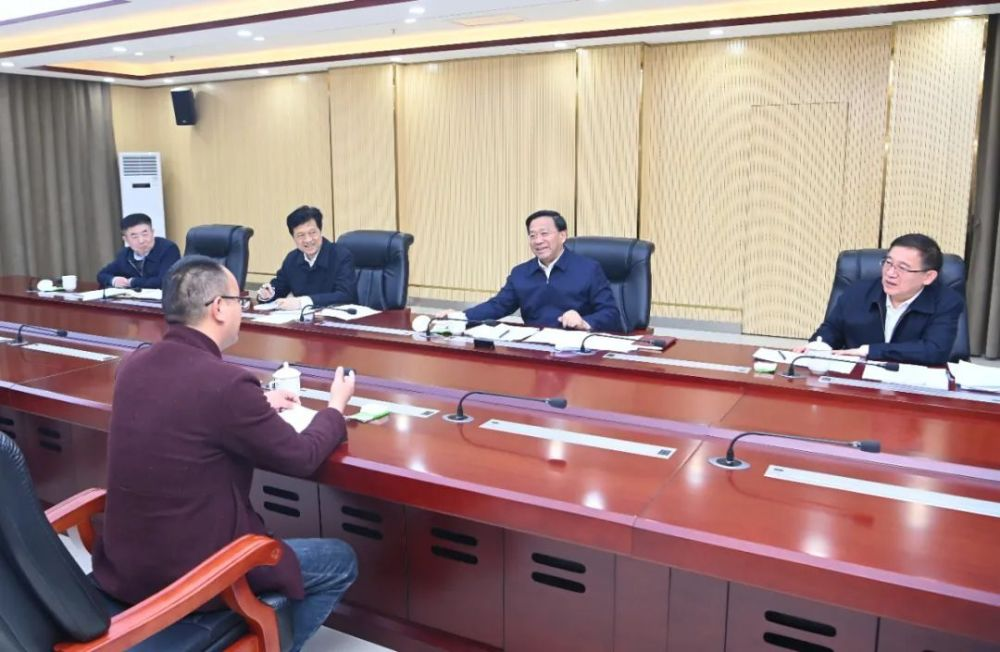

# 群众反映水质差，省委书记不打招呼直奔小区督导办理，并当场接自来水喝，检查水质

据安徽日报微信公众号报道，12月8日上午，安徽省委常委会学习践行“四下基层”优良传统，赴宿州市现场办公。

12月8日下午，省委书记韩俊专程到宿州市信访局接待信访群众，面对面倾听诉求，现场解决群众反映问题，并赴埇桥区督导《民声呼应》群众反映事项办理情况。

下午2点30分许，韩俊来到信访局，详细了解来访处理工作流程，察看智能接谈室、根治欠薪联合接待服务中心、涉法涉诉接待室、纪委监委检举控告申诉接待室等，看望在此接访的干部，向他们表示慰问，勉励大家全力做好“送上门的群众工作”，通过线上线下多种方式，畅通老百姓反映问题渠道，
**用心用情接待每一位来访群众、办好每一件诉求事项，做到件件有着落、事事有回音。**

随后，韩俊来到信访接待室，与省市县有关负责同志一同接待上访群众。“工资拖欠了两年多，一直要不到”“去年承包了耕地保护项目，项目完工了，但工程款至今没有兑付”“拆迁近3年，安置房地基还没打好”……韩俊认真倾听每一位信访人反映的问题，询问详细情况，
**并与当地负责同志现场办公，共同研究解决办法，对群众诉求一一给予答复，要求有关部门及时反馈办理结果。**

 _来源：安徽日报微信公众号_

他说， **领导干部就是为群众办实事的，要想群众之所想、急群众之所急，着力解决好农民工工资清欠、工程款兑付、拆迁安置等问题。**
省市有关部门要以接访的问题为案例，加强对信访普遍性问题的梳理分析，突出源头治理，健全制度机制，举一反三解决共性问题。

据报道，10月28日，有群众反映，埇桥区东城康居苑南区未通自来水，只能饮用地下水，不仅水质差、水压不够还经常停水，严重影响居民生活。
**韩俊在《民声呼应》上看到这个反映后，立即作出批示，要求当地查明原因、研究解决。**

**接访结束后，韩俊不打招呼直奔该小区，实地督导群众反映事项办理情况。**
韩俊首先察看改造后的供水设施，看到了小区已经接通市政自来水。然后，随机走进2户居民家中，与他们促膝交谈，详细询问“水质怎么样”“水压够不够”“还经常停水吗”。
**并走进厨房，拧开水龙头检查水还有没有异味。**

视频画面显示， **韩俊在居民家厨房，当场接了一杯自来水喝，检查水质。**

在小区门口的街道养老服务中心，老人们正在开展丰富多彩的娱乐休闲活动，韩俊走进老人中间，向他们了解小区生活饮用水改善情况，听到大家满意答复后，他对随行的市县干部讲，饮水安全关系广大人民群众身体健康，要加快管网改造进度，确保该小区每一户居民都能接上市政自来水。要举一反三，扎实推进皖北地区群众喝上引调水工程，切实加强城市供水安全保障工作，确保群众喝上干净水、放心水。
**要健全完善“民声呼应”平台工作体系和闭环办理机制，做到群众合理诉求不论大事小事都有人听、有人问、有人管、有人抓，确保群众诉求有问必答、有求必应。**

接访和督导中，韩俊强调，民之所望，就是政之所向。各级党委政府特别是主要负责同志，要把增进民生福祉作为工作的出发点和落脚点， **带头深入基层、直插现场**
，带着感情和责任为群众排忧解难，扎扎实实办好民生实事，打通服务群众“最后一公里”，把惠民生的事办实、暖民心的事办细、顺民意的事办好。各级各部门要坚持和发展新时代“枫桥经验”，推广运用“新时代六尺巷工作法”，强化预防在前、调解优先、依法调解、实质调解，落实好领导干部公开接访、常态下访等制度，及时了解问题、破解难题，最大限度把矛盾纠纷化解在基层、解决在萌芽状态，以高水平平安安徽建设保障安徽高质量发展。

来源：安徽日报、安徽卫视等

