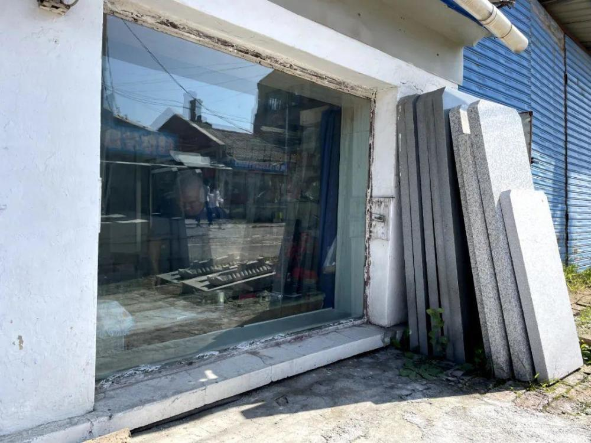
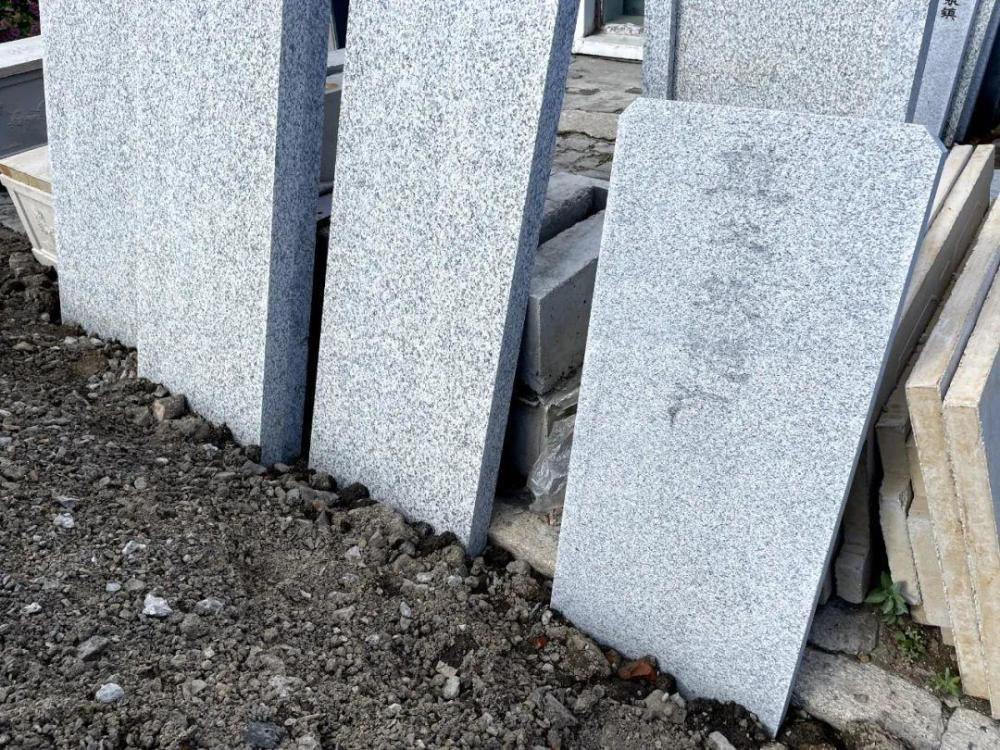

# 东北最后的刻碑人，和他看到的迁徙、死亡，与叶落归根

**文图丨史东旭**

**编辑丨雪梨王**

天气转凉后，丛培新和老伴动身去海南了——和东北的很多“候鸟老人”一样，他们会在每年供暖季前后赶往温暖湿润的南方“猫冬”（东北方言，指躲避冬天），享受那里的碧海蓝天和阳光沙滩。和丛培新一起进入猫冬模式的，还有他的纸花店。

所谓纸花店，说白了，就是殡葬用品店，主营业务是刻墓碑。

小镇不大，如今只剩了两个刻墓碑的人，其中包括丛培新，这个68岁的老人在镇上刻了30年墓碑。他皮肤黢黑，饼大的圆脸上遍布深深浅浅的老年斑。身上的衣服略有些紧，也便愈发凸显出他的啤酒肚。“原来镇上住的人可多，现在房子几乎都空着。”丛培新说起话来慢慢悠悠，少了点儿东北人自带的幽默和松弛。

这些年镇上的人少了，纸花店也落寞起来——破旧的房上立着斑驳的牌匾，唯一新的东西，是不断送来又拉走的石材与墓碑。他的店就开在自家平房里，丛培新这代人习惯住平房，“穿着鞋就能随便进屋、有痰直接往地上一吐”。他觉得，东北农村的平房再破再旧，只要有“人气儿”，都能住人，就怕空着，空个几年，房子就完了。

丛培新担心小镇的未来像平房那样越来越空。

镇上，昔日的荣光与如今的破败俱在——一个“白酒瓶”形状的废弃建筑物伫立在流经小镇的河边，曾经作为小镇骄傲的酒厂大门紧闭；百货大楼闲置了，牌子上写着它建成于1979年，这个购物中心仅有的功能是作为几班公交车的起始站和终点站；原本的中学因为生源减少，索性把小学和初中并到一起上课；沿街的食杂店关门了，原来的招牌还没撤，招租信息更是无人问津。如今镇上只开着些餐馆、食杂店、旅店和快递接收点，满足着人们的基本需求。要是有更高需求的话，大可以买一张5块钱的公交车票坐到市区。

_自行车是丛培新的主要交通工具_

一个无法回避和必须接受的事实是：人的离开。丛培新也一样。

这个即将到来的冬天，会是他在海南度过的第4个冬天。离开时总没有太多感觉，可冬天一过，他的“心就活了，想回家，恨不得立马到才好”。

这些年外头总会说起这里的人口流失，这些丛培新都认，也都看在眼里。可作为刻墓碑的人，他发现了一件只有他能发现的事情——那些或短暂迁徙或定居外地的人，最终大多会选择把骨灰带回这片黑土地安葬。“外头再好，也没家里好。”一提这事，丛培新就这么念叨。

在丛培新动身去南方猫冬之前，我们找到了他。和他聊了聊这三十年里，他看到的迁徙、死亡，以及最后的叶落归根。

以下是他的口述：

墓碑无人认领

我刻了那么多年墓碑，很少有刻完没人要的。多数时候，墓碑刻好之后，会被直接拉去墓地，一两天就能给立上。但干这行时间长了，啥事都能碰着——疫情那几年，有一块墓碑，在我店里放了得有一年多吧，之后花钱刻墓碑的人才来领。石头这玩意儿不怕风吹雨淋，反正放在外面也不会坏掉，我就一直把它在窗户下面放着，不碍事。

那块碑看上去也没啥特别的，规规矩矩，石材是芝麻白的，刻着逝者的籍贯、名字以及立下墓碑的时间——2021年8月7日。逝者名字前只有一个“故”字，不认识的人即使看到这块碑，也很难判断出立碑人与逝者的关系。

它其实是一个中年女人给死去的丈夫刻的。

男人生前和妻子一样，都是镇上的环卫工人。丈夫过世后，女人也离开了镇子，一个人去了北京打工。

她本来没打算给丈夫刻墓碑。说实话，刻碑也不是啥非做不可的事，但时间长了，如果没块碑立着，找墓地可就难了。地形以及周边景物发生变化，有可能找不到葬在哪儿。尤其是以前土葬，给亲人烧错纸、迁错坟，挖了别人家尸骨也是有发生过的。

这个女人就是这么想的，她怕过几年回来，找不到丈夫的墓地。但她当时已经不在镇上了，就托朋友找到我店里，给她的丈夫订了一块墓碑。钱交了，立碑时间也刻上了，可因为疫情，她人一时半会儿回不来。

她给我打过电话，说自己挺惦记这事的——墓碑迟迟立不上，对她来说是个很大的、没有完成的心事。她嘱咐我帮她好好看着。我从电话里判断，他们夫妻感情应该挺好。

去年9月底，女人为了给丈夫立碑，专门回到镇上。我瞅着她挺眼熟，以前在镇上肯定都见过。取走墓碑的当天，我帮她雇了几个人运碑，并帮忙把碑立起来。

这几年，不断有人因为各种原因离开小镇，近的去了市里，远的出了东北。虽然我没跟这个女人唠太多，但能感觉出来，她多半是不会再回到镇上生活了。要是没块墓碑，单靠人的记性，几年后能不能找到她丈夫的墓地，都很难说。

这种妻子为丈夫立碑其实是少数。立墓碑的人中，还是子女为父母，或晚辈为长辈立碑的人最多。多数子女会选择双亲都过世后立碑，墓碑上也大多会写着“慈父”“慈母”这样的称谓。很多年轻人对处理后事的习俗不知道也不了解，有的人也不信那些，我就会告诉他们一些注意事项，别犯忌讳。听不听，那就是人家的事了。

年代不同了，很多老规矩没那么多说道了。以前哪有提前给自己刻墓碑、办葬礼的，现在这事一点儿也不奇怪。老人们总想着，别给子女添麻烦，巴不得自己的后事自己提前办了。你想啊，有心的子女在你过世后能给你刻块碑，那些不孝顺的，谁还管你。

所以那些心里惦记着得有块碑的老人，就自己花钱张罗，自己选样式，这跟提前买好寿衣寿材备着一回事，关键都得是自己喜欢的。我前段时间也是，我姑娘从外地回来待了十几天，我就把现在住的这个平房过户给了她。早晚都是她的，趁着现在能动弹，就都办了。

_丛培新店外堆放着的墓碑石材_

刻碑跟别的行业不一样，东北人再愿意唠嗑，做我们这行的也不能啥都问，所以多数时候就是买家和卖家的关系——人家把设计好的样子告诉我，双方谈妥了，交了定金，我就开始刻碑，很少会打听对方家里的情况。可刻墓碑时间长了，也免不了听说一些家长里短，观察到一些蛛丝马迹。总结下来就是，那些子女多的人家，矛盾就多。

我店里到现在都有一块没人领走的墓碑。因为那家几个子女不和，彼此之间有矛盾，刻墓碑要花钱，立碑也得花，雇车拉墓碑、找人砌墓碑、烧纸修坟等等，这些都下来得花不少钱。子女们谁都不想牵头，牵头就得多花钱，所以一拖再拖，始终没人来取走刻好的墓碑。

“就像翻看人生一样”

学刻墓碑之前，我做过很多事情，种地、伐木，也打过工，学过阴阳先生，后来误打误撞进入了这行，没想到后半生都在做这件事。刚入行时，也就是上世纪90年代那会儿，怎么都刻不好，我就找一些老师傅们请教。当时镇上会刻墓碑的人多，他们也愿意教我，刻坏了不少废碑之后，我的手艺就慢慢好了，主动上门找我刻碑的人也就多了。

刻墓碑这活儿咋说呢，就是殡葬行业里的一环，是一个好人不想做，孬人做不了的活儿。干起来确实埋汰（东北方言，脏），整得浑身都是粉尘，有的人还忌讳。以前就更是了，我们这种店很多人路过都不愿意往里多看一眼。

但我就是靠这门手艺养活了一家四口人。我有两个孩子，一儿一女。当然，他们也不愿意跟着我学这个手艺活儿，我也不想让他们干，没发展，赚不了啥大钱。

以前，往墓碑上刻字得用锤子、凿子，撅着屁股吭哧吭哧地一点点刻。现在有角磨机方便多了，也快多了，省劲儿，女的也都能刻，不算啥体力活。我基本上一块墓碑连写带刻，40分钟就能好，除非是人家要求还得在墓碑后面写逝者生平那种。刻好后一点一点刷上油漆，等油漆晾干了，墓碑也就完工了。

农村都有闰月年不刻墓碑的说法，所以有些年份刻墓碑的人相对会少一些。但基本上一年算下来也要刻上七八十块。我曾经最高的纪录，一年刻了150多块。

打从我刻墓碑开始就有个习惯——用毛笔在石材上写下楷书或隶书，之后再刻字。我从小就写毛笔字，说不上有多专业，但看起来不磕碜（东北方言：难看）。现在我也写。到了夏天，我老伴儿去火车站前跳广场舞，我把音箱给她拉过去之后，就在广场上用特制的毛笔蘸水写字，笔都写坏好几根了。

现在刻碑可比以前省事多了，去复印店打印不干胶，想要啥字体就有啥字体，之后贴在墓碑上，按照镂空的地方刻就行了。

这种出来的字体确实规整，但我不喜欢。我还是愿意手写毛笔字，我觉得那样看起来有种特别的温度，更舒服一些，没那么硬。刻碑是纯纯的手上功夫，虽说没大姑娘绣花那么精细，但在石头上刻字，字的笔画、宽窄、深浅，都影响整体效果。

_丛培新会去到顾客家中，商量设计方案_

在我们东北，刻碑也就是夏天的活儿，冬天刻不了。一是墨汁在石材上沾不上，另外刻墓碑时会产生大量粉尘，不能在室内。室外就别指望了，本身温度就低，石材温度更低。再说冬天黑土地都冻得杠杠的，想立碑也挖不动啊。有一次，镇上有个老人家过世，家属希望在冬天立碑，我就找了一个仓库，扯上电源，费了好大力气才把墓碑给刻了。那会儿我也年轻，有体力，年纪大了之后，我就再没在冬天刻过碑。

刻墓碑的石材多数都是从外地买的，万年青、芝麻白、天岗白最为常见，其中万年青最好刻，另外还有一种叫黑珍珠或芝麻黑的石材，是我们镇上的石材。刻碑价格根据石材和复杂程度不同，大约在几百元到上千元不等。

我刻墓碑还有个习惯，就是会把每个墓碑的设计草稿都记在本子上，包括石材信息、墓碑尺寸、逝者信息，并且会按照当年刻碑的时间给这些墓碑依次编上编号。30年下来，我已经记了好几本了。

这些本子前几年派上过用场。当时是附近的一次迁坟，相关部门的工作人员找不到也联系不到逝者家属。他们知道那碑是我刻的，到店里来找我。我通过草稿本上记下的信息，找到了逝者家属。翻看一本本设计草稿本，就像翻看他们的人生一样，我都留着呢。

黑土地上的记号

我这辈子也算行了。家里两套楼房，镇里一套、市区一套，还有一套平房，就是现在用来开店也住人的这套。谈不上富足，但也还算可以。

我把市区的楼房过户给了大儿子。大儿子一家在市区生活，今年春天他又跑去了天津开大车，说那边挣得比东北多一些，缺点就是很少能回来。

这几年，我每年冬天都去三亚猫冬，跟5家朋友组团去，租房子住，互相有个照应。那边主要是气候好，很适合养身体，不像东北的冬天，老年人真的只能在家里猫冬。在三亚时，我一般都是一早一晚出门溜达，中午太热就待在家里，没事刷刷短视频。

去三亚前，我就把平房的钥匙交给邻居，让他们帮着照看家里。在镇上的楼房也会停了暖气，把门一锁，基本上没啥可惦记的了。

但其实也还是惦记，尤其是春天。看别人收拾东西准备回老家时，我的心也跟着活了，越来越盼着回家，哪里都不如家好。但每年冬天都去三亚，要是不去反而不习惯了。

和东北的很多小镇一样，现今生活在镇上的人大多数是老年人，很少能见到年轻人和孩子。无论平房还是楼房，都空了很多。尤其是冬天，现在大家生活条件好了，去南方过冬的老人越老越多。但无论是长期在外地定居还是临时猫冬，根都还在这里。

_丛培新记性变差了，写下字后发现已经刻过，便又擦掉_

人总是要回到家乡的，即使过世，也要落叶归根。我刻的墓碑里，有时候会碰到那种在省外过世的老人，老人临终前就说了，得回老家。子女就把父母的骨灰带回老家，刻好墓碑，之后安葬。那种突然过世的，来不及交代，子女也知道得给带回老家，毕竟祖坟也在这儿。

那从这个角度来看，刻碑这事没受啥人口流失的影响，还是刚需。

也有人问过我，刻了大半辈子墓碑，会不会给自己也刻一个备着。我想过，但还没刻。我感觉我时间还够用，还能刻几年，手也还行，至少刻墓碑的时候还挺稳。就是眼睛花了，再加上得戴护目镜，刻的时候费点劲儿。

立墓碑这件事，算是人活在这个世上的最后一桩人生大事。我刻了30年，墓碑样式也从原来简单的矮小石碑，变得越来越复杂、好看。殡葬习俗其实也慢慢变了，比如近些年流行的海葬，骨灰都撒到海里了，哪还需要什么墓碑？忌日的时候，去海边撒一把鲜花就完事了。

但刻墓碑这件事还是有人会需要，尤其是我们这样一个小镇上。咋说呢，它就好比你留在黑土地上的一个记号，有这么个记号，家人就能找得到你。

【版权声明】本文所有内容著作权归属凤凰周刊冷杉RECORD，未经许可，不得转载、摘编或以其他形式使用。

