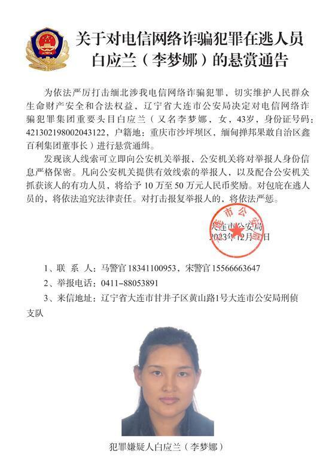

# 公安机关公开通缉10名缅北果敢自治区电信网络诈骗犯罪集团重要头目

来源：央视新闻客户端

针对当前缅北涉我电信网络诈骗犯罪严峻形势，我公安机关先后对多名电信网络诈骗犯罪集团重要头目进行公开通缉，形成强大震慑。近日，在掌握相关犯罪事实和证据的基础上，辽宁、福建、重庆等地公安机关决定对白所成、魏怀仁、刘正祥等10名缅北果敢自治区电信网络诈骗犯罪集团重要头目进行公开悬赏通缉，坚决打掉犯罪分子嚣张气焰。

长期以来，缅北果敢自治区多个家族犯罪集团大肆组织开设诈骗窝点，针对中国公民实施电信网络诈骗犯罪活动，公开武装护诈，危害极其严重，人民群众反映强烈。今年11月，我公安机关对以明学昌为首的家族犯罪集团重要头目进行公开悬赏通缉。在缅甸各方的大力配合下，首犯明学昌畏罪自杀，明国平、明菊兰、明珍珍3人被缉拿归案，公安机关正彻查其犯罪事实，将依法予以严惩。与此同时，辽宁、福建、重庆等地公安机关在侦查中发现，以白所成、魏怀仁、刘正祥为首的3个家族犯罪集团和以徐老发为首的犯罪集团，长期实施针对中国公民的电信网络诈骗犯罪活动，诈骗数额巨大。在公安机关严打高压态势下，仍不收敛、不收手，同时涉嫌故意杀人、故意伤害、非法拘禁等多种严重暴力犯罪，犯罪事实清楚，证据确凿充分。

为依法严厉打击缅北涉我电信网络诈骗犯罪，切实维护人民群众生命财产安全和合法权益，辽宁省大连市公安局决定对白所成、白应苍（又名李云晨）、白应兰（又名李梦娜）进行公开悬赏通缉；福建省泉州市公安局决定对魏怀仁、魏榕（又名陈榕）、魏青松（又名杨松）进行公开悬赏通缉；福建省龙岩市公安局决定对刘正祥、刘积光（又名李华光）、刘正茂进行公开悬赏通缉；重庆市公安局决定对徐老发（又名徐发启）进行公开悬赏通缉。

公安机关敦促犯罪嫌疑人白所成、魏怀仁、刘正祥、徐老发等10人认清形势，悬崖勒马，主动投案自首，争取宽大处理。同时，希望社会各界和广大人民群众积极举报，协助抓捕犯罪嫌疑人。对提供有效线索和协助抓捕的有功人员，公安机关将给予10万至50万元人民币奖励。

（总台央视记者 张岗）

