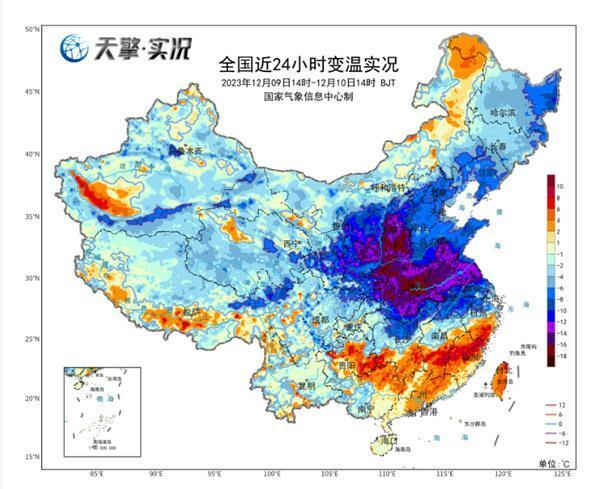
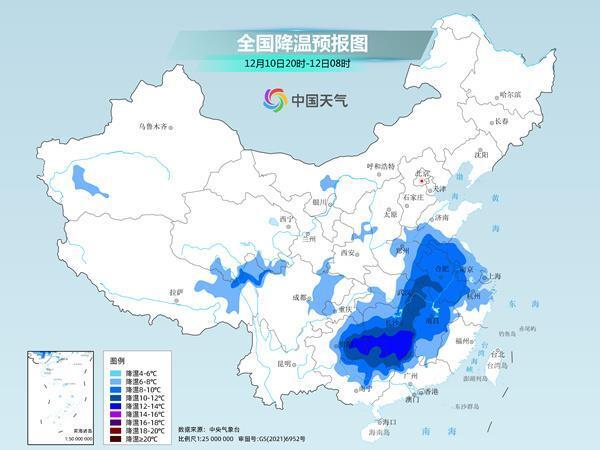
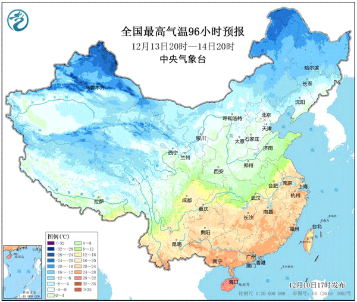
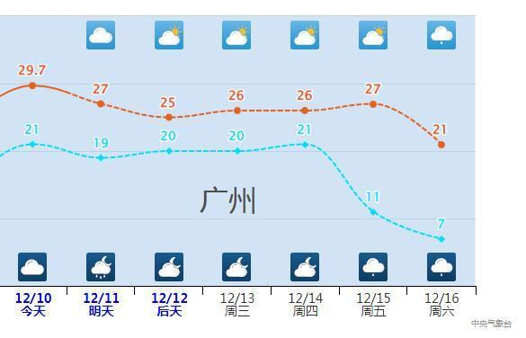
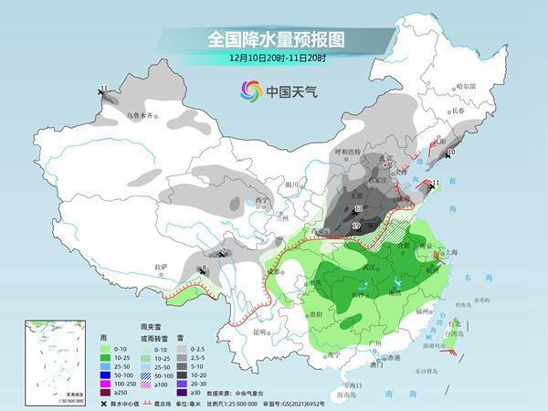
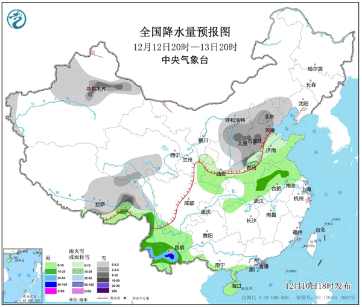

# 冷上加冷！寒潮“王炸”将登场，北方全天冰冻降雪或抵达长江以南

寒潮影响还在持续中，降温重心将转移到南方！同时中央气象台已经升级发布暴雪黄色预警，华北、黄淮北部等地今夜起将进入降雪主要时段。

另外，下周即将到来的寒潮更是“王炸”，降温直达华南，中东部大部地区气温将创新低，北方大部全天冰冻，还有大范围的雨雪。

**下周寒潮“王炸”登场 气温大面积创新低**

12月首次寒潮过程正在影响中东部，今天降温主要集中在山西、河南、安徽北部、江苏北部、湖北北部等地，不少地方降温幅度达到10—16℃。

明天，降温将会转移到江南西部等地，川西高原北部、黄淮南部、江淮、江汉东部、江南中西部、贵州东部、华南北部等地将先后降温6～8℃，其中，安徽西南部、湖北东部、湖南中南部、贵州东部、广西东北部等地部分地区降温10～12℃，局地可达12℃以上。

到后天，江南东部和南部、华南等地也会有降温出现，不过本轮寒潮影响就此接近尾声。随着暖湿气流的“反攻”，南方气温还会有明显反弹，14日前后，安徽、江苏、浙江、湖南、江西等地最高气温将达到或超过20℃。

但不要大意，真正“王炸”的寒潮就要到来。

14—17日，寒潮将影响我国大部，中东部气温先后下降8～12℃，西北地区东部、华北、东北地区南部等地的部分地区降温幅度可达14℃以上。

在下周末前后，中东部地区的气温将进入真正的低谷时段，从北到南最高气温将大面积创新低。北方大部最高气温在0℃以下，全天冰冻。安徽、湖北、江苏、浙江、湖南多地最高气温只有个位数，最低气温跌至0℃及以下，18日前后最低气温0℃线可南压至贵州至江南北部。

看看各地16日有多冷↓↓

16日最高气温

长春-17℃ 太原-6℃ 北京-4℃

天津-6℃ 济南-3℃ 郑州-2℃

合肥5℃ 武汉6℃ 南京7℃

上海6℃ 杭州7℃ 长沙8℃

（数据源自中央气象台10日20时预报）

下周的寒潮过程还能影响到广东、广西、福建、海南等地，像广州，14日最低气温还有21℃，16日就降至7℃，必须翻出厚被子了。

总之，下周末将会十分寒冷，大家提前准备好厚衣服，保暖少不了。

**大范围雨雪接连来袭 雪线或推至长江以南**

在目前这轮寒潮的影响下，中东部大范围雨雪天气也来袭。今天夜间到明天早晨，将是西北地区东部、华北、黄淮北部等地的降雪主要时段。中央气象台已经升级发布了暴雪黄色预警。

预计今天晚上到明天，陕西中部、山西中南部、北京西南部、河北南部、河南北部、山东西部和半岛东部、辽宁东南部等地有大雪，其中，山西南部、河南北部、辽宁东南部等地的部分地区有暴雪。

接下来，在14—17日的寒潮影响下，中东部还将有一轮大范围雨雪。

预计13—16日，西北地区东部、华北北部和东北地区中南部有小到中雪，华北中南部、黄淮以及江淮有雨夹雪转雪，四川盆地东部、贵州以及江南北部有雨转雨夹雪，江南南部和华南大部有小到中雨，部分地区大雨。

由于下一轮寒潮实力更强，各地气温将降到更低的水平，因此降雪的南界也可能更偏南，甚至有望抵达长江以南。

预报时效较远，还有变数，大家记得留意最新预报，提前做好防范。

（来源：中国天气网）

