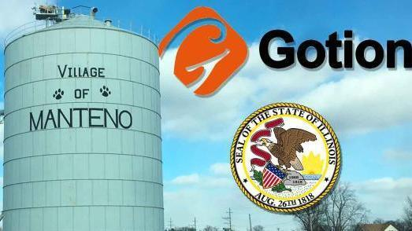

# 国轩高科回应董事长因美国电池厂项目被监管：正常经营不受影响

12月8日晚间，国内电池头部企业国轩高科公告表示，因公司未及时披露与美国伊利诺伊州政府签署了REV补贴协议这一重大交易事项，近日安徽监管局对公司出具警示函并对董事长李缜、董秘潘旺采取监管谈话措施。

此次监管措施是否会对国轩高科在美国伊利诺伊州建设电池工厂的投资产生影响？

12月10日，国轩高科回应澎湃新闻记者表示，本次行政监管措施不会影响公司正常的经营管理活动。

此外，国轩高科表示，公司坚持全球化布局战略，从市场、产能、产品、技术、资本、供应链等多个维度同步推进，努力开拓中国、亚太、欧非及美洲四大市场，构建国内、国际增长双引擎。公司将继续严格按照有关法律法规的规定和相关监管要求及时履行信息披露义务。

根据公告内容，国轩高科于2023年12月7日收到中国证券监督管理委员会安徽监管局(以下简称“安徽证监局”)出具的《关于对国轩高科股份有限公司采取出具警示函并对李缜、潘旺采取监管谈话措施的决定》
(以下简称“《行政监管措施决定书》”)。

2023年9月7日，国轩高科与美国伊利诺伊州政府签署了REV补贴协议。对于该重大交易事项，公司未及时披露，直至2023年10月12日才进行披露，违背了上市公司信息披露的及时性要求，不符合《上市公司信息披露管理办法》(证监会令第182号)第二十四条的规定。

公司董事长李缜直接参与了与美国伊利诺伊州政府签署协议的相关工作，董事会秘书潘旺作为公司信息披露事务的具体负责人，二人未能按照《上市公司信息披露管理办法》(证监会令第182号)第四条的规定履行勤勉尽责义务，对公司相关违规行为负有主要责任。

根据《上市公司信息披露管理办法》(证监会令第182号)第五十二条相关规定，安徽证监局决定对公司采取出具警示函的行政监管措施并记入证券期货市场诚信档案。对李缜、潘旺采取监管谈话的行政监管措施，并记入证券期货市场诚信档案。公司及李缜、潘旺应加强相关法律法规学习，依法履行信息披露义务，杜绝此类违规行为再次发生。

在公告中，国轩高科也表示，公司及相关责任人员高度重视上述行政监管措施决定书所指出的问题，将认真吸取教训，深刻反思公司规范运作及信息披露中存在的不足，加强对《上市公司信息披露管理办法》《深圳证券交易所股票上市规则》等相关法律法规及规范性文件的学习，努力提升规范运作意识，强化信息披露管理，切实提高公司治理水平，杜绝此类事件再次发生，维护公司及全体股东的合法权益，促进公司健康可持续发展。

**迷雾重重的时间轴**

不妨再回顾一下此次项目的时间轴。

2023年当地时间9月8日，美国伊利诺伊州政府官网发表声明，国轩高科通过子公司美国国轩（Gotion
Inc）将斥资20亿美元在该州坎卡基县曼特诺（Manteno）新建一座电动汽车锂电池工厂，将创造2600个就业岗位，规划用地约150英亩。

该电池工厂项目是伊利诺伊州史上金额最大的电动汽车电池投资。

该工厂将专注于锂离子电池、电池组生产和储能系统集成，建成后预计将生产10 GWh锂离子电池组和40GWh锂离子电芯，预计将于2024年开始生产。

据伊利诺伊州州长普利兹克介绍，国轩高科未来也将获得高达5.36亿美元的资金补贴。补贴资金将分别来源于伊利诺伊州的REV激励计划（Reimagining
Energy and
Vehicles，重新构建能源和车辆计划)，以及一项名为“投资伊利诺斯州”的基金。其中，通过REV激励计划，国轩高科将获得1.25亿美元的资金。除此之外，国轩高科还有资格在未来30年内获得2.13亿美元的税收优惠。

伊利诺伊州州长JB普利兹克（J.B.
Pritzker）和当地官员参加了项目奠基仪式，称赞该项目是伊利诺伊州在发展电动汽车生态系统和供应链方面迈出的重要一步。

副州长朱莉安娜·斯特拉顿(Juliana
Stratton)说:“这个项目将改变我们州的经济格局，创造新的就业机会，并表明我们将继续致力于使伊利诺伊州成为可再生能源制造中心。”

国轩高科董事长李缜则在奠基仪式上表示，“我们相信，国轩高科的电池技术将有助于推动北美的电动交通以及中美之间的经贸交流。”

9月9日中午，澎湃新闻记者从国轩高科方面确认了该投资项目，公司高层也跟澎湃新闻记者介绍，此次伊利诺伊州的电池工厂项目不需要新建工厂，而是计划重新利用曼特诺现有的一家工厂的基础设施，在节约资源的同时也提高了建设效率。但跟伊利诺依州新闻稿有些出入的是，该高层对记者强调，“产能为年产40GWh的锂离子电池包”，并非新闻稿中的“10GWh锂离子电池组和40GWh锂离子电芯。”

9月9日下午，国轩高科方面发布了该项目的新闻通稿，包括产能在内的基本新闻事实与伊利诺伊政府的新闻稿吻合，新闻稿中没有提到项目的具体投资金额和补贴金额。

不过，直到10月12日，国轩高科才发布正式公告，公告中也没有提及项目具体的投资金额、补贴金额和产能规划。只表示拟在美国伊利诺伊州投资建设锂电池项目。项目投资具体金额将根据本项目的可行性分析及申报审批情况等确定。资金来源则是与第三方战略投资者合作共同投资。

此外，公告表示，美国国轩与伊利诺伊州政府签署了《REV TAX CREDIT
AGREEMENT》，该协议的主要内容为伊利诺伊州基于此前通过的专门补贴新能源及电车企业的REV补贴法案，针对该项目给予税务补贴。最终投资额和补贴额将以实际投资情况为准。截止本公告日，美国国轩已完成本项目土地、厂房等不动产资产购买协议签约。

国轩高科表示，以上仅为公司初步预计的项目基本情况，具体的项目投资建设情况以公司视
项目的可行性分析及申报等前期工作的进度，结合项目建设的计划，待相关条件具备后，按照相关规定履行审批决策程序后披露的信息为准。

此外，还值得注意的是，伊利诺伊州的电池工厂项目，是国轩高科继去年10月宣布将投资24亿美元、在密歇根州北部建造电池材料工厂后，在美国的第二笔重大投资。密歇根电池材料工厂包括一个每年生产15万吨电池正极材料的工厂，以及两个年产电池负极材料5万吨的工厂。

而密歇根州项目的正式公告，国轩高科发布的时间是今年10月25日，跟密歇根州政府官方网站发布公告的时间相差了一年。在这一年期间，今年6月，美国当地媒体报道工厂获得美国联邦政府批准。7月，美国当地媒体又爆出工厂建设延期的消息，但被公司高层否认。

根据全球咨询机构SNE research的统计，今年1—10月，国轩高科的全球动力电池装车量在全球排名第八。

根据公司2023年半年度报告，报告期内，国轩高科实现营业收入152.39亿元，同比增长76.42%，公司归母净利润2.09亿元，同比增长223.75%。
公司扣非归母净利润首次实现转正至3537.01万元，同比增长120.43%，经营性净现金流1.65亿元，同比增长80.19%。

2015年，国轩高科在美国成立了子公司，主营动力电池的销售、研发。

