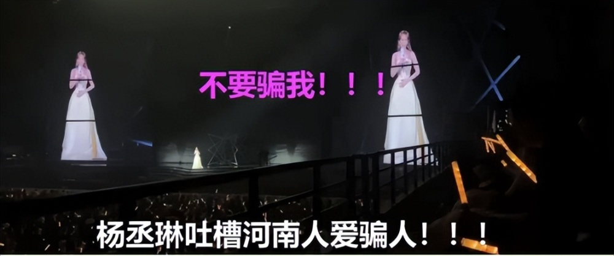
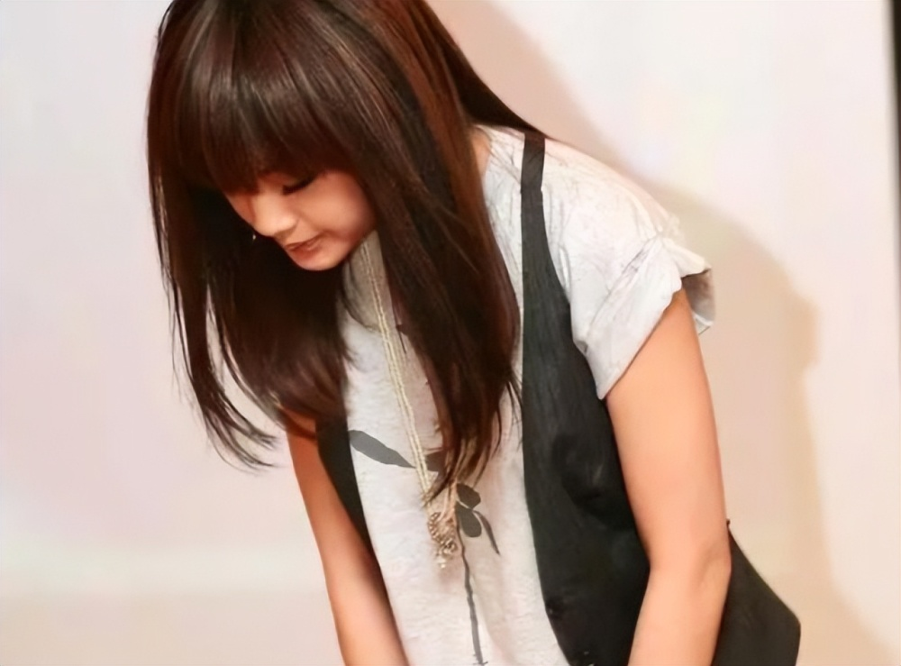

# 杨丞琳演唱会翻车，吐槽河南人爱骗人，本人紧急道歉：是我的不对

随着演出市场的复苏，很多台湾省明星也轮番来内地开演唱会，但是随之引发的一些翻车例子，也让网友热议纷纷
。这次引发争议的是杨丞琳，她在河南演唱会上公然地域歧视，直接冲上了热搜，本人不得不出来道歉。

据悉，在12月9日晚，杨丞琳在河南郑州举办了演唱会，而争议就来源于杨丞琳和粉丝互动时的一段对话。当杨丞琳在台上唱歌的时候，一对情侣在这个氛围下情不自禁地接吻，却被大屏幕拍到了，然后引起了现场一阵儿欢呼声。

杨丞琳唱完八卦魂就来了，一直在问在座的粉丝朋友刚才发生了什么事情？是谁在接吻？是哪边的在接吻？不过却并没有立刻得到回应，所有人一直在挥舞着荧光棒。

这让较真的杨丞琳来劲了，杨丞琳继续问到底是哪边？还放话你们不说我就不唱了，大家就和杨丞琳开玩笑，开始说：是我们是我们。不过大家并没有感受到杨丞琳的较真，只以为这是明星本人在演唱会和粉丝的正常玩笑话而已。

杨丞琳一直没有得到答案，或许是感受到了自己的话不被重视，她突然就语出惊人吐槽说：“河南人不可以这样，你们一直有一些名声，爱骗人的事。你们不要骗我哦，郑州人你们太坏了一直骗我”

这段对话曝光后引起了很大的争议，杨丞琳本人也在第二立刻道歉，称自己当时开了一个很冒犯并没有礼貌的玩笑，愿意接受大家的批评指正。随后，有当时在场的粉丝证实了确实杨丞琳吐槽了河南人爱骗人，还表示自己听完就蒙了，直言杨丞琳很过分，不要拿玩梗来当理由，说出这番话就是没脑子。

确实也是很离谱，粉丝花钱来看演唱会，莫名其妙被一棍子打死，这不是地域黑吗？杨丞琳作为公众人物，当着这么多人吐槽，这难道不是对在场河南粉丝的冒犯吗？在网友看来，是少数河南人败坏了名声，台湾省才是出了名的诈骗岛，那么按照杨丞琳的逻辑，她之前在台湾省生活也是诈骗犯咯。

这不是杨丞琳第一次地域黑了，有人透露她才出道没多久的时候来厦门参加活动，被问到内地和台湾省的区别，杨丞琳吐槽厦门人穿的比较土，只是当时杨丞琳名气不大，所以才侥幸逃过一劫。

杨丞琳祖籍在广东，后来在台湾省发展生活，但数典忘祖，最出名的就是当年的“抗战八年”言论。当时杨丞琳在参加综艺节目的时候，被吴宗宪揭穿不知道抗战八年历史，还居然说：“八年而已哦”。

不仅如此，杨丞琳对抗战历史一问三不知，不明白当年中国人受到的伤害有多大，还多次表达对日本的喜爱，直言自己上辈子一定是日本人，穿着和服走在雪地上的感觉最高贵。

这些年来，杨丞琳不止一次出现类似的争议，如果一次或许是误会，但是这次又再次提到敏感的话题，无疑是重蹈覆辙，只能说作为艺人还是要提高情商。粉丝花钱看演唱会不是来受气的，杨丞琳作为公众人物还是要谨言慎行，不要触碰大家的底线。

