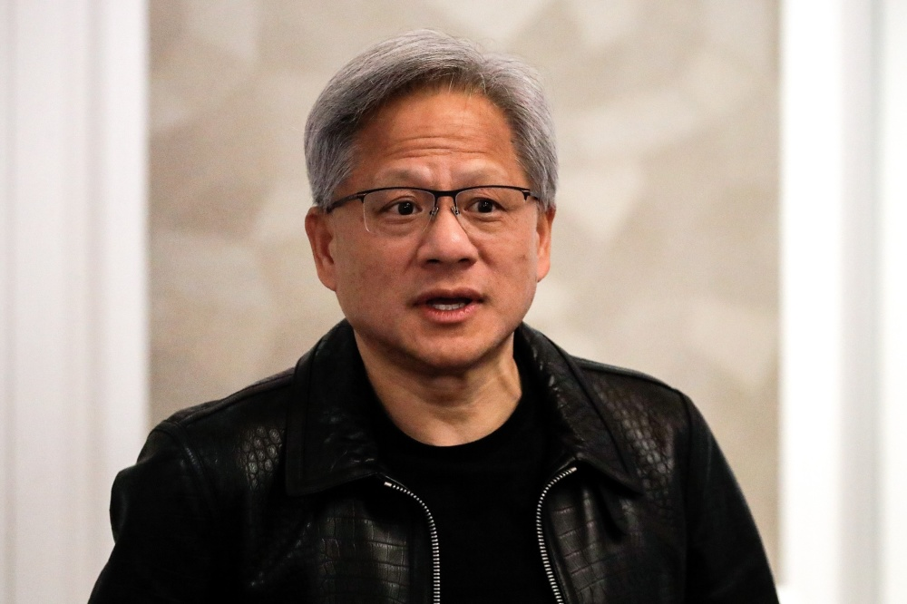

# 8天4个国家！黄仁勋密集亚洲之行透露出哪些信号

_英伟达CEO黄仁勋 IC photo 图_

英伟达CEO黄仁勋的亚洲之行已经有了丰厚的收获，先后公布了在日本、新加坡、马来西亚和越南四国的合作或投资计划，表现出这家AI（人工智能）芯片巨头对于亚洲市场的重视。

当地时间12月10日，越南政府网站发文称，越南政府总理范明政当日与黄仁勋会面。黄仁勋表示，英伟达“将越南视为自己家”，公司希望在越南建立一个半导体基地，因为越南是一个重要的市场。越南政府表示，该基地将“吸引来自世界各地的人才，为越南半导体生态系统和数字化的发展作出贡献”。

12月11日，黄仁勋和英伟达的其他高管继续在越南国家创新中心 (NIC) 举行工作会议。据外媒报道，英伟达此前已在越南投资约2.5亿美元。

越南已经是黄仁勋此次亚洲之行的第四站，尚不清楚是否为最后一站。在越南之前，黄仁勋已经先后到访了日本、新加坡和马来西亚。在这四个国家中，有三个都是东南亚国家，显示出英伟达正在东南亚展开积极布局。

在接受马来西亚媒体的采访时，黄仁勋也称自己“对东南亚充满信心”。目前，英伟达已经宣布将在越南建设半导体基地，在新加坡进行了关于未来可能的大型投资的谈判、帮助新加坡政府开发大模型，以及在马来西亚投资200亿马来西亚林吉特（约合42.9亿美元）、和YTL（马来西亚的杨忠礼集团）合作建设AI基础设施。

而在到访东南亚之前，12月4日，黄仁勋首先来到东京，与日本首相岸田文雄进行会谈。会谈结束后，黄仁勋在接受采访时表示，英伟达计划将与包括软银在内的日本公司合作研发生成式AI，并称自己向首相承诺，英伟达“将尽最大努力优先考虑日本的GPU需求”。

黄仁勋此行到访的四个国家有一个显著的共同点，那就是都在大力推进AI和半导体产业的发展。其中，日本政府在11月刚通过了一项额外预算案，决定将2万亿日元左右的补贴用于芯片领域，来加强日本在全球半导体领域的地位；12月4日，新加坡也发布了国家人工智能策略2.0，提出通过培训本地人才和从海外招聘人才，将其AI从业人员数量增加两倍，达到1.5万人。

而据外媒报道，今年以来，马来西亚半导体行业的外国直接投资显著增加。马来西亚总理安瓦尔·易卜拉欣也在和黄仁勋会谈后表示，英伟达决定投资马来西亚是一个明确的信号，表明外国投资者、特别是世界科技巨头继续将马来西亚作为该地区的首选投资目的地。

越南对于芯片行业的重视更是突出。今年9月，美国总统拜登拜访越南河内，白宫称越南可能是全球半导体供应链中的“关键参与者”。当时，白宫发布的文件显示，英伟达已经与越南领先的科技公司合作，在云计算、汽车和医疗行业中部署AI技术。今年10月，越南科技部经济技术行业科技司司长阮富雄也表示，最近越南与美国及其他国家在半导体芯片领域开展的合作为越南带来了巨大机遇，越南完全可以参与全球半导体价值链。

另有分析指出，英伟达此次亚洲之行可能还有一个目标，那就是寻找潜在的合作伙伴。在日前的瑞银全球科技会上，英伟达首席财务官科莱特·克雷斯（Colette
Kress）谈到，目前市场上有许多强大的晶圆代工厂，台积电和三星都是英伟达的重要合作伙伴，而英伟达也在考虑增加其他潜在的晶圆代工厂。

此外，英伟达和亚洲各国的本地厂商展开合作，或许也是为了应对美国政府新的芯片出口限制政策。在近日的东南亚之行中，黄仁勋曾多次强调，中国市场历来占英伟达总销售额的20%左右，英伟达将继续开发一系列符合美国政府关于向中国出口高端芯片的规定的新产品。

去年10月，美国政府宣布实施最初的人工智能芯片出口限制。英伟达由于无法向中国市场提供A100和H100人工智能处理器，专门为中国市场特供A800和H800，以符合相关政策。

据环球时报报道，美国商务部于10月17日发布了一系列新的芯片出口限制，扩大了对高级人工智能芯片的定义，并对运往40多个国家的芯片产品提出额外的许可要求，以避免转售给中国。新的限制措施定于11月16日生效。

中国外交部发言人毛宁在例行记者会上曾强调，中方已多次就美国对华芯片出口管制表明立场。美方应当停止将经贸科技问题政治化、工具化、武器化，停止扰乱全球产供链稳定。中方将密切关注有关动向，坚决维护自身权益。

