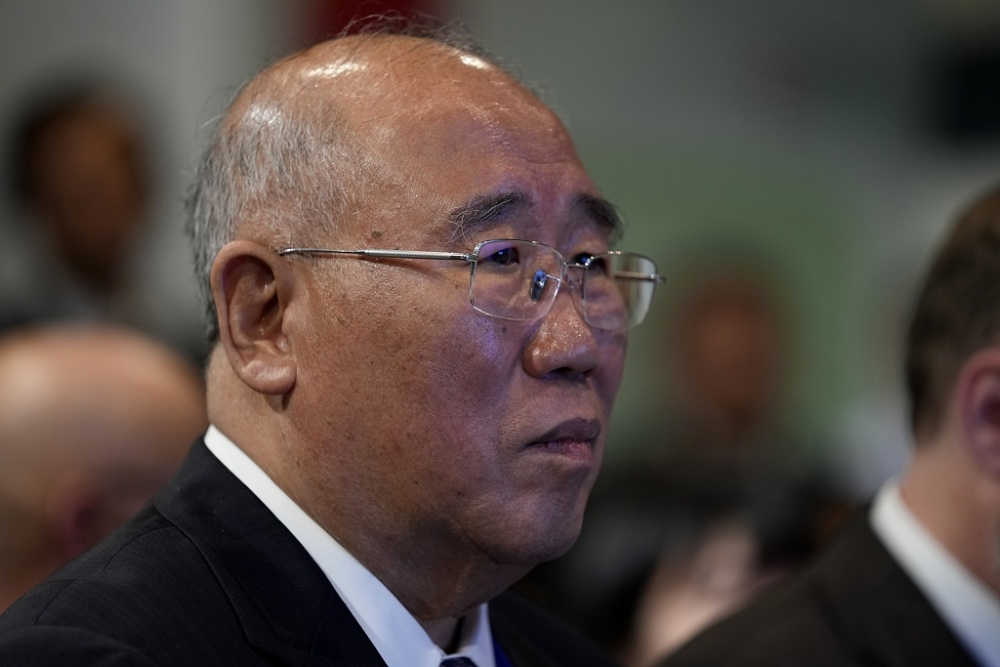

# COP28决议文本陷分歧！中国气候变化事务特使：中方正与各方密集磋商

【环球时报特约记者 陈欣 环球时报驻埃及特派记者 黄培昭 环球时报特约记者
青木】正在阿联酋迪拜举行的《联合国气候变化框架公约》第二十八次缔约方大会（COP28）即将于12日落幕，各国正在就决议文本展开密集磋商，其中有关化石燃料未来使用方案的措辞是最大分歧之一。在这一背景下，中国气候变化事务特使解振华9日在COP28期间举办的记者会上的一系列表态引发广泛关注。解振华坦言，本届大会是近年来“最困难”的一届，目前形成的案文有27页，206个问题需要解决。解振华表示，中方正与各方积极磋商，寻找各方都能接受的解决方案，推动本届大会取得成功。

_当地时间2023年12月9日，阿联酋迪拜，中国气候变化事务特使解振华出席第二十八届联合国气候变化大会。（视觉中国）_

据路透社9日报道，谈判观察人士称，沙特和俄罗斯等国认为，此次会议应只关注减少空气污染，而非针对造成污染的化石燃料；而包括美国、欧盟和许多贫穷、易受气候变化影响的国家则要求COP28决议中明确要求最终停止使用化石燃料。COP28大会主席贾比尔9日晚些时候告诉各国加快磋商，以达成最终协议。他表示“分歧的领域仍多于达成一致的领域”，而“减少这些分歧的窗口正在关闭”。

8日公布的最新谈判文本显示，各国仍在考虑一系列选择——从同意“根据现有最佳科学方法逐步淘汰化石燃料”，到“逐步淘汰有增无减的化石燃料”，再到根本不提及化石燃料的未来使用。

据路透社报道，萨摩亚自然资源与环境部长舒斯特代表小岛屿国家联盟发言，对今年的谈判或因争议陷入僵局表示担忧。他说，“鉴于我们在迪拜剩下的时间有限，我们非常关心谈判的速度。可再生能源的目标不能取代对逐步淘汰化石燃料和结束化石燃料补贴的更强有力的承诺。COP28需要两者兼顾。”

在各国就决议文本产生分歧之际，中方表态备受关注。据法新社9日报道，当天在迪拜的记者会上，中国气候变化事务特使解振华表示，不解决化石燃料问题，COP28难以取得成功。

解振华9日表示，目前中方“正在与各主要缔约方密集磋商，以找到一个符合《巴黎协定》精神，反映能源转型大趋势，一个正确的、能指明未来努力正确方向，反映正能量，体现最大包容性，各方都能接受的解决方案”。解振华说，“我们目前已经有了积极进展……我们对此很有信心”。

路透社9日报道称，包括印度和中国在内的国家尚未明确支持逐步淘汰化石燃料，但支持了推动可再生能源的普遍呼吁。

在谈到中国落实《巴黎协定》目标的行动时，解振华表示中国将在2030年前实现碳达峰。迄今为止，风力发电的成本已经降低了80%，光伏发电成本降低了90%，为全球大规模部署可再生能源奠定了非常好的基础。

在帮助发展中国家提高应对气候变化能力方面，解振华指出，中国通过南南合作和绿色“一带一路”对发展中国家展开了形式多种多样的支持、帮助与合作，今后中国将继续增进与发展中国家的资金和技术等合作。

“中国在世界气候大会上令人惊喜的三大原因”，德国《商报》9日评论认为，虽然迄今为止中国尚未在迪拜做出让步，但在中美和解的背景下，作为“全球南方”的倡导者，可再生能源增长创纪录的中国在气候问题上做的可能会比承诺的多。

不过，美国亚洲协会政策研究院专家李硕（音）对英国《卫报》表示，美中气候协议为COP28大会奠定了基础，但如果全球雄心仅限于世界两大经济体，我们将陷入困境。在会议剩余的时间里，各国需要在中美奠定的基础上积极积累，他们能否做到这一点将决定这次气候大会能否成功。

