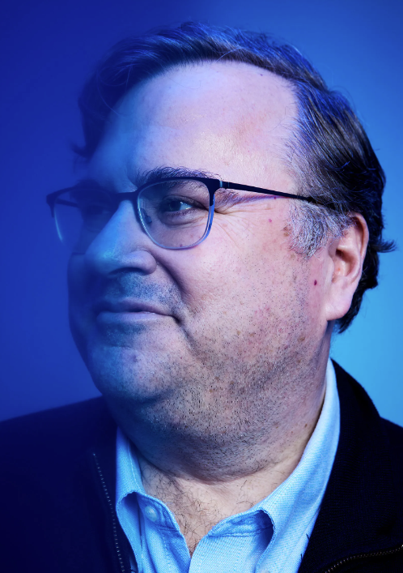
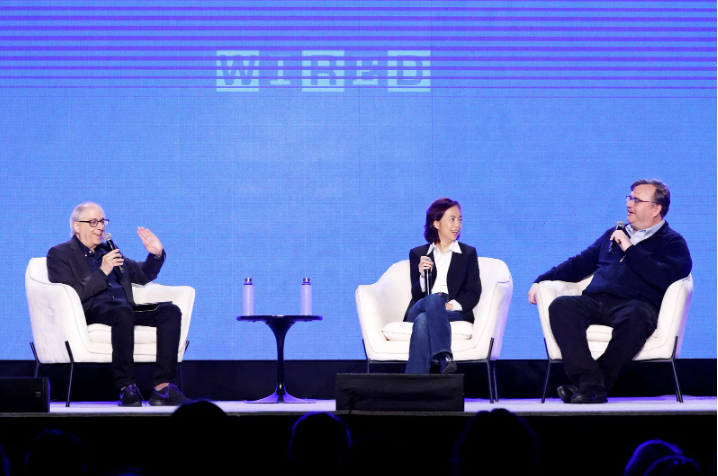

# OpenAI联创霍夫曼力挺奥特曼：他是聪明的AI塑造者 朝着正确方向前进

**划重点**

  * _1_ 对于奥特曼能重返OpenAI担任CEO，联合创始人霍夫曼表示支持，并认为OpenAI的情况会改善。
  * _2_ 霍夫曼认为，没有必要暂停AI技术的发展，并称这种激进举措是不明智且具有破坏性的。
  * _3_ 斯坦福大学计算机科学家李飞飞表示，若有机会，会仔细考虑加入OpenAI董事会的可能。

腾讯科技讯 据外媒报道，OpenAI联合创始人雷德·霍夫曼（Reid Hoffman）表示，随着山姆·奥特曼（Sam
Altman）重新担任首席执行官，公司的情况会得到更好的改善。奥特曼在领导和推动OpenAI的发展上表现出色，这使得霍夫曼对他充满了信心。

最近，在旧金山举行的《连线》杂志LiveWIRED
30周年纪念活动上，霍夫曼首次对OpenAI最近的混乱局面发表了评论。在谈到得知奥特曼被解雇后的反应时，他说：“这不仅仅让我感到震惊。”曾经共事过的董事会成员不再相信奥特曼，同样让他觉得难以接受。今年3月，霍夫曼离开了OpenAI的董事会，此前他与人共同创立了竞争对手Inflection
AI。

在遭到员工和投资者的反对后，奥特曼在几天后重新获得了工作。霍夫曼对此表示：“有奥特曼担任首席执行官，我们的处境会好得多。他在这方面非常有能力。”

2015年OpenAI成立时，霍夫曼与埃隆·马斯克（Elon
Musk）以及其他几位富有的科技大佬共同提出了OpenAI最早的愿景。他说：“我认为，在所有公司历史上，我从未见过董事会解雇首席执行官时，几乎100%的员工都在联名信上签名，表示‘要么让首席执行官复职，要么我们就走人’。这是历史性的。”

在LiveWIRED的另一个小组讨论中，计算机科学家乔伊·布兰姆唯尼（Joy
Buolamwini）表示，虽然奥特曼和许多科技领袖一样，对人工智能的能力和潜力持有“特殊的乐观态度”，但她同样关注政府监管人工智能的必要性等问题。

在OpenAI试图走出危机之际，科技领袖对奥特曼的支持显得非常重要，尽管导致四位董事会成员罢免他的担忧仍不为人所知。OpenAI的ChatGPT等技术的迅速普及提供了早期迹象，表明强大的人工智能系统将如何重塑工作和娱乐，而奥特曼等负责人对变革过程的影响将变得更为关键。周三，谷歌发布了Gemini，这是一个旨在对抗OpenAI的多模态人工智能模型。

作为职业社交网站领英的联合创始人和风险投资公司Greylock的投资人，霍夫曼强调了开发技术并不意味着一定会有好的结果。他指出：“你还必须谨慎塑造技术，并引导它朝着正确的方向前进。这是一个聪明的塑造者所必须具备的能力。”

**当前和未来风险**

OpenAI正在重组董事会，可能会更加倾向于履行其最初使命。在这个过程中，它必须面对的问题之一是，如何在关注人工智能系统的盈利潜力和价值，以及未来系统变得比人类更智能化的前景之间取得平衡。这一挑战与公司的使命密切相关。

在LiveWIRED活动上，一些演讲者强调了当前人工智能系统可能出现的问题，如ChatGPT传播虚假信息或存在问题的种族、性别或宗教内容，这需要优先考虑并解决。

初创公司Hugging Face的研究和首席伦理科学家玛格丽特·米切尔（Margaret
Mitchell）表示，未来的问题可以等一等再去解决。她说：“事情不会突然发生根本变化，导致很多人死去。但由于部署的人工智能无人机正在做出杀人的决定，人们现在正在死亡，我们必须立即对此作出反应。”

霍夫曼和其他人认为，没有必要暂停人工智能技术的发展，并称这种激进举措是不明智且具有破坏性的，尽管一些人工智能研究人员曾为此请愿。他说：“我建议每个人都加入我们的乐观主义者俱乐部，不是因为它是乌托邦，一切都会很好，而是因为它可能是一个惊人解决方案的一部分。这就是我们正在努力实现的目标。”

米切尔和人工智能危害倡导组织算法正义联盟(Algorithmic Justice
League)的首席艺术家兼主席布兰姆唯尼表示，不能单纯依赖公司的承诺来减轻人工智能的偏见和滥用问题。他们强调政府必须明确表示人工智能系统不能损害人们的公平待遇或人性权利。布兰姆唯尼特别关注那些可能被剥削或勒索甚至灭绝的人群，并呼吁停止使用致命无人机等系统。她补充说，像致命无人机这样的系统应该停止使用，“我们已经处在一个人工智能很危险的世界，我们不能再把人工智能当作死亡天使”。

武器等应用与OpenAI的核心目标相去甚远，该公司的核心目标是帮助程序员、作家和其他专业人士。按照他们的服务条款，该公司的工具不能用于军事和战争，尽管OpenAI的主要支持者和热心客户微软与美国军方有相当大的业务往来。

但布兰姆唯尼建议，开发商业应用程序的公司应该受到同样的审查。随着人工智能接管作曲等日常任务，企业必须准备好应对这样的社会后果：工人学习工作基础知识的机会可能会减少，而这些工作对成为高技能人才可能至关重要。她说：“经历创作的过程，找到合适的词语，弄清楚如何表达自己，并在努力中学习一些东西，这对人工智能意味着什么？”

斯坦福大学计算机科学家李飞飞管理着该校以人为本人工智能研究所，她表示，人工智能社区必须关注该技术对人类的影响，从个人尊严到整个社会。她说：“我应该成立一个新的俱乐部，叫做科技人文主义者，只说‘你想加速还是减速?’太简单了，我们应该讨论在哪些方面应该加速，哪些方面应该放缓。”

李飞飞是现代人工智能的先驱之一，开发了被称为ImageNet的计算机视觉系统。OpenAI会希望在其新董事会中出现一个像她这样看似平衡的声音吗？OpenAI新董事长布雷特·泰勒（Bret
Taylor）没有回应置评请求。但如果有机会，李飞飞表示会仔细考虑。（编译/金鹿）

