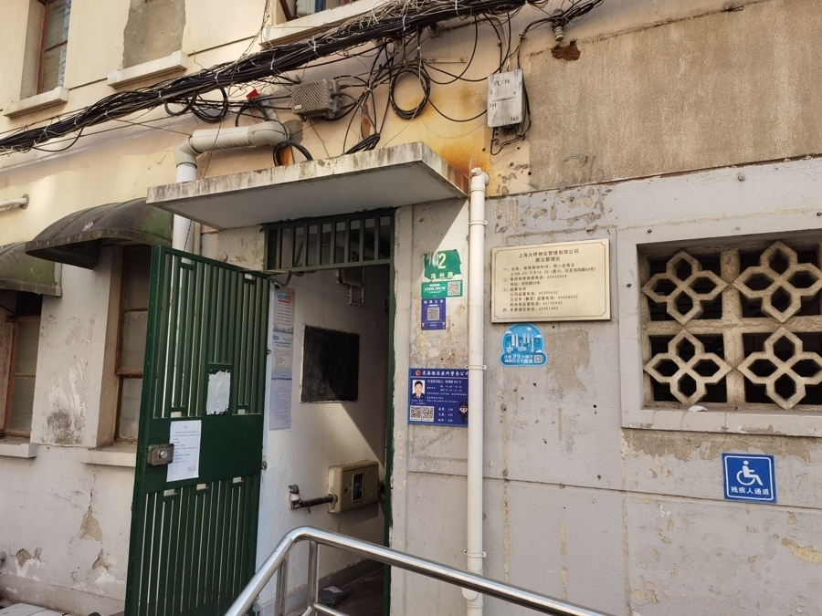
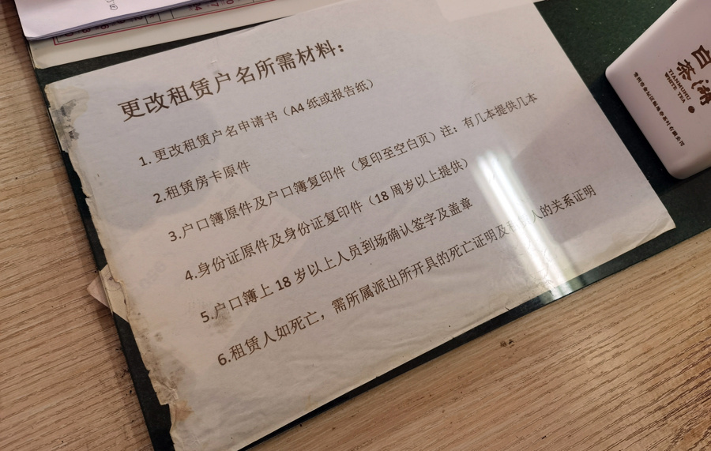

# 上海90岁老人瘫痪在床却被要求“当面办理” 家属：难道用救护车拉来

“老人瘫痪在床呢，难道要我们叫辆救护车拉过来吗？”

日前，杨浦区市民陈女士（化名）致电12345市民服务热线求助，称她公公租有隆昌路541弄内的两间公房。近日，老人想为这两间公房办理“公房变更租赁户名”，即将房子更改到老人儿子名下。但陈女士多方询问，均被告知办理这项业务需要老人到场确认签字。

陈女士称，老人已经90多岁，瘫痪在床，长期住在护理院内，“到场确认”这一要求难倒了老人和家属。她通过“12345”询问：他们能否要求上门服务？

**可以人性化操作吗？**

12月5日，记者来到隆昌路541弄。弄内有大量的老式公房住宅，陈女士公公所租住的房子，位于其中一幢3层小楼内，外观看起来很有些斑驳破旧。坐在弄堂里休闲的老人告诉记者，弄内房子大多是由卫百辛集团负责经营管理的直管公房，日常由卫百辛集团下属的直管转制物业企业大桥物业实施管理服务。

 _△隆昌路541弄。_

“公房变更租赁户名”如何办理？“沪房规范【2019】3号文”有明确的规定，承租人与本处有本市常住户口的共同居住人协商一致，可要求变更租赁户名。文件中列明了材料的要求，其中包括“当事人对变更租赁户名协商一致的书面意见”，对是否一定要当面办理并未有明确的要求。

记者致电卫百辛集团公房管理部了解详情。一位工作人员解释，市民可直接前往公房的管理单位大桥物业办理变更租赁户名，由大桥物业负责收集材料并进行初审。
**通常来说，为了避免纠纷，大桥物业会要求户口本上的所有人员到场，由物业现场一一确认对于更改租赁户名事宜的同意意见。尤其是作为目前承租人的老人，现场确认尤为重要。**
记者讲述了陈女士家的情况，表示老人到场有困难，对此，对方倒是提供了一条变通的做法：即由老人出具一份委托书，写明书面意见，并由护理院作为见证人敲章确认。

可行吗？陈女士联系了老人所在的护理院，岂料被一口回绝。护理院称从来没有做过相关的事务，也没有法定的义务去配合老人作为第三方见证人。多方询问未果，陈女士家变更租赁户名一事只能暂时搁置。

**物业：“近的话可以上门”**

11月5日，记者又前往大桥物业现场走访，询问陈女士的诉求是否还有操作的空间。

隆昌路541弄的居民们告诉记者，大桥物业在长阳路上的长隆小区里设有一处管理处，这是距离隆昌路541弄小区最近的一处。铭牌显示，这里是大桥物业第三管理处。近中午时分，一名工作人员正在值班。面对记者提出的要上门办理变更租赁户名的要求，她回应如果老人住得近，她可以提供上门的服务，但远的话则就不行了。
**攀谈中她进一步告知，日常业务中遇到过市民提出上门的要求，“虽然这并非是标准的服务，肯不肯上门要看具体办事的师傅，但一般来说好好沟通都是可以上门的。”**

不过，隆昌路541弄并非是由大桥物业第三管理处管理，而是由远在海州路2号的大桥物业第五管理处管理，记者又转而前往。

_△位于海州路2号的大桥物业第五管理处。_

在大桥物业管理处，工作人员指着办公桌上压着一张变更租赁户名所需材料清单提示记者先了解清楚， **里面特别注明“户口簿上18岁以上人员到场确认签字及盖章”**
。但管理处一名负责人告诉记者，如果老人实在行动不便，大桥物业工作人员可以提供上门服务，“在实际操作中已经上门过几次了”。

_△变更租赁户名所需材料清单里面特别注明“户口簿上18岁以上人员到场确认签字及盖章”。_

**可见，尽管上门服务并不在卫百辛集团规划的服务内容中，但在实际操作中，物业大多还是能提供人性化操作的。**

**上门服务应有制度化安排**

此前，申城曾有媒体报道过残疾人申办残疾证时也被要求必须是患者本人到现场办理，这给行动特别困难的人员带来了极大的麻烦。报道后，市残联和市卫健委为残疾评定推出上门办理等多项便利服务：
**对明确诊断为植物人，且有办理残疾人证意愿的人员，提供“上门评残”服务** ；有条件的地区，可为有特殊需求的申请人提供上门取件、代跑、代办便利服务等。

但是，这也仅仅解决了“评残”这一项公共服务中特殊老人面临的痛点。从“12345”收到的投诉求助来看，类似的情况并不少见，不少市民呼吁，
**公共服务中为行动不便的特殊老人提供上门服务理应成为一种制度化的设计。**

**华东理工大学社会与公共管理学院副教授王宁**
认为，现实中，我们也经常看到许多银行、公证处、各类与社会保障相关联的“认证”为情况特殊、行动不便的老人提供了上门服务。但是，这些上门服务只是个别实践，并没有明确的制度设置作为保障，因此也致使一些领域和社会服务依然缺乏足够的灵活度，缺乏对老人“特殊情况”的“包容度”，致使卧床老人及其家人陷入“办事难“的困境。

王宁称，《“十四五”国家老龄事业发展和养老服务体系规划》中指出，要营造老龄友好型社会环境，上海近年来也在积极打造“老龄友好”城市，这就要求社会各领域要为老年群体提供更多的“包容”，尤其是对那些自身健康状况差、行动和日常生活受限的老人。这种“尊重”与“包容”不应仅停留在“理念”，或体现在城市空间等“硬件”，也应体现到社会各领域的办事服务，为行动不便的老年人提供上门服务，或者提供视频验证等一系列替代的方案，并通过政策制度加以保障落实。

