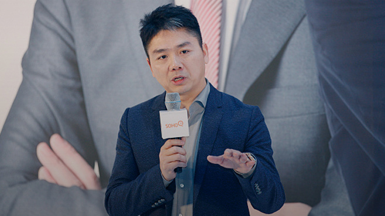
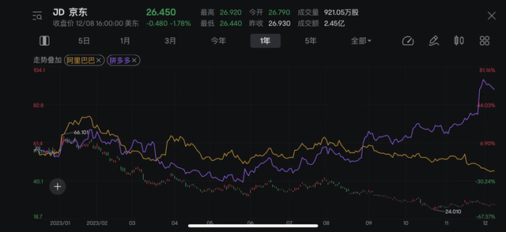
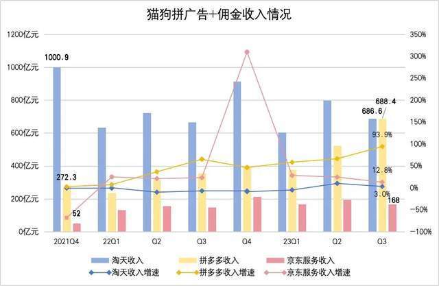

# 京东的“第一场雪”，来得晚了一些

员工内网吐槽，老板借机回复，从而引发集体反思，日前，刘强东也摸上了马云的石头。

12月9日，京东创始人刘强东在内网回复了一位京东员工的帖子。帖子内容核心涉及到“低价”战略贯彻以来，京东所暴露的种种问题。“低价”是刘强东拍板，并亲自部署的策略，贯穿全年，旨在扭转京东电商当下所遇到的困境。刘强东的回复大约可以精炼为五个词：
**人在车上、手有点抖、责任在我、你别躺平、咱们能行。**

按照过往规律，但凡刘强东在年末针砭时弊，接下来大概率会有一系列涉及到业务与人员的大动作。其实，今年内部一直处于纷更之中。5月11日，618前，徐雷卸任京东集团董事长，宣布退休；11月15日，京东发布第三季度财报，同时宣布京东零售集团CEO辛利军另有任用，由京东集团CEO许冉兼领之。

毫无疑问，刘强东长年幕后指挥，亟需一个机会对外发声，释解今年一系列变动缘由的机会。同时也需要一个契机，为此后大刀阔斧的调整，做情绪上的铺垫。毕竟一把手下了罪己诏，“兄弟们”还能全身而退吗？

与马云早前在内部回应拼多多市值超过阿里有类似之处，京东的业态同样异常广泛，而且比阿里更棘手的问题是，京东业务大多带有重资产的“基建”属性，在大环境倒逼企业缩表的前提下，长周期、高投入、慢回报的重资产，容易产生“过度基建”与“无效基建”的问题。

市值折射出某种真实。

京东美股市值在今年持续走低，大多将之归因于模糊的“失速”并不准确，失速是表征，核心动因是京东去年以来的一系列调整皆不及预期。这种情绪类似于，“用了特效药，病情没有好转”，于是市场便产生强烈的看空情绪。

_截图来自东方财富APP，过去一年京东美股市值持续走低_

之所以“低价”策略不及预期，核心原因是京东在服务方面的成本与优势，并不贴合当下消费市场对于“质价比”的诉求。当人们需要更好的服务与更好的品质时，哪怕京东信马由缰，也能坐收规模溢利。可一旦市场追求性价比，在单一的价格维度下，京东并不占优。

用一位业内人士的话说，京东是“开着劳斯莱斯做低价”。

一切责任都在“低价”？

“怀念2009年前后的京东，那时候我们做自营，不需要运营，只要入仓就好，很简单就能把盘子做大。”某品牌商家表示，后来平台着了天猫的道，于是商家开始付费，再后来还要讲打法，运营难度和成本都在抬高。

“现在京东特别难做的一点就是扣点高，又要求比价，压缩了我们的毛利空间，没有毛利怎么去打广告？而且即便付费，京东主站的流量天花板低，拉不起动销，投入等于打水漂。”

上述商家提到的核心问题在于，京东从自营向平台转变的过程中，缺乏流量与商家长效经营的场域。改变京东较弱的经营场域不是一蹴而就的事情，正如构建自营体系一样，最紧迫的事情是完善流量市场的供给与需求。

降低第三方商家的入驻门槛，增强平台属性，实现POP商家与自营平权，这些是京东今年低价调整的核心手段。为吸引第三方商家入驻，京东还推出“春晓计划”持续降低门槛，提供流量扶持。不过京东站内流量并不充沛，能给到的扶持相较抖快，都是小巫见大巫。

平台广告营销反映商家的经营活跃度，佣金收入则体现了经营结果。据京东2023年三季度财报，在平台属性不断增强的变革策略下，京东非商品收入主要包括广告与佣金，第三季度收入为
168 亿元，同比增长 12.8%，占京东零售收入的 7.9%。京东自营所带来的商品收入仍占据绝对主导。

在通往低价的这条路上，京东为POP商家给予了足够大的开放程度，为平台收入开发增量。但从京东服务收入近几个季度的增速来看，去年三季度达到峰值后便一路减速。这说明京东今年针对POP商家展开的一系列变革与扶持并未持续调动起商家在平台的经营活跃度。

在京东百亿补贴上线之初，就有服务商表示：“品牌们都是比较理性的去看待京东的百亿补贴。短期内，商家们觉得去试一试是可行的，先走一步看一步；但长期来来说，商家希望它是一个较大的流量入口，能给品牌经营带来一些附加值，但如果成本等hold不住，是否再投入则要做调整。”

京东百亿补贴自上线以来，商家自补是大头，这是很多商家出于引流的目的。据京东三季度财报，截至 9 月 30 日的三季度中，京东的税前利润达到了 108.02
亿元，同比增长 40.1%，利润并未受到补贴的影响。此前徐雷也在业绩会上回应，百亿补贴对于利润率影响非常低，公司有信心控制这一影响。

这反过来说明，京东官方补贴力度在控制范围内。拼多多百亿补贴持续占据着强心智，若京东长此需要品牌自补来推动百亿补贴，品牌参与的积极性必然会大打折扣。

真正的低价来自于机制——如果商家在平台的经营成本降低，效率增加，那么平台也可以向市场提供更有性价比的产品。事实上，“成本”是京东商家经营始终都难以回避的问题，这是百亿补贴无法持续的根本原因。

一位多平台经营的品牌告诉光子星球：“在平台扣点方面，天猫和抖音都是扣5个点，拼多多不上活动不扣点，上百亿补贴扣3个点。相比之下，京东自营商家的佣金则高达27%，这其中仓储和物流就占了20个点，对于POP商家来说即便不入仓，其佣金比例也高于其他几大平台，为7%。”

需要指出，为了激发商家积极经营，上述7%的扣点中，有一小部分可以作为对赌，如果商家完成对赌，那么扣点可以返还一部分，约为1%。也就是说，对赌成功后，京东的扣点约为6%，依然高于其他平台。

“给了20%的仓储费入库，你会感觉到京东的牛逼；不给那20%的仓储费自配，你会感觉到京东的更贵。”

对于第三方商家而言，入仓面临着高成本，而不入仓则不具备服务优势，很难与自营商品在同一平台内竞争。一直以来，外界对京东低价变革最大的质疑都在于“低价”与京东过去建立的服务体系不兼容，事实亦是如此。

低价不够，直播来凑？

“听说有些主播喊出了‘全网最低价’。京东是全国最大额零售商，凭什么在京东面前说（自己的价格）全网最低？”今年双11落幕之际，前京东零售CEO辛利军为京东采销直播站台，以京东作为零售商的能力力推低价。

中小商家是如今电商低价场的关键角色，而辛利军以“全国最大的零售商”优势为低价站台，如同一条悖论。京东进行低价变革，其最大的阻碍本身就在于其零售商角色——自营。自营长于品控，而短于价格，在流量方面也不似平台模式那般有较强的整合能力。

为了追逐流量，京东上半年围绕“低价”做了很多事情，简单概括为加速平台化。不过平台缺乏流量，尤其是内容基建，因此下半年，则将重心放在了直播，并在双十一期间，试图用没有中间环节的“采销直播”来建立用户心智。

为此，10月末爆发了那场涉及京东、李佳琦直播间、海氏电器三方的“协议低价罗生门”事件。受事件影响，站内直播流量稍有起色。日前，有参与过京东直播的服务商告诉光子星球，“早前单场直播流量很难破10万，发生了低价协议事件后，流量能够轻松做到10万量级，不过累计观看数跟抖快相比还是很悬殊。”

结果表明，京东挑起的“协议低价”事件，起到了一举三得之效，一则蹭上了李佳琦的热度，将“低价”植入京东直播的心智，二则削弱了其他平台头部主播的影响力，三则硬刚海氏电器，也向供应商摆出了铁腕的姿态。

尽管如此，京东采销直播的转化效率仍然有待提高。有参与其中的服务商提到，“在相同条件下，抖音的转化均值差不多在5%左右，天猫波动稍大在2%-5%之间，如果是店播，合理控制投流，平均维持在8%左右。”而京东直播转化率低于抖快这类短视频与直播平台的电商平台，也低于天猫。

短期转化低有用户心智的原因，也有京东直播对服务商设置了考核要求的因素，导致业务开展流于形式。

且不论是否需要考核，由于京东直播缺乏用户心智，对服务商而言运营一个缺乏创作环境的生态尤为困难，为了实现短视频+直播的协同效应，平台要求服务商必须完成各类任务，否则无法满足推流要求。据了解，考核要求中包括每个月发布视频数与图文数，保持直播间不掉等级等。有个别服务商提到，合作账期较长，进一步降低了他们的动能。

事实上，不止是京东，大部分头部企业都高度依赖各类考核达成目标效果，然而京东似乎将考核外溢，并形成广泛规则。

或许是看到自家直播体系搭建还需要时间，京东还把目光放到了外部。前些年一直依赖快手，而今年京东还寻求与抖音深度合作。有一位知情人士提到，年中京东请了抖音直播一位leader指导工作，提供经验，结果这位leader只说这个不行，那个不行，没有提供太多有价值的信息，使得不少京东员工私下抱怨，“我要是会了，还要你做甚”。

尽管困难重重，可仍然没有阻挡京东向抖音靠拢的动作。日前，有服务商表示，京东最近寻求在抖音上为京东新百货带货，为此正在联络一批服务商。

百补也好，直播也罢，似乎目前都并未从结构上改变京东站内流量较低的问题。

据第三方机构Questmobile所发布的《2023年双十一洞察报告》显示，双11期间，京东的日活用户规模落后于淘宝与拼多多。猫狗拼三个平台中，下沉用户唯有对京东来说是更多作为“增量市场”而存在，如今从用户体量上还并未明显带来效果。

12月9日，员工提到促销机制复杂的问题，在淘天持续围绕大促做减法，压力来到了京东这一边。哪怕不做大促，品牌营销仍然在那里，如何在内容基建薄弱，流量河床并不充沛的情况下，承接品牌营销的投入，将持续考验京东的管理者。

过去成功之因，阻碍其通往未来

京东的商业生态一度依靠物流的以储代运、电商的服务性收入、金融与供应链的资本运营的复合模式，建立起强服务的品牌心智与更高的利润空间。因此，很长一段时间，京东获取流量的核心手段其实是依托于服务。

今年6月18日，京东总部二十年老友会的屏幕中播了一段短剧，内容包括了早期诚实经营与顶住压力做物流的故事。短剧试图告诉人们，服务才是过去二十年，京东赖以成功的关键。更好的服务造成京东的成本高于其他平台，直到提升效率与触达边际效应，才能最终抹平成本差。

过去二十多年，京东“重资产”投入是一把“双刃剑”，好处是优质的服务与履约能力，能够在极为内卷的标品大类（3C家电、快消、保健品），实现品牌与利润的名利兼收。坏处是，重资产投入，客观上将造成商品流通时，附加刚性成本，一旦消费市场对于价格敏感，则会非常被动，比如第三方商家在京东经营的成本高于其他平台。

或许是外部压力让京东丧失了耐心，才会不顾自身优势，逆流而上。

尽管京东百补与采销直播都是以低价的形式出现，但目的并非低价本身，而是背后的流量。通往流量的路径千万条，低价是一条，内容是一条，服务与口碑也是一条。2020-2023年，是京东的主场，人们看到了重资产投入所带来的履约与服务能力。

消费市场斗转星移，今年京东挑起低价叙事，希望用低价，一劳永逸地解决流量来源问题。电商板块开放POP、流量平权，乃至采销直播，将低价当成大棒。

王兴饭否是一个思考的酒窖，多年前他曾写过一句话：取舍判断力是更高等级的智力，有些题目当开始认真去做时就已经输了，因为你为它忽视了更重要的。对于刘强东与京东而言，确实需要思考“京东做低价”这个题目的有效性，以及是否可以把精力投入到其他更适合自己的领域。

毕竟，机会成本也是成本。

撰文｜吴先之 何芙蓉

编辑｜王 潘

