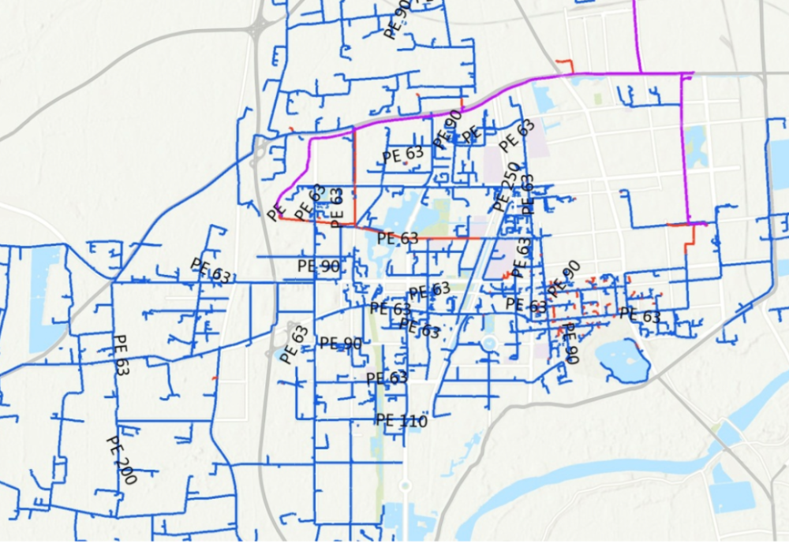

# 国家安全机关部署重要行动，两个背景值得关注

**撰文 | 董鑫**

12月11日，国家安全部在微信公众号披露了一项重要行动：

**地理信息数据安全风险专项排查治理**

地理信息数据可广泛应用于精准农业、能源电力、智能网联汽车等行业领域及日常快递网购、外卖送餐、家政服务等生活场景。

文章指出，一些别有用心的组织和人员，利用地理信息系统软件，企图窃取涉密敏感地理信息数据，对我国家安全带来了威胁和隐患。

政知道（微信ID：bqzhengzhiju）注意到，这是国家安全部首次公开发布与数据安全有关的工作部署。

两个背景值得关注。

_△境外地理信息系统软件绘制的城市管网图_

**美国情报机构攻击**

**公开报道显示，近年来，一些境外组织机构屡屡觊觎我国相关领域的重要数据。**

最近一例就在今年。

7月，武汉市应急管理局地震监测中心报警称，该中心发现部分地震速报数据前端台站采集点网络设备被植入后门程序。
**联合调查组获取的大量证据显示，此次攻击的幕后黑手，来源于美国的情报机构。**

湖北省武汉市公安局江汉分局发布的警情通报显示，遭受攻击后，该中心地震速报前端台站采集的地震烈度数据极有可能被窃取。

360公司网络安全专家在接受央视采访中指出，地震数据是目前探测地下空间最有效的手段。可以推测出某些地方的地质和水文条件，包括是否有空洞，是否适合布置相关军事设施或设备等。

**此次部署专项治理的一个重要背景就是，国家安全部发现，个别境外组织、机构和人员企图利用地理信息系统软件开展情报窃密活动。**

国家安全部在文中指出，近期国家安全机关工作发现，我国有关重要行业领域使用的境外地理信息系统软件存在搜集外传地理信息数据的情况。

手段包括：

**在软件使用过程中自动连接境外服务器，无限制收集用户数据；**

**蓄意在软件中预置“后门”，为网络攻击和数据窃取打开方便之门等。**

**还有少部分用户的数据安全意识薄弱，将城市管网、军事目标、涉密单位的高精度地理位置坐标标注在地图上。**

窃取地理信息数据有什么用？

地理信息系统软件是具备地理信息数据采集、存储、分析、管理、共享等功能的专业软件，能够将采集的各类地理信息标注在地图上，并根据需要进行分析和展示，坐标精度甚至能够达到厘米级。

国家安全部指出，通过窃取我国高精度地理信息数据，可还原出我交通、能源、军事等重要领域特定区域的三维地貌图，为侦察监视、军事行动提供关键支持，将严重威胁我军事安全。

**国家安全部：将建立保障工作协作机制**

**另一个重要背景是，数据安全是高层多次部署的工作。**

数据安全是国家安全的重要组成部分。

2017年12月，十九届中央政治局专门就实施国家大数据战略进行第二次集体学习，强调“要切实保障国家数据安全”“要加强关键信息基础设施安全保护，强化国家关键数据资源保护能力，增强数据安全预警和溯源能力。要加强政策、监管、法律的统筹协调，加快法规制度建设”。

2022年4月，中央宣传部、中央国安办组织编写了《总体国家安全观学习纲要》。该书在“新时代国家安全的主阵地主战场”一章中，增列了人工智能和数据安全。

2023年10月25日，国家数据局正式挂牌。中共中央政治局常委、国务院副总理丁薛祥在出席仪式时强调，要统筹发展和安全。

政知道（微信ID：upolitics）注意到，根据《数据安全法》，中央国家安全领导机构负责国家数据安全工作的决策和议事协调，研究制定、指导实施国家数据安全战略和有关重大方针政策，统筹协调国家数据安全的重大事项和重要工作，建立国家数据安全工作协调机制。

**国家安全部在最新发布的文章中表示，将会同有关部门建立健全数据安全保障工作协作机制，共同维护国家重要数据安全。**

**资料｜国家安全部、新华社等**

**【版权声明】本文著作权归政知新媒体独家所有，未经授权，不得转载。**

