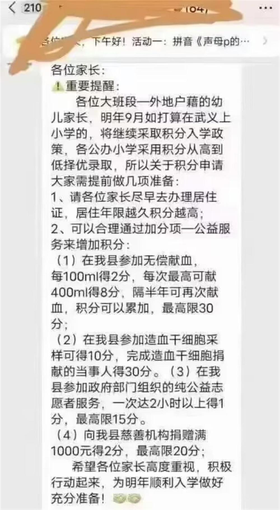
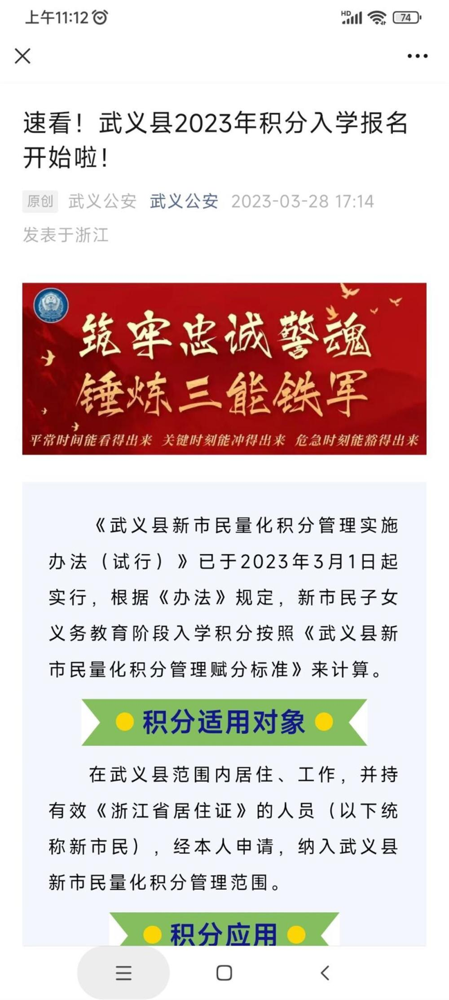

# 浙江一地新市民子女根据家长积分择优入学：家长无偿献血或捐款可加分

极目新闻记者 张万军

家长无偿献血100毫升，或向慈善机构捐款1000元可以加2分，在孩子小学入学时能起到正面作用……日前，有网友称浙江金华武义县对新市民孩子采取积分入学政策，各公办小学根据积分从高到低择优录取，家长参加无偿献血活动或捐款可以增加积分。12月11日，极目新闻记者采访获悉，该情况属实。

_网友发帖（来自网络）_

12月10日，一位网友发帖称，浙江金华武义县一所幼儿园的老师在微信群内提醒学生家长，如果孩子打算明年9月在武义上小学，当地各公办小学采用积分从高到低择优录取。关于积分申请，家长可以通过参加无偿献血、造血干细胞采样、向该县慈善机构捐款等方式增加积分。其中，家长参加无偿献血，每献血100毫升得2分，每次最高可献血400毫升得8分，隔半年可再次献血，积分可以累加，最高限30分。家长向该县慈善机构捐款满1000元可得2分，最高限20分。

该帖受到网友关注，议论纷纷。

12月11日，武义县教育局工作人员告诉极目新闻记者，最近三年，该县对于新市民孩子在当地上小学都采取积分入学政策，明年也将采取类似政策。每年的具体政策都有所不同，但大体原则不会改变，政策一般在每年3、4月份公开发布。家长为孩子申报学校后，学校将根据家长的积分，按照从高到低的顺序择优录取。对于没有被申报学校录取的孩子，教育部门将发布还有空余学位的学校信息，供这些孩子选择，这些学校再根据家长的积分高低进行录取。

_武义公安发布的政策（来自武义公安微信公众号截图）_

_武义公安发布的政策（来自武义公安微信公众号截图）_

该工作人员表示，武义县的新市民积分管理办法不是由教育部门制定的，而是由公安部门制定的，积分将用于多个方面，并不仅仅用于孩子入学。

极目新闻记者注意到，2023年3月28日，武义县公安局官方微信公众号“武义公安”发布了稿件《速看！武义县2023年积分入学报名开始了》。该稿件显示，《武义县新市民量化积分管理实施办法（试行）》已于2023年3月1日起实行，根据《办法》规定，新市民子女义务教育阶段入学积分按照《武义县新市民量化积分管理赋分标准》来计算。该积分构成中包含了公益服务积分：参加无偿献血每100毫升得2分，最高限30分；完成遗体捐献的直系亲属得30分：向该县慈善机构捐赠每满1000元得2分，最高限20分……

12月11日，武义县行政服务中心公安一窗通办窗口工作人员向极目新闻记者介绍，武义县2023年的新市民积分管理办法以武义公安公众号发布的政策为准，明年的积分管理办法将在明年3、4月份公开发布，政策是否会变化尚不确定。

（来源：极目新闻）

