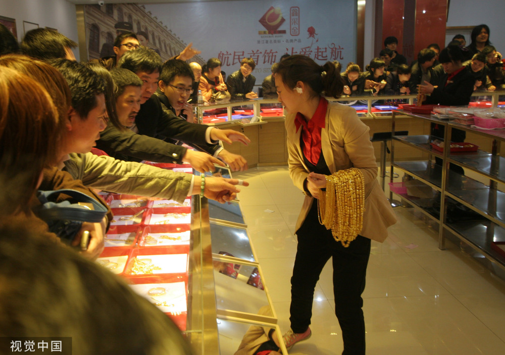

# 消费者爆买黄金，老铺、梦金园争相上市，演员海清已大赚千万

_图片来源：视觉中国_

作者 | 肖望 编辑 | 陈弗也

出品 | 棱镜·腾讯小满工作室

买黄金的投资者们喜笑颜开。

国际金价今年以来涨幅超过11%，而国内金价涨幅更是达到16%，国际金价在近日一度站上2049.5美元/盎司的历史高点。与此同时，A股沪深300指数今年以来下跌超过12%。

“后悔年初买太少了。”北京的投资者李女士今年初买了价值约20万元的金条，随着金价一路走高，她既惊喜又懊恼。

买黄金成了“稳稳的幸福”，与此对应的是今年黄金零售市场的火热。多家黄金零售上市公司的营收同比大幅增长。

在抢金潮中，梦金园和老铺黄金先后提交了赴港上市的招股书。两者虽都以纯金制品为主，但定位截然不同。

老铺黄金主打高端市场，门店均为自营，且开在高端商场如SKP、万象城、澳门威尼斯人等；而梦金园则主打三线及以下城市，以加盟门店为主。

知名演员海清（本名黄怡）曾在2013年至2020年间担任梦金园的代言人，并由此结识公司并参与公司的投资，上市前海清持股比例为1.53%。以梦金园最后一次投资价格12元/股计算，海清持股市值为4200万元，加上此前海清以1947万元转让出去的部分股份，粗略估算，该笔投资海清已大赚上千万。

老铺黄金和梦金园的招股书里，还藏着金店们的哪些秘密？

**都是黄金，老铺净利率超梦金园十倍**

老铺黄金的历史可以追溯至2009年，创始人徐高明通过原本从事旅游纪念品的“金色宝藏”公司推出专门销售古法金的门店。

2016年，老铺黄金正式注册成立，古法黄金珠宝的资产业务由金色宝藏转让给老铺黄金。随着古法黄金在零售市场的走俏，老铺黄金的业绩在短短几年间快速提升。

老铺黄金披露，2020年至2022年间，其营业收入复合增长率超过20.2%，从8.96亿元增长至12.94亿元；而今年上半年，其营收达到14.18亿元，同比增速达到116.1%。

这样的经营成绩，是在老铺黄金仅有29家自营门店的情况下实现的。老铺黄金非高端商场不进，其门店采取全自营模式，在全国前十的高端百货商场中，其已进驻了八家，与周大福、奢侈品珠宝蒂芙尼和尚美并列。其单店收入在国内所有黄金珠宝品牌中排名第一，前6个月其店均收入已达4480万元，接近2022年全年表现。

古法黄金显著提升了足金产品的附加值，其利润率远高于同业水平。老铺黄金的毛利率持续在41%以上，其中足金黄金产品毛利为37%，足金镶嵌产品毛利为45.7%，上半年净利率也达到13.9%。老铺黄金近年来利润也较为可观，2021年、2022年以及今年上半年分别实现1.14亿元、0.95亿元和1.97亿元的净利润。

老铺黄金走的是奢侈品路线，相较之下，梦金园则更加接地气，主打性价比。

其最早可以追溯到2000年在山东潍坊昌乐县成立的昌乐华业珠宝有限公司，主要从事珠宝首饰加工、批发及销售。2003年开始，公司不断拓展线下销售网络。

据调研机构弗若斯特沙利文，按黄金加工量及黄金珠宝收入计算，梦金园在中国黄金珠宝品牌中分别排名第四和第五。

截至今年6月末，梦金园覆盖2756家加盟店、35家直营店、7个直营服务中心和17个省级代理。梦金园强调，其在中国三线及以下城市拥有稳固的市场地位。

这些门店中，位于三线及以下城市的有1928家，在黄金珠宝品牌中排名第四。梦金园称，2022年其在三线及以下城市的黄金珠宝收入（不包括金条）所占份额为6.1%排名第三。

庞大的销售网络支撑起梦金园的规模，其营收从2020年的108.35亿元增至2022年末的157.24亿元，今年上半年营收实现93.16亿元，同比增长38.67%。

不过，梦金园增收不增利。财报显示，其上半年毛利率为5.7%，净利率仅有1.1%。2021年及2022年其净利润分别为2.24亿元、1.81亿元，今年上半年为1.06亿元。

也就是说，梦金园的营收是老铺黄金的6.6倍，但净利润仅有对方的一半左右。老铺黄金的净利润率是梦金园的十倍还多。

梦金园招股书还显示，其黄金首饰产品毛利率为4.9%，而K金首饰、钻石镶嵌饰品等毛利率高达25.6%。不过，黄金首饰产品贡献了其98.1%的收入，上半年达91.38亿元，而K金首饰、钻石镶嵌饰品的营收占比仅有1.4%。

作者也从业内了解到，随着黄金加工工艺的提升，原本K金硬度才可以满足制作的镶嵌类饰品，当下基本都可以用足金完成，加上消费者保值需求提升，近两年K金及钻石销售大幅下滑，而足金饰品越发受消费者欢迎。梦金园也称，其将重心策略性地转移至高纯度黄金珠宝。

**老铺黄金开店五个月能回本**

尽管电商购物已十分普遍，但对于黄金来说，线下门店才是销售的隐形王者。

老铺黄金招股书显示，其线上销售渠道的营收贡献占比持续在10%左右，其更是不断强调门店位置对品牌的重要性。

老铺黄金以高端商场北京SKP的两家门店举例，其上半年实现总收入1.54亿元，相当于每平米每月收入约42.7万元，而SKP平均每平米每月销售额为1.6万元。老铺黄金的店面可谓“寸土寸金”。

老铺黄金以严格自营模式为傲，线上和门店都统一定价。其称，这不仅保证了其较高的毛利率，并能够严格控制产品及服务质量，有利于树立及维护品牌形象。

梦金园的收入结构更是直观体现了线下渠道的重要性。今年上半年，其电商销售收入为1.72亿元，对营收贡献占比仅有1.8%，自营门店贡献也仅有2.4%，而特许经营网络贡献了95%的营收，其中加盟商占比63.5%，省级代理贡献31.6%。

2021年时，梦金园电商销售收入曾达到16.08亿元，其称，这是由于作为促销活动，当年向国内一家主流线上折扣零售商销售金条。不过这一活动趋势并未能持续。

在募资用途及未来规划方面，老铺黄金提到，其将在未来几年在内地开设35家新的自营门店，主要针对一线及新一线城市，以巩固线下销售网络，覆盖更广泛的客户群体；同期在香港、澳门和新加坡开设约12家新门店，以提升品牌海外知名度。

老铺黄金提到，开设门店的平均投入为3000万元，主要包括租金、装修、员工成本及存货等。过往的经营状况显示，平均一个月可以实现盈亏平衡，平均五个月可以收回门店的初始投资（包括租金及装修费用等，不包括存货）。

作者据招股书数据计算，梦金园单家加盟店2022年的营收平均为351万元；今年上半年单家加盟店的营收达到214.3万元。而自营门店2022年营收平均为1145万元，今年上半年为648万元。

梦金园并未披露加盟店的盈利周期等数据，仅指出，其对加盟商的历史销售纪录、财务背景及业绩、商业资源、长期经营目标等有系统评估。数据显示，2021年，加盟商开店热情较高，当年梦金园新增18家加盟商，新增137家加盟店。而今年上半年，加盟商减少了10家，新增加盟店也仅有13家。

梦金园此前曾冲刺A股上市，证监会对其反馈意见曾提出，按自营门店及加盟门店分类说明其营收和利润情况，自营门店与加盟门店店均销售额是否存在较大差异、原因及合理性等。其A股招股书曾显示，其不同门店之间差异巨大，如蓬莱利群店2020年营收超1500万元，净利润达140万元；而最小的滨州市滨城区银座黄河店销售额仅29.2万元，亏损10万元。

**金店在县城贴身肉搏**

肉眼可见的事实是，金店越开越多。

作者在北京东直门某商场内看到，周大福、老凤祥、周大生、老庙等7家黄金珠宝品牌门店一字排开。亦有网友分享，在自己湖南老家五线小县城的一条主要街道上，就聚集了9家不同品牌的加盟金店。“一家金店几百万乃至上千万的投资，这么多投资还扎堆开，不挣钱谁信？”

世界黄金协会统计显示，今年前三季度，中国国内金饰总需求已达481吨，同比增长8%。其中一季度中国金饰消费总量为198吨，同比增长11%，环比增长56%，是2015年以来金饰需求最强劲的一季度表现。

北京一黄金珠宝从业者近期走访了内蒙、山东等多地市场。他告诉作者，今年越来越多的珠宝商改行卖黄金或是增加了黄金销售品类，有珠宝城黄金一天能卖一公斤，而钻石几天都不一定能卖掉一颗。

深圳水贝某黄金加工厂人士也对作者表示，除了消费者抢购黄金外，金店还在大举向县城市场进驻。“一开店就要囤很多货，这也推高了今年黄金的需求。”如果哪天不干了，黄金保值且很好变现。上述人士还介绍，前两年黄金零售不好做，但由于黄金大幅增值，金店的“库存”反而大赚一笔。

不同于老铺黄金只进驻高端商场的“奢侈品”路线，梦金园及周大福、周大生、中国黄金等的财报显示，金店在三线及以下的市场正疯狂扩张。

其中，周大福在内地2021年间新增1339个零售店，2022年间更是新增1576个零售店，截至今年9月末已在内地铺设7699个门店。公司称，内地门店有近一半是近两年开设的，预期随着店铺逐渐成熟，将提升门店的营业额和盈利。

但周大福同时也表示，当前的资本成本较高，会更有选择性地开设新店。

中国黄金计划今年门店达到4000家，截至3季度末，其已有门店3866家，加盟店开店提速，其计划第四季度增加11家直营店、173家加盟店。周大生财报显示，截至9月末其门店达到4831家，其中一二线城市门店1532家，三四线及以下城市门店3299家。

梦金园也将目光聚焦在三线及以下城市市场，其募资部分将用于升级潍坊厂区的生产设施，提升产能，另一主要用途便是扩张及加强加盟商网络。

弗若斯特沙利文数据称，2017年至2022年间，中国一线城市、二线城市黄金珠宝的复合年增长率分别为6.7%和8.3%；而得益于三四线城市消费升级，消费者的黄金珠宝人均消费在2022年达617.5元，三线、四线及低线城市的复合增长率达到11.0%和11.5%。

梦金园称，公司战略性地将国内三线及以下城市作为市场切入点，提升在未开发市场的占有率，并受益于其显著增长和持续扩张。

老铺黄金和梦金园都提到，黄金珠宝行业属于资金高度密集行业，新进入者面临较高的资本壁垒。但同时，行业内有高达8000家黄金首饰从业者，黄金首饰制造和零售领域都竞争激烈。

可以预见，在资本的加持下，金店们的开店战争会更加激烈。

