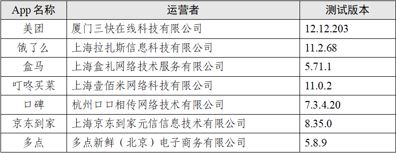
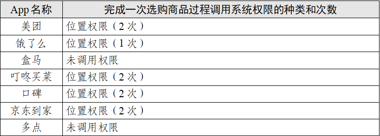
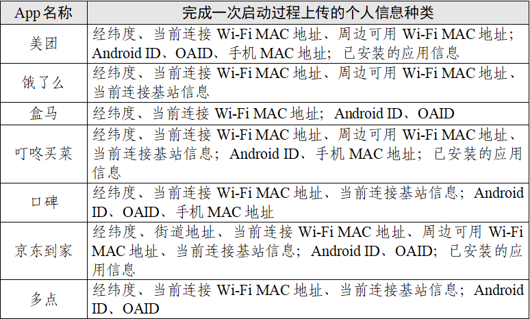
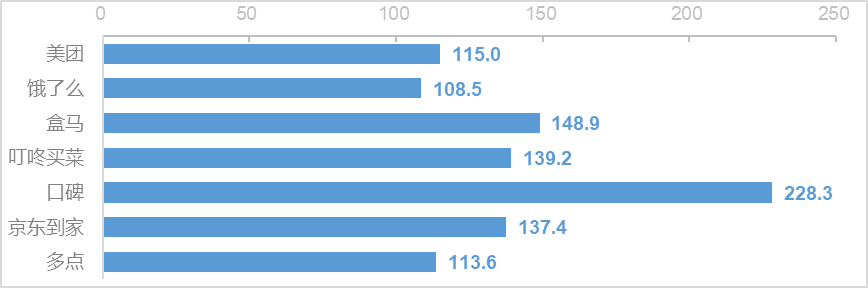

# 点个外卖会调用你手机多少信息？这七款App的测试报告来了

使用外卖类APP时是否调用了个人信息？

12月11日，据“中国网络空间安全协会”微信公号消息，近期，中国网络空间安全协会对“餐饮外卖类”公众大量使用的部分App收集个人信息情况进行了测试。

此次测试共选取19家应用商店⁽¹⁾中累计下载量达到1亿次的“餐饮外卖类”App，共计7款，如表1所示：

 _表1 7款App基本情况_

澎湃新闻记者了解到，此次测试选取相同品牌、型号的手机终端，安装相同版本安卓操作系统，分别部署7款App，在相同网络环境下进行同步操作。

测试单元为完成一次外卖商品选购活动，包括启动App、浏览首页、搜索商品、选购商品4种用户使用场景，以及后台静默应用场景⁽²⁾。测试共包括系统权限调用、个人信息上传、网络上传流量3项内容。

从系统权限调用情况来分析，测试发现，
**7款App在5种场景下调用了位置、设备信息、应用列表、剪切板、存储5类系统权限，未发现调用相机、麦克风、通讯录等其他权限。**

调查显示：（1）在启动App场景中，调用系统权限种类最多的为叮咚买菜（4类），调用系统权限次数最多的为盒马（20次）。具体情况如表2。

_表2 启动App场景调用系统权限情况_

（2）在浏览首页场景中，调用系统权限种类和次数最多的为叮咚买菜（2类，4次）。具体情况如表3。

_表3 浏览首页场景调用系统权限情况_

（3）在搜索商品场景中，除多点以外均调用1类系统权限，调用系统权限次数最多的为口碑（3次）。具体情况如表4。

 _表4 搜索商品场景调用系统权限情况_

（4）在选购商品场景中，调用系统权限种类最多的为美团、饿了么、叮咚买菜、口碑、京东到家（均为1类），调用系统权限次数最多的为美团、叮咚买菜、口碑、京东到家（均为2次）。具体情况如表5。

 _表5 选购商品场景调用系统权限情况_

（5）在后台静默场景中，调用系统权限种类最多的为饿了么、口碑、多点（均为2类），调用系统权限次数最多的为口碑（16次）。具体情况如表6。

_表6 后台静默场景调用系统权限情况_

此外测试发现，7款App上传了5种类型个人信息：①位置信息，包括经纬度、街道地址、当前连接Wi-Fi MAC地址、周边可用Wi-Fi
MAC地址、当前连接基站信息；②唯一设备识别码，包括Android
ID（安卓ID）、OAID（开放匿名设备标识符）、手机MAC地址；③应用列表信息，包括手机上已安装、新安装和新卸载的应用信息；④用户截图操作信息；⑤用户使用App产生的交互信息，包括搜索词。

从 **个人信息上传情况** 来分析，调查显示：（1）在启动App场景中，个人信息上传种类最多的为美团、叮咚买菜、京东到家（均为3类）。具体情况如表7。

 _表7 启动App场景个人信息上传情况_

（2）在浏览首页场景中，个人信息上传种类最多的为盒马和叮咚买菜（均为2类）。具体情况如表8。

_表8 浏览首页场景个人信息上传情况_

（3）在搜索商品场景中，个人信息上传种类最多的为叮咚买菜和口碑（均为 3 类）。具体情况如表9。

_表9 搜索商品场景个人信息上传情况_

（4）在选购商品场景中，个人信息上传种类最多的为叮咚买菜和口碑（均为2类）。具体情况如表10。

_表10 选购商品场景个人信息上传情况_

（5）在后台静默场景中，个人信息上传种类最多的为美团和盒马（均为2类）。具体情况如表11。

_表11 后台静默场景个人信息上传情况_

从 **网络上传流量情况**
来分析，测试显示：（1）7款App在用户完成一次外卖商品选购活动（启动App、浏览首页、搜索商品、选购商品）时，上传数据流量平均⁽³⁾最多的为口碑，约为228KB；平均最少的为饿了么，约为109KB。具体情况如图1。

_图1 完成一次外卖商品选购活动的平均上传数据流量（单位：KB）_

（2）7款App后台静默12小时，上传数据流量平均⁽⁴⁾最多的为美团，约为29KB；平均最少的为叮咚买菜，约为1KB。具体情况如图2。

_图2 后台静默12小时平均上传数据流量（单位：KB）_

**注释：**

⁽¹⁾包括华为应用市场、小米应用商店、腾讯应用宝、OPPO软件商店、VIVO应用市场、360手机助手、百度手机助手、豌豆荚手机助手、历趣应用商店、乐商店、魅族应用商店、移动MM商店、太平洋下载、中关村在线、木蚂蚁安卓应用市场、多特软件站、华军软件园、西西软件园、绿色资源网。

⁽²⁾启动App指用户点击图标启动App至首页加载完毕；浏览首页指用户在首页下滑浏览约20条信息；搜索商品指用户选中搜索框，输入搜索词，点击搜索并选择第一项搜索结果；选购商品指用户将商品添加到购物车至满足起送价格，并选择地址下单；后台静默指用户启动App后，切换到后台保持静默状态。

⁽³⁾共重复测试10次。

⁽⁴⁾共重复测试10次。

