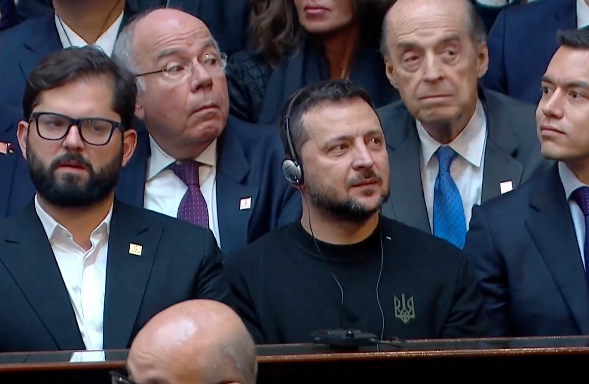

# 米莱宣誓就任阿根廷总统，泽连斯基和匈牙利总理欧尔班现身就职仪式

【环球时报报道 记者
丁雅栀】10日，阿根廷举行总统就职典礼，赢得选举的哈维尔·米莱正式宣誓就职。竞选期间，来自极右翼选举联盟“自由前进党”的米莱承诺了一系列激进改革，诸如削减政府部门以减少公共支出、取缔阿根廷央行、用美元取代阿根廷比索等。那些投票支持他的阿根廷民众等待着一个“繁荣国家”的奇迹，而面对经济深陷困境的阿根廷，新任总统米莱的前路充满了不确定性。

_12月10日，阿根廷当选总统哈维尔·米莱在首都布宜诺斯艾利斯议会大厦宣誓就职，任期4年。图为他在就职仪式上向人们挥手致意。（法新社）_

阿根廷《布宜诺斯艾利斯先驱报》10日报道称，随着米莱就任新总统，阿根廷将开启一个新的时代。米莱于当地时间上午11时57分宣誓就职，随后他将在议会大厦外的台阶上向聚集的民众发表讲话。当天下午，米莱将接待前来参加就职典礼的外国政要，内阁成员随后也将宣誓就职。

在米莱就任总统之际，阿根廷经济正处于20年来最脆弱的状态。据法新社报道，阿根廷过去12个月累计通胀率达到142.7%，贫困率达40%。同时，政府债台高筑。法新社援引美国智库威尔逊中心阿根廷项目主任本杰明·格丹的话表示：“和许多前任阿根廷总统一样，米莱上任时，警示的红灯都亮着。”为降低人们对经济迅速好转的预期，米莱此前警告称，随着他“财政重组”对经济活动产生负面影响，以及受到庇隆主义者大肆印钞的影响，阿根廷可能会出现一段“滞胀”时期。

米莱计划从周一开始，在未来几周内向国会提交一份范围广泛的改革方案。据当地媒体报道，该方案将包括削减开支和一项政府重组计划，将政府部门的数量从19个减少到个位数，并提议将一些国有企业私有化。

格丹表示：“‘米莱2.0’仍将面临艰难的攀登，但他似乎采取了更务实的议程，并寻求了更有经验的政治人物的建议。”由于在国会中占弱势地位，米莱已经软化立场，与此前一些处于对立面的政客结盟，并将他们纳入内阁。

在参与米莱就职仪式的多国政要中，乌克兰总统泽连斯基和匈牙利总理欧尔班引发关注。据路透社报道，这是泽连斯基首次访问拉丁美洲，此访将表达深陷战争近两年的乌克兰期待获得“全球南方”国家的支持。报道还称，乌克兰媒体猜测，米莱的就职仪式可能会成为泽连斯基与欧尔班举行会晤以化解围绕乌克兰申请加入欧盟事宜的分歧的契机。

_泽连斯基参与米莱就职仪式。（阿根廷TN新闻电视台视频截图）_

