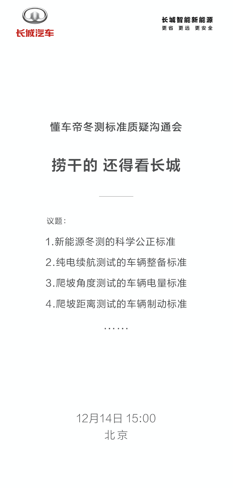
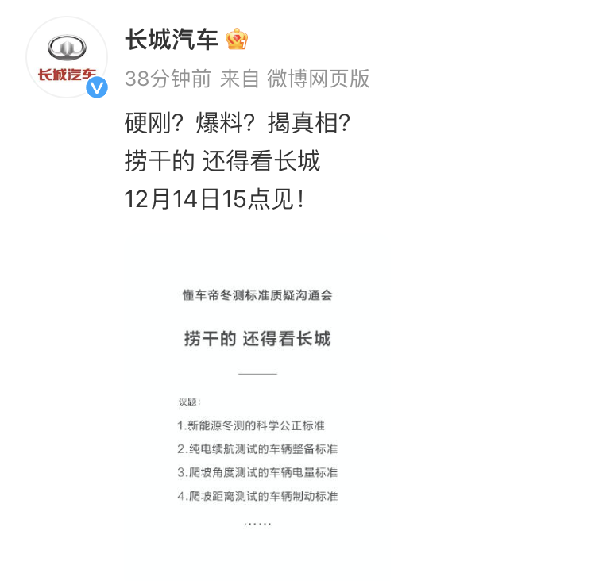
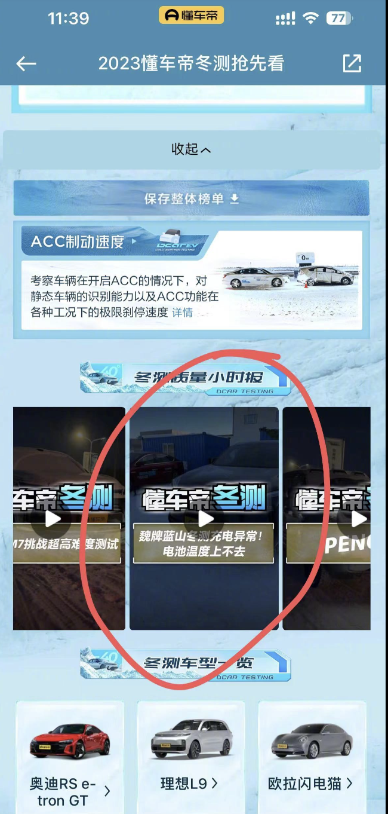
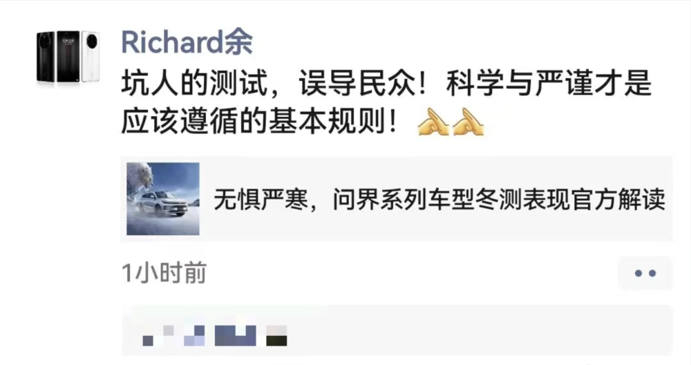
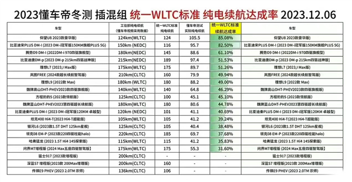

# 继华为余承东后，长城汽车硬刚懂车帝冬测，对多项测试标准存在质疑

腾讯汽车讯 12月11日消息，长城汽车官微发文，“硬刚？爆料？揭真相？ 捞干的还得看长城，12月14日15点见！”

从配图内容可以看出，长城汽车对于懂车帝的冬季测试标准和结果产生了质疑，并且提出了四个议题：1.新能源冬测的科学公正标准；2.纯电续航测试的车辆整备标准；3.爬坡角度测试的车辆电量标准；4.爬坡距离测试的车辆制动标准。

_长城汽车官微图片_

日前，懂车帝公布了冬季测试的结果，问界M7的测试结果也遭到了余承东的“回应”。测试车中，问界M7续航达成率仅31.60%，为最后一名。余承东在朋友圈发文称，坑人的测试，误导民众！科学与严谨才是应该遵循的基本规则！

_懂车帝冬季测试结果_

