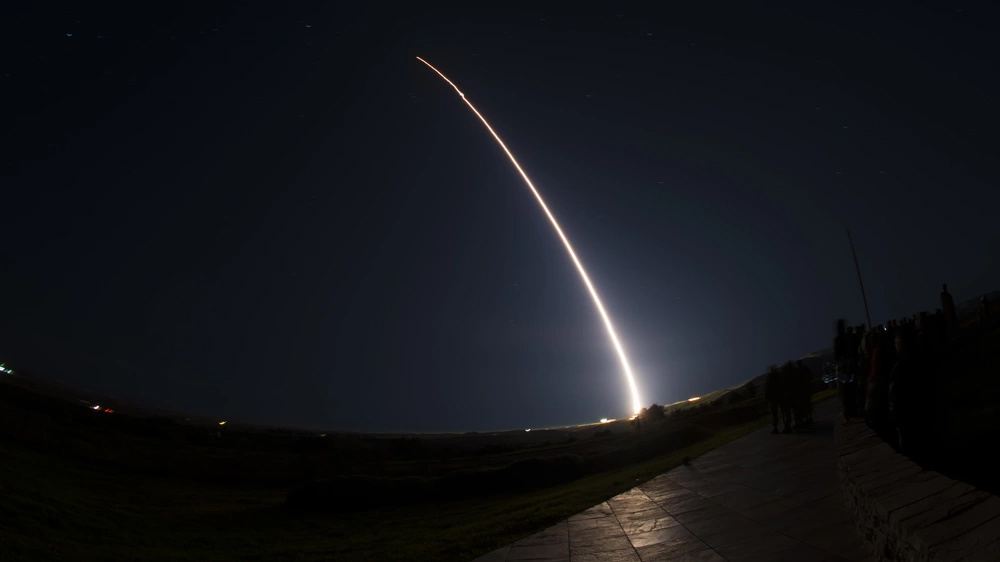

# 美国被曝正考虑与中国建立导弹发射通报机制，与中俄协定类似

【文/观察者网 熊超然】据《日经亚洲》（Nikkei
Asia）12月11日援引一名美国国务院高级官员的消息报道称，美国正考虑提出同中国相互通报发射导弹的提议内容。这名美方高级官员称，华盛顿方面希望明年年初与中国就军备控制问题举行会谈，而导弹发射通报机制是美国政府正考虑的具体措施之一。

报道提及，今年11月15日，中美元首会晤在美国旧金山斐洛里庄园举行，而在此之前，[中美还“罕见”举行军控与防扩散磋商](https://news.qq.com/rain/a/20231108A03RTH00)。白宫方面称，中美元首会晤时决定解决包括军控和防扩散在内的关键问题，并指示两国高级官员跟进这些事项并采取后续行动。

“发射通报机制之所以如此重要，是因为我们有义务阐明我们正在做的事情。”这名向《日经亚洲》透露消息的美国国务院高级官员说：“中国与俄罗斯达成的一项协议表明，他们认识到稳定关系的重要性。这就是我们正在努力建立的基础。”

中俄于2009年10月13日签署了《中华人民共和国政府与俄罗斯联邦政府关于相互通报发射弹道导弹和航天运载火箭的协定》，该《协定》于2020年12月16日到期，此后中俄又将该《协定》有效期延长10年。

这名官员认为，美国和中国应该采取初步措施以建立信任，比如通报导弹发射，以帮助建立彼此互信。

_资料图：美国发射中程陆基导弹 图自兰德公司网站_

尽管这名官员拒绝就美国提议的细节发表评论，但他认为，美国和俄罗斯（苏联时期签署生效）之间类似的双边协议《弹道导弹发射通知协议》（Ballistic
Missile Launch Notification Agreement），可以成为美中两国这一机制框架的范例。

报道称，在1988年冷战时期，美国和苏联签署的这一协议规定，两国发射洲际弹道导弹和潜射弹道导弹等战略导弹的计划，必须让对方知道，这是为了表明“即将到来的导弹发射不是突然袭击式的核打击”。

虽然美俄之间的关系因俄乌冲突而严重恶化，但俄罗斯仍继续提前通知美国此类导弹试验，这表明俄方也认识到了避免误判和意外反应的重要性。

卡内基国际和平研究院核政策项目联合主任詹姆斯·阿克顿（James Acton）表示，美国应当就导弹通知问题提出具体而详细的建议，并衡量中国的立场。

阿克顿说：“虽然很难乐观，但我相信发射通知协议将符合中国和美国的利益。”他进一步指出：“重要的一步是，每个国家都要确定其认为特别具有威胁性并可能引发紧张局势升级的行为，而诸如发射通知制度或管理卫星操作的协议也会有所帮助。”

_2019年2月5日，美国加利福尼亚州范登堡空军基地，美国空军试射一枚未携带弹头的“民兵3”洲际弹道导弹。图自美国空军_

《日经亚洲》称，据美国官员透露，在未来举行的军控谈判中，军事领域使用人工智能的规范将是另一个关键议题。今年，拜登政府出台了负责任的军事人工智能应用综合原则。美方认为，应该由人类参与操作和作出使用核武器的决定。

据外交部网站消息，2023年11月6日，中国外交部军控司司长孙晓波与美国国务院主管军控事务的助理国务卿斯图尔特在华盛顿举行了军控与防扩散磋商。

双方围绕《不扩散核武器条约》、五核国合作、核安全、防扩散与出口控制、生化履约、外控安全和常规军控等广泛议题深入、坦诚、建设性交换了意见。双方强调应保持沟通交流，以增进互信、积累共识、管控分歧、探讨合作。

中方阐述了在军控与防扩散问题上的立场和政策，强调中美应在相互尊重的基础上开展对话合作。中方强调，双方应秉持共同、综合、合作、可持续的安全观，切实尊重彼此主权、安全与发展利益，增进战略互信，致力于维护国际军控与防扩散体系，实现世界持久和平与普遍安全。

**本文系观察者网独家稿件，未经授权，不得转载。**

