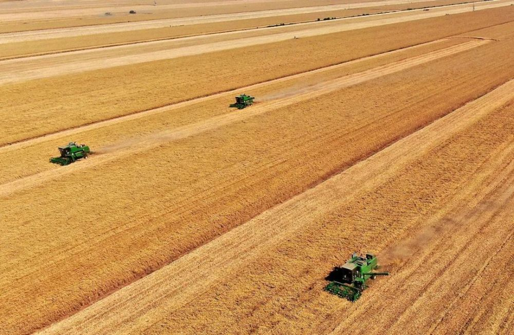

# 自然灾害多发、耕地面积减少，为何还能实现粮食丰收？农民日报回应

粮食问题总是牵动人心。 **国家统计局公布的数据显示，全年粮食再获丰收，产量再创新高，达到13908.2亿斤。**
在日益严峻的全球粮食安全形势下，给大家吃下了一颗“定心丸”。但与此同时，社会上、网络中也有一些追问，比如，今年自然灾害多发，近年来耕地面积又有所减少，为何还能实现丰收乃至增产？既然粮食连年丰收，进口为何还在不断增长？

**先来回答第一个问题：今年自然灾害多发，为何还能实现丰收？**
的确，从全年来看，今年先后遭遇黄淮罕见“烂场雨”、华北东北局地严重洪涝、西北局部干旱等灾害，给粮食生产带来了不小的挑战，但气象灾害给农业生产带来的影响大小，还要看防灾减灾措施是否到位。我国在农业防灾减灾方面积累了很多经验，有一套从中央到地方、从种子到田头完整的应对机制，有各级党委政府真金白银的支持，稳产增产、“一喷三防”、“一喷多促”等关键技术措施落实到位，最大限度降低了气象灾害对农业生产的影响。

再从空间上看，我国地域辽阔、气候多样，农业资源禀赋各异。放眼全国，每年都会有受灾减产的地方，也会有无灾增产的地方。
**今年我国一些地方确实出现因灾减产的情况，但总的来说是点上重、面上轻，以秋补夏、以丰补歉，因此今年粮食总体上依然是丰收的。**
比如，受暴雨洪涝灾害影响，今年黑龙江五常一些地块减产甚至绝收，但从黑龙江全省来看，农作物受灾面积反而是少于常年的，粮食生产实现了“二十连丰”。范围扩大到全国全年粮食生产，道理也是一样。

**再来回答第二个问题：耕地面积减少，为何还能增产？**
有地才有粮，第三次全国国土调查结果显示，2019年底，我国耕地面积较十年前减少了1.13亿亩，一些人因此对粮食产量产生了担忧。我们讨论产量，一要看面积，二要看单产。先看面积。
**秋粮是全年粮食生产大头，在粮食安全党政同责、多项粮食生产专项补贴等一系列实招硬招下，今年秋粮面积实现了连续第4年增加。**
而从长远来看，近两年耕地总量减少的问题已经得到初步遏制，这也为粮食丰产丰收提供了有力支撑。

接着看单产。我国人多地少，在面积有限的前提下挖掘单产潜力空间，是提升粮食产量、保障粮食安全的必然选择。
**近年来，我国通过藏粮于地、藏粮于技，持续提升单位面积的粮食产出，今年全国粮食单产389.7公斤/亩，每亩产量比上年增加了2.9公斤。**
今年初，农业农村部还启动了粮油等主要作物大面积单产提升行动，据专家调查，在行动覆盖的300个重点县，对粮食增产的贡献率达到73%。在面积增加空间越来越小的情况下，单产的提升为粮食丰收增产提供了新的动力。

**最后来看第三个问题：为何我国粮食连年丰收，进口还在不断增长？**
海关总署此前公布了一组数据，2023年1-10月，我国累计进口粮食量12993万吨，同比增长7.3%，一时间引发热议。
**从根源上说，粮食产量和进口量“双增”，还是因为我们的消费量增长了。**
一方面，过去长期以来，我国人口总数持续增长，吃饭的嘴越来越多，消耗量越来越大。另一方面，伴随着城镇化的进程，人们生活水平的提高带来消费结构的变化，也极大地推动了粮食消费量的增加。过去十年间，我国人均肉类的消费就增长了35%，这必然带来饲料用粮的增长。俗话说，一斤肉五斤粮，老百姓每一份蛋白质、热量的获取，从“吃得饱”到“吃得好”的每一次进阶，既是质的提升，也离不开量的保障。

从进口结构上看，我国粮食进口以饲料用粮为主。今年1-10月，大豆、玉米、大麦、高粱等传统意义上的饲料用粮进口量占粮食进口总量的87.6%，进口小麦占比虽然达到了8.3%，但相当一部分是作为玉米的替代，同样用于饲料加工。从渠道来看，也从以往高度集中于个别国家向多元化发展。与饲用相比，用于口粮的进口粮食占比并不大，且主要用于品种调剂。当前，我国口粮的自给率在100%以上，谷物自给率在95%以上，人均粮食占有量超过485公斤，高于国际公认的400公斤粮食安全线。
**饲料粮的供给问题当然不能忽视，但是只要“谷物基本自给、口粮绝对安全”的战略底线守住了，中国人“吃饭”就出不了大问题，我们发展的主动权就能牢牢掌握在自己手中。**

不过，粮食进口量的增加也提醒我们，虽然我国已经告别了粮食短缺，但粮食供需仍然处在紧平衡的状态，节粮减损、保护资源是我国一项长期重要任务。
**我们仍要始终紧绷粮食安全这根弦，无论何时都不能觉得高枕无忧，要在收获、储存、加工、运输、销售、消费等粮食全产业链各环节加强节约减损。**
具体到每个人，就是要珍惜每一餐饭，节约每一粒粮。

其实，粮食与我们每个人的日常生活息息相关，需求弹性很低，倘若真的出现供给短缺，往往很快就能感受到。而从我们身边看，既没出现粮价大幅上涨，也没听说粮食短缺的情况，可见粮食总体依然量足价稳。当然，在当前国内外环境日趋复杂、不稳定性和不确定性因素增加的背景下，我们既要打起十二万分精神，始终办好自己的事情，夯实粮食不断丰收的基石，做到谷物和口粮“该保必保”；另一方面，也要充分利用两个市场两种资源，实现更高层次的粮食供需动态平衡，牢牢端稳中国饭碗。

**作者：骆玉兰 赵宇恒**

监制：高雅 编辑：刘婉茹

