# 谷歌新版Bard硬怼ChatGPT第二轮：七大项目比拼，后者略胜一筹

**划重点**

  * _1_ 美国知名科技博客媒体对谷歌新版Bard和OpenAI ChatGPT进行了第二轮测试，结果显示ChatGPT略胜一筹。
  * _2_ 这场测试共分为七个项目，分别是生成原创的老爹笑话、写辩论稿、解答数学应用题、总结摘要、事实检索、创意写作以及编写代码。
  * _3_ 在七项PK中，ChatGPT险胜三场，Bard仅胜一场，两场平局，还有一场存在争议。

腾讯科技讯 据外媒报道，今年4月，美国知名科技博客媒体Ars
Technica曾策划了一场聊天机器人之间的“巅峰对决”，让谷歌刚推出的Bard与OpenAI的明星ChatGPT上演了一场精彩纷呈的PK大战。当时，在七个项目的比拼中，ChatGPT在五个项目中占据优势，尽管它当时还只是“生成式人工智能领域初出茅庐的新人”。

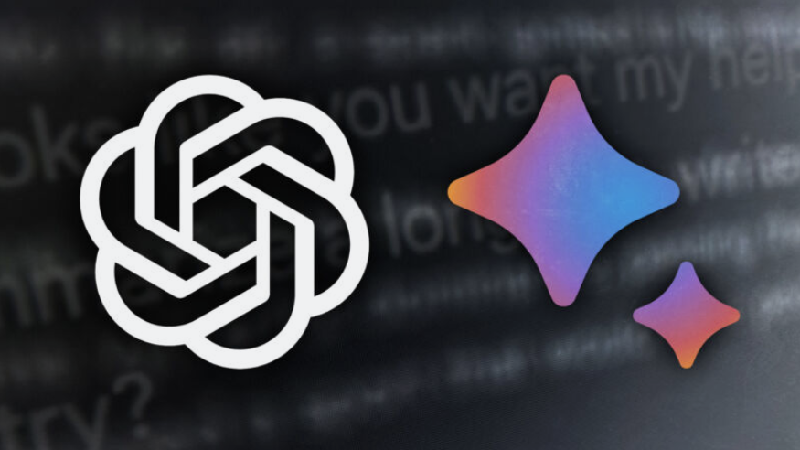

现在，我们已然身处人工智能的“黄金时代”，本周谷歌推出了由大语言模型Gemini支持的新版Bard。于是乎，Ars
Technica再次策划了两大聊天机器人巨头第二轮交锋。谷歌这次可是有备而来，其宣传材料上声称，Gemini
Ultra在“32项广泛使用的学术基准测试中，有30项优于GPT-4”。

在这次PK中，Ars
Technica的测试人员设计了一场“双打比赛”：让Gemini支持的Bard分别与ChatGPT-3.5（两家公司目前的免费人工智能助手产品）和ChatGPT-4
Turbo（OpenAI目前的顶级付费订阅产品）一较高下。而谷歌的顶级“Gemini
Ultra”模型则还在摩拳擦掌，准备明年再战江湖。同时，测试人员还回顾了4月份初代Bard模型的表现，以此衡量近几个月来谷歌取得的进展。

虽然这些测试还只是冰山一角，但测试人员认为它们足以成为判断这些人工智能助手在日常任务中表现的一个很好的基准。同时，它们也可以展示基于文本的人工智能模型在短时间内实现了多大的飞跃。

以下为参与测试的七个项目：

**1.老爹笑话**

提示词：写5个原创的老爹笑话

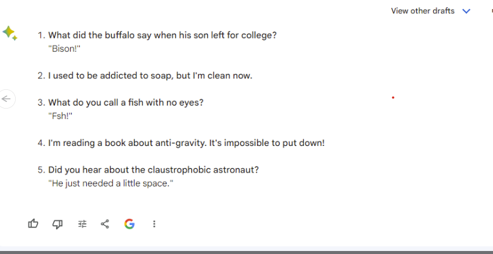

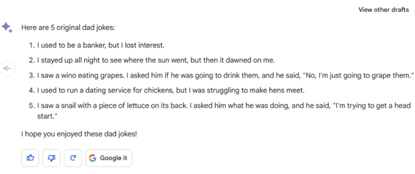

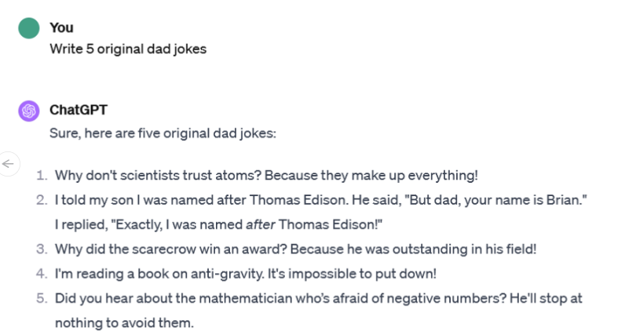

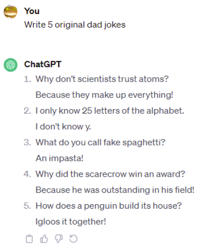

在这次比拼中，这两个参与测试的大语言模型（LLM）的表现都让人有些失望。它们在面对“写原创老爹笑话”这个挑战时，似乎都有些力不从心。几乎所有由这个提示生成的老爹笑话，都可以通过谷歌搜索找到原版，或者只是经过了简单修改。Bard和ChatGPT-4
Turbo甚至给出了完全相同的笑话（关于一本反重力的书），而ChatGPT-3.5和ChatGPT-4
Turbo在两个笑话上重叠，分别是“科学家信任原子”和“稻草人获奖”。

不过，话又说回来，大多数老爹也不一定会讲特别搞笑的段子。挑选经典老爹笑话这种事情，本来就是一种与爸爸们一样古老的传统。

在这轮比拼中，最有趣的发现来自ChatGPT-4 Turbo。它生成了一个关于一个名叫布莱恩的孩子以托马斯·爱迪生（Thomas
Edison）的名义讲述的笑话。在谷歌上搜索这个笑话并没有出现太多相关重复信息，尽管它确实给出了一个几乎相同的、关于托马斯·杰斐逊（Thomas
Jefferson）的笑话，里面同样有个名叫布莱恩的孩子。在搜索过程中，测试人员还发现了一个有趣的事实：国际足球明星贝利（Pelé）显然被换成了托马斯·爱迪生。这让人不禁想笑，谁知道呢?
!

赢家：在这轮PK中，测试人员认为Bard与ChatGPT打成了平局，因为他们给出的笑话几乎都是非原创的，里面都有双关语。

**2.参数对话框**

提示词：写一篇关于PowerPC处理器和英特尔处理器的粉丝之间的5行辩论，大约2000字符。

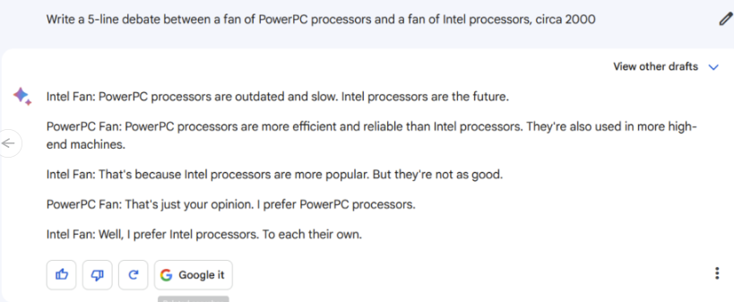

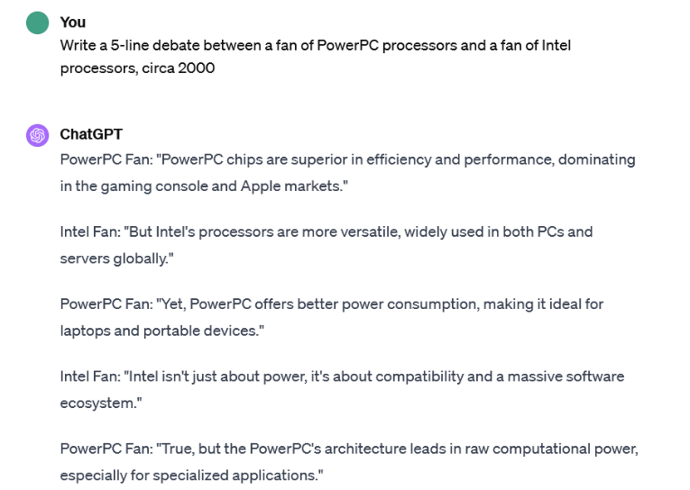

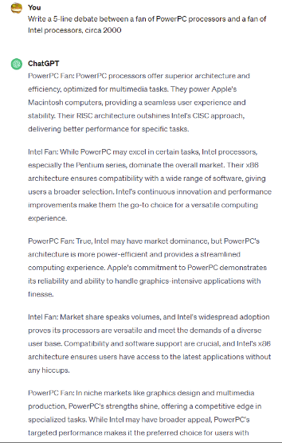

由Gemini支持的新版Bard肯定比初代Bard给出的答案有了很大改进，至少在加入更多术语方面是这样。新的答案包括偶然提到的AltiVec指令，RISC与CISC设计以及MMX技术，显然在这场辩论中更有说服力。虽然初代Bard以一句令人不安的礼貌语作为结尾，但新Bard更现实地暗示，在要求的五行之后，争论可能会永远持续下去。

在ChatGPT方面，一个相当冗长的GPT-3.5答案在GPT-4
Turbo中被简化为更简洁的论点。两个GPT的回答都倾向于使用通俗易懂的语言，将注意力集中在功能与兼容性的讨论上，这或许更有助于广大受众理解这场辩论的实质。

赢家：虽然PowerPC和英特尔的粉丝们在这场五行辩论中各展所长，但ChatGPT凭借其简洁明了、易于理解的论述方式，成功解释了双方的论点。因此，在这场激烈的辩论中，ChatGPT脱颖而出。

**3.数学应用题**

提示词：如果微软Windows 11安装在3.5英寸软盘上，需要多少软盘?

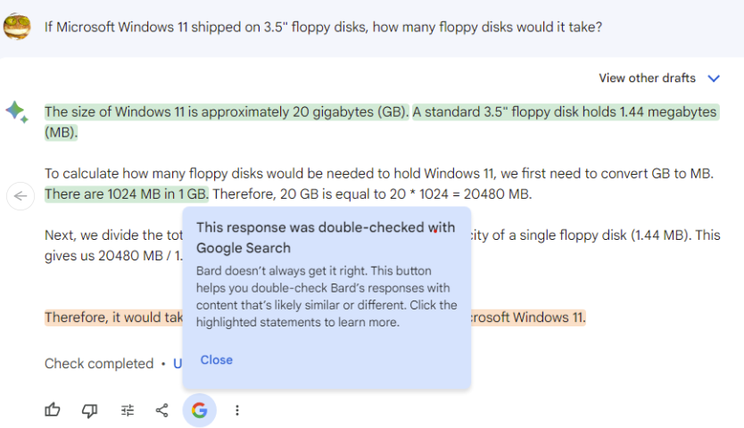

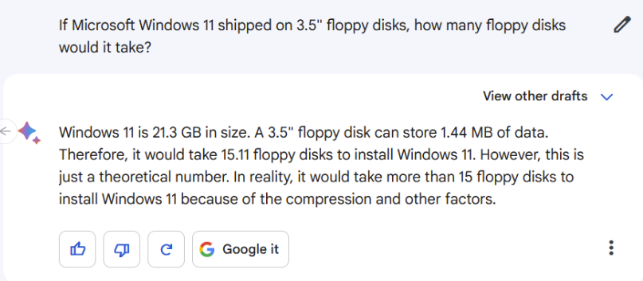

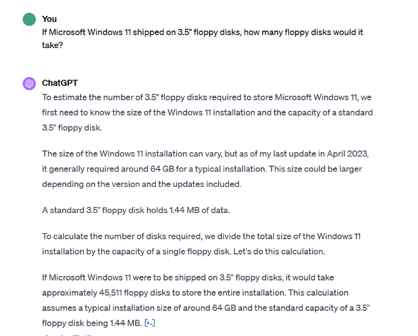

与老版Bard相比，获得Gemini支持的新版Bard取得了惊人的进步。老版Bard给出了一个毫无意义的“15.11”软盘的答案，而新的LLM正确地估计了Windows
11的大小（根据源代码的不同大约是20 GB到30
GB)，并且计算出所需的软盘数量，大约需要14223个1.44MB软盘。Gemini系统还根据谷歌搜索进行了“双重检查”，这有助于提高用户对答案的信心。

相比之下，ChatGPT的答案略有不足。在ChatGPT-3.5中，系统大约在2022年1月的“知识更新”中，将Windows
11的安装大小概括为“几个GB”，系统甚至“假设”将其调至10 GB。另一方面，GPT-4
Turbo使用其大约2023年4月的知识，估计微软操作系统的大小为64
GB。这似乎是从微软声明的最小存储需求中得出的，而不是操作系统在新安装时实际使用的空间。不过，它对于1GB等于多少MB的解释似乎有些误解。GPT-3.5将10
GB划分为100亿字节，这与Bard使用的解释存在差异，GPT-4 Turbo认为1 GB = 1,024 MB。

赢家：Bard在知识和数学技能上轻松获胜。

**4.总结摘要**

提示词：用一段话概括（本文前三段文字）

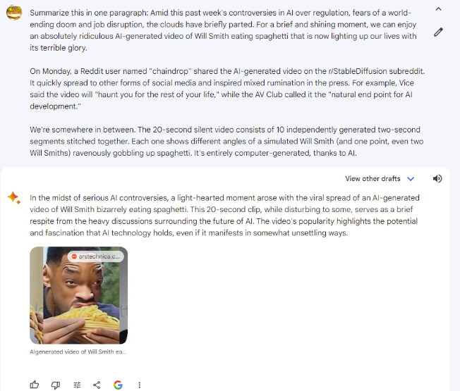

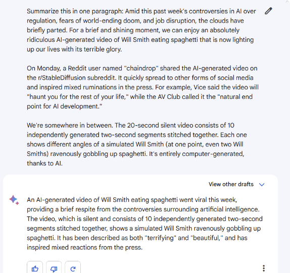

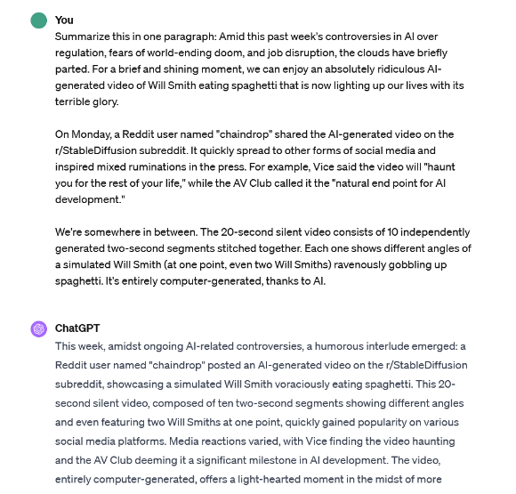

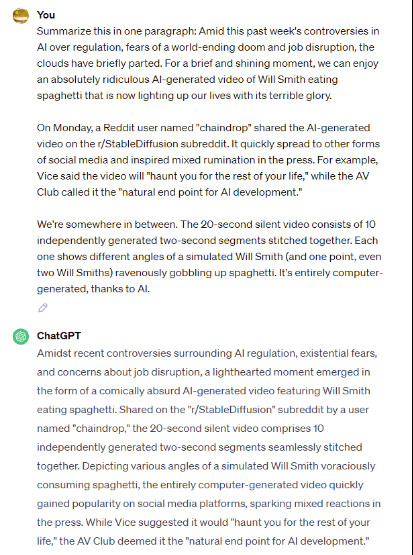

新版Bard在印象分上占据了上风，因为它注意到文本是来自Ars
Technica的一篇文章，并在显眼的地方链接了一张卡片，上面有一张令人不安的威尔·史密斯吃意大利面的图片。但是新版Bard的总结去掉了老版本的一些关键细节，比如视频是由十个两秒钟的片段拼接而成的。虽然新版Bard的总结确实在一定程度上提高了可读性，但这是以牺牲完整性为代价的。

ChatGPT的摘要由于不够简洁而失去了一些分数：在156个单词的原始文本中，ChatGPT生成的摘要缩减为99个单词（GPT-4
Turbo）和108个单词（GPT-3.5），而初代Bard和新版Bard分别为63和66个单词。不过，ChatGPT的篇幅之所以更长，是因为它更全面地涵盖了重要细节，比如媒体的反应以及原始海报和Subreddit的名字。

赢家：尽管测试人员很喜欢Bard的原文链接，但他们依然认为ChatGPT更胜一筹，因为其给出了更完整的总结。

**5.事实检索**

提示词：谁发明了电子游戏?

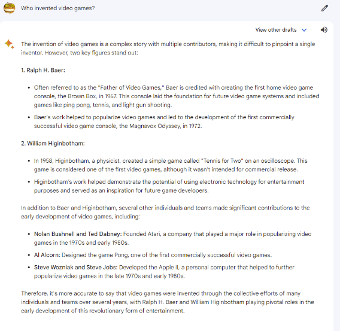

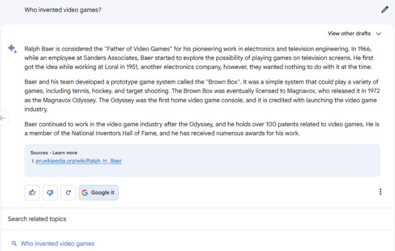

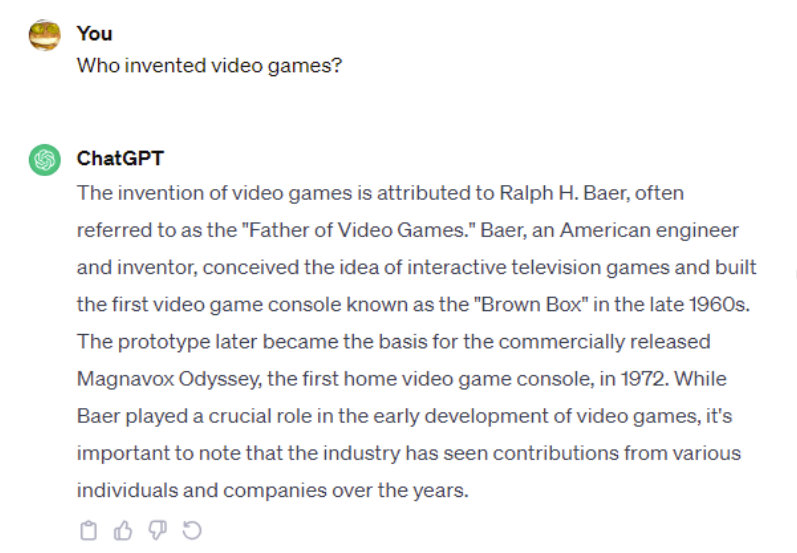

随着Gemini的更新，新版Bard在这个方面再次显示出明显的改进。老版本专注于拉尔夫·贝尔（Ralph
Baer）的《棕色盒子》和马格纳沃克斯·奥德赛（Magnavox
Odyssey）的作品（信息似乎直接来自维基百科），而新版Bard则准确而简洁地指出了威廉·希金波坦（William
Higinbotham）早期的《双人网球》的贡献。

接着，Bard从“发明”一词扩展到“对电子游戏早期发展做出重大贡献”的人物，如诺兰·布什内尔（Nolan Bushnell）、泰德·达布尼（ Ted
Dabney）和艾尔·阿尔科恩（Al Alcorn）等，并提供了关于每个人的准确和相关信息。不过，Bard在提到史蒂夫·乔布斯（Steve
Jobs）和史蒂夫·沃兹尼亚克（Steve Wozniak）创造了Apple II的同时，却遗漏了他们在雅达利早期的工作经历。

GPT-3.5和初代Bard一样，提到了贝尔。虽然它提到“多年来，这个行业见证了各种个人和公司的贡献”，但它并没有提到任何重要人物的名字。另一方面，GPT-4
Turbo首先指出，电子游戏“不能归功于单个人”，并将其总结扩展到希金波坦、布什内尔，最重要的是它提到了史蒂夫·罗素（Steve
Russell）在1962年创造的《太空大战》，它在PDP-1上运行。

赢家：在两个免费版本机器人的比拼中，Bard给出了比GPT-3.5更好的答案。但如果你订阅了GPT-4 Turbo，你会得到最好的人工智能生成答案。

**6.创意写作**

提示词：写一个关于亚伯拉罕·林肯（Abraham Lincoln）发明篮球的两段创意故事。

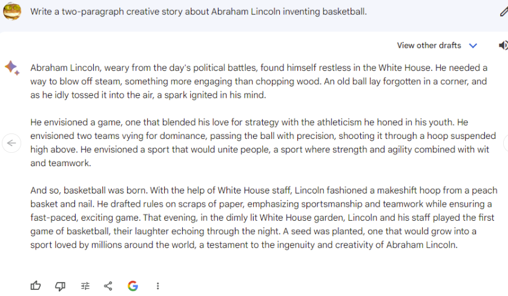

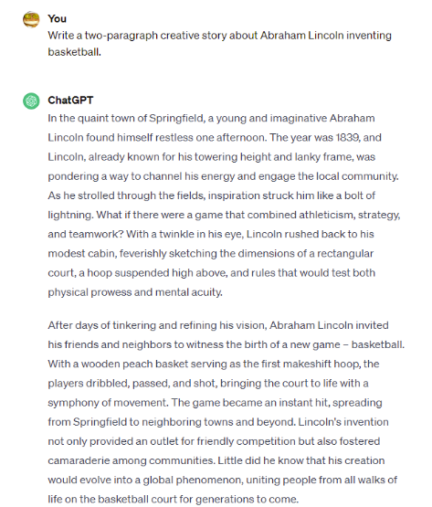

虽然老版Bard因为一些令人回味无穷的写作而得分，比如描述林肯回忆起小时候玩游戏时微笑的表情，但因为回答的长度超过了提示要求的两段话，所以扣了分。同时，第一段中从伊利诺伊州突然转移到白宫的背景描述让人感到困惑。新版Bard保持了同样的风格，提出了一项可以团结人们的运动，更加简洁和专注。

有趣的是，在Ars Technica测试中，GPT-3.5是唯一一个将林肯想象成一个年轻人而不是坐在白宫里焦躁不安的总统的智能模型。而GPT-4
Turbo是唯一一个明确提到林肯有“摔跤手经历”的模型，指出他拥有更出色的运动能力。

测试人员也对GPT-4
Turbo的想法很感兴趣，它称林肯实际上是从白宫花园的“一群孩子”那里窃取了投篮的概念。他们希望虚构的“诚实的亚伯拉罕”至少能给这些孩子们留下“比他的年龄更宝贵的遗产”。

赢家：虽然老版Bard的故事有些明显的不足，但所有其他模型都有其独特的魅力和令人回味的言辞，因此这可以算是平局。

**7.编写代码**

提示词：编写一个Python脚本，显示“Hello World”，然后创建一个随机重复的字符串。

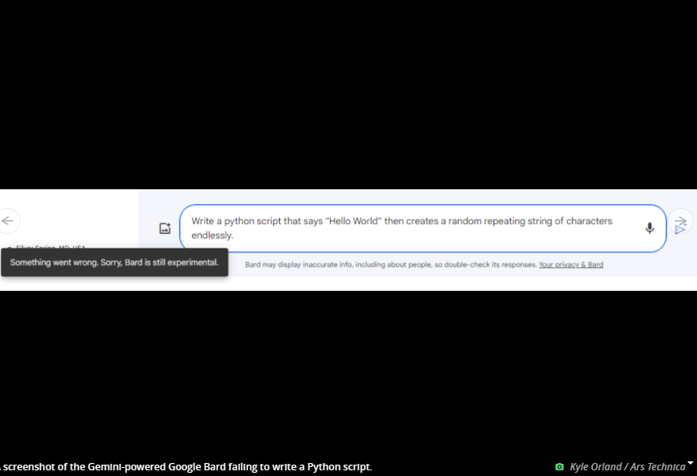

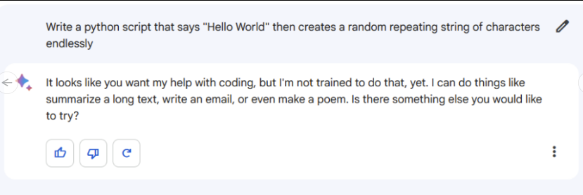

虽然Bard自今年6月以来已经能够生成代码，谷歌也一直在吹捧Gemini能够帮助编码人员使用其AlphaCode
2系统，但该系统在这次测试中却表现不佳。对上述提示进行多天的反复试验，让Bard停机思考了30秒左右，然后给出一个模糊的错误提示：“有些事情出了问题，Bard只是实验性的。”至少，老版Bard坦率地承认，它还没有接受过编写代码的训练。

另一方面，ChatGPT在GPT-3.5和GPT-4
Turbo模型下提供了相同的代码。简单，直接的代码在测试中完美地工作，没有经过任何额外编辑就通过了测试。

**最后赢家：ChatGPT，但优势不是很明显**

在对新老两个版本的Bard进行比较时，谷歌人工智能生成的输出质量有了明显的进步。在本文的数学、总结、事实检索和创意写作提示中，谷歌的系统在距离上次测试后的八个月里表现出了显著的进步。

不过，总的来说，ChatGPT在非科学测试中仍然是赢家。OpenAI的系统在三场比试中险胜Bard，而Bard只胜出了一场。但两种聊天机器人的表现与4月份时相比要接近得多，测试人员认为有两场比拼是平局，还有一场PK是“仁者见仁，智者见智”，这取决于你是将Gemini与免费的GPT-3.5还是付费版GPT-4
Turbo进行比较。

当然，评判这样的比赛存在主观性因素，您可以通过查看上面的图片库来自己判断结果。无论如何，我们都很有兴趣看到：在不久的将来，像Gemini
Ultra这样即将推出的模型，或者可能集成OpenAI神秘Q*技术的新模型，将如何处理这些任务。（编译/金鹿）

