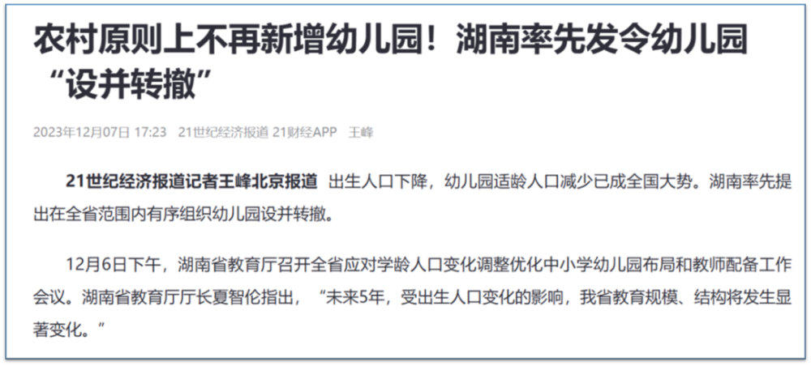
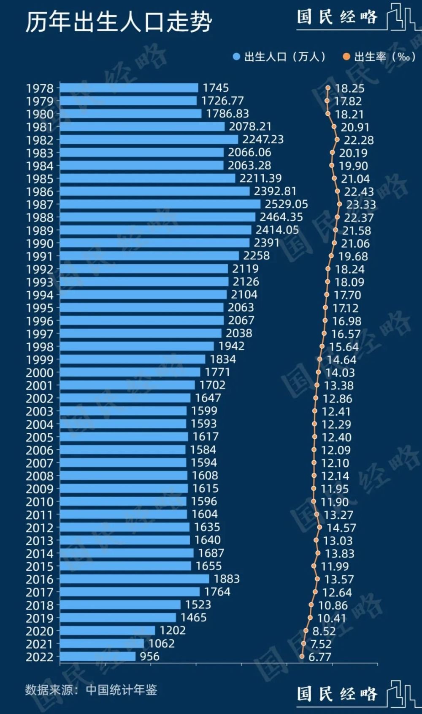
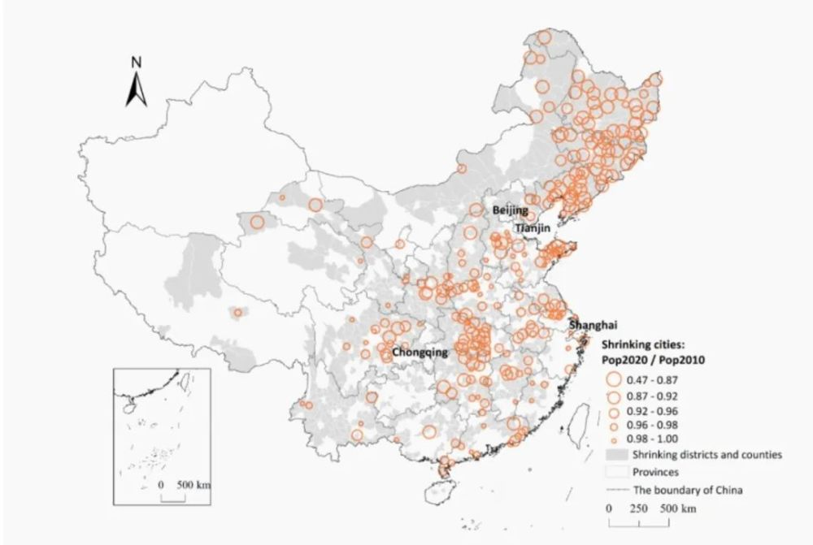
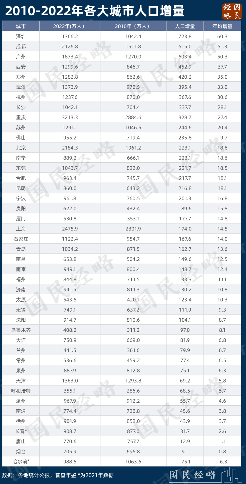

# 这些地方，开始撤并幼儿园了

**文|凯风**

人口影响，开始浮现了。

**01**

撤并幼儿园，真的来了。

日前，湖南省有关部门召开会议指出，受出生人口变化的影响，教育规模、结构将发生显著变化……要把握调整优化重点任务， **有序组织幼儿园撤并转设。**

一周多前，湖南省教育厅就已发布通知，有序组织幼儿园设并转撤，在城镇新增人口集中地区新建、改扩建一批公办幼儿园， **农村地区原则上不再新增幼儿园。**

作为人口大省和教育大省，湖南成为 **全国首个在省级层面提出调整幼儿园布局的省份** ，无疑有着十足的信号意义。

事实上，撤并幼儿园，并非第一次出现，从县城到省会再到经济强市，不一而足。

今年8月， **安徽省临泉县** 教育局曾发布公告，当地 **50所民办幼儿园终止办学。**

其中，12所幼儿园申请终止办学，38所幼儿园无实际招生、办学行为，占2022年全县幼儿园总数的11.8%，占全县民办幼儿园总数的24.5%。

临泉，虽然只是一个普通县城，却有着中国户籍人口第一大县的称号，总人口一度超过230万人，相当于许多西部地级市的规模。

**一个人口大县，一次性关闭了1/10左右的幼儿园** ，影响可想而知，遑论只有数十万人的小县？

在一些大城市，也出现了关停幼儿园的现象，如海口市33所民办幼儿园停办，青岛即墨区因地制宜撤并小规模村办园61所等。

事实上，幼儿园减少并非孤立现象，而是全国性现象。

根据教育部最新发布的统计公报，2022年，全国共有幼儿园28.92万所， **比上年减少5610所，** 下降1.90%，这也是2008年以来首次负增长。

这些被撤并或消失的幼儿园，多数都是村办、民办幼儿园，部分因为不符合办学资质而被清退，部分因公办园建成而被调整，更多的则是因为生源不足而难以为继。

**02**

幼儿园，为什么开始减少了？

**其一，幼儿园的撤并，核心原因在于出生人口变化** ，而毛入学率已达高位，幼儿园供求关系开始逆转。

每一年的出生人口，直接影响到3年后的幼儿园生源，同时影响到6年后的小学生源。

从全国层面来看，2016年到2022年，全国出生人口从1883万人下降到956万人，对幼儿园及小学生源的影响可想而知。

与此同时，全国学前三年毛入园率由2012年的64.5%提高到2022年的89.7%，学前教育基本处于普及阶段，提升空间相对有限。

**其二，人口并非问题的全部，民办园与公办园的此消彼长，也是难以忽视的因素。**

可以看到，安徽省临泉县数十所民办园被撤并的同时，该县仅2022年一年，就新建、改扩建幼儿园9所， **有效扩增公办幼儿园学位2070个。**

学前教育虽然没有纳入义务教育，但在政策层面获得越来越大的重视，来自财政投入的支持力度越来越大。

根据规划，到2025年，全国学前三年毛入园率达到90%以上，普惠性幼儿园覆盖率达到85%以上，公办园在园幼儿占比达到50%以上。

公办园一年的费用只有几千元，而民办园动辄上万元乃至数万元。如果不能提供差异化的教育培养模式，很难在激烈的竞争中存活下来。

**其三，城乡之间、大城市与中小城市之间的人口流动，又加剧了幼儿园的分化态势。**

可以注意到一个细节，无论是湖南省还是安徽临泉县，撤并的多数的都是村办园和民办园，而城镇人口聚集地区，仍要新建、改扩建一批公办幼儿园。

整体而言，随着城镇化不断提升，加上大城市逐步取消落户限制，大量农村人口尤其是年轻人持续涌入城市，导致农村的幼儿园乃至小学出现过剩现象。

然而，不是所有城市都能保持扩张态势。

人随产业走， **超大特大城市人口仍在膨胀** ，而中小城市却普遍面临人口流失的尴尬。

根据龙瀛团队的最新研究，2010年-2020年， 全国共有1507个收缩的区县，占比超过一半，集中于东北和中西部地区。

_龙瀛团队：2010-2020年人口收缩的县区市，新疆数据暂缺_

这些地方，也正是这一轮幼儿园和小学布局调整的首当其冲之地。

**03**

有的地方开始撤并幼儿园， **有的地方仍在拼命建学校。**

就全国而言，幼儿园总量呈现过剩态势，但在一些超大特大城市，幼儿园学位尤其是公办学位仍旧供不应求。

深圳就是典型。作为全国经济第三大市，深圳却有着 **“一线的经济产业，三四线的教育”** 的戏称，无论是大学，还是中小学、幼儿园，都与强省会存在明显差距。

近年来，随着人口疯狂涌入，尤其是年轻人纷至沓来，深圳基础教育学位缺口更呈现扩大之势。

过去10多年，深圳常住人口从1037万飙升到1766万，而实际管理人口早已超过2000万人，大量人口的涌入，需要与之相匹配的教育资源。

早在2018年，深圳因小学、初中学位缺口巨大就一度引发热议，而 **当时深圳公办园在园幼儿占比不到4%，** 更是令许多人感到震惊。

为此，近年来，深圳开始拼命建学校，从大学到中小学再到幼儿园，无不如此。

2018年到2022年，深圳各类学校数（含幼儿园）从2500所增加到2862所， **公办学校（含幼儿园）更是从579所跃升到1565所**
，而公办园在园幼儿比例则从不到4%飙升到50%以上。

这从深圳的教育经费投入就可见一斑。2018年到2023年，深圳各类教育支出从585亿元提升到1015亿元，占一般公共预算的比重超过20%。

学前教育经费的提升最为明显。

2018年，深圳在学前教育上的投入仅为20.79亿元，而在2023年预算中，这一数字已经飙升到119亿元，接近“十三五”整个五年周期的8成。

**超过1/5的公共预算用在了教育上，在校生人均教育经费更是力压一众传统教育大市** ，足见深圳对于教育的重视程度之高。

面向未来，深圳仍在拼命建学校。

根据规划， **未来5年，深圳将新建基础教育学位90.8万座。**
其中，新建学前教育学位12.5万座、公办义务教育学位67.3万座、公办普通高中学位11万座。

深圳的幼儿园扩容与一些地方的撤并形成鲜明对比，背后的原因一方面在于人口流入与流出带来的张力，另一方面则与地方财力和发展水平不无关系。

无论是大城市还是中小城市，即使人口形势压力巨大，即使各类学校开始供过于求，但公办学校尤其是优质教育资源，仍有巨大的提升空间。

