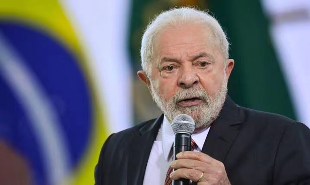
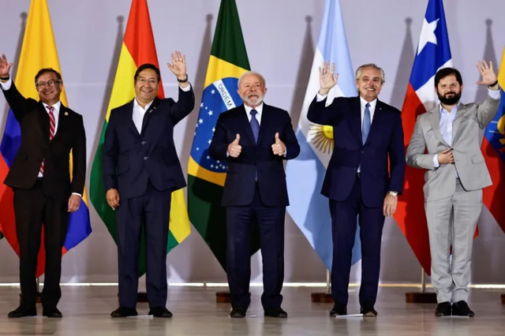
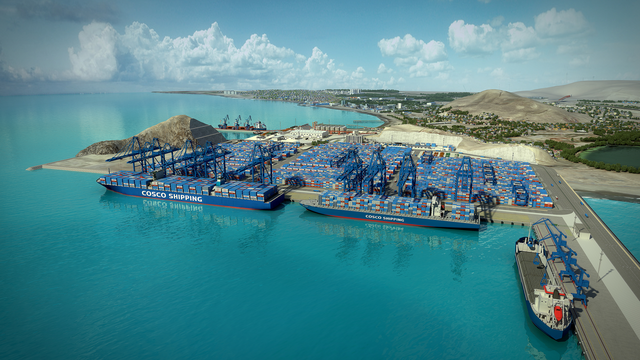
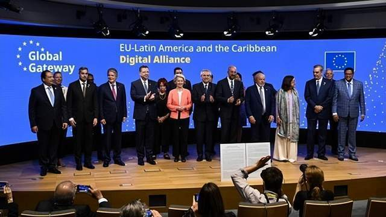

# 阿根廷极右翼总统就职，拉美呈现左右翼同期执政，两极化更进一步

**文/周志伟（中国社会科学院拉丁美洲研究所研究员）**

**采访整理/关珺冉**

12月10日是阿根廷极右翼政客哈维尔·米莱正式就职总统的日子。自从这位头发蓬乱的政治素人赢得阿根廷大选以来，受到全球瞩目。

在西方媒体看来，他的当选堪称一种爆冷，将给国家带来急转弯。但这一结果并不出乎意料。一方面，阿根廷左翼正义党作为主宰政坛多年的执政党，在过去十几年的执政周期中政绩乏善可陈，阿根廷也是拉美地区为数不多经济持续走下坡路的国家之一。另一方面，米莱代表一种极右翼势力的崛起，这不仅符合近几年拉美右翼的发展态势，也符合全球右翼崛起的态势。这预示着拉美政治的两极化越来越清晰。

_12月10日，阿根廷极右翼政客哈维尔·米莱正式就职总统。_

过去两年间，拉美政治出现明显“向左转”的趋势，但目前来看，实际效果并不理想，许多国家遇到了不同程度的困境。

最近我访问了智利、阿根廷、秘鲁三国，明显感受到当地经济的不景气。以阿根廷为例，该国货币严重贬值，通胀率已经超过140%，每天的汇率变化幅度极大。这也体现在贫困人口增加，平均工资下降等方面。

不少国家则出现了政局动荡的局面。在秘鲁，自2022年12月时任总统卡斯蒂略被弹劾并遭拘押后，国家持续动荡；智利总统博里奇面临国内严峻的经济形势，新宪法被选民否决，支持率徘徊在30%左右；哥伦比亚虽然实现历史性“向左转”，产生了首位左翼总统佩特罗，内阁成员却像走马灯一样不断更换。

也有一些在左翼浪潮中表现突出的国家。例如巴西在总统卢拉回归后，政治局势呈现出相对稳定的局面。

 _巴西在总统卢拉回归后，政治局势呈现出相对稳定的局面。_

在拉美多国“翻红”的大背景下，巴拉圭老牌保守派政党红党保持领先优势，在2023年4月的大选中拔得头筹，并在9月的补充市政选举中成为最大赢家。加上米莱代表的极右翼势力在阿根廷登台，意味着拉丁美洲在过去一年出现了一个调整过程。

种种迹象让该地区的政治局势显得更加复杂，国家间的差异愈发突出。

呈现左右翼同期执政的局面

近两年在拉美地区，并不是左翼大获全胜的局面。不少左翼政党在左右博弈中以微弱优势赢得大选，却在议会选举层面处于相对弱势，这给右翼势力做大基本盘提供了良好的土壤。

卢拉执政前，巴西经历了四年右翼势力的执政。前总统博索纳罗执政期间，巴西的社会反馈、处理疫情的方式以及外交上面都没有太好的表现，甚至发生了巴西版“国会山骚乱”。即使这样，博索纳罗还是迎合了很大一部分选民的心理。

由此来看，如果左翼政府无法兑现竞选承诺，或在国家治理上无法有一个明显改善，该地区必然会向右转。

未来两年，拉美又将迎来一个选举周期，整个地区的政治版图处于一个很难预测的阶段。目前来看，墨西哥总统洛佩斯所在的执政党国家复兴运动党呼声依然很高，赢得2024年大选胜算较大。至于委内瑞拉大选，其不确定性因素相对较多。

_2024年，委内瑞拉将举行总统选举。_

届时，整个拉美地区将呈现左右翼同时执政的局面，那就可能出现政治周期错配的概率。这意味着，一些国家可能从左翼转为右翼。这样的局势将给地区一体化带来阻碍。因为意识形态差异明显，达成政治共识的可能性将会下降。

值得肯定的是，时隔九年的南美国家领导人会议再次举行。2023年5月30日，来自南美洲12个国家的国家元首和政府首脑齐聚巴西首都巴西利亚，就地区合作和推进南美一体化进程进行沟通，并签署了《巴西利亚共识》。阿根廷、巴西和哥伦比亚也接连重返南美洲国家联盟（UNASUR）。

_2023年5月30日，南美国家领导人会议在巴西首都巴西利亚举行。_

南美洲国家联盟是拉美地区一体化的真实缩影，一直以来，它都在不同模式之间切换。左翼上台后，推进政治一体化议程，右翼上台又把左翼的思路否定，推进更注重经济的一体化模式。此次会议是对南美一体化倒退的一次反思。他们意识到塑造一个共同身份，对于整个地区都是一件重要的事情。他们还意识到，要通过共同发声来强化南美国家在全球事务中的影响力。

拉美尚未走出经济低迷的局面

过去一年，包括巴西、阿根廷、玻利维亚在内的多个拉美国家，都在推进“去美元化”进程。

不管是拉美国家还是整个新兴经济体，近几年都受到美国不负责任的货币政策影响。去美元化成为这些国家的重要呼声，为的是回避美元波动对本国经济造成的负面冲击。这也体现了拉美国家推进国际货币体系改革的政治决心，必须创造一个更加公平的全球货币体系，对冲美国的美元霸权。

_过去一年，包括巴西、阿根廷、玻利维亚在内的多个拉美国家，都在推进“去美元化”进程。_

经济方面，拉美依然增长乏力。2022年拉美经济曾略有起色，这是因为全球疫情结束后的一个触底反弹过程，但遗憾的是，这种反弹没有得到延续。联合国拉美和加勒比经济委员会（CEPAL）2023年9月发布的最新报告预测，2023年拉美和加勒比地区经济将实现1.7%的增长，增速仍维持在较低水平。

拉美实现经济增长主要通过三个渠道：贸易、投资及内需。

在贸易方面，由于拉美主要以初级产品的出口为主，而整个新兴经济体的对外贸易不像上个周期那么强势，如果国际市场需求低迷，就会影响到拉美的贸易增长。

在投资方面，拉丁美洲自身投资动力不足，非常依赖外部资金进行补充。眼下，全球流动性格局萎缩，市场资金的充裕程度不高，加上近两年乌克兰危机、巴以冲突等地缘冲突影响，投资方面很难达到预期需求。

在内需方面，由于经济没有得到实质性增长，拉美各国失业率都非常高，贫困率持续上升，通胀严重，这些因素导致整个地区内在消费能力不足。不管从哪个渠道，都无法形成对经济增长强有力的刺激作用。

整体来看，拉美还没走出过去10年经济低迷的局面。不过，其中也有一些个例。例如圭亚那得益于石油行业的蓬勃发展，2023年国内生产总值（GDP）增长率预计将达到38%，有望成为全球增长最快的经济体。另外，巴西2022年的经济增长（2.9%）低于地区平均值（3.7%），不过预计2023年会超过地区平均值。

值得指出的是，由于拉美国家经济社会发展受限，多国出现移民危机。巴拿马就面临10年来最具挑战性的移民危机。

拉美的移民问题由内外两个因素造成。其一，过去10年拉美地区经济增长乏力，贫困率上升，社会矛盾加剧，包括公共治安在内的各种社会矛盾凸显出来。其二，这与美国总统拜登做出的移民承诺有关。在拜登执政的第一年，他就颁布了296条移民行政命令，内容包括提高难民数量上限、增加难民安置项目等。相比之下，同样重视移民问题的特朗普在执政第一年仅颁布了86项移民行政命令，执政四年期间共颁布了472项移民行政命令。

上述因素直接推动了拉美移民问题的加剧。要解决移民问题，这些国家首先要改善本国经济，其次要与移民接收国进行协调，做到非法移民的妥善安置。

“一带一路”合作带来外部动力

2023年，巴西、洪都拉斯、委内瑞拉、阿根廷、智利、哥伦比亚、乌拉圭等拉美国家元首纷纷访华。中国成为拉美地区绝大多数国家非常重要的合作伙伴。

在全球大国竞争不断加剧的背景下，无论是推动中东和平谈判，还是全球治理倡议，中国的主张都迎合了拉美大多数国家的全球治理理念，体现出全球南方国家强化合作的趋势。

阿根廷极右翼总统米莱上台后，外界担心，是否会影响对华合作。中国与之前的费尔南德斯政府合作节奏较快，米莱上台后或许在合作节奏上有所不同。但他肯定不会兑现大选期间提出的“断绝与中国合作”，至于是否会“拒绝加入金砖国家”，还是未知数。不过，中国依旧是阿根廷最重要的合作伙伴之一，也是其主要外资来源国，米莱需要回归到务实的立场上来。

2023年，中国与厄瓜多尔、尼加拉瓜签署了自由贸易协定，加上智利、秘鲁和哥斯达黎加，中国在该地区已经有了五个自贸伙伴。眼下，中国已同洪都拉斯举行了自贸协定第二轮谈判，与秘鲁举行了自贸协定升级第五轮谈判。

_2023年6月9日，洪都拉斯总统卡斯特罗开启为期6天的访华之旅。_

跟中拉贸易合作趋势一致，拉美国家进一步加大对华市场的开发营销力度。哥伦比亚、古巴、巴西等拉美国家都参加了第六届中国国际进口博览会，进一步丰富对华的产品出口。

在投资方面，中国推动在拉美地区的人工智能、大数据、云计算、物联网等科技创新领域的合作。就在2023年11月，中国-
拉美开发性金融合作机制第二届理事会会议暨金融合作论坛召开。该机制能够推动中拉各国金融合作，为促进拉美国家经济发展和中拉经贸合作发挥重要作用。

作为21世纪海上丝绸之路的自然延伸，拉美地区已成为“一带一路”倡议的重要参与方。中拉在“一带一路”框架下的合作，符合拉美大多数国家的发展诉求。拉美地区的内部增长动力持续萎缩，需要依靠外部市场拉动。“一带一路”合作恰好给该地区的经济社会发展带来外部动力。

中拉合作基本延续了过去的传统产业，比如能源矿产、基础设施。

中国在拉美有一系列标志性工程，例如巴西美丽山特高压输电项目、秘鲁钱凯港项目、乌拉圭500千伏输变电环网闭合项目等。这是双方资源互补性的有效衔接。拉美基础设施缺口大、投资能力不足，恰恰是“一带一路”合作的重要一面。

近期，我在秘鲁考察了“一带一路”标志性项目——钱凯港项目。钱凯港位于秘鲁首都利马以北约80公里，属天然深水港。这是中国在秘鲁建设的第一个大型交通基础设施项目，预计将于2024年11月竣工。届时，钱凯港将成为拉美地区重要的枢纽港和太平洋门户港。南美洲的农产品及矿产能直接通过这里出口到亚洲市场，比通过巴拿马运河要节省十余天时间，大大降低了运输成本。

_钱凯港项目是中国在秘鲁建设的第一个大型交通基础设施项目，预计将于2024年11月竣工。_

比较抢眼的还有农业合作。中拉农业合作取得丰硕成果，拉美和加勒比地区已是中国最大的农产品进口来源地。另外，中拉的科技创新合作机制不断完善，合作形式日益丰富：中阿共建的阿根廷深空站为“嫦娥四号”“天问一号”等执行任务发挥作用；中国与巴西联合研制的地球资源卫星为两国空间技术合作提供更多手段；中拉可持续粮食创新中心也在加速建设。

面对地区冲突，拉美寻求共同发声

2023年10月巴以冲突发生后，多位拉美国家元首、政府首脑和高级官员通过官方公告或社交平台表达了对以色列的谴责。

玻利维亚政府10月31日宣布与以色列断绝外交关系，打响第一枪。同日，智利、哥伦比亚召回本国驻以色列大使。阿根廷、秘鲁、墨西哥11月1日谴责以色列对加沙地带难民营的空袭。洪都拉斯政府11月3日宣布召回本国驻以色列大使进行磋商。

这些表态与拉美国家的传统外交立场一致。拉美国家一直奉行和平外交政策，坚定反对地缘政治冲突、军事对抗。20世纪以来，拉美是世界为数不多没有发生过战争的大陆之一。因此，该地区的民众十分珍惜和平。

面对乌克兰危机，拉美国家也努力发出自己的声音。2023年7月，在欧盟-
拉美和加勒比国家共同体（拉共体）峰会期间，欧盟试图游说拉美国家加强对乌克兰的声援，然而此举并未得到拉美国家的响应。最终，峰会宣言未提及俄罗斯或谴责“军事侵略”，仅称欧盟和拉共体对乌克兰局势表示“深切关注”。

_2023年7月17日至18日，第三届欧盟与拉美和加勒比国家共同体峰会（欧拉峰会）在布鲁塞尔举行。_

在地缘局势愈发复杂的情况下，包括拉美在内的“全球南方”国家成为各国争相争取的对象。这给这些国家带来一定的战略自主空间。

对拉美来说，其经济规模以及国际影响力相对有限，存在抱团取暖、互相支持、共同发声的政治意愿。所以，无论在俄乌还是巴以问题上，拉美国家都会努力表达共同立场。

过去20年间，中国在拉美地区对外贸易中崛起，给美国造成很大焦虑。美国一直把中国与拉美的合作看成一种威胁，这其实是基于门罗主义的霸权思维。实际就是想独霸美洲，不让别人插手。

2022年6月，美国推出了名为“美洲经济繁荣伙伴关系”的经济计划。美方宣称，该计划将增加美国在美洲地区投资、重振美洲开发银行、提高供应链弹性、促进基础建设投资以及确保“可持续和包容性贸易”。2023年11月3日，首届美洲经济繁荣伙伴关系领导人峰会在美国华盛顿召开。

_2022年6月，美国推出了名为“美洲经济繁荣伙伴关系”的经济计划。_

很多人将其称为美洲版“印太经济框架”，其限制了中国和拉美的经贸合作节奏，旨在为美洲国家提供除了中国之外的合作选择，以此抗衡中国的影响力。但和“印太经济框架”一样，如果缺乏传统自贸协定中的激励措施和执行机制，这样的“伙伴关系”计划恐怕难以奏效。

另外，中国已与拉美国家在基础设施、高科技、航天等领域展开合作。美国则将这些合作视为一种地区安全威胁，这或将削弱中国与拉美地区的合作深度。

相较于其他地区，拉美不是中美竞争的核心地区，所以中美在拉美地区的竞争呈现出一种滞后性。但在未来，这方面的竞争恐将逐渐加强。

