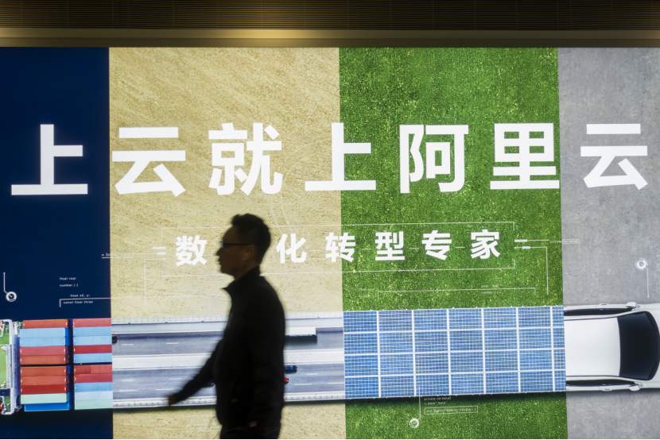
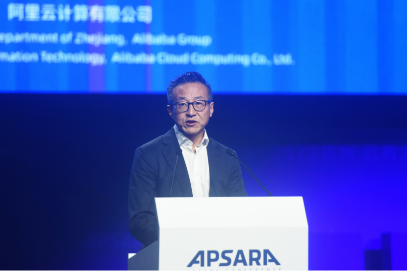
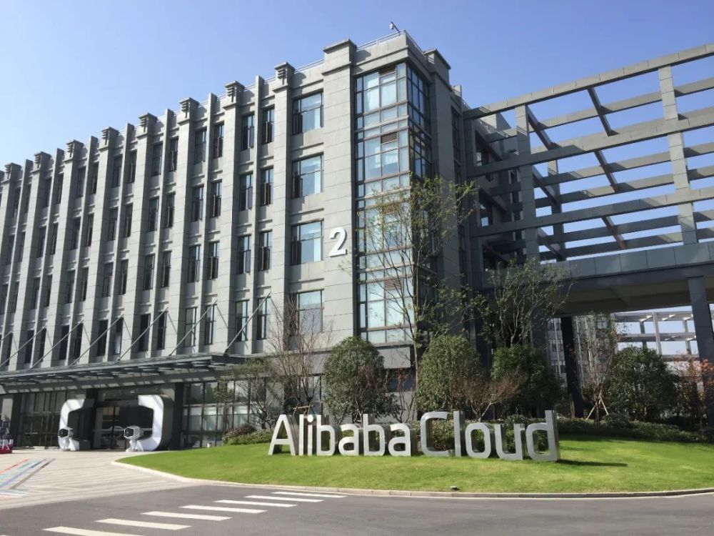

# 阿里云的多事之秋：故障频出，调整不断

**11月12日，原本是一个平常的周末。一年一度的双11刚刚结束，有人期待着快递，有人还在比价，看自己有没有省钱，还有的人忙着退货，或者把替换下来的东西挂上闲鱼。对于阿里云的工程师们，这个周末也是愉快的，最忙的一段时间已经过去，接下来服务器负载将慢慢回落，他们也能松一口气。**

**这口气刚松一半，12日晚间，淘宝崩了。同一时刻，阿里云盘、闲鱼、钉钉、饿了么等产品接连崩溃，无法登陆、查看、结算等问题一并涌现，从17:44故障发生到21:11所有服务完全恢复，时长累计近三个半小时。**

**阿里系产品的大规模崩溃，很快就上了热搜，问题指向了阿里的“技术底座”——阿里云。与此同时，众多使用阿里云服务的企业和个人，也受到了影响。这是阿里云时隔一年后，又一场“史诗级故障”。**

**那几天，高层寻找故障源头并定责、技术人员排查漏洞、公关部门对外发布处理结果。这边还忙乱着，11月27日，异常再次出现。当日09:16
起，阿里云监控发现北京、上海、杭州、深圳、青岛、香港以及美东、美西地域的数据库产品的控制台和OpenAPI访问出现异常，持续时间约2小时。**

**短短一个月里，阿里云出现了两次大规模故障，这在整个云计算行业中都是罕见的。实际上，近日阿里云还有另外两次小规模局部故障，一次在11月28日，12月5日也有一次异常，持续时间都很短，很快就被解决。对云计算公司而言，安全性与可靠性是最重要的，也是阿里云始终在追求的，但频发的故障也显示出，阿里云内部可能存在着一些问题。**

**文 |** 徐晴 李清扬

**编辑 |** 赵磊

**运营 |** 橙子

**委屈与不幸**

一个月接连两次故障后，阿里云的一位技术人员满腹委屈：“还能怎么重视安全和稳定性呢？”

在阿里云的发展史上，每一次故障都是大新闻。除去2018年6月和2019年3月的两次，最近的一次大故障出现在2022年12月，当时，阿里云的下游客户——一些公司和政府部门网站陷入瘫痪，数小时无法提供服务。最后发现，阿里云香港机房出现故障导致宕机，这成了科技圈里最大的热点，“是阿里云运营十多年来持续时间最长的一次大规模故障”。

面对故障，阿里云高度重视。内部传说“高层震怒”，香港宕机事件后，阿里云总裁张建锋（行癫）卸任，时任阿里集团一号位逍遥子张勇亲自挂帅。公司还额外成立了一个“稳定性团队”，在每个产品部门里设置专人负责。当月，稳定性团队拉上所有产品团队开了一个全体动员大会，内部叫做“kick
off
meeting”，简称“KO”，参与过那次大会的老员工王子木说，阵仗浩大，“热烈倡议我们打一场战役，集中力量把稳定性做好，做到哪些指标和级别，用多长时间，能想到的东西全都列好”。

到今年年初，关于安全和稳定的举措再迈上了一个台阶。阿里云CTO周靖人对安全和稳定尤其重视，每个员工也要在自己的OKR里加上“维护某某项目的安全与稳定性”。随后设置了“安全分”，发现有安全方面的问题就扣分，分数关系到具体员工的绩效，而绩效关系着年终奖和晋升，在3.25和3.75相差巨大的阿里，这几乎是最高力度的惩罚。

把这些举措加在一起，“公司已经没什么能做的了，几乎是120%的重视程度”。在王子木看来，一个把安全和稳定挂在嘴边、严格执行的公司，怎么会接连出问题？他只能把故障总结为运气，“阿里云多少是少了点运气”。

与香港宕机事件导致的局部故障不同，11月12日的故障，是一个底层全局性服务组件出现问题，导致全球范围内所有可用区和所有服务器同时发生故障，影响范围巨大。除了阿里系产品，还有众多使用阿里云业务的客户，尤其是那些没有规模化的运维技术团队，完全依赖阿里云各类托管服务的中小企业和个人开发者。

于是，在那个晚上，除了阿里系产品无法使用，还有闪送小哥上传不了接单凭据，原神玩家收不到短信验证码，一些停车场不抬杆，一些超市结不了账，甚至有的大学生因为刷不了卡，用不了学校的公共洗衣机。万幸的是，故障发生在周日，不然还会导致使用金融云和政务云的相关部门瘫痪，造成更大的损失。

_▲阿里云相关新闻频频登上热搜。图 / 截图_

故障发生后，这边CTO周靖人和几位P10、P9，以及负责销售、对接客户的前线部门牵头，跟GTS（全球基础技术业务）部门共同召开定责会议，排查问题源头。那边高层们在工作群里接连发消息：把安全和稳定坚决放在第一位，所有工作都放下，全力排查风险，排查完成后，再考虑其他工作。有的部门排查了一两天，也有的排查时间更长。紧接着，员工们收到一封全员信，阿里云员工王珂说，“名义上让几个大佬把年终奖清零了”。

近日，阿里云因11月12日故障对客户的赔偿陆续到账。根据阿里云向客户承诺的《服务等级协议》，如果因阿里云故障导致月度服务的可用性达不到99.90%，也就是故障时间超过43分钟，就得赔偿30%月度费用的代金券。许多个人开发者赔付金额没达到50元，也被阿里云统一提高到50元。据业内人士估算，这次赔偿的总金额可能超过1亿元，约为阿里云一个月的利润，但对于因故障导致的客户损失，这些代金券又显得微不足道。

11月27日，上一次故障还没有善后完毕，新的故障又发生了。一位连夜参与第二次故障排查的技术人员叹了口气，“各种故障扎堆了，越是重视，它越是出问题”。

很多技术圈博主都认为，技术故障不可能百分百避免，但根据海因法则，一次大故障的背后，一定有几十次轻微事故，几百次未遂先兆，上千条事故隐患。而如此高频的故障，意味着阿里云内部有着很多不稳定因素，提高了故障发生的概率，也会让客户对阿里云的可靠性产生动摇。

在阿里一拆六的大背景下，阿里云这一年里无比动荡，调整不断，影响着每个具体员工的心态和工作。在故障与阿里云的摇摆和动荡之间，或许没有直接的联系，但有间接的关联。正如王子木所说，“阿里发展了这么多年，里边总是有坑坑洼洼的地方，技术人员流失，公司变化剧烈，有些代码可能没有人维护，有一些断层。也有可能人的心态被影响，人不稳定了，代码就有风险，毕竟，代码都是人写的，很多问题会慢慢暴露出来。”

**第一向第二学习**

阿里云也有过幸运的时候。

王子木记得，在最鼎盛的2015-2018年，“市场上只有阿里云一家云厂商，客户请着你去跟他们交流。价格上不打折，我们说多少钱，客户只要有预算，就买”。

做云，阿里有天然的优势。为了冲每年双十一的成交额，阿里采购了数量庞大的服务器，搭建了一支技术上的精英团队，但在非双十一、流量没那么大的时间段，这些多余的算力和技术服务就可以出租出去，赚钱、盈利。“在当时看，这个故事是很美满的。”

阿里也是起步最早的云计算公司之一，2009年率先站上了跑道。移动互联网时代来临，互联网要把传统行业重新改造一遍，一些传统消费品牌、创业公司需要上云，首选就是阿里云。

从2015年到2019年，阿里云年收入从30亿暴增至400亿，市场份额遥遥领先，阿里云的地盘几乎等于第二名到第九名的总和。但很快，市场发生了变化，除了腾讯云、金山云，华为云异军突起，移动、电信等运营商也加入了战场。玩家变多，竞争激烈，云计算的赛道里，大家的身位越来越近，几乎是贴身肉搏。

 _▲图 / 视觉中国_

在行情最好的2018年末，阿里云提出三年后营收过千亿的目标，那时阿里云的营收不过200多亿，相当于翻五倍。但在2021年，阿里云就开始放慢增速，Q1-Q4收入同比增速分别为37%、29%、33%、20%，2022年第一季度，收入同比增速降到了12%，几乎陷入了增长瓶颈。

主流的云服务有两种类型，私有云和公有云，前者相当于把水和花洒都买回自己家，云计算厂商帮忙调试，一些政企客户出于保密或某些政策原因倾向于私有云；公有云则像是一个公共的大澡堂子，谁都可以进来，价格便宜，按时计费，刷卡就可以出水。

那两年，公有云市场见顶，而在政府、央国企集中的私有云领域，客户预算动辄几千万甚至上亿，是全新的增量市场。擅长做政企生意的华为，正是在私有云的生意里获得了增长的燃料，2022年，华为赶超腾讯，成为国内排名第二的云计算厂商。

阿里云的创始人王坚曾在2013年公开称，私有云根本就称不上是云，如果不能够将计算资源规模化、大范围地进行共享，所谓的“私有云”，顶多是将其原有的解决方案重新包装一下，卖给客户一个升级版的IT解决方案。

面对增长危机，一个问题开始困扰着阿里云：要不要做私有云？最终，阿里云还是没办法放弃这块肥肉，但阿里云的工程师和销售们，缺乏与政企客户们打交道的经验。王子木曾经接触过私有云的项目，他的感慨是，“政企的甲方太难伺候了”。

据王子木回忆，多年前，有一个金额巨大的特大项目，阿里云与客户相谈甚欢，一拍即合，为了取得客户信任，真金白银投入了机器、人还有钱，最终发现合同都没签。项目烂尾，还在扩张期高歌猛进的阿里云“大手大脚，也不知道钱到底有没有要回来”。在那之后，流程才越来越严格。

更常见的问题是，私有云服务很难标准化，更像是定制，政企事业单位的甲方很可能不断地加需求、改需求，最终定好一年的项目，两年都还没有验收结束、支付尾款。阿里云卖机器赚不了多少钱，赚钱的是标准化的服务，但定制化的服务成本也是最高的，拉技术人员协调、修改这些需求，卖一千万的项目，搭进去一千五百万的人力成本是常事，营收看似涨了，但很多是赔钱的买卖。

着急中的阿里云，开始向华为学习。先是华为出身的任庚被任命为中国区总裁，紧接着高薪聘用大量华为跳槽来的销售。任庚引入了“红蓝对抗大练兵”、打卡等华为管理方法，并不断调整销售团队的架构。

2022年3月，前华为企业业务中国区总裁蔡英华到阿里云履新，花名华焱，担任资深副总裁，统管全球销售业务，职级为M7，相当于P12，直接向阿里云总裁张建锋汇报。本打算离职的任庚也被挽留，成了蔡英华的下属。

前阿里云员工张扬透露，蔡英华带着更加浓厚的华为风格与印记，他像任正非一样喜欢发“红头文件”，下发的文档以“一号令”“二号令”等命名。到任后，他把负责销售的前线职位都改了个名字，重新换了组织架构，“从前销售解决方案是一个部门，研发是一个部门，他将这两个部门整合到了一起”。

更重要的是，蔡英华改革了销售策略。根据犀牛财经报道，蔡英华发布了新生态政策，相信“重赏之下必有勇夫”，标准级以上分销伙伴佣金率翻倍；增量消费最高佣金率从4%提高至30%；对开拓新兴下沉区域的伙伴，新增额外保底佣金，最高涨幅12%。向生态伙伴分利，也是华为模式成功的关键之一。

但有渠道商接受采访时表示，“虽然佣金多了，但实际上限制条件也比较多，相当于大客户都被阿里云拿走了，我们的客户群变窄了，基本以小客户居多”。学习华为的尝试最终没起到明显的效果，整个2022年，阿里云营收目标一降再降，仅实现营收776亿元。

今年年初，王子木听到了内部消息，“私有云不做了”，10个月后，在11月的第三周，阿里云再次调整组织架构。据了解，蔡英华“基本处于即将离职的状态”。

这一次早有预兆的调整，只是今年阿里云动荡的开端。

_▲图 / 视觉中国_

**“不对”**

王子木觉得“不对”。从今年年初开始，这个声音一直响在他的脑海里。“我在阿里云这些年了，好像做事情也没有什么阻碍，整个人的状态也不差，但就是感觉不对，好像自己在告诉自己，你得出去了。”

从年初到9月份离职之前，王子木经历了许多调整。阿里整个集团“一拆六”，作为技术底座的阿里云，在拆分后多出来不少中台等技术人员。五月底，阿里云传出“裁员7%”的消息，阿里云员工徐皓鹏记得，有些部门有优化的KPI，每个组的主管都会领到几个名额，徐皓鹏的一位师兄，一位刚31岁、TOP2大学的博士，都在春天结束时离开了阿里云。

那时，时任CEO的张勇还计划阿里云在未来12个月里完成分拆上市，但短短4个月后，张勇就卸任阿里云董事长和CEO职务，由吴泳铭接任。

变化给人的影响是具体的。张扬原本准备内部转岗，由于换CEO，转岗流程暂停，他只好离开，寻找新的工作机会。21岁的杨天风在香港读大学，九月初开始秋招时，阿里1+6+n的独立招聘中，他大部分都投了。淘天集团、阿里国际商业集团很快回复了面试的要求，而阿里云直到11月24日才给他发来简历评估通过的消息。

11月，阿里在财报中宣布，鉴于多方面不确定性因素，不再推进云智能集团的完全分拆，这也意味着，阿里云的上市计划将推迟甚至取消；CEO吴泳铭表示，未来阿里云的发展战略将围绕“AI驱动，公共云优先”两个方向展开。

按照他的说法，未来阿里云将减少项目制销售订单，也就是私有云订单，加大公共云核心产品投入——短短的一年，战略调转了180度。在最新一个季度的财报里（截至9月30日），阿里云的营收增速仅为2%，在多个业务集团中排名靠后。这或许是又一次调转方向的契机。

_▲2023年10月31日，2023云栖大会在杭州云栖小镇开幕。阿里巴巴集团董事会主席蔡崇信在开幕式上致辞时表示，阿里巴巴“要打造AI时代最开放的云”。图
/ 视觉中国_

阿里云前员工林佳觉得，“阿里云的摇摆，本质上就是要挣钱，要完成那个目标，但在私有云上花了大力气，最终又回来重点做公有云，说白了就是做私有云也完成不了目标。如果做私有云每年增速100%，肯定不会有最近的调整，不会说公有云优先，不可能的。”

阿里云顺风顺水的时候，营收增长，员工的薪资也涨，“大家干得有劲，值个班、熬个夜，都觉得不算什么。到双11的时候，每天基本上不怎么睡觉，依然是激情澎湃”。但在业务增长缓慢，今年以来又频繁调整的情况下，大量的员工，很久没有再涨薪了。

王子木在阿里云工作8年，进入公司的第三年升职为P8，之后再也没有升职。在他看来，自己的晋升之路跟阿里云的发展重合，船不往前开，人也不会往前走。他因此萌生跳槽的打算。阿里云裁员的那段时间，字节的火山云、小红书、快手都在挖人，他找到了更好的机会。他所在的团队里，有近10%资历超过8年的老阿里人都跳了出去。

动荡之下，更多的人处于观望中，林佳说：“你想想，如果你做一个工作，每天想的就是随时都会裁员，不知道什么时候裁到自己，自己主动走还不如等着拿大礼包，这份工作还能投入去做吗？”

公司的气氛也有了些微妙的变化。另一位阿里云员工宋繁敏锐地观察到，阿里云内部有一个技术论坛ATA，从前的几年，技术大佬们无偿把自己的心得、经验、新的想法分享在这里，一片火热，像一个小型的技术创新发电站。但今年以来，新帖罕见，旧帖也蒙上了一层时间的灰尘，很少有人再回复和讨论。

宋繁自己也变了。从前习惯每天早上看一篇最新的技术分析，裁员以来再没看过。对工作，他少了激情和投入，“就是打一份工，赚一份钱”，就算是早下班心里也没有负担。在北京望京的阿里云工区，“下班时间明显变早了，到了晚上8、9点公司很空，以前晚上还蛮多人的”。因为难以接受“突然有一天，你的饭搭子都不见了”，宋繁也正在考虑离职。

在某种程度上，11·12故障的原因与人的心态、工作状态变化有所关联。

阿里云员工徐皓鹏和相关知情人告诉每日人物，这次事故来自于对象存储OSS部门，由一个五六个人的小团队负责。在一个配置更新升级时，“本来应该先发一小部分进行灰度测试，等测试没问题，再一个区域一个区域地发布，最后达到全域更新。但有技术人员未经测试，一次性全域发布，最后导致了很大的故障”。

对象存储是一个基础性服务，涉及到认证和鉴权，用户想进入数据库要先通过一道密码门比对身份。而配置更新是一个很基础的动作，相当于设置密码和身份，只要严格规范操作，不太可能会出问题，“制度虽然存在，但是员工没有把流程做规范”。

另一位员工王珂则分析，11·12故障出现在周日，一个非正常工作时间，“有些东西如果没有很完整的测试流程或者框架的自动化，需要人手动测，耗时耗人，跑一次测试一天、一周都有可能，人在这样的环境下对工作没有耐心，可能就会在流程上不规范，出现人导致的纰漏”。

尤其可靠性工程师这个职位，很难有产出，没法通过不出故障来证明自己的价值，因为大家默认那是应该的，反而一出故障就会被追责，在降本增效面前，也承担着巨大的心理压力。

而针对11月的第二次故障，新的“安全与稳定性”举措又开始了。上周五，阿里云的员工们都在填一张表格，“H2财年（2023年10月-2024年3月）会在安全方面做哪些事，每个人至少要投入30%的人力在这上面”，王珂感觉很无奈，数字是这么写，但30%人力到底怎么换算，谁也不清楚。

相比这些模糊的概念，大家更在意的显然是自己的薪水、年终奖。填表时，王珂听到同事在讨论，“今年整个阿里云的绩效肯定是3.25，那会不会全员3.25？”最终回答他的，只有A4纸翻动的声响和众人的沉默。

_▲杭州云栖小镇，阿里云。图 / 视觉中国_

**阿里云要往哪儿走？**

故障对云服务厂商而言是致命的。当前阿里云服务的客户超过300万家。十月底的“2023云栖大会”上，阿里巴巴集团主席蔡崇信指出，目前中国80%的科技企业和一半的大模型公司都跑在阿里云上。

最常见的商业故事是一条鲶鱼搅乱池水，在大鱼口中夺食，但阿里云自己就是那条大鱼。当下的阿里云，面临着最大的问题是，如何应对竞争者们的挑战，保住自己的地盘。

情况是紧迫的。在私有云领域，阿里云竞争不过华为云，全球权威信息与分析咨询公司IDC发布的《中国数字政府大数据管理平台市场份额，2021：乘风破浪，风光再现》报告显示，2021年华为云在中国数字政府大数据管理平台市场占有率为17.9%，增速达74%，市场份额第一，阿里云第二。而在优势的公有云领域，腾讯云、百度云的成长也非常迅速。

和华为比，阿里缺乏组织优势，无法堆人头来满足政企客户的定制化要求。王珂说，“华为云是有很多人的，客户想要什么就给什么，阿里云虽然能做出来，但是哪有那么多人去投入？”如果将他所在的部门跟华为云对应的团队相比，人数比例是1:5。

从前做混合云时，私有云和公有云的技术流程、体系也不同，但技术人员要同时兼顾。王珂所在的小组有5个人左右，大家在处理私有云项目需求的同时，也要做公有云产品，“太累了，一个人要负责的是方方面面，但是华为那边可能一个项目就好几十人去做，很聚焦”。

与此同时，阿里云有大量早期就加入阿里、经历过高光的几年升职加薪的老技术人员，和高薪挖来的员工，虽然人数少，但成本不见得比华为低。

阿里云原本有的技术优势也逐渐削弱。每年双11，高流量、高峰值、高需求倒逼阿里云在技术上的创新，支撑体量越来越庞大的淘宝、成倍攀升GMW。每年的庆功会，阿里云的技术人员代表业务去参加，心里最大感觉是“值得”。阿里云员工对于技术的追求是执着的，也是他们引以为傲的。

但随着阿里电商业务增长放缓，对技术创新的要求没那么高了，“业务孵化不出来新的技术，技术的发展趋势也是开源的，所有人都能做，许多产品变得同质化”。其他厂商也在孜孜不倦地挖走阿里云技术人才，不断拉近与阿里云的技术差距。

在创业公司和小公司们生存艰难的当下，技术似乎也不再那么重要，只有安全和稳定性是最根本的需求。王子木反问，“如果我是企业老板，我会在乎是阿里云还是华为云吗？”言下之意，谁的价格低，谁的服务稳定，谁就能获得客户，而故障必然会带来客户的流失。

竞争对手的步步紧逼也不是问题的核心，根本原因在于，国内的云计算市场是有限的，池塘里养不下的鱼，都要去更广阔的海面上谋生。拼多多和字节跳动正是在出海业务上强势，找到了更广阔的市场，才有了业务发展和转型的可能性，带动着市值（估值）不断提升。如何进入更大的海域，这是阿里云的挑战，也是腾讯云、华为云的挑战。

_▲图 / 视觉中国_

AI或许能给阿里云带来转机——大模型创业公司和互联网公司小步快跑加入AI赛道，自动驾驶公司和造车新势力们也在新能源赛道里争抢身位，对算力的需求不断提升。阿里依靠大量囤积的高算力GPU，做起了卖水和铲子给淘金者的生意。王小川的百川智能、李开复的“零一万物”、小鹏、理想等都是阿里云智算业务的客户。

但这块业务到底要怎么做，还不好说。在智算业务上，囤了上万张A100和A800（AI算力芯片）的字节跳动是阿里的潜在对手，一位阿里云智算业务员工透露，“一直在跟字节抢单，业务方向也不是很清晰，有一系列的不确定性”。

唯一可以确定的是，在不久的将来，云服务战场会掀起新的战争，那将是更残酷的厮杀，处于其中的人们还将面临新的震荡。而对阿里云来说，找准方向，做好准备，是当下最重要的事情。

（文中所有受访者均为化名）

**参考资料：**

【1】GPLP犀牛财经：打造AI时代最开放的一朵云，这次阿里云能成功吗？

【2】第一财经：守住公共云主战场，押注开源，阿里云迎来“关键一战”

【3】中国电子报：新晋院士话产业丨他六年前成功预言了“云”的影响

【4】锌产业：阿里云的增长难题

【5】字母榜：阿里云重新定调

【6】数智前线：特稿｜过去5年，阿里云是如何打造云原生数据库PolarDB的

【7】经济观察报：阿里的“一次小抖动”

【8】36氪：阿里云，迷航深水区

【9】非法加冯：我们能从阿里云史诗级故障中学到什么

**文章为每日人物原创，侵权必究**

