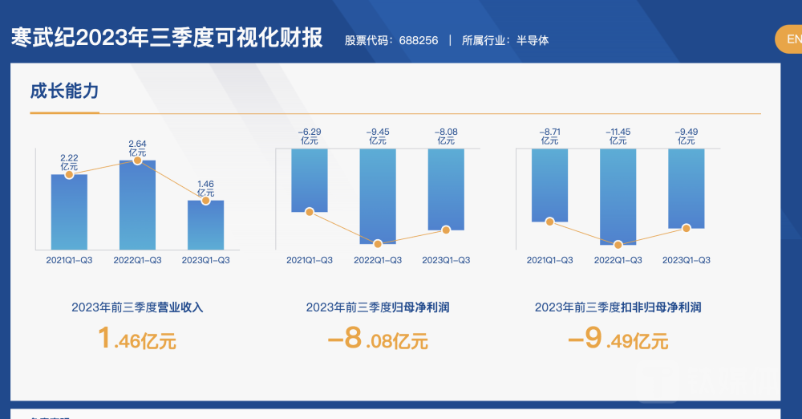

# 2023年有1.09万家中国芯片公司消失，比去年增长近90%

 _图片来源@视觉中国_

中国芯片淘金热逐渐“退潮”，行业下行加速企业转型。

**12月12日消息，钛媒体App
从企查查处独家获悉，截至12月11日，2023年，中国已经有1.09万家芯片相关企业工商注销、吊销，同比增加69.8%，比2022年的5746家增长89.7%；同期新注册6.57万家芯片相关企业，同比增加9.5%。**

**2023年的10900家芯片相关企业注销、吊销数量远超往年。这意味着，平均每天就有超过31家芯片企业注销、吊销工商信息。另据钛媒体App编辑梳理，过去五年间，国内吊销、注销芯片相关企业数量就已经超过2.2万家。**

（注：数据仅统计企业名称、经营范围、产品名称包含关键词“芯片”的企业，同比增长口径来源于企查查，全年增长数据来源钛媒体App编辑整理）

_（来源：钛媒体App编辑、企查查，数据仅供参考）_

随着美元加息、消费电子市场持续下滑、脱钩以及行业下行等因素，百年未有之大变局下，国内芯片行业也很难“独善其身”。据世界半导体贸易统计（WSTS）最新预测，2023年，全球半导体市场规模达5200亿美元，同比下降9.4%。

**这意味着，全球芯片行业仍处于下行周期，当前企业仍面临重要挑战，预期的复苏可能没有那么快。**

今年12月8日，晶圆代工龙头台积电（NYSE:
TSM）发布的月度业绩显示，今年11月，公司合并营收约合65.39亿美元（人民币469.41亿元），环比减少15.3%，同比下降7.5%。2023年1-11月，台积电总营收约合630.19亿美元，同比减少4.1%。台积电预计，第四季度销售额为188亿-196亿美元，环比增长约9%-13%。

台积电总裁魏哲家近日表示，2023年处于调整库存期。鉴于通货膨胀与成本持续上涨等外在因素，2024年仍有其不确定性。不过得益于 AI
应用迅速发展，2024年也将是充满机会的一年。

有消息称，2024年，台积电资本支出可能降至280亿-300亿美元，同比下降超过6.3%，恐下探近四年来低点。

到国内市场，据东方财富Choice数据显示，截至11月1日，已有151家半导体上市公司披露2023年三季报，合计实现营业总收入约3523亿元，较去年同期几乎持平；合计实现归母净利润约193亿元，较去年同期下降约54%。其中在151家半导体上市公司中，有111家半导体公司归母净利润同比出现下降，约占整体数量的74%。

以 AI
芯片设计公司寒武纪（688256.SH）为例。根据其10月公布的第三季度财报显示，实现营业收入3134.28万元，同比下降66.15%；归属于上市公司股东的净亏损2.63亿元，去年同期为亏损3.22亿元。2023年1-9月，寒武纪营收1.46亿元，同比减少44.84%；归母净亏损8.08亿元。

_寒武纪财报（图片来源：上交所官网）_

同时，二级市场也不容乐观，芯片行业“内卷”加剧。以芯片设计为例，据清华大学教授、中国半导体行业协会集成电路设计分会理事长魏少军在ICCAD
2023上分享的数据，今年国内共3243家芯片设计企业，其中1910家企业的销售收入小于1000万元，即
**55%的中国芯片设计公司收入不足1000万元。**

整体来看，国内芯片企业数量虽多，但都属于“小而散”。
**有分析指出，国内半导体上市公司里，70%实现盈利，30%处于亏损，整体净利润下降约54%，其中74%的公司净利润下降。**

魏少军表示，2023年，大部分中国芯片设计企业将出现大面积亏损。库存积压严重、行业供应饱和，当前部分库存面临减值风险，而随着时间的推移，库存产品的竞争力逐步丧失，造成损失已是必然结果。

魏少军指出，“外部对中国高端芯片的打压和遏制则是明确的，美国的出口管制措施将高端芯片的出口列为限制对象，不仅不卖给中国高端芯片，还要对中国高端芯片生产进行限制。这一方面使得中国超级计算机、人工智能所需的高算力芯片出现了一些麻烦，但另一方面也给了中国芯片设计企业一个难得的机遇去填补外国产品主动退出的市场。不少企业都意识到了这一点，也做了很大的努力，但在高端芯片方面的建树还是乏善可陈。”

“这暴露出我们的企业在市场大潮中还需要进一步磨砺，提升对市场、对需求的把控能力，避免盲目跟风，降低风险。”魏少军表示，需要冷静地看待国产替代带来的机遇，促使企业抓住机遇更上一层楼，是一个严肃的课题。其实，国产替代并不是低水平的代名词，而是高水平的要求。数十年来，大量的电子设备主要依赖的是进口芯片，现在突然要改为国产芯片，挑战是多样的。

而作为半导体国产化率最低的环节之一，据VLSI
Research数据显示，中国半导体检测设备市场，大部分被科磊（KLA）、应用材料、日立等厂商占据，市场份额分别为54.8%、9.0%和
7.1%。据东吴证券测算，2022年，国产半导体检测设备厂商中科飞测、上海精测、上海睿励三家企业销售收入合计约为7.46亿元，对应在中国的市场份额不足3%，远低于去胶设备、刻蚀设备、薄膜沉积设备等其他环节。

另外，从进出口数据看，国内芯片行业仍面临不确定性。其中，进口端，据海关总署，今年1-11月，中国集成电路（IC）进口量达4376亿颗，同比下降12.1%，相比之下前10个月进口量下降13.1%，进口总额同比下降16.5%至3166亿美元；出口端，据国家统计局，今年10月中国出口了313亿个IC产品，今年1-10月，中国集成电路出口量达2765亿个，同比仅增长0.9%。

但“瑕不掩瑜”。最近，华为Mate
60系列手机的国产芯片、龙芯3A6000通用处理器、长鑫存储LPDDR5存储芯片等国产芯片产品集中发布就是有力的例证，依靠本土供应链的支持将长期推动中国芯片产业发展。

目前，芯片行业希望2024年迎来“复苏”。据Gartner数据显示，预计到2024年，全球半导体行业销售额将增长16.8%，达6240亿美元。其中，存储芯片行业预计将增长66.3%。另外在生成式
AI 技术需求下，预计到2027年，数据中心的 AI 加速芯片部署将增加20%以上。

**研究机构IDC甚至预计，2024年全球半导体销售市场将增长高达20%。**

IDC资深研究经理曾冠玮表示，近期存储芯片价格有所提升以及 AI
应用需求下，将驱动2024年整体全球半导体销售市场复苏，半导体供应链也即将挥别低迷的2023年。

联想集团董事长兼CEO杨元庆在11月下旬财报会议上表示，科技行业的复苏迹象明显，他预计2024年PC（电脑）行业将恢复单位数的增长，实现5%以下的增长一定是有可能的。

随着国产芯片加速发展，据龙芯中科董事长胡伟武预计， **到2027年，中国芯片产业链“卡脖子”问题应该能得到基本解决。**

**（本文首发钛媒体App，作者｜林志佳）**

